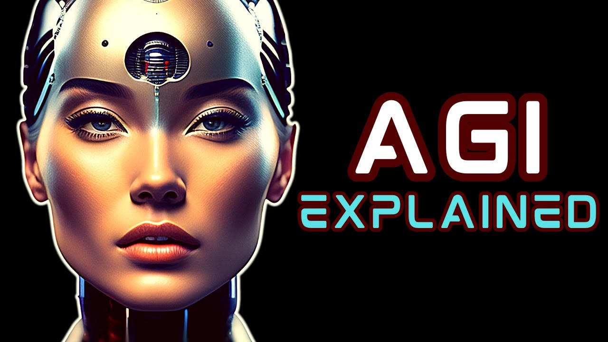

Artificial General Intelligence (AGI) represents a form of artificial intelligence with the cognitive capabilities comparable to humans. Unlike Artificial Narrow Intelligence (ANI), which is designed for specific tasks, AGI aims to perform any intellectual task with the same proficiency as a human being. The significance of AGI lies in its potential to understand, learn, and apply knowledge across a vast range of disciplines, which could reshape industries fundamentally.

The transformative potential of AGI extends across various sectors, promising advancements in robotics, healthcare, and logistics, among others. In finance and trading, AGI could be revolutionary. By processing and analyzing massive datasets much faster than any human or existing AI, AGI could uncover patterns and insights that are currently unnoticed. This capability could lead to more precise decision-making in investment strategies, risk management, and financial forecasting.

In the context of algorithmic trading (Algo Trading), AGI introduces a paradigm shift. Traditional algorithmic trading utilizes predefined instructions in reacting swiftly to market changes, often employing ANI to enhance processes. However, the integration of AGI could entail creating models that not only adapt in real-time but also anticipate future trends by synthesizing information dynamically, akin to human reasoning. This ability to predict and adapt could redefine the speed and efficacy of trades, potentially leading to unprecedented levels of profitability and market efficiency.

Thus, the introduction of AGI into the world of trading promises not just an evolution of current strategies but a complete metamorphosis of the trading landscape. The potential to achieve an unparalleled understanding and prediction of market behaviors marks AGI as a cornerstone in the future panorama of finance and trading.




## Table of Contents

## Understanding AGI and Its Current State

Artificial Intelligence (AI) is often categorized into three distinct types: Artificial Narrow Intelligence (ANI), Artificial General Intelligence (AGI), and Artificial Superintelligence (ASI). The progression from ANI to AGI, and potentially to ASI, illustrates the levels of complexity and capability AI systems can achieve.

**Artificial Narrow Intelligence (ANI)** refers to AI systems that excel in specific tasks, such as facial recognition, voice assistants, or spam filtering. These systems operate under a narrow set of parameters and lack the ability to generalize knowledge beyond their predefined functions.

**Artificial General Intelligence (AGI)** represents a significant leap forward in AI development. Unlike ANI, AGI aims to achieve human-level intelligence, capable of understanding, learning, and applying knowledge across a broad range of tasks. The goal of AGI is to replicate the cognitive functions of humans, thereby allowing it to solve problems it has never encountered before. Achieving AGI means creating a system that can think, learn, and adapt autonomously.

**Artificial Superintelligence (ASI)** surpasses human intelligence in all aspects, potentially leading to capabilities beyond human comprehension. While ASI remains largely speculative, the focus of current research is primarily on achieving AGI.

### Progress in AGI Research by Major Players

Research in AGI is largely led by technology giants such as DeepMind and OpenAI. DeepMind, established in 2010 and acquired by Google in 2015, is known for its development of AlphaGo, the first AI program to defeat a world champion Go player. This breakthrough demonstrated AI’s potential to handle complex tasks requiring strategic thought.

OpenAI, on the other hand, has been at the forefront of AI language models, developing technologies like GPT-3 and GPT-4, which use vast datasets to generate coherent and contextually relevant text. Their advancements indicate significant progress toward more adaptive and generalized forms of AI systems, inching closer to the capabilities required for AGI.

### Current Capabilities and Limitations of AI

Despite these advances, AI today primarily consists of ANI systems, highly specialized but constrained within predefined boundaries. These systems cannot operate or understand beyond their narrow scope, a limitation starkly contrasting the theoretical objectives of AGI.

While progress towards AGI continues, significant challenges remain, primarily concerning the understanding and replication of human cognition and consciousness. Current AI lacks the nuanced understanding, emotional depth, and ethical reasoning inherent in human intelligence. Furthermore, the theoretical nature of AGI involves complex, interdisciplinary problems, ranging from computational to ethical and philosophical debates.

Ultimately, reaching AGI will require not only technical advancements but also insights into human cognition and behavior. The endeavor to develop AGI continues to inspire new research methodologies, and while a fully realized AGI remains theoretical, each step forward brings us closer to potentially transformative capabilities in AI.


## Potential Impact of AGI on Trading

Artificial General Intelligence (AGI) promises to fundamentally transform trading strategies and how market participants interact. AGI's capacity to process and analyze vast amounts of data at human-level intelligence enables it to develop sophisticated trading algorithms that respond to market dynamics with unprecedented precision and speed.

AGI has the potential to revolutionize trading strategies by integrating insights from multiple data sources, such as economic indicators, geopolitical events, and historical market patterns. Unlike human traders or traditional algorithmic systems, AGI can autonomously detect patterns and predict market movements, enabling the design of adaptive trading models that self-improve over time. These models can quickly adjust to evolving market conditions, offering a competitive edge to those who deploy them.

One aspect to consider is AGI’s potential impact on market [volatility](/wiki/volatility-trading-strategies). On one hand, AGI systems could reduce volatility by providing more accurate predictions and stabilizing market swings through intelligent decision-making and [liquidity](/wiki/liquidity-risk-premium) provision. On the other hand, the rapid and high-frequency nature of trading decisions made by AGI could exacerbate volatility. For instance, if multiple AGI systems simultaneously react to the same information by executing large [volume](/wiki/volume-trading-strategy)s of trades, they could inadvertently amplify price fluctuations before the market stabilizes.

For traders, an AGI-driven trading landscape presents both challenges and opportunities. The sophisticated analytical capabilities of AGI can lead to the discovery of new trading opportunities and strategies that were previously inaccessible due to human cognitive limitations. These opportunities include the ability to analyze complex datasets for [arbitrage](/wiki/arbitrage), [trend following](/wiki/trend-following), and risk management strategies that are more finely attuned to market conditions.

Moreover, AGI could provide tools that assist traders in optimizing portfolio allocations and rebalancing strategies based on real-time data analytics and predictive insights. The integration of AGI in trading platforms could also facilitate the development of personalized trading strategies that align with individual risk tolerances and investment goals.

In conclusion, while AGI offers significant benefits in refining trading strategies and enhancing market interactions, it is essential for traders and market participants to critically assess how these systems are implemented. The dual potential of AGI to both stabilize and destabilize markets underscores the need for robust risk management frameworks and thoughtful integration of human oversight to harness AGI’s full potential responsibly.


## AGI and Trading Strategies

The development of advanced algorithms powered by Artificial General Intelligence (AGI) represents a significant leap forward in [algorithmic trading](/wiki/algorithmic-trading). Unlike traditional algorithms that rely on pre-programmed rules and patterns, AGI-driven models have the potential to learn and adapt autonomously, achieving a level of dynamism and efficiency previously unattainable.

### Development of Advanced Algorithms

AGI can process vast datasets in real-time, identify complex patterns, and make predictions without explicit human guidance. In trading, this capability can manifest as an algorithm that not only learns from historical and real-time market data but also anticipates systemic failures or market shifts. These algorithms, unlike current machine learning models, do not just interpolate from past events but can extrapolate, potentially identifying novel trading opportunities.

### Combining Human Intuition with AGI

Human intuition, with its nuanced understanding of geopolitical, social, and economic contexts, could be significantly enhanced when combined with the processing power and predictive accuracy of AGI. For example, traders often rely on their intuition to make decisions during unpredictable market conditions. By incorporating AGI, these intuitive decisions could be supported by data-driven insights. Human traders might flag potential market-moving events for AGI-powered systems to analyze, offering a hybrid approach that leverages both human experience and machine efficiency.

### New Trading Strategies Enabled by AGI

The integration of AGI into trading platforms could lead to the development of novel trading strategies. For example, AGI could enable algorithmic models that dynamically adjust to market sentiment, interpreting social media trends, news feeds, and economic indicators in real time. Such strategies could allow for anticipation of market moves before they solidify, offering a competitive edge.

Consider an AGI-driven model that utilizes [reinforcement learning](/wiki/reinforcement-learning) to enhance decision-making. In Python, an outline for such a model might include:

```python
import numpy as np

class AGITrader:
    def __init__(self, market_environment):
        self.state_space = self.get_state_space(market_environment)
        self.action_space = self.define_actions()
        self.q_table = np.zeros((self.state_space, self.action_space))

    def get_state_space(self, market_environment):
        # Analyze the market environment to define the state space
        return len(market_environment.features)

    def define_actions(self):
        # Define potential trading actions
        return ['buy', 'sell', 'hold']

    def choose_action(self, state):
        # Advanced AGI decision-making for selecting actions
        return np.argmax(self.q_table[state])

    def update_q_table(self, state, action, reward, next_state):
        # Reinforcement learning update rule
        self.q_table[state, action] = reward + np.max(self.q_table[next_state])

# Example usage:
market_environment = MarketSimulator(data_source='live_feed')
trader = AGITrader(market_environment)
```

This hypothetical AGITrader model could autonomously adapt its strategy based on complex market cues and historical data, continuously refining its approach to optimize trading outcomes.

The anticipation of AGI's integration into trading strategies suggests that markets may soon experience a shift towards more adaptive, intelligent, and potentially less predictable trading dynamics. This may prompt traders and financial institutions to explore hybrid models that best leverage the strengths of both AGI and human insight.


## Role of Human Traders in an AGI Era

As Artificial General Intelligence (AGI) integrates into trading environments, the role of human traders is poised for significant transformation. Although AGI systems possess the potential to undertake complex computations and data analysis at unprecedented speeds, human traders still offer irreplaceable strengths, notably creativity and strategic decision-making. 

Creativity, inherent to human cognition, enables traders to devise novel strategies that AGI might not spontaneously generate. Humans can draw from diverse experiences, cultural contexts, and an understanding of non-quantifiable [factor](/wiki/factor-investing)s to innovate within trading environments. This creative capacity can be leveraged alongside AGI's superior data-processing abilities, allowing traders to explore scenarios and opportunities that may not be immediately apparent through data analysis alone. 

Strategic decision-making is another area where human judgment excels. While AGI can analyze vast datasets to identify patterns and forecast trends, human traders can interpret these insights within a broader strategic framework. They can assess market sentiment, geopolitical events, and other qualitative factors that might influence trading decisions but aren't easily quantifiable by algorithms. This human touch adds a dimension of strategic foresight that AGI may model but cannot inherently replicate. 

Traders can enhance their decision-making capabilities by harnessing AGI's strengths. AGI can process real-time data and perform high-frequency transactions, offering a level of agility in trade execution that surpasses human capabilities. By interpreting AGI-generated insights regarding trends, anomalies, and predictive scenarios, traders can make more informed decisions with greater confidence. 

For instance, a trader may employ AGI to continuously scan the financial markets for arbitrage opportunities. Once identified, AGI can conduct a series of high-speed transactions before human traders validate and potentially expand upon the initial strategy with qualitative insights. This hybrid model allows human intelligence and machine capabilities to achieve a synergistic effect, optimizing both efficiency and innovation in trading strategies. 

In summary, while AGI will automate many elements of trading, human traders will continue to play an indispensable role. By combining their unique capabilities with AGI systems, traders can elevate their strategic effectiveness, ensuring a future where technology amplifies rather than replaces human potential.


## Speed, Efficiency, and Risk Management in Trading

Artificial General Intelligence (AGI) holds significant promise for enhancing speed, efficiency, and risk management in algorithmic trading. By mimicking human cognitive functions at or beyond human levels, AGI could revolutionize high-frequency trading ([HFT](/wiki/high-frequency-trading-strategies)) and risk assessment with unprecedented capabilities.

AGI's potential to enhance HFT lies in its ability to process and react to data at speeds unattainable by human traders. HFT relies on the rapid execution of buy and sell orders, often within microseconds, to capitalize on minute price discrepancies. AGI could further optimize these processes by continuously learning and improving its trading strategies without human intervention. Consider an AGI system that predicts stock movements by processing vast amounts of market data, such as historical prices, real-time news, and social media sentiment. By leveraging [machine learning](/wiki/machine-learning) models, such as recurrent [neural network](/wiki/neural-network)s (RNN) or [long short](/wiki/equity-long-short)-term memory (LSTM) networks, AGI can swiftly identify patterns and anomalies, leading to more profitable trades. Here's a simple illustration using Python:

```python
import numpy as np
from keras.models import Sequential
from keras.layers import LSTM, Dense

# Generating dummy stock price data
data = np.random.rand(100, 1)

# Reshaping data for LSTM input [samples, time steps, features]
data = data.reshape((1, 100, 1))

# Build LSTM model
model = Sequential()
model.add(LSTM(50, activation='relu', input_shape=(100, 1)))
model.add(Dense(1))
model.compile(optimizer='adam', loss='mse')

# Train model
model.fit(data, np.array([0]), epochs=300, verbose=0)

# Predict future stock price
predicted = model.predict(data)
```

AGI's role in risk management is equally transformative through its advanced data analysis capabilities. Traditional financial models often struggle with the immense volume and velocity of today's market data. AGI can address this by using predictive analytics to mitigate risks like market crashes or black swan events. For example, AGI systems could evaluate correlation matrices across thousands of assets in real-time, improving Value at Risk (VaR) calculations and stress testing scenarios. The ability to incorporate non-linear and dynamic relationships between assets enhances the system's preventive measures against unexpected market movements.

Furthermore, AGI can significantly bolster the overall efficiency of trading operations. By automating and optimizing both routine and complex tasks, traders can achieve higher throughput with fewer errors. This automation extends to tasks such as portfolio optimization, asset allocation, and compliance checks, which benefit from AGI's continuous learning and adaptation. 

Ultimately, the implementation of AGI in trading could lead to faster decision-making, reduced operational costs, and a more nuanced approach to risk management, reshaping the landscape of financial markets. However, balancing these improvements with ethical considerations and robust regulatory frameworks remains critical to ensure fair and stable markets.


## Ethical and Regulatory Considerations

Artificial General Intelligence (AGI) presents new ethical challenges, especially when applied to trading. The potential consequences of AGI's deployment in trading environments raise significant concerns that warrant attention, particularly regarding market manipulation and the need for regulatory oversight.

One of the major ethical concerns is the risk of market manipulation. AGI's ability to process vast amounts of data and execute trades at unprecedented speeds could be exploited to manipulate financial markets intentionally. For example, AGI systems could engage in predatory high-frequency trading strategies, leading to unequal market conditions where sophisticated algorithms can front-run trades, unfairly benefiting those who can afford to implement such technology. This scenario could exacerbate the information asymmetry between different market participants, challenging the integrity and fairness of financial markets.

Moreover, AGI systems might unintentionally contribute to market volatility. Complex interactions between numerous AGI-driven trading algorithms could lead to unpredictable outcomes, potentially triggering flash crashes or other rapid market movements. The infamous "Flash Crash" of 2010, although caused by simpler algorithms, underscores the potential for tech-driven dissociations from market fundamentals, leading to widespread financial implications.

To prevent such scenarios, comprehensive regulatory frameworks are essential. Regulators must establish rules that account for the unique capabilities and risks posed by AGI in trading. These could include monitoring systems to detect manipulative patterns, enforcing transparency in algorithmic strategies, and setting constraints on certain high-frequency trading practices.

Additionally, there's a need for ethical guidelines in the design and deployment of AGI systems. Companies should adhere to principles of fairness, accountability, and transparency. Developing AGI with mechanisms to prevent harmful actions and ensure compliance with regulatory standards can help balance innovation with ethical responsibility.

In summary, while AGI holds transformative potential for financial markets, its deployment necessitates careful consideration of ethical issues, particularly market manipulation and stability. Establishing robust regulatory frameworks is crucial to safeguard market integrity, ensure fair competition, and protect investors and participants in an increasingly automated trading landscape.


## Investing in AGI Companies

Investing in Artificial General Intelligence (AGI) companies offers a unique opportunity to be at the forefront of technological innovation. Key players in the AGI research and development space include industry giants like Microsoft, NVIDIA, and Google. These companies are heavily investing in AI, with the aim of achieving breakthroughs in AGI that could transform various sectors, including healthcare, finance, and transportation.

When considering investing in AGI stocks, it's important to evaluate the company's commitment to AI innovation. This can be assessed by examining their research and development expenditures, partnerships, acquisitions in the AI space, and overall strategic focus on AGI. For instance, Microsoft has significantly partnered with OpenAI, while Google has been advancing its AI capabilities through DeepMind. NVIDIA, with its dominance in GPU technology, is critical in providing the hardware that facilitates intensive AI computations.

However, investing in AGI also comes with risks. Since AGI is still a theoretical concept without practical implementation, there's a degree of uncertainty about when, or if, AGI will be realized. This uncertainty can translate into volatility in AGI-related stocks. Furthermore, ethical concerns about AGI, such as data privacy issues and potential misuse, could lead to regulatory challenges that might affect these companies' operations and stock performance.

On the positive side, the successful development of AGI holds tremendous potential. Companies that succeed in this space could revolutionize industries, leading to significant profitability and growth. Investors who choose wisely have the opportunity to benefit from substantial returns as these technologies reshape the future.

Overall, investing in AGI companies involves balancing the potential high rewards with the associated risks, making it crucial for investors to conduct thorough research and stay informed about developments in AGI technology and regulation.


## Conclusion

Artificial General Intelligence (AGI) stands to radically transform algorithmic trading and the broader trading industry. By synthesizing immense datasets and discerning patterns beyond human capability, AGI could redefine trading strategies, offering unparalleled precision and potentially unlocking new avenues for innovation. With the capability to analyze market dynamics and execute trades at lightning speed, AGI can drive efficiencies that reshape market interactions.

However, the promise of AGI comes with significant risks that investors and traders must heed. The potential for market manipulation and increased volatility requires careful consideration and robust regulatory oversight. Investing in AGI-driven solutions entails not only the pursuit of impressive returns but also navigating the ethical and operational risks that accompany such advancements.

Monitoring AGI developments is crucial for staying ahead. As the technology matures, and the competitive landscape evolves, those who remain informed will be best positioned to harness AGI's full potential. Engaging with ongoing research, regulatory updates, and market innovations will be imperative for making prudent trading and investment decisions in an AGI-augmented future. This balanced approach, weighing both opportunities and potential drawbacks, will be key to capitalizing on AGI's transformative potential in the trading industry.


## References & Further Reading

[1]: Bostrom, N. (2014). ["Superintelligence: Paths, Dangers, Strategies."](https://www.amazon.com/Superintelligence-Dangers-Strategies-Nick-Bostrom/dp/0199678111) Oxford University Press.

[2]: Russell, S., & Norvig, P. (2020). ["Artificial Intelligence: A Modern Approach (4th Edition)"](https://www.amazon.com/Artificial-Intelligence-Modern-Approach-4th/dp/0134610997) Pearson.

[3]: Silver, D., et al. (2016). ["Mastering the game of Go with deep neural networks and tree search."](https://www.nature.com/articles/nature16961) Nature 529, 484-489.

[4]: ["Deep Reinforcement Learning in Trading: Strategies and Applications"](https://jmlr.org/) by various authors, Journal of Machine Learning Research. 

[5]: ["Artificial Intelligence in Finance"](https://www.palgrave.com/gp/book/9783030429674) by Yves Hilpisch

[6]: Arrieta-Ibarra, et al. (2018). ["Artificial Intelligence in Financial Markets"](https://www.econometricsociety.org/publications/econometrica/2018/09/01/beneficial-artificial-intelligence-financial-markets) Econometrica.

[7]: ["Deep Learning for Finance: A Guide to Contemporary Practices"](https://www.amazon.com/Deep-Learning-Finance-Contemporary-Practices/dp/1492041925) by Tom Wilson