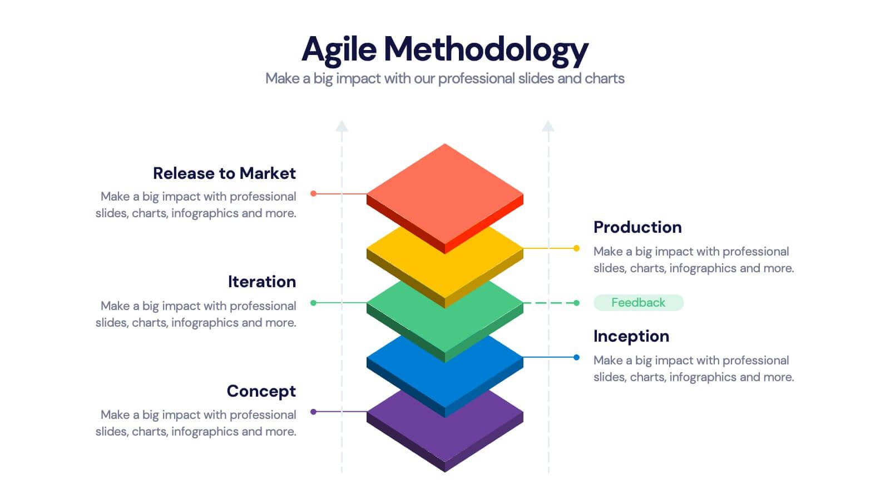

Agile project management has emerged as a pivotal force across various industries by fostering a culture of flexibility, collaboration, and a focus on customer-centricity. This methodological shift empowers organizations to adapt swiftly to changing conditions, respond effectively to customer needs, and streamline processes through iterative development. Notably, in the finance sector, agile methodologies have the potential to revolutionize practices, particularly in the niche of algorithmic trading—a domain characterized by its demand for rapid adaptation and precise execution.

Algorithmic trading leverages mathematical models and computational power to execute trades at high speeds, necessitating systems that can swiftly react to ever-evolving market conditions. Agile practices, with their emphasis on iterative progress and responsiveness to change, are uniquely suited to meet these demands. By integrating agile methodologies into the fabric of algorithmic trading projects, financial institutions can enhance their capacity to develop, test, and deploy trading algorithms rapidly and reliably.

This article will explore how agile methodologies can be effectively integrated into financial projects with a particular focus on algorithmic trading. The exploration will cover the tangible benefits of agile adoption, such as increased customer satisfaction, enhanced flexibility, and improved market competitiveness. Furthermore, the challenges associated with transitioning to agile practices within the finance sector, such as overcoming cultural resistance and managing stakeholder expectations, will be addressed. Finally, best practices for implementing agile in this specialized field will be provided, offering concrete strategies to drive efficiency and growth.

The integration of agile project management in finance, and specifically in algorithmic trading, presents a pathway to substantial improvements in operational effectiveness and strategic outcomes. As financial markets continue to evolve, embracing agile principles will be crucial for organizations striving to maintain a competitive edge and meet the demands of an increasingly dynamic environment.

## Table of Contents

## Understanding Agile Project Management in Finance

Agile methodologies have achieved significant prominence in various industries by emphasizing flexibility, collaboration, and iterative progress. In finance, these principles are particularly valuable, as they enable teams to adapt swiftly to volatile market conditions and regulatory changes. The dynamic nature of the financial sector, where precision and timeliness are crucial, necessitates a management approach that can deliver both speed and accuracy. Agile methodologies offer these capabilities, making them suitable for finance projects, especially within algorithmic trading.

Algorithmic trading involves the use of algorithms to execute trades at high speeds and volumes, often with minimal human intervention. This requires a robust and adaptive framework, such as agile, which facilitates rapid iteration and continuous improvement. Agile methods empower teams to test, refine, and deploy algorithms quickly, ensuring they remain competitive and responsive to market dynamics.

Several agile frameworks are applicable to financial projects, each offering unique advantages. Scrum, for instance, is a popular framework that structures work in iterative cycles known as sprints. During each sprint, teams focus on delivering a potentially shippable product increment. For [algorithmic trading](/wiki/algorithmic-trading), this could involve refining a trading strategy or deploying enhancements to existing algorithms. The consistent feedback loops in Scrum drive continuous improvement, aligning well with the iterative needs of financial markets.

Kanban, another agile framework, emphasizes continuous delivery without overloading the development team. It visualizes the workflow and manages work in progress with the goal of increasing output efficiency. In finance, Kanban can be used to streamline processes, reduce bottlenecks, and enhance operational efficiency, essential for maintaining a competitive edge in fast-paced trading environments.

Lean, with its focus on eliminating waste and optimizing processes, can bring significant efficiencies to algorithmic trading projects. By identifying value streams, Lean principles help teams concentrate efforts on areas that deliver the most value, thus minimizing unnecessary activities and enhancing performance.

In the finance sector, adopting agile methodologies allows firms to become more responsive and adaptable, fostering an environment conducive to innovation. The ability to respond swiftly to market changes and regulatory environments is not only a competitive advantage but a necessity in today's financial landscape. Agile practices equip financial teams with the tools needed to navigate complexity with agility, ensuring ongoing alignment with strategic business goals.

## The Role of Agile in Algorithmic Trading

Algorithmic trading is a domain where speed and precision are paramount, aligning seamlessly with the core principles of agile methodologies. Agile practices facilitate rapid responses to fluctuating market conditions, thereby allowing financial institutions to maintain a competitive edge. The agile approach, characterized by its iterative cycles and customer-centric focus, enhances the ability of teams to develop and deploy trading algorithms efficiently.

One of the primary advantages of integrating agile methodologies in algorithmic trading is the accelerated pace at which algorithms can be tested and implemented. Traditional development methodologies often involve lengthy phases of requirement gathering, development, and testing. In contrast, agile practices such as Scrum focus on short, iterative development cycles known as sprints. These cycles enable algorithmic trading teams to continuously refine their strategies based on real-time feedback and testing outcomes.

The iterative nature of agile further supports the continuous refinement and enhancement of trading strategies. By breaking down complex projects into smaller, manageable pieces, teams can incrementally build and test algorithm components. This approach not only fosters innovation but also reduces the risk of large-scale failures. For instance, when a component of an algorithm needs improvement, agile practices allow for focused testing and development without overhauling the entire system.

Case studies exemplify the successful application of agile methodologies in algorithmic trading. A prominent example is a financial firm that adopted the Kanban framework, a lean management method tailored to optimize workflow. By visualizing their work process and limiting work in progress, the firm improved its algorithm deployment speeds. The Kanban system enabled them to quickly identify bottlenecks and make necessary adjustments, ensuring that their trading algorithms remained robust and responsive to market demands.

Another case involves the implementation of a hybrid agile approach combining elements of Scrum and Extreme Programming (XP) to enhance collaboration between developers and traders. This hybrid methodology facilitated continuous integration and testing of trading algorithms, leading to more reliable and effective trading outcomes.

Overall, the integration of agile methodologies in algorithmic trading supports the rapid development and deployment of sophisticated trading strategies. By fostering an environment of collaboration and continuous improvement, agile practices empower financial teams to innovate and react swiftly to market changes, ultimately driving improved trading performance.

## Benefits of Agile in Finance and Algo Trading

Agile methodologies are advancing the finance sector, particularly within algorithmic trading, by prioritizing client needs and ensuring that processes are aligned accordingly. This alignment translates into increased customer satisfaction as the agile approach focuses on delivering value that resonates with the specific demands and expectations of clients. By incorporating continuous feedback loops and iterative development, financial teams can refine their processes and outputs more effectively, ensuring that the end product or service is closely matched to client requirements.

Enhanced flexibility and adaptability are also key features of agile methodologies, making them indispensable for remaining competitive in today's dynamic markets. Agile frameworks promote a responsive organizational culture where adjustments to strategies and operations can be made rapidly in response to market shifts or emerging opportunities. This adaptability not only helps in maintaining competitive advantage but also supports risk management by allowing financial firms to pivot with minimal disruption or delay.

The implementation of agile practices accelerates the time to market for new trading strategies and tools. The iterative nature of agile approaches means that products are developed in small, manageable increments, enabling quicker launches and allowing teams to gather and incorporate feedback at various stages. This expedited development cycle can significantly reduce time-to-market, providing financial institutions with a critical edge in unveiling innovative trading solutions.

Improved collaboration is another significant benefit reported by financial teams adopting agile methodologies. Agile fosters a culture of collaboration and open communication, which enhances the coordination between different team members and stakeholders. This collaborative environment is conducive to higher-quality outputs as team members are better able to share insights, identify potential issues early, and work collectively toward common objectives. Enhanced collaboration ensures that everyone involved is aligned with the strategic goals and is contributing effectively toward achieving them.

Overall, agile methodologies bring significant enhancements to the finance sector and algorithmic trading, boosting customer satisfaction, making organizations more adaptable, speeding up time-to-market, and improving teamwork and quality of work. These factors contribute to a more responsive and dynamic financial operation, capable of thriving in a fast-paced and ever-evolving industry.

## Challenges of Implementing Agile in Finance

Implementing agile methodologies in finance, particularly in algorithmic trading, presents several unique challenges. One of the primary difficulties lies in the cultural shift required within organizations. Traditional financial institutions often adhere to rigid processes and hierarchical structures, which can be resistant to the agility and flexibility that agile methodologies promote. The transformation requires altering established mindsets, promoting a culture of collaboration, and encouraging teams to embrace iterative development processes.

Financial firms might initially struggle with the complexity of agile frameworks. Agile methodologies like Scrum and Kanban require a detailed understanding of their specific practices, roles, and terminologies. For instance, the concept of iterative sprints in Scrum or the visual workflow management in Kanban might be new and difficult to assimilate for teams accustomed to linear project execution. Training and consistent practice are essential to overcoming these initial hurdles.

Moreover, managing stakeholder expectations in an agile environment can pose challenges. Agile involves frequent changes and iterations, which can lead to shifts in project timelines and outcomes. Stakeholders used to predictable and fixed outcomes may find this uncomfortable. Transparent communication and setting clear expectations are vital. Explaining the agile process, emphasizing the benefits of flexibility, such as faster response to market changes and quick iteration cycles, can alleviate concerns and build trust.

Addressing these challenges effectively requires a strategic approach. Leadership within financial institutions should champion the agile transition, acting as role models. Providing comprehensive training and resources to teams can ease the adoption process. Additionally, engaging stakeholders through regular updates, demonstrations, and involving them in iteration reviews can align expectations and illustrate the tangible benefits of agility in finance. This strategic alignment and education can mitigate resistance and facilitate a smoother transition to agile methodologies in the finance sector.

## Best Practices for Agile Implementation in Algo Trading

Establishing clear objectives and aligning team goals with overall business outcomes is crucial for the successful implementation of agile methodologies in algorithmic trading. By setting specific, measurable, achievable, relevant, and time-bound (SMART) objectives, teams can ensure alignment with the broader strategic goals of the organization. This alignment helps maintain focus on delivering value to the business while also meeting client needs.

Fostering a culture of collaboration and open communication across teams is a cornerstone of agile practices. It requires breaking down silos and encouraging cross-functional teams to work together seamlessly. Regular meetings, such as daily stand-ups and sprint reviews, facilitate transparency and keep team members informed about progress and challenges. This environment of open dialogue supports rapid problem-solving and innovation, which are essential in the fast-paced world of algorithmic trading.

Prioritizing quality and continuous improvement in all processes is fundamental to maintaining competitive advantage in algorithmic trading. Adopting practices such as Test-Driven Development (TDD), Continuous Integration (CI), and Continuous Deployment (CD) ensures that code quality is upheld and that algorithms are robust. These practices help identify and rectify defects early in the development process, reducing the risk of failures in live trading environments.

Implementing a risk management plan and regularly monitoring progress with flexibility for adjustments allows teams to respond agilely to changing market conditions and other unforeseen events. Agile risk management identifies potential risks early and develops mitigation strategies, ensuring that the team is prepared to adapt as necessary. Regular retrospectives and progress reviews provide opportunities to assess risk factors and make necessary adjustments, ensuring that the team remains aligned with project goals and market demands.

By adhering to these best practices, organizations can effectively integrate agile methodologies into their algorithmic trading processes, enhancing both efficiency and responsiveness to market changes.

## Conclusion

Agile project management in finance, particularly in algorithmic trading, provides several notable advantages. These methodologies support the dynamic nature of financial markets by allowing finance teams to remain flexible and responsive to rapid changes and evolving client needs. Agile methods promote efficiency and effectiveness by enabling continuous feedback loops and iterative improvements, which are crucial in developing and deploying trading algorithms swiftly.

The adoption of agile practices in finance, despite certain implementation challenges, has demonstrated the potential for substantial gains in process and project management. Financial teams that incorporate agile principles report enhanced adaptability, improved collaboration, and a faster time-to-market for trading strategies and innovations. This increased speed and flexibility are particularly beneficial in maintaining a competitive edge in fast-paced market environments.

To leverage the full benefits of agile methods, finance teams must be willing to embrace cultural shifts that prioritize collaboration and open communication. Agile principles encourage teams to regularly reassess and align their objectives with business goals while staying open to iterative changes. As financial markets continue to evolve, the integration of agile frameworks in future finance projects is likely to drive significant innovation and help achieve strategic objectives. By adopting agile approaches, finance teams will be better positioned to respond to market demands and foster an environment conducive to ongoing improvement and success.

## References & Further Reading

[1]: Beck, K., et al. (2001). ["Manifesto for Agile Software Development."](https://athena.ecs.csus.edu/~buckley/CSc191/Manifesto%20for%20Agile%20Software%20Development.pdf) Agile Alliance.

[2]: Schwaber, K., & Sutherland, J. (2020). ["The Scrum Guide."](https://scrumguides.org/docs/scrumguide/v2020/2020-Scrum-Guide-US.pdf) Scrum.org.

[3]: De Prado, M. L. (2018). ["Advances in Financial Machine Learning."](https://papers.ssrn.com/sol3/papers.cfm?abstract_id=3257419) Wiley.

[4]: Aronson, D. R. (2006). ["Evidence-Based Technical Analysis: Applying the Scientific Method and Statistical Inference to Trading Signals."](https://www.amazon.com/Evidence-Based-Technical-Analysis-Scientific-Statistical/dp/0470008741) Wiley.

[5]: Jansen, S. (2020). ["Machine Learning for Algorithmic Trading: Predictive Models to Extract Signals from Market and Alternative Data for Systematic Trading Strategies with Python."](https://www.amazon.com/Machine-Learning-Algorithmic-Trading-alternative/dp/1839217715) Packt Publishing.

[6]: Rigby, D. K., Sutherland, J., & Takeuchi, H. (2016). ["Embracing Agile."](https://hbr.org/2016/05/embracing-agile) Harvard Business Review.

[7]: Chan, E. (2009). ["Quantitative Trading: How to Build Your Own Algorithmic Trading Business."](https://github.com/justinchou/books-quantitative-trading) Wiley. 

[8]: Pichler, R. (2010). ["Agile Product Management with Scrum: Creating Products that Customers Love."](https://www.romanpichler.com/romans-books/agile-product-management-with-scrum/) Addison-Wesley Professional.