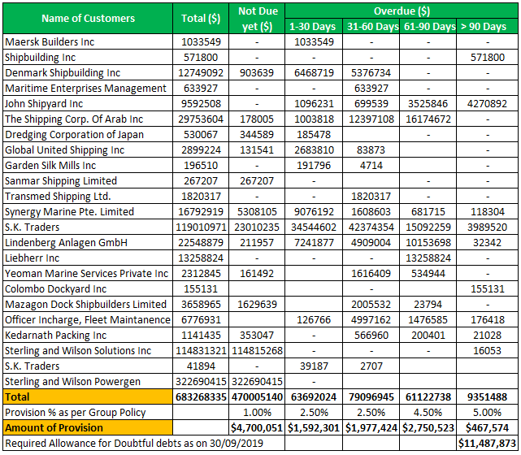

Efficient financial management stands as a cornerstone for the sustained growth and success of businesses across various industries. This encompasses a wide range of tasks such as budgeting, forecasting, investing, and managing resources. A critical aspect of financial management is ensuring that revenue streams are predictable and stable, which is where accounting practices like accounts receivable aging become essential. 

Accounts receivable aging is a vital accounting methodology used to evaluate the creditworthiness of customers and assess the financial health of a business. It involves categorizing outstanding receivables based on the length of time that invoices have remained unpaid. By organizing receivables into time brackets—such as 0-30 days, 31-60 days, 61-90 days, and over 90 days—businesses can identify which accounts pose a risk for delayed payments and take necessary actions to mitigate these risks. This process aids companies in managing their cash flow effectively, understanding credit risks, and ensuring that they maintain a healthy balance between incoming and outgoing funds.



Simultaneously, algorithmic trading has emerged as a transformative force in the financial markets. It employs complex algorithms and mathematical models to make trading decisions at speeds and frequencies that are beyond the capacity of human traders. Algorithmic trading is lauded for its precision, efficiency, and ability to process vast sets of data in real-time, thereby optimizing investment strategies. Traders develop specific algorithms that can automatically place orders based on various parameters, such as timing, price, or quantity, ensuring a more systematic and unemotional approach to trading.

The intersection of accounts receivable aging and algorithmic trading highlights a significant synergy between traditional accounting practices and modern financial technologies. The insights derived from accounts receivable aging reports can inform algorithmic trading strategies by providing a clearer picture of a company's financial standing and liquidity. This information can be pivotal for making informed trading decisions, such as altering positions in a portfolio based on a company’s current and projected fiscal health. Thus, integrating accounts receivable aging data into algorithmic trading systems can enhance the decision-making process, reduce financial risks, and ultimately contribute to a more agile and robust financial management framework. By leveraging both practices, businesses can not only streamline their financial operations but also maintain a competitive edge in today’s fast-paced economic environment.

## Table of Contents

## Understanding Accounts Receivable Aging

Accounts receivable aging is an accounting method used to monitor and categorize a company's receivables based on the length of time an invoice has been outstanding. This process is vital for understanding a company’s liquidity and cash flow situation. The primary purpose of accounts receivable aging is to assess credit risk and ensure financial health by identifying overdue accounts that may require immediate attention.

Aging reports are structured to categorize receivables based on different time frames, typically broken down into intervals such as 0–30 days, 31–60 days, 61–90 days, and over 90 days past due. Each category represents the duration for which an invoice has not been paid. By organizing receivables this way, companies can swiftly identify overdue accounts and prioritize collection activities. 

Monitoring these aging categories enables businesses to determine the extent of their credit exposure and assess the likelihood of receiving payments. For instance, invoices that fall into the 0–30 days category may be considered normal, whereas those beyond 60 days might signal potential collection problems. Companies often calculate an aging schedule to quantify their exposure, using formulas to measure the percentage of total receivables in each category. A common measure expressed is the "Days Sales Outstanding" (DSO), which gauges the average number of days it takes to collect a payment after a sale.

Businesses leverage aging reports to understand their financial health better. For instance, a high percentage of receivables in the 90+ days overdue category may indicate [liquidity](/wiki/liquidity-risk-premium) issues or potential bad debts, urging managers to revise credit policies or improve collection strategies. Furthermore, regular analysis of aging reports helps in forecasting cash flows, ensuring enough liquidity for operations, and planning for future investments.

In summary, accounts receivable aging is an indispensable tool for companies aiming to maintain a stable cash flow and minimize credit risk. By categorizing and analyzing outstanding invoices, businesses can effectively manage their receivables, thereby supporting overall financial stability and strategic planning.

## Example of an Aging Report in Accounting

An accounts receivable aging report is an essential tool in financial management that categorizes outstanding invoices by the length of time they have remained unpaid. This report aids businesses in evaluating their receivables, managing cash flow, and assessing credit risk. To illustrate how an aging report functions, let us consider a hypothetical company, XYZ Corporation, with various outstanding invoices.

### Hypothetical Data for XYZ Corporation:

Suppose XYZ Corporation has the following invoices outstanding:

| Invoice Number | Customer        | Amount ($) | Invoice Date | Due Date   |
|----------------|-----------------|------------|--------------|------------|
| INV-001        | Alpha Corp      | 5,000      | 2023-01-01   | 2023-01-31 |
| INV-002        | Beta Ltd        | 3,500      | 2023-02-10   | 2023-03-12 |
| INV-003        | Gamma Inc       | 4,200      | 2023-03-01   | 2023-03-31 |
| INV-004        | Delta LLC       | 6,000      | 2023-03-15   | 2023-04-14 |
| INV-005        | Epsilon Co      | 2,700      | 2023-04-01   | 2023-05-01 |

### Categorization:

Aging reports categorize the invoices into various buckets based on the days past due. The typical categories are:

- Current (not past due)
- 1-30 days past due
- 31-60 days past due
- 61-90 days past due
- Over 90 days past due

Assuming today's date is May 10, 2023, the aging report for XYZ Corporation would look like this:

| Aging Category    | Amount ($) |
|-------------------|------------|
| Current           | 2,700      |  
| 1-30 days past due| 6,000      |
| 31-60 days past due| 4,200     |
| 61-90 days past due| 3,500     |
| Over 90 days past due| 5,000   |

### Interpretation

The aging report signifies that XYZ Corporation has a significant portion of its receivables in the overdue categories. Particularly, the $5,000 in the "Over 90 days past due" category could be a warning signal of potential cash flow issues, as this suggests receivables are not being collected in a timely fashion.

### Calculating Doubtful Accounts:

To determine the allowance for doubtful accounts, a common method is aging analysis. Companies set percentages based on historical data and experience for each category to estimate uncollectible amounts.

Let's assume XYZ Corporation uses the following percentages to estimate uncollectible invoices:

- Current: 1%
- 1-30 days past due: 2%
- 31-60 days past due: 5%
- 61-90 days past due: 10%
- Over 90 days past due: 25%

Calculate the allowance for doubtful accounts:

$$
\begin{align*}
\text{Allowance} &= \text{(Current Amount)} \times \text{(Current %)} + \\
&\quad \text{(1-30 Days Amount)} \times \text{(1-30 Days %)} + \\
&\quad \text{(31-60 Days Amount)} \times \text{(31-60 Days %)} + \\
&\quad \text{(61-90 Days Amount)} \times \text{(61-90 Days %)} + \\
&\quad \text{(Over 90 Days Amount)} \times \text{(Over 90 Days %)} \\\\
&= 2,700 \times 0.01 + 6,000 \times 0.02 + 4,200 \times 0.05 + 3,500 \times 0.10 + 5,000 \times 0.25 \\\\
&= 27 + 120 + 210 + 350 + 1,250 \\\\
&= 1,957
\end{align*}
$$

XYZ Corporation should record an allowance for doubtful accounts of $1,957, reflecting the potential loss from uncollectible receivables.

This aging report provides crucial insights that not only influence cash flow strategies but also help determine credit policies to enhance financial stability. By regularly monitoring these reports, businesses can proactively manage credit risk and maintain healthy cash flows, supporting sustained financial health.

## The Role of Aging Reports in Cash Flow Management

Aging reports play a pivotal role in a company’s cash flow management by providing a detailed analysis of outstanding invoices and their duration. These reports categorize receivables based on the length of time they have been overdue, typically into time brackets such as 0-30 days, 31-60 days, and so on. This categorization allows companies to track overdue payments, assess the effectiveness of their credit policies, and make informed decisions about their cash flow strategies.

Monitoring receivables is crucial to maintaining positive cash flow as it provides insights into the payment behaviors of customers and helps predict future cash inflows. If a significant portion of accounts receivable is overdue, it could indicate potential cash flow issues. Frequent review of aging reports enables businesses to take corrective actions such as adjusting credit terms, improving collection processes, or identifying customers who consistently delay payments.

To address overdue payments identified in aging reports, companies can employ several strategies. These include:

1. **Improving Communication**: Establish clear communication with clients, reminding them of outstanding invoices as they approach their due dates. Regular follow-ups through phone calls, emails, or automated reminders can be effective in prompting payment.

2. **Offering Incentives for Early Payments**: Discounts or other benefits may be provided to clients who settle their invoices early. These incentives can encourage timely payments and improve cash inflow consistency.

3. **Implementing Penalties for Late Payments**: Instituting a late payment penalty can deter clients from delaying their payments. However, it is essential to communicate these penalties clearly in the terms and conditions agreed upon with clients.

4. **Reviewing Credit Policies**: If persistent overdue payments are identified, it might be necessary to rethink the company’s credit policy. This could involve adjusting credit limits or terms for specific clients based on their payment history.

5. **Utilizing Collection Services**: For accounts that remain unpaid despite follow-ups, companies might consider engaging professional collection agencies. These agencies specialize in recovering overdue payments, although this might lead to a reduction in the amount ultimately collected due to fees.

Effective cash flow management using aging reports allows businesses to mitigate risks associated with late payments, sustain operational liquidity, and support long-term financial stability. By systematically addressing overdue accounts, companies can enhance their financial health and reduce reliance on external financing.

## Integrating Algorithmic Trading into Financial Strategies

Algorithmic trading involves the use of computer algorithms to automate trading decisions, executing orders and managing portfolios with minimal human intervention. This approach to trading has substantially redefined investment strategies by enabling greater precision and efficiency in market operations. Algorithmic trading systems leverage complex mathematical models to analyze market data at a speed and [volume](/wiki/volume-trading-strategy) beyond human capabilities, allowing traders to exploit even the smallest price fluctuations.

The growing role of [algorithmic trading](/wiki/algorithmic-trading) in investment strategy stems from its numerous advantages. Algorithms can process information and make decisions at a much faster rate than human traders, allowing for high-frequency trading where positions are held for very short durations. This speed not only improves trading performance by capturing more opportunities but also enhances market liquidity by increasing the number of transactions.

Moreover, algorithmic trading minimizes human error and emotional biases, which can lead to costly mistakes, especially in volatile markets. Automated systems adhere strictly to predefined rules and strategies, ensuring consistent decision-making aligned with an investor’s goals. These systems can also continuously operate throughout the trading day, taking full advantage of market conditions without fatigue.

One of the primary strategies in algorithmic trading is **statistical [arbitrage](/wiki/arbitrage)**, which involves trading on pricing inefficiencies between related financial instruments. Algorithms detect these anomalies by analyzing historical correlations and executing trades when deviations occur, with the expectation that prices will revert to their statistical norm.

Another common strategy is **mean reversion**, based on the assumption that asset prices will tend to return to their historical average over time. Algorithms using this strategy identify when an asset's price deviates significantly from its historical mean and execute trades accordingly, betting on the eventual reversion.

**Momentum trading** is yet another algorithmic approach that capitalizes on trends in asset prices. This strategy involves buying assets that have shown an upward trend and selling those exhibiting a downward trend, under the assumption that these price movements will continue for some time.

Implementing these strategies typically involves the use of programming languages such as Python due to its extensive libraries and frameworks tailored for financial applications. For instance, the `pandas` library is widely used for data manipulation, while `numpy` and `scipy` provide robust tools for scientific calculations.

Here is a simple Python example illustrating a basic [momentum](/wiki/momentum) trading algorithm:

```python
import pandas as pd

# Load historical price data
data = pd.read_csv('price_data.csv', index_col='Date', parse_dates=True)

# Calculate the momentum indicator
data['Momentum'] = data['Close'] - data['Close'].shift(periods=5)

# Define a simple trading strategy based on momentum
data['Signal'] = 0
data.loc[data['Momentum'] > 0, 'Signal'] = 1  # Buy signal
data.loc[data['Momentum'] < 0, 'Signal'] = -1  # Sell signal

# Display signals
print(data['Signal'].tail())
```

In this example, a simple momentum indicator is calculated by subtracting the closing price five periods ago from the current closing price. A buy signal is generated when this momentum is positive, and a sell signal when negative.

In conclusion, algorithmic trading is transforming financial strategies by combining speed, precision, and advanced analytics. Its implementation through various strategies, such as [statistical arbitrage](/wiki/statistical-arbitrage), mean reversion, and momentum trading, can yield significant advantages in modern market settings.

## Synergies between Accounts Receivable Management and Algo Trading

Accounts receivable aging and algorithmic trading are two distinct financial management tools, yet their integration can enhance financial decision-making. The insights derived from accounts receivable aging can significantly inform algorithmic trading decisions by offering a nuanced understanding of a company's financial health and liquidity status.

Accounts receivable aging involves categorizing outstanding invoices by the length of time they have been unpaid, which supports the assessment of credit risk and cash flow stability. A detailed aging report provides data that highlights potential liquidity constraints. When a company has an increase in overdue receivables, it may indicate a tightening liquidity situation. Such information can be a crucial input into algorithmic trading strategies, particularly those that involve trading the company’s shares or derivatives. A trading algorithm could, for example, decrease the portfolio's exposure to a company with deteriorating receivables or anticipate market sentiment shifts that impact stock prices.

Here's a hypothetical Python snippet outlining how an aging report might inform an algorithmic decision:

```python
import numpy as np

# Example of aged receivables data
days_past_due = [30, 60, 90, 120]
receivables = np.array([50000, 30000, 10000, 5000])  # dollars

# Calculate weighted average age of receivables as a liquidity risk metric
weights = np.array(days_past_due) / sum(days_past_due)
weighted_age = np.dot(weights, receivables)

# Trading decision based on weighted age threshold
liquidity_risk_threshold = 60  # days

if weighted_age > liquidity_risk_threshold:
    print("Reduce stock exposure due to high receivable risk.")
else:
    print("Maintain or increase stock exposure.")
```

This example demonstrates how accounts receivable data, particularly the weighted average age of receivables, can provide input into a trading algorithm. By using such insights, traders can dynamically adjust their strategies based on the financial health indicators derived from aging reports.

The potential benefits of combining accounts receivable management with algorithmic trading are substantial. Enhanced risk management, better-timed investment decisions, and improved financial forecasting are some of the advantages. Companies can leverage accounts receivable data to optimize liquidity, which can inform more precise trading actions. Furthermore, this integration can lead to a more holistic approach to financial strategy by combining cash flow and market intelligence to drive investment performance. 

Overall, the synthesis of accounts receivable insights with algorithmic trading enhances strategic financial management, offering businesses a competitive edge in maintaining robust cash flow and seizing market opportunities.

## Best Practices for Optimizing Financial Operations

Optimizing financial operations in today's dynamic business environment requires a strategic approach that includes automation, real-time data analytics, and regular updates to financial strategies. By embracing these best practices, businesses can ensure a more efficient and responsive financial management system.

Automating accounts receivable processes stands as a pivotal strategy in managing financial operations efficiently. Automation tools can streamline routine tasks such as invoicing, payment reminders, and tracking, which not only reduces human error but also speeds up the receivables cycle. Implementing software solutions that enable electronic invoicing and automatic payment reminders can significantly decrease the time a company waits to receive payments. Moreover, integrating [artificial intelligence](/wiki/ai-artificial-intelligence) algorithms can help predict customer payment behaviors, allowing companies to prioritize collection efforts towards accounts that are likely to delay.

Real-time data analytics provide a competitive edge by offering immediate insights into both cash flow and trading decisions. Using platforms that facilitate real-time data integration allows businesses to monitor and analyze financial metrics as they unfold. This capability aids in identifying cash flow bottlenecks promptly and adjusting trading strategies to reflect current market conditions. For example, if an increase in overdue accounts is detected, algorithms could adjust investment allocations to maintain liquidity. Python programming, with libraries such as Pandas and NumPy, can be used to process and analyze financial data efficiently. Here's a simple example of how Python can be utilized to analyze accounts receivable data to identify overdue payments:

```python
import pandas as pd

# Sample data: invoice date and payment due date
data = {'Invoice Date': ['2023-01-05', '2023-02-10', '2023-03-15'],
        'Due Date': ['2023-02-05', '2023-03-10', '2023-04-15'],
        'Amount': [1500, 2300, 800]}

df = pd.DataFrame(data)

# Convert to datetime
df['Invoice Date'] = pd.to_datetime(df['Invoice Date'])
df['Due Date'] = pd.to_datetime(df['Due Date'])

# Calculate aging in days
current_date = pd.to_datetime('2023-10-20')
df['Days Overdue'] = (current_date - df['Due Date']).dt.days

# Identify overdue accounts
overdue_accounts = df[df['Days Overdue'] > 0]
print(overdue_accounts)
```

Lastly, regularly reviewing and updating financial strategies to align with evolving market and organizational goals is crucial. The financial environment is perpetually changing, and so should a company's strategies. Conducting quarterly reviews of financial performance and strategic objectives ensures that companies remain adaptive and proactive. This process may include revisiting risk management policies, updating predictive models with recent data, and recalibrating investment portfolios to balance between growth and liquidity requirements.

Collectively, these practices form a holistic approach to financial operations, ensuring that companies not only manage their finances effectively but also remain agile in response to market changes. By adopting automation, leveraging real-time data, and maintaining strategic flexibility, businesses can achieve robust financial health and sustain growth.

## Conclusion

Integrating accounts receivable aging reports and algorithmic trading offers significant advantages for businesses striving for optimized financial management. Accounts receivable aging, a key component of financial accounting, allows companies to evaluate their credit risk and maintain better control over cash flow. By understanding the duration of outstanding receivables through aging reports, businesses can assess their financial health and make informed decisions regarding credit policies and collections. On the other hand, algorithmic trading provides precision and efficiency in investment strategies, using automation and complex algorithms to execute trades based on market data and conditions swiftly.

The intersection of these two areas creates a strategic advantage. Aging reports can offer valuable insights into cash flow trends and potential liquidity issues, which can be crucial for algorithmic models that incorporate financial health indicators of companies. Such integration facilitates data-driven decision-making, allowing businesses to adjust trading strategies dynamically, responding swiftly to changes in financial conditions reflected in aging reports. For instance, insights from these reports can guide adjustments in capital allocations in trading algorithms, reducing risks and optimizing returns.

By combining the meticulous monitoring capabilities from accounts receivable management with the agility of algorithmic trading, businesses are well positioned to enhance their financial strategies. This confluence supports sustained business growth through more informed strategic decisions, promoting both stability in cash flow management and efficiency in market operations. Companies are thus encouraged to adopt these integrated financial practices, leveraging real-time data and automated processes to achieve a competitive edge in today’s dynamic economic landscape. Emphasizing strategic financial management not only ensures business continuity but also contributes to long-term profitability and success.

## References & Further Reading

[1]: Bergstra, J., Bardenet, R., Bengio, Y., & Kégl, B. (2011). ["Algorithms for Hyper-Parameter Optimization."](https://dl.acm.org/doi/10.5555/2986459.2986743) Advances in Neural Information Processing Systems 24.

[2]: ["Advances in Financial Machine Learning"](https://www.amazon.com/Advances-Financial-Machine-Learning-Marcos/dp/1119482089) by Marcos Lopez de Prado

[3]: ["Evidence-Based Technical Analysis: Applying the Scientific Method and Statistical Inference to Trading Signals"](https://www.amazon.com/Evidence-Based-Technical-Analysis-Scientific-Statistical/dp/0470008741) by David Aronson

[4]: ["Machine Learning for Algorithmic Trading"](https://github.com/stefan-jansen/machine-learning-for-trading) by Stefan Jansen

[5]: ["Quantitative Trading: How to Build Your Own Algorithmic Trading Business"](https://www.amazon.com/Quantitative-Trading-Build-Algorithmic-Business/dp/1119800064) by Ernest P. Chan