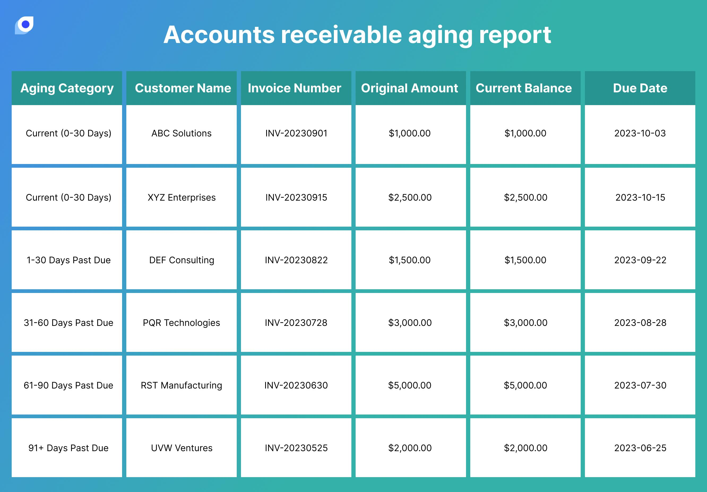

## Table of Contents

## What is aging in accounting?

Aging in accounting is a method used to keep track of how long invoices or bills have been outstanding. It helps businesses understand which payments are overdue and by how many days. This information is important because it shows how well a company is managing its cash flow and collecting payments from customers. By categorizing invoices into different time periods, like 0-30 days, 31-60 days, and so on, businesses can see at a glance which accounts need attention.

Using an aging report, a business can focus on collecting the oldest debts first, which helps improve cash flow. It also helps in identifying customers who consistently pay late, allowing the business to take action, like changing payment terms or even stopping sales to those customers. Overall, aging reports are a useful tool for managing finances and ensuring that a business remains healthy and operational.

## Why is aging important in accounting?

Aging is important in accounting because it helps businesses see which invoices are not paid on time. By looking at an aging report, a company can quickly find out how many days an invoice has been outstanding. This is useful because it shows which customers are slow to pay and helps the business decide what to do next. For example, if a customer always pays late, the business might change how they handle that customer's payments or even stop selling to them.

Aging also helps with managing cash flow. When a business knows which invoices are overdue, they can focus on collecting those payments first. This means more money coming in sooner, which is good for the business. It also helps the business plan better because they can predict when money will come in and make sure they have enough cash to cover their costs. Overall, aging in accounting is a simple but powerful tool that keeps a business financially healthy.

## How does aging help in managing accounts receivable?

Aging helps manage accounts receivable by showing how long invoices have been unpaid. It organizes invoices into groups based on how many days they are overdue, like 0-30 days, 31-60 days, and so on. This makes it easy for a business to see which customers are not paying on time. By looking at the aging report, the business can decide which invoices to focus on collecting first. This helps them get money back faster, which is important for keeping the business running smoothly.

Using aging also helps the business understand which customers often pay late. If a customer is always late with payments, the business can take action. They might change the payment terms for that customer or even stop selling to them if the problem continues. This way, the business can avoid spending too much time and resources chasing payments that are hard to collect. Overall, aging is a simple but powerful tool that helps businesses manage their money better and keep their accounts receivable under control.

## What are the different categories typically used in an aging report?

An aging report usually sorts invoices into different time categories to show how long they have been unpaid. The most common categories are 0-30 days, 31-60 days, 61-90 days, and over 90 days. These categories help businesses see at a glance which invoices are overdue and by how much.

By using these categories, a business can quickly find out which customers are slow to pay. For example, if many invoices are in the 61-90 days category, it means those customers are taking a long time to pay. This helps the business decide which invoices to focus on collecting first, making sure they get their money back as soon as possible.

## Can you explain how to prepare an aging report?

To prepare an aging report, start by gathering all the invoices that are still unpaid. Look at the date each invoice was sent and the date it was due. Then, sort these invoices into different time categories based on how many days they are overdue. The most common categories are 0-30 days, 31-60 days, 61-90 days, and over 90 days. You can use a spreadsheet or accounting software to help you organize this information.

Once you have sorted the invoices into their categories, add up the total amount of money owed in each category. This will give you a clear picture of which invoices are the oldest and which ones need attention first. By looking at the aging report, you can see which customers are slow to pay and decide what actions to take, like sending reminders or changing payment terms. This helps you manage your money better and keep your business running smoothly.

## What are common software tools used for generating aging reports?

Many businesses use accounting software to make aging reports. Some popular tools are QuickBooks, Xero, and FreshBooks. These programs help you keep track of your invoices and show you which ones are not paid on time. They sort the invoices into groups like 0-30 days, 31-60 days, and so on. This makes it easy to see which customers are slow to pay and helps you focus on collecting the oldest debts first.

These software tools also let you make aging reports quickly. You just need to enter your invoice information, and the software will do the rest. It will show you a report that tells you how much money is owed in each time category. This helps you manage your money better and make sure you get paid on time. Using these tools can save you a lot of time and help keep your business running smoothly.

## How often should aging reports be reviewed and updated?

Aging reports should be reviewed and updated regularly, usually at least once a month. This helps businesses keep track of which invoices are not paid on time. By checking the aging report every month, you can see which customers are slow to pay and decide what to do next, like sending reminders or changing payment terms.

Some businesses might need to review their aging reports more often, like every week, especially if they have a lot of invoices or if cash flow is tight. Updating the report weekly helps them stay on top of their money and make sure they get paid as soon as possible. This way, they can manage their finances better and keep their business running smoothly.

## What are the implications of an aging report on a company's cash flow?

An aging report can tell a lot about a company's cash flow. It shows which invoices are not paid on time, and this is important because if a lot of money is owed for a long time, it can make it hard for the company to have enough cash to pay its bills. If many invoices are in the older categories, like over 90 days, it means the company might not have enough money coming in to keep running smoothly. This can cause problems, like not being able to buy supplies or pay employees on time.

By looking at the aging report, a company can see which customers are slow to pay and take action to get the money faster. For example, they might send reminders or change payment terms for those customers. This helps improve cash flow because the company gets paid sooner. A good aging report helps the company plan better and make sure they always have enough cash to cover their costs. This way, they can keep their business healthy and avoid financial trouble.

## How can aging reports be used to assess the financial health of a business?

Aging reports can help a business see how well it is doing with money. By looking at the report, the business can find out which invoices are not paid on time. If a lot of money is owed for a long time, it might mean the business is having trouble getting paid. This can be a sign that the business needs to work on collecting money faster or that some customers are not good at paying on time. By checking the aging report, the business can see if it has enough cash to keep running smoothly or if it might run into problems soon.

Using aging reports also helps a business understand its customers better. If many invoices are in the older categories, like over 90 days, it shows which customers are slow to pay. The business can then decide what to do, like sending reminders or changing payment terms. This helps the business get money back faster and keep its cash flow healthy. By keeping an eye on the aging report, the business can plan better and make sure it always has enough money to cover its costs, which is important for staying financially healthy.

## What strategies can be implemented to improve the results shown in aging reports?

To improve the results shown in aging reports, a business can start by sending reminders to customers whose invoices are overdue. These reminders can be emails, phone calls, or letters, and they should be polite but firm. The business can also offer early payment discounts to encourage customers to pay their invoices sooner. This way, the business gets its money faster, which helps with cash flow. Another strategy is to change payment terms for customers who often pay late. For example, the business might ask for payment upfront or set shorter payment deadlines.

Another way to improve aging reports is by using credit checks before selling to new customers. This helps the business know if a customer is likely to pay on time. If a customer has a history of late payments, the business might decide not to sell to them or to ask for payment in advance. The business can also work on better communication with customers. By talking to them regularly and understanding their payment habits, the business can find out why they are paying late and work on solutions together. This can help improve the overall results in the aging report and keep the business financially healthy.

## How do aging reports influence credit and collection policies?

Aging reports help businesses decide how to handle credit and collection policies. By looking at the report, a business can see which customers are slow to pay their invoices. If many invoices are in the older categories, like over 90 days, it might mean the business needs to change its credit policy. For example, they might start doing credit checks on new customers to make sure they will pay on time. This helps the business avoid selling to customers who might not pay their bills.

Aging reports also help with collection policies. If the report shows that a lot of money is owed for a long time, the business might need to be more strict about collecting payments. They could send reminders more often or even stop selling to customers who always pay late. By using the information from the aging report, the business can make better decisions about how to get paid faster and keep their cash flow healthy.

## What advanced analytics can be applied to aging reports for predictive purposes?

Advanced analytics can be used on aging reports to predict how long it will take to get paid. By looking at past data, businesses can use [machine learning](/wiki/machine-learning) to see patterns in how customers pay their invoices. For example, the analytics can tell if certain customers always pay late or if certain times of the year are slower for payments. This helps the business guess when they will get their money and plan better. They can also use this information to decide if they should change how they give credit or collect payments.

Another way advanced analytics can help is by predicting which customers might have trouble paying in the future. By looking at things like how much a customer owes, how long they take to pay, and even their credit history, the business can figure out who might be a risk. This helps them take action early, like asking for payment upfront or setting shorter payment deadlines. By using these predictions, the business can manage its money better and make sure it always has enough cash to keep running smoothly.

## What is an example of an Aging Report in Accounting?

An accounts receivable aging report is an essential tool in financial management that categorizes outstanding invoices by the length of time they have remained unpaid. This report aids businesses in evaluating their receivables, managing cash flow, and assessing credit risk. To illustrate how an aging report functions, let us consider a hypothetical company, XYZ Corporation, with various outstanding invoices.

### Hypothetical Data for XYZ Corporation:

Suppose XYZ Corporation has the following invoices outstanding:

| Invoice Number | Customer        | Amount ($) | Invoice Date | Due Date   |
|----------------|-----------------|------------|--------------|------------|
| INV-001        | Alpha Corp      | 5,000      | 2023-01-01   | 2023-01-31 |
| INV-002        | Beta Ltd        | 3,500      | 2023-02-10   | 2023-03-12 |
| INV-003        | Gamma Inc       | 4,200      | 2023-03-01   | 2023-03-31 |
| INV-004        | Delta LLC       | 6,000      | 2023-03-15   | 2023-04-14 |
| INV-005        | Epsilon Co      | 2,700      | 2023-04-01   | 2023-05-01 |

### Categorization:

Aging reports categorize the invoices into various buckets based on the days past due. The typical categories are:

- Current (not past due)
- 1-30 days past due
- 31-60 days past due
- 61-90 days past due
- Over 90 days past due

Assuming today's date is May 10, 2023, the aging report for XYZ Corporation would look like this:

| Aging Category    | Amount ($) |
|-------------------|------------|
| Current           | 2,700      |  
| 1-30 days past due| 6,000      |
| 31-60 days past due| 4,200     |
| 61-90 days past due| 3,500     |
| Over 90 days past due| 5,000   |

### Interpretation

The aging report signifies that XYZ Corporation has a significant portion of its receivables in the overdue categories. Particularly, the $5,000 in the "Over 90 days past due" category could be a warning signal of potential cash flow issues, as this suggests receivables are not being collected in a timely fashion.

### Calculating Doubtful Accounts:

To determine the allowance for doubtful accounts, a common method is aging analysis. Companies set percentages based on historical data and experience for each category to estimate uncollectible amounts.

Let's assume XYZ Corporation uses the following percentages to estimate uncollectible invoices:

- Current: 1%
- 1-30 days past due: 2%
- 31-60 days past due: 5%
- 61-90 days past due: 10%
- Over 90 days past due: 25%

Calculate the allowance for doubtful accounts:

$$
\begin{align*}
\text{Allowance} &= \text{(Current Amount)} \times \text{(Current %)} + \\
&\quad \text{(1-30 Days Amount)} \times \text{(1-30 Days %)} + \\
&\quad \text{(31-60 Days Amount)} \times \text{(31-60 Days %)} + \\
&\quad \text{(61-90 Days Amount)} \times \text{(61-90 Days %)} + \\
&\quad \text{(Over 90 Days Amount)} \times \text{(Over 90 Days %)} \\\\
&= 2,700 \times 0.01 + 6,000 \times 0.02 + 4,200 \times 0.05 + 3,500 \times 0.10 + 5,000 \times 0.25 \\\\
&= 27 + 120 + 210 + 350 + 1,250 \\\\
&= 1,957
\end{align*}
$$

XYZ Corporation should record an allowance for doubtful accounts of $1,957, reflecting the potential loss from uncollectible receivables.

This aging report provides crucial insights that not only influence cash flow strategies but also help determine credit policies to enhance financial stability. By regularly monitoring these reports, businesses can proactively manage credit risk and maintain healthy cash flows, supporting sustained financial health.

## References & Further Reading

[1]: Bergstra, J., Bardenet, R., Bengio, Y., & Kégl, B. (2011). ["Algorithms for Hyper-Parameter Optimization."](https://dl.acm.org/doi/10.5555/2986459.2986743) Advances in Neural Information Processing Systems 24.

[2]: ["Advances in Financial Machine Learning"](https://www.amazon.com/Advances-Financial-Machine-Learning-Marcos/dp/1119482089) by Marcos Lopez de Prado

[3]: ["Evidence-Based Technical Analysis: Applying the Scientific Method and Statistical Inference to Trading Signals"](https://www.amazon.com/Evidence-Based-Technical-Analysis-Scientific-Statistical/dp/0470008741) by David Aronson

[4]: ["Machine Learning for Algorithmic Trading"](https://github.com/stefan-jansen/machine-learning-for-trading) by Stefan Jansen

[5]: ["Quantitative Trading: How to Build Your Own Algorithmic Trading Business"](https://www.amazon.com/Quantitative-Trading-Build-Algorithmic-Business/dp/1119800064) by Ernest P. Chan