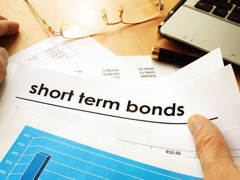

## Table of Contents

## What is agio in simple terms?

Agio is a term used in finance and banking that refers to the difference between two values, usually the difference between the value of one currency compared to another. It can also mean the fee charged for exchanging one currency into another. Think of it as a small extra cost you might pay when you change your money from dollars to euros, for example.

In another context, agio can be the difference between the face value of a bond or stock and its market price. If you buy a bond for more than its face value, the extra amount you pay is called agio. This term helps people understand the extra costs or premiums involved in financial transactions.

## How does agio affect the price of bonds?

When you buy a bond, you might pay more than its face value. This extra amount is called agio. If a bond's face value is $1,000 but you pay $1,050 for it, the $50 difference is the agio. This happens when the bond is in high demand or when interest rates in the market go down. People are willing to pay more for the bond because it offers a better return compared to other investments at that time.

Agio affects the bond's yield, which is how much money you earn from the bond. If you pay more for the bond (higher agio), the yield goes down because you're spending more money for the same interest payments. On the other hand, if the agio is low or negative (you buy the bond for less than its face value), the yield goes up. So, understanding agio helps you see how much you're really paying for a bond and how much return you can expect.

## Can you explain the basic mechanism of agio?

Agio is the difference between the face value of something like a bond or stock and the price you actually pay for it. Let's say a bond has a face value of $1,000, but you buy it for $1,050. That extra $50 is the agio. This happens because of things like high demand for the bond or because interest rates have gone down, making the bond more valuable.

When you pay more than the face value, it affects how much money you earn from the bond. This is called the yield. If you pay more (higher agio), the yield goes down because you're spending more money for the same interest payments. If you pay less than the face value, the yield goes up. So, agio is important because it helps you understand the real cost of buying a bond and how much money you can expect to earn from it.

## What is the difference between agio and disagio?

Agio and disagio are terms used in finance to describe the difference between the face value of a bond or stock and the price you pay for it. Agio happens when you pay more than the face value. For example, if a bond's face value is $1,000 but you buy it for $1,050, the extra $50 is the agio. This can happen when the bond is in high demand or when interest rates go down, making the bond more valuable.

Disagio is the opposite of agio. It happens when you pay less than the face value of a bond or stock. If you buy a bond with a face value of $1,000 for only $950, the $50 difference is the disagio. This can occur when the bond is not in high demand or when interest rates go up, making the bond less valuable. Both agio and disagio affect the yield, or the return you get from the bond, but in opposite ways.

## How is agio calculated in bond markets?

Agio in the bond market is calculated by finding the difference between the price you pay for a bond and its face value. If a bond's face value is $1,000 and you buy it for $1,050, the agio is $50. This happens when the bond is popular or when interest rates drop, making the bond more valuable to buyers.

The calculation is simple: you subtract the face value from the purchase price. If the result is positive, you have agio. This extra amount affects the bond's yield, which is how much money you earn from it. If you pay more for the bond because of agio, the yield goes down because you're spending more money for the same interest payments.

## What factors influence the level of agio on bonds?

Several things can make the agio on bonds go up or down. One big thing is how much people want the bond. If lots of people want to buy it, the price can go above the face value, creating agio. This can happen because the bond is seen as a good investment or because it offers a better return than other investments at the time. Another important factor is interest rates. If interest rates go down, older bonds that have higher interest rates become more valuable, so people are willing to pay more for them, increasing the agio.

Another factor that can affect agio is how safe people think the bond is. If a bond is from a very reliable company or government, people might pay more for it because they trust it won't fail. The overall economy can also play a role. In good economic times, people might be more willing to pay extra for bonds, leading to higher agio. But if the economy is doing poorly, people might not want to pay as much, which could lower the agio. All these factors together decide how much agio there will be on a bond.

## How does agio impact the yield of a bond?

Agio affects the yield of a bond in a straightforward way. When you buy a bond for more than its face value, that extra amount is called agio. If you pay more for the bond, the yield goes down. This is because you're spending more money for the same interest payments. So, even though you're getting the same amount of interest, it's a smaller percentage of what you paid, making the bond's return less attractive.

For example, let's say a bond has a face value of $1,000 and pays $50 in interest each year. If you buy it for $1,050 because of high demand, the agio is $50. The yield would be $50 divided by $1,050, which is about 4.76%. But if you had bought the bond at its face value of $1,000, the yield would be $50 divided by $1,000, or 5%. So, the agio makes the bond's yield lower. Understanding agio helps you see the real cost of buying a bond and how much money you can expect to earn from it.

## What are the historical trends of agio in bond markets?

Historically, agio in bond markets has gone up and down based on what was happening in the economy and with interest rates. During times when the economy was doing well and people felt confident, there was often more agio because people were willing to pay more for bonds. For example, in the late 1990s and early 2000s, when the economy was booming, bond prices went up, and so did agio. On the other hand, during economic downturns, like the 2008 financial crisis, agio tended to go down because people were less willing to pay extra for bonds when they were worried about the economy.

Another factor that has influenced agio over time is changes in interest rates. When interest rates go down, older bonds with higher interest rates become more valuable, leading to higher agio. This was seen in the years following the 2008 crisis when central banks around the world lowered interest rates to help the economy recover. As a result, the agio on existing bonds increased because they offered better returns than new bonds. Conversely, when interest rates rise, the agio on existing bonds can decrease because new bonds with higher interest rates become more attractive to investors.

## How do investors use agio to make investment decisions?

Investors use agio to understand how much they are really paying for a bond and what kind of return they can expect. When they see a bond with a high agio, it means they will have to pay more than the face value of the bond. This can happen when the bond is in high demand or when interest rates have gone down. By knowing the agio, investors can decide if the bond is worth the extra cost. If the agio is too high, it might make the bond's yield, or the money they earn from it, less attractive because they are spending more for the same interest payments.

On the other hand, if a bond has a low or negative agio, meaning they can buy it for less than its face value, it could be a good deal. This often happens when the bond is not in high demand or when interest rates have gone up. Investors might see this as an opportunity to get a higher yield because they are paying less for the bond. By comparing the agio of different bonds, investors can make smarter choices about where to put their money, balancing the cost of the bond with the potential return they will get.

## What are the tax implications of agio on bond investments?

When you buy a bond for more than its face value, the extra amount you pay is called agio. This can affect your taxes because it changes how much profit or loss you make when the bond matures or is sold. If you buy a bond for $1,050 that has a face value of $1,000, you'll get $1,000 back when it matures. That means you lose $50, which is the agio. This loss can sometimes be used to reduce your taxable income, depending on the tax laws where you live.

On the other hand, if you sell the bond before it matures and someone else buys it for $1,100, you make a profit. This profit includes the agio you paid when you bought the bond. When you sell, you need to figure out how much of your profit is from the agio and how much is from other gains. The tax you pay on this profit can be different based on whether it's considered a short-term or long-term gain, and the tax rules in your country. It's a good idea to talk to a tax professional to understand how agio affects your taxes.

## How does agio vary across different types of bonds?

Agio can be different for different types of bonds because each type of bond has its own features and risks. For example, government bonds are usually seen as very safe, so they might have a smaller agio because people are willing to pay a bit more for the safety. On the other hand, corporate bonds can have a bigger agio, especially if the company is doing well and people think it's a good investment. The agio on these bonds can go up if the company's future looks bright, making the bonds more popular and increasing their price above the face value.

Another type of bond where agio can vary is municipal bonds. These are issued by local governments and can have different levels of agio based on the financial health of the area. If the local government is doing well, the agio might be higher because people trust that the bonds are a safe investment. But if the area is struggling financially, the agio might be lower or even negative, meaning you can buy the bond for less than its face value. Overall, the agio on any bond depends on how much people want to buy it and how much risk they think it has.

## What advanced strategies can be employed to manage agio risk in a bond portfolio?

To manage agio risk in a bond portfolio, investors can use a strategy called laddering. This means buying bonds that mature at different times. By doing this, you spread out when you get your money back. If interest rates go down, the bonds you bought earlier might have a higher agio because they are more valuable. But if you have bonds maturing at different times, you can reinvest the money from the ones that mature into new bonds with different agio levels. This helps balance out the risk of paying too much for bonds with high agio.

Another strategy is to use bond swaps. This means selling a bond with a high agio and buying another bond with a lower agio or even a disagio. If you think the bond you own is overpriced because of high demand, you can sell it and buy a similar bond that is cheaper. This can help you get a better yield because you're not paying as much for the new bond. By keeping an eye on the market and being ready to swap bonds, you can manage the risk of agio and make sure your portfolio stays balanced and profitable.

## What is Agio and why is it important in bond trading?

Agio in bond trading refers to the premium by which a bond's market value exceeds its par value. This premium can be an essential indicator of the bond's profitability, offering insights into market sentiment and investor confidence. Historically, the concept of agio originated to describe currency spreads within the same country but evolved to entail the spread between different nations' currencies in more recent financial practices. 

In bond markets, calculating agio is vital for investors seeking to understand a bond's profitability accurately. The formula for agio can be expressed as:

$$
\text{Agio} = \frac{\text{Market Value} - \text{Par Value}}{\text{Par Value}}
$$

This formula enables investors to quantitatively assess the extent to which a bond is trading at a premium above its face value. A positive agio indicates investor confidence in the bond issuer, suggesting perceived stability or reduced risk, while a negative agio can signal concerns regarding the issuer's financial health.

Understanding agio also plays a significant role in international bond trading. In global contexts, agio is crucial for evaluating the effects of currency exchange rates on bond profitability. Given the [volatility](/wiki/volatility-trading-strategies) in exchange rate fluctuations, agio helps investors develop strategies that account for potential gains or losses incurred by currency movements associated with bonds across different markets.

Furthermore, agio impacts decision-making in terms of currency exchange transactions. When trading bonds internationally, an investor must consider the additional layer of complexity introduced by currency conversion, where agio serves to provide critical insights into the profitability of such cross-border financial activities.

In summary, agio is a pivotal metric within bond trading that offers investors nuanced insights into market dynamics, issuer reliability, and the complexities of international financial transactions. Understanding and computing agio empowers investors to make informed decisions, optimizing their investment strategies while navigating the multifaceted global bond market.

## What is the Process of Bond Valuation?

Bond valuation is a complex process that requires a thorough understanding of both intrinsic and market values to make informed investment decisions. The intrinsic value of a bond is determined by calculating the present value of its future cash flows. This process involves estimating the bond’s future cash flows, such as coupon payments and the principal repayment at maturity, and then discounting them to the present using an appropriate discount rate, typically based on the bond's yield or a similar benchmark rate.

The formula for calculating the present value of a bond's future cash flows is expressed as:

$$

PV = \sum_{t=1}^{n} \frac{C}{(1 + r)^t} + \frac{F}{(1 + r)^n} 
$$

Where:
- $PV$ is the present value of the bond
- $C$ is the coupon payment
- $r$ is the discount rate
- $F$ is the face value of the bond
- $n$ is the number of periods until maturity

Selecting the appropriate discount rate is crucial for accurate bond valuation. It often reflects the risk-free rate plus a risk premium associated with the specific bond issuer, taking into account factors such as the issuer’s creditworthiness and prevailing economic conditions.

In contrast, the market value of a bond is influenced by external factors, primarily market demand and economic conditions. Interest rate fluctuations, inflation expectations, and changes in the issuer's credit rating can significantly affect a bond’s market price. When market interest rates rise, the price of existing bonds typically falls, and vice versa, due to the inverse relationship between bond prices and interest rates.

The difference between a bond's intrinsic value and its market value is known as agio. This discrepancy is crucial for investors, as it helps them assess whether a bond is overvalued or undervalued in the market. In the context of bond trading, understanding and analyzing agio allows investors to make more informed purchase and sale decisions, optimizing their investment strategies based on perceived profitability and risk.

## References & Further Reading

[1]: ["The Handbook of Fixed Income Securities"](https://www.amazon.com/Handbook-Fixed-Income-Securities-Ninth/dp/1260473899) by Frank J. Fabozzi

[2]: ["Algorithmic Trading: Winning Strategies and Their Rationale"](https://www.wiley.com/en-us/Algorithmic+Trading%3A+Winning+Strategies+and+Their+Rationale-p-9781118746912) by Ernie Chan

[3]: ["Advances in Financial Machine Learning"](https://www.amazon.com/Advances-Financial-Machine-Learning-Marcos/dp/1119482089) by Marcos Lopez de Prado

[4]: ["Bond Valuation, Yield Measures, and the Term Structure of Interest Rates"](https://www.investopedia.com/terms/t/termstructure.asp) by CFA Institute

[5]: Treleaven, P., Galas, M., & Lalchand, V. (2013). ["Algorithmic trading review."](https://dl.acm.org/doi/10.1145/2500117) Communications of the ACM, 56(11), 76-85. 

[6]: Fabozzi, F. J., & Mann, S. (2012). ["Introduction to Fixed Income Analytics"](https://onlinelibrary.wiley.com/doi/book/10.1002/9781118266649), John Wiley & Sons.