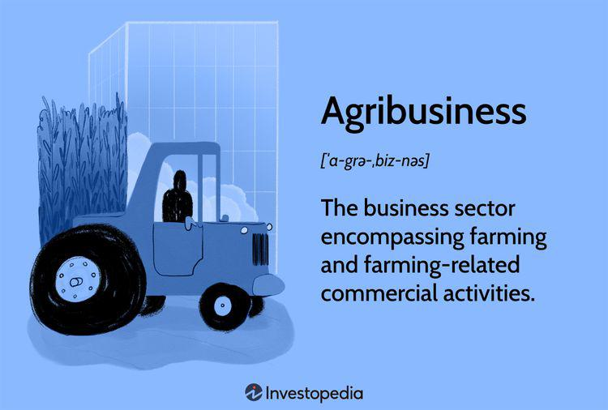

The intersection of agriculture, agribusiness, and algorithmic trading presents unique opportunities and challenges. At this convergence, businesses strive to innovate and adapt in response to market dynamics, technological advancements, and environmental pressures. The increasing complexity of global food systems, propelled by population growth and changing dietary preferences, underscores the necessity for efficient and sustainable agricultural practices. 

Prominent examples of businesses operating in this intricate landscape often deploy advanced technologies, such as artificial intelligence, big data analytics, and the Internet of Things (IoT). These technologies enhance operational efficiency, reduce costs, and mitigate risks associated with market volatility and climate change impacts. Companies like Cargill and John Deere exemplify these efforts, integrating cutting-edge solutions to maintain competitiveness and respond proactively to the demands of the agribusiness sector.



Algorithmic trading plays a critical role in this context, offering sophisticated tools to manage financial risks and optimize trading decisions in agricultural markets. By leveraging automated systems, businesses can process large volumes of data at unprecedented speeds, enabling more accurate predictive analytics and strategic planning. This is particularly significant in agriculture, where price fluctuations, driven by supply chain disruptions and variable weather conditions, can significantly impact profitability.

Agricultural companies are continuously exploring innovative methods to transform traditional farming practices. Technologies such as drones for aerial monitoring, GPS for precision agriculture, and sensors for soil moisture analysis contribute to more sustainable and profitable farming operations. These advancements empower farmers to make data-driven decisions, ultimately enhancing productivity and ensuring environmental stewardship.

In examining these developments, we uncover the transformative potential of technology and algorithmic trading in overcoming the multifaceted challenges faced by the agricultural industry. Through strategic innovation and adaptation, businesses in this sector are better equipped to navigate an ever-evolving landscape, positioning themselves for success in the years to come.

## Table of Contents

## Understanding Agribusiness and Its Challenges

Agribusiness encompasses a complex network of activities ranging from farm production to the marketing and sale of agricultural products. This sector is a vital component of the global economy, contributing significantly to food security, employment, and trade. However, agribusiness faces an array of challenges that necessitate continuous adaptation and innovation.

One of the primary challenges in agribusiness is global competition. As markets become increasingly interconnected, agricultural enterprises must compete not only with local and regional players but also with international firms. This competition emphasizes the need for efficiency, cost-effectiveness, and high-quality output. Companies must embrace technological advancements to maintain a competitive edge, such as adopting precision agriculture and employing data analytics to optimize production and distribution processes.

Climate change represents another significant challenge for agribusiness. Changes in climate patterns can lead to unpredictable weather events, affecting crop yields and livestock productivity. Droughts, floods, and other extreme weather conditions pose risks to food production and supply chains. To address these issues, agribusinesses are required to implement adaptive strategies that enhance resilience, like crop diversification, investment in drought-resistant seeds, and improved water management practices.

Sustainability is an imperative that agribusinesses can no longer overlook. The need for sustainable practices arises from environmental pressures, such as soil degradation, water scarcity, and biodiversity loss. Adopting sustainable methods not only helps mitigate these issues but also meets the growing consumer demand for environmentally friendly and ethically produced goods. Innovative approaches such as integrated pest management, organic farming, and agroforestry are becoming increasingly important to ensure long-term viability and environmental stewardship in agriculture.

Market fluctuations also pose a challenge to agribusinesses. Prices of agricultural commodities can be volatile due to factors such as changing demand, geopolitical tensions, and policy shifts. Such [volatility](/wiki/volatility-trading-strategies) necessitates risk management tools and strategies. For instance, futures contracts, insurance products, and diversification can provide some stability against unpredictable market movements.

Environmental pressures continue to demand innovative solutions from the agricultural sector. Companies are turning to technology, not only for production optimization but also for environmental monitoring and resource management. Technologies like satellite imaging, remote sensing, and [artificial intelligence](/wiki/ai-artificial-intelligence) are integral in tracking weather patterns, assessing soil health, and ensuring efficient use of inputs.

In summary, agribusiness is confronted with global competition, climate change, the demand for sustainable practices, and market volatility. To navigate these challenges, agricultural enterprises must adopt innovative approaches, leveraging technology and implementing sustainable solutions to remain resilient and competitive in the global market.

## Business Examples in Agriculture

Cargill and John Deere serve as exemplary leaders in adopting technological advancements within the agribusiness sector, showing a robust integration of artificial intelligence (AI), big data, and the Internet of Things (IoT) into their operations to enhance efficiency and manage risks.

Cargill, one of the largest privately-held corporations in the U.S., has been a forerunner in employing big data analytics to optimize its supply chains and make informed decisions in commodity trading. By using data-driven strategies, Cargill can better forecast market trends, manage environmental risks, and improve the efficiency of resource use. The company's focus on sustainable practices is evident in its commitment to reducing greenhouse gas emissions across its global operations, indicating an adaptive strategy to climate challenges and market demands.

John Deere, a leader in agricultural machinery, has transformed its product offerings through the integration of IoT and AI. The company's precision agriculture technology enables farmers to utilize data collected from IoT devices embedded in machinery to make real-time decisions about planting, fertilization, and harvesting. This technological integration not only improves crop yields and reduces operational costs but also minimizes environmental impact by optimizing input use. John Deere's approach reflects an understanding of the importance of sustainability and climate resilience, ensuring the company remains competitive in a fast-evolving market.

Both companies exemplify how the strategic use of technology can enable agribusinesses to adapt to changing market and environmental conditions. Their advancements reflect a broader industry trend toward embracing technological solutions that align with sustainability goals while enhancing operational efficiency and risk management.

## Algorithmic Trading in Agribusiness

Algorithmic trading utilizes computational algorithms to systematically execute trades in agricultural markets, thereby optimizing trading decisions and enhancing operational efficiency. The primary advantage of this technology lies in its ability to process and analyze vast datasets at a speed and scale beyond human capabilities. This rapid data processing facilitates informed trading choices, maximizing profit margins and minimizing risks inherent in agricultural markets.

Due to the volatile nature of agricultural commodities, which are influenced by factors such as weather conditions, geopolitical events, and market supply-demand dynamics, leveraging [algorithmic trading](/wiki/algorithmic-trading) can be crucial for agribusinesses. Through artificial intelligence (AI) and [machine learning](/wiki/machine-learning) (ML), algorithmic trading systems can process historical and real-time data to generate predictive analytics. This predictive capability is instrumental in anticipating market trends and commodity price movements.

The algorithms primarily operate by identifying patterns and correlations within data that may indicate profitable trading opportunities or potential risks. For instance, a machine learning model could be trained on historical price data to predict future commodity prices. A simple implementation would use a linear regression model to forecast the price of a commodity like corn:

```python
from sklearn.model_selection import train_test_split
from sklearn.linear_model import LinearRegression
import pandas as pd

# Load dataset
data = pd.read_csv('corn_prices.csv')

# Define features and target
X = data[['feature1', 'feature2', 'feature3']]  # Example features
y = data['corn_price']

# Split data
X_train, X_test, y_train, y_test = train_test_split(X, y, test_size=0.2, random_state=42)

# Initialize and train model
model = LinearRegression()
model.fit(X_train, y_train)

# Predict
predictions = model.predict(X_test)
```

This code snippet represents a simplified version of how machine learning can be employed to predict agricultural commodity prices. In practice, algorithmic trading systems would use more sophisticated models, such as neural networks or ensemble methods, to improve forecast accuracy.

Moreover, algorithmic trading aids in managing agricultural risks by allowing real-time monitoring and adjustment of trading positions based on evolving market conditions. By incorporating risk management strategies, such as stop-loss orders or hedging techniques, agribusinesses can protect their portfolios from adverse market changes.

In conclusion, algorithmic trading serves as a vital tool for agribusinesses seeking to navigate the complex and unpredictable agricultural markets. Through advanced data analytics and automated execution, it provides a means to stay competitive and resilient in a rapidly evolving industry landscape.

## Optimizing Operations with Technology

The agricultural industry is experiencing significant transformation through the adoption of advanced technologies that enhance operational efficiency and sustainability. Among these technologies, drones, GPS, and moisture sensors are leading the way in revolutionizing farming practices.

Drones are increasingly used in agriculture for tasks such as crop monitoring, spraying, and mapping. Equipped with high-resolution cameras and sensors, drones provide farmers with real-time data on crop health, soil conditions, and pest infestations. This information allows for targeted interventions, reducing the use of fertilizers and pesticides, thereby promoting sustainable farming practices. Additionally, drones enable precision agriculture by covering large areas quickly and efficiently, minimizing labor costs and time.

Global Positioning Systems (GPS) play a crucial role in precision agriculture by providing accurate location data that enhances field mapping, soil sampling, and crop scouting. GPS technology allows farmers to apply inputs such as seeds, fertilizers, and water with precision, optimizing resource use and increasing crop yields. This precision reduces waste and environmental impact, contributing to more sustainable agriculture.

Moisture sensors are vital in optimizing irrigation strategies. These devices measure soil moisture levels in real-time, allowing farmers to make informed decisions about when and how much to irrigate. This precise water management not only conserves water resources but also ensures that crops receive the optimal amount of moisture, enhancing growth and productivity. Implementing moisture sensors leads to healthier crops and reduces water wastage, aligning with sustainable agricultural practices.

Innovations such as bee vectoring technology are emerging to aid crop protection. Bee vectoring uses natural pollinators like bees to deliver pest and disease control [agents](/wiki/agents) directly to plants. This method reduces the need for chemical pesticides, thus fostering healthier ecosystems and promoting sustainability. Moreover, electronic drones are becoming integral in crop monitoring and protection. They offer capabilities such as early detection of diseases and pests, enabling prompt interventions that protect crop health and yield.

The integration of these technologies contributes to more efficient farming operations by optimizing resource use, reducing environmental impact, and enhancing crop yields. As the agricultural sector continues to face challenges such as climate change and resource scarcity, the adoption of advanced technological solutions remains crucial for achieving sustainability and efficiency in farming operations.

## Case Studies of Successful Integration

John Deere, a leading figure in the agricultural machinery industry, has successfully harnessed the power of the Internet of Things (IoT) to optimize precision farming. This integration involves utilizing connected devices and sensors to gather real-time data from agricultural fields. The data includes soil moisture levels, crop health indicators, and weather conditions. In addition to IoT, John Deere employs algorithmic trading methods to manage and mitigate risks associated with commodity price fluctuations, thus enhancing decision-making processes for farmers. These technological advancements enable more accurate application of inputs like water and fertilizers, reducing waste and improving crop yields. 

On the other hand, Climate Corporation, a subsidiary of Bayer, exemplifies the effective use of big data in agriculture. It leverages vast datasets to provide predictive insights on crop yields and weather patterns. Through sophisticated algorithms, Climate Corporation's platform analyzes historical climate data, satellite imagery, and field-specific information. This analysis helps farmers anticipate weather-related risks and make informed planting and harvesting decisions. By predicting crop performance and optimizing resource utilization, the company offers farmers valuable tools to increase efficiency and productivity.

These case studies highlight the successful integration of modern technology in agriculture, showcasing how companies like John Deere and Climate Corporation are setting new standards in the agro-sector. Their approaches demonstrate the potential of IoT, big data, and algorithmic methodologies to drive sustainability and innovation in farming practices.

## Future Trends and Considerations

Advancements in artificial intelligence (AI) and machine learning are poised to significantly enhance algorithmic trading in agribusiness by enabling more sophisticated modeling and predictive analytics. These technologies facilitate the analysis of large datasets to detect patterns and trends, allowing businesses to anticipate market movements more accurately. Machine learning algorithms can improve the accuracy of forecasts related to crop yields, pricing, and consumer demand, giving agribusinesses a competitive edge.

Blockchain technology presents another promising development for agribusiness by enhancing transparency and traceability in supply chains. This technology allows for the secure and immutable recording of transactions, which can help in verifying the origin and authenticity of agricultural products. For consumers and companies alike, blockchain can mitigate concerns over product quality and ethical sourcing. As reported by several studies, including one by Saberi et al. (2019), blockchain applications in supply chain management have been shown to improve efficiency and trust among stakeholders.

Sustainability, driven by data-driven decisions, is crucial for the future of agribusiness. With the growing emphasis on sustainable practices, agribusinesses are under pressure to reduce their carbon footprint and resource consumption. Using predictive analytics and real-time data, companies can optimize resource use, minimize waste, and reduce environmental impact. For instance, precision agriculture, enabled by GPS and sensor technologies, allows farmers to apply water, fertilizers, and pesticides more efficiently, leading to sustainable farming practices.

In summary, the future of agribusiness is increasingly intertwined with technology, presenting both opportunities and responsibilities. As AI and machine learning refine algorithmic trading, blockchain enhances supply chain transparency, and data guides sustainable practices, businesses that embrace these innovations will be better positioned to succeed in the evolving global market.

## Conclusion

Agribusiness currently stands at a pivotal point, where it confronts considerable challenges while simultaneously encountering an expanse of opportunities driven by technological advancements and algorithmic trading. The industry's complexities, such as global competition, climate change, and the demand for sustainable agricultural practices, require such innovations to ensure ongoing profitability and stability.

Technology enables the optimization of operations, helping agribusinesses improve their efficiency and reduce their environmental footprint. Machine learning algorithms, for instance, can optimize resource allocation by predicting crop yields based on variables like weather patterns and soil conditions. Python libraries such as scikit-learn and TensorFlow are commonly used for building such predictive models, allowing companies to make data-driven decisions with higher accuracy. These predictive analytics facilitate proactive management of agricultural operations, leading to enhanced productivity and reduced waste.

Moreover, algorithmic trading contributes to better risk management for agribusinesses by processing massive datasets swiftly and executing trades with precision. This approach not only minimizes the human error [factor](/wiki/factor-investing) but also provides a strategic advantage in navigating market volatilities. The agility with which these algorithms can adjust strategies outpaces traditional methods, promoting more stable financial outcomes.

To succeed amid these challenges, businesses must embrace innovation. By integrating technologies like the Internet of Things (IoT), artificial intelligence, and blockchain, enterprises can enhance traceability, ensure transparency, and solidify consumer trust and compliance with sustainable practices. The synergy of these technologies within agribusiness operations fosters resilience against external pressures such as climate fluctuations and evolving market demands.

As agribusinesses navigate this evolving landscape, their ability to leverage technology and algorithmic tactics will determine their capacity to lead the market. Adaptation and forward-thinking strategies remain essential for harnessing the full potential of these technological tools, driving not just immediate financial gains but fostering long-term sustainability and industry leadership.

## References & Further Reading

[1]: Saberi, S., Kouhizadeh, M., Sarkis, J., & Shen, L. (2019). ["Blockchain technology and its relationships to sustainable supply chain management."](https://www.tandfonline.com/doi/full/10.1080/00207543.2018.1533261) International Journal of Production Research, 57(7), 2117-2135.

[2]: ["Artificial Intelligence and Machine Learning for Business: A No-Nonsense Guide to Data Driven Technologies"](https://archive.org/details/artificialintell0000finl) by Steven Finlay

[3]: O'Connor, M. (2021). ["The Role of Big Data in Agribusiness: Turning Agricultural Improvements into Economic Growth."](https://www.linkedin.com/in/felicia-flaxman-8bb420173) Journal of Agribusiness.

[4]: ["Precision Agriculture Technology for Crop Farming"](https://www.taylorfrancis.com/books/oa-edit/10.1201/b19336/precision-agriculture-technology-crop-farming-qin-zhang) by Qin Zhang

[5]: Porter, M. E. (2008). ["The Five Competitive Forces That Shape Strategy."](https://hbr.org/2008/01/the-five-competitive-forces-that-shape-strategy) Harvard Business Review. 

[6]: Basso, B., & Antle, J. (2020). ["Digital agriculture to design sustainable agricultural systems."](https://www.nature.com/articles/s41893-020-0510-0) Nature Sustainability, 3, 254–256.

[7]: ["Sustainable Agriculture and Food Security"](https://www.sciencedirect.com/science/article/pii/B9780128121603000039) by Ramesh C. Raghuvanshi