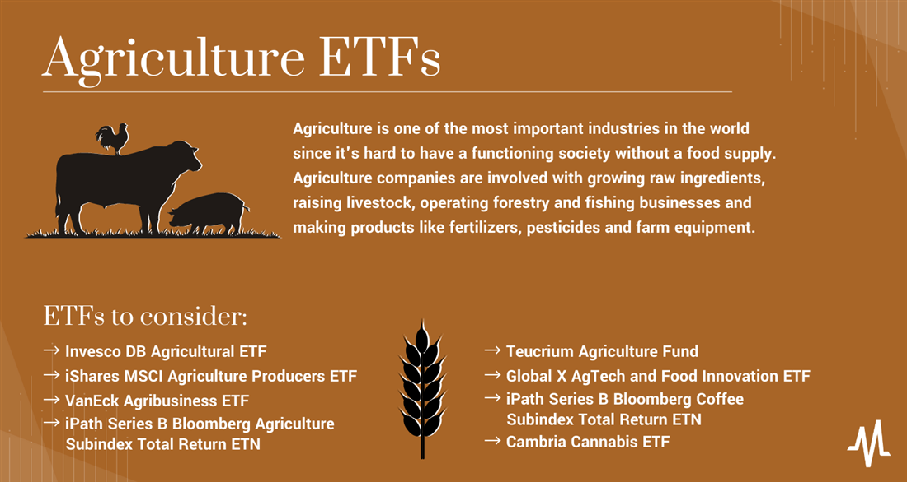

## Table of Contents

## What are Agricultural Exchange-Traded Funds (ETFs)?

Agricultural Exchange-Traded Funds (ETFs) are investment funds that track the performance of agricultural commodities or companies involved in agriculture. These ETFs allow investors to buy and sell shares that represent a basket of agricultural assets, such as grains, livestock, or farming equipment manufacturers, without having to directly own the physical commodities or individual stocks.

Investing in agricultural ETFs can provide diversification to an investment portfolio, as they offer exposure to the agriculture sector, which can behave differently from other sectors like technology or finance. This can help spread risk and potentially increase returns. Additionally, agricultural ETFs are often more liquid than investing directly in commodities, making it easier for investors to enter and exit their positions.

## How do Agricultural ETFs work?

Agricultural ETFs work by pooling money from many investors to buy a collection of agricultural assets. These assets can be things like corn, wheat, soybeans, or stocks in companies that make farming equipment. The ETF then divides this collection into shares, which investors can buy and sell on a stock exchange, just like they would with regular stocks. The price of the ETF shares goes up and down based on how well the agricultural assets are doing.

When you invest in an agricultural [ETF](/wiki/etf-trading-strategies), you don't have to worry about storing or managing the actual crops or livestock. The ETF does that for you. Instead, you can easily buy or sell your shares whenever the stock market is open. This makes it simpler and more convenient than directly investing in farming. Plus, because the ETF holds a variety of agricultural assets, it can help spread out your risk, making your investment safer than putting all your money into just one type of crop or company.

## What types of agricultural commodities are typically included in these ETFs?

Agricultural ETFs often include a mix of different crops and livestock. Common crops you might find in these ETFs are grains like corn, wheat, and soybeans. These are important because they are used for food and animal feed all around the world. Other crops can include cotton, which is used for making clothes, and sugar, which is used in many foods and drinks. These ETFs might also hold rice, which is a staple food in many countries.

Besides crops, agricultural ETFs can also include livestock like cattle and hogs. These animals are raised for meat, which is a big part of many people's diets. Some ETFs might also invest in dairy products like milk and cheese. In addition to these, you might find ETFs that include agricultural products like coffee and cocoa, which are popular beverages and ingredients in many sweets.

Some agricultural ETFs go beyond just commodities and include stocks of companies involved in agriculture. This can mean companies that make farming equipment like tractors, or companies that produce fertilizers and seeds. By including these stocks, the ETFs give investors a way to benefit from the overall health of the agriculture industry, not just the prices of specific crops or livestock.

## What are the benefits of investing in Agricultural ETFs?

Investing in Agricultural ETFs can be a smart way to spread out your investment risk. Instead of putting all your money into one type of crop or one farming company, you get a little bit of many different agricultural things. This means if one crop has a bad year because of weather or bugs, you won't lose all your money because other parts of your investment might do well. It's like not putting all your eggs in one basket.

Another benefit is that Agricultural ETFs are easy to buy and sell. You can trade them on the stock market just like regular stocks, so you don't have to worry about storing crops or taking care of animals. This makes it simpler and less work than investing directly in farming. Plus, because these ETFs are traded a lot, it's easy to get in and out of your investment whenever you want.

Lastly, Agricultural ETFs can help you make money from the growing need for food and farming products around the world. As more people live on our planet, they need more food, and that can make the value of agricultural investments go up. By investing in these ETFs, you can benefit from this trend without having to know everything about farming or the agriculture business.

## What are the risks associated with Agricultural ETFs?

Investing in Agricultural ETFs can be risky because the prices of crops and livestock can go up and down a lot. Things like bad weather, diseases, or changes in what people want to eat can make the value of these ETFs drop. For example, if there's a drought and crops fail, the ETF that includes those crops might lose value. Also, if people start eating less meat, the value of livestock in the ETF could go down.

Another risk is that Agricultural ETFs might not always do what you expect. They're supposed to follow the prices of agricultural things, but sometimes they don't match perfectly. This can happen because of fees, how the ETF is managed, or other costs. So, even if corn prices go up, the ETF that includes corn might not go up as much as you hoped. This can make it hard to predict how much money you'll make or lose.

Lastly, the overall economy can affect Agricultural ETFs. If there's a big economic problem, like a recession, people might buy less food or farming products, which can hurt the value of the ETF. Also, changes in government rules about farming or trade can make a big difference. So, even though Agricultural ETFs can be a good way to invest in farming without the hassle, they still come with risks that you need to think about carefully.

## How do Agricultural ETFs compare to other investment vehicles like stocks or mutual funds?

Agricultural ETFs are different from stocks and mutual funds in a few important ways. When you buy a stock, you're buying a piece of one company. If you buy a stock in a farming company, your money is tied to how well that one company does. Agricultural ETFs, on the other hand, let you invest in a bunch of different agricultural things at once, like crops, livestock, and farming companies. This can spread out your risk because if one thing does badly, the others might do well. Mutual funds are similar to ETFs because they also pool money from many investors to buy a mix of assets, but ETFs can usually be bought and sold more easily throughout the day, just like stocks, while mutual funds are only traded once a day after the market closes.

Another big difference is how easy it is to get in and out of your investment. With stocks, you can buy and sell them whenever the stock market is open, but you're still betting on one company at a time. Agricultural ETFs give you the same easy trading but with a broader spread of agricultural assets. Mutual funds might be less flexible because you can only trade them at the end of the day, but they can still offer a diversified investment. Overall, Agricultural ETFs can be a good middle ground if you want to invest in farming without the hassle of managing individual stocks or the limitations of mutual funds.

## What factors should be considered when selecting an Agricultural ETF?

When [picking](/wiki/asset-class-picking) an Agricultural ETF, it's important to think about what the ETF includes. Some ETFs focus on specific crops like corn or wheat, while others might include a mix of different crops, livestock, and even farming companies. You should choose an ETF that matches what you want to invest in. If you think a certain crop will do well, you might want an ETF that focuses on that crop. But if you want to spread your risk, an ETF with a mix of different things might be better.

Another thing to consider is the fees and costs of the ETF. All ETFs have some fees, like management fees, which can eat into your returns. You should look for ETFs with lower fees so more of your money stays in your pocket. Also, think about how well the ETF has done in the past. While past performance doesn't guarantee future results, it can give you an idea of how the ETF might do. Finally, think about how easy it is to buy and sell the ETF. Some ETFs are more popular and easier to trade, which can be important if you want to get in and out of your investment quickly.

## How can Agricultural ETFs be used in a diversified investment portfolio?

Agricultural ETFs can be a great way to add variety to your investment portfolio. When you invest in different things, you spread out your risk. If one part of your investments goes down, other parts might go up and help balance things out. Agricultural ETFs let you invest in farming without having to pick just one crop or company. By including these ETFs in your portfolio, you're not putting all your money into one type of investment, like tech stocks or real estate. This can make your overall investment safer and might help you make more money over time.

Adding Agricultural ETFs to your mix can also help you take advantage of trends in the food and farming world. As the world's population grows, people need more food, and this can push up the value of agricultural investments. By having some of your money in Agricultural ETFs, you can benefit from this trend without needing to know everything about farming. Plus, these ETFs are easy to buy and sell, so you can adjust your investments as needed. This flexibility, along with the potential for growth in the agriculture sector, makes Agricultural ETFs a smart choice for a well-rounded investment strategy.

## What are some examples of popular Agricultural ETFs?

One popular Agricultural ETF is the Invesco DB Agriculture Fund (DBA). This ETF invests in a basket of agricultural commodities like corn, wheat, soybeans, and sugar. It's designed to track the performance of the DBIQ Diversified Agriculture Index Excess Return, which means it tries to follow how well these commodities are doing in the market. People like this ETF because it gives them a way to invest in farming without having to pick just one crop or deal with the hassle of owning the actual crops.

Another well-known Agricultural ETF is the Teucrium Agricultural Fund (TAGS). This ETF is different because it invests in other ETFs that focus on specific crops. It includes ETFs for corn, wheat, soybeans, and sugar, which means it spreads your investment across several important agricultural products. This can be a good choice if you want to invest in farming but also want to spread out your risk even more. Both of these ETFs are popular because they make it easy to invest in agriculture and can help you diversify your investment portfolio.

## How do global economic factors influence the performance of Agricultural ETFs?

Global economic factors can have a big impact on Agricultural ETFs. When the world economy is doing well, people have more money to spend on food, which can drive up the prices of crops and livestock. This can make Agricultural ETFs do better because they invest in these things. On the other hand, if the economy is struggling, people might buy less food or switch to cheaper options, which can lower the prices of agricultural products and hurt the performance of these ETFs. Also, changes in currency values can affect how much money farmers make from selling their crops abroad, which can influence the value of Agricultural ETFs.

Another important global economic [factor](/wiki/factor-investing) is trade policies and international relations. If countries put up trade barriers or change their rules about importing and exporting food, it can make a big difference in the prices of agricultural commodities. For example, if a big country like China decides to buy less soybeans from the United States, the price of soybeans might go down, which can affect the value of an ETF that includes soybeans. Weather and climate changes around the world also play a role. Droughts, floods, or other bad weather can hurt crop yields, which can cause the prices of those crops to go up if there's less supply. All these global factors can make Agricultural ETFs go up or down, so it's important to keep an eye on them when you're thinking about investing in these funds.

## What are the tax implications of investing in Agricultural ETFs?

When you invest in Agricultural ETFs, you need to think about taxes. Just like with other investments, you might have to pay taxes on any money you make from your Agricultural ETFs. If you sell your shares for more than you paid for them, you'll have to pay capital gains tax. How much you pay depends on how long you held the shares. If you held them for less than a year, it's a short-term capital gain, and you'll pay your regular income tax rate on it. If you held them for more than a year, it's a long-term capital gain, and the tax rate is usually lower.

Another thing to consider is that Agricultural ETFs might pay out dividends. These are payments the ETF makes to its shareholders from the money it earns. Dividends are usually taxed as regular income, but there's a special rule for qualified dividends. If the dividends meet certain conditions, they're taxed at the lower long-term capital gains rate. It's a good idea to talk to a tax advisor to understand all the tax rules and how they apply to your specific situation. They can help you figure out the best way to handle your taxes when investing in Agricultural ETFs.

## How do regulatory changes affect Agricultural ETFs and their underlying commodities?

Regulatory changes can have a big impact on Agricultural ETFs and the commodities they invest in. When governments change rules about farming, like how much fertilizer can be used or how land can be used, it can affect how much food is produced. If new rules make it harder or more expensive to grow crops, the supply might go down, which can push up the prices of those crops. This can be good for Agricultural ETFs because they might make more money if the prices of the commodities they hold go up. But if the rules make it easier to farm and there's more supply, prices might go down, and that can hurt the ETFs.

Trade policies are another big thing that can change because of regulations. If a country puts up new trade barriers or changes its rules about importing and exporting food, it can mess with the prices of agricultural products. For example, if a big country like the United States changes its trade deals with other countries, it can affect how much money farmers make from selling their crops abroad. This can make the value of Agricultural ETFs go up or down depending on whether the new rules help or hurt the farmers. So, when you're thinking about investing in these ETFs, it's important to keep an eye on what's happening with regulations around the world.

## References & Further Reading

[1]: ["Agricultural ETFs: A New Shot at Farmland"](https://finance.yahoo.com/news/11-best-agriculture-etfs-buy-184901340.html) - Wall Street Journal article exploring agricultural ETFs.

[2]: BlackRock. (2023). ["Understanding Agricultural & Agribusiness ETFs"](https://www.blackrock.com/us/individual/products/239652/ishares-msci-global-agriculture-producers-etf) - Information by BlackRock on investing in agricultural ETFs.

[3]: Stiroh, K. J., & Rumble, A. (2006). ["The Dark Side of Diversification: The Case of US Financial Holding Companies."](https://www.sciencedirect.com/science/article/pii/S0378426605001342) Staff Reports, Federal Reserve Bank of New York.

[4]: Hays, F. (2023). ["What Are Sector ETFs?"](https://www.nasdaq.com/articles/the-11-sectors-of-the-stock-market-their-biggest-etfs-2021-05-30) - Investopedia article explaining how sector ETFs, including agricultural, work.

[5]: Frank J. Fabozzi, CFA. (2010). ["The Handbook of Commodity Investing"](https://onlinelibrary.wiley.com/doi/book/10.1002/9781118267004) - This book contains information on commodity-based ETFs, including agricultural commodities.