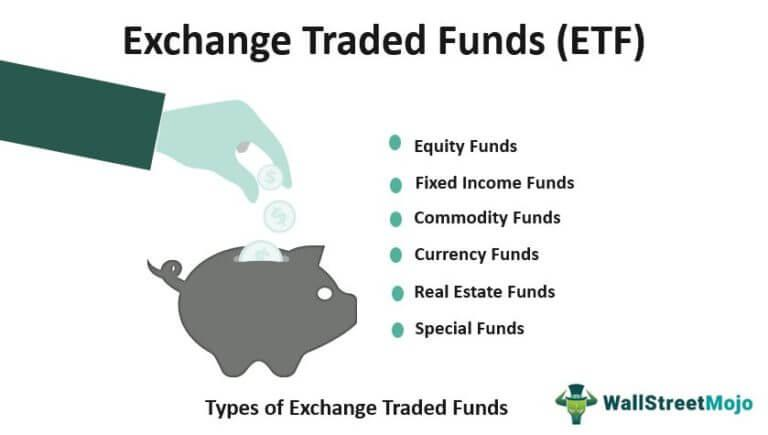

In investments, exchange-traded funds (ETFs) have emerged as a popular choice for diversifying portfolios. They offer investors an opportunity to access various markets and sectors without needing to select individual stocks or assets. Among the diverse ETF categories available, agricultural ETFs stand out due to their unique focus on the agricultural sector, which plays a vital role in the global economy. This focus allows investors to tap into a sector characterized by essential goods and sustainable growth.

Agricultural ETFs are designed to provide exposure to the agriculture market, encompassing both crops and livestock. They cater to investors aiming to benefit from the agriculture sector's growth while potentially hedging against inflation. This article explores the intricacies of agricultural ETFs, considering their types, benefits, and the role of algorithmic trading in enhancing investment strategies in this space. By understanding how agricultural ETFs function, investors can efficiently access the agriculture market, benefiting from the diversification and liquidity that these funds offer.



In addition to exploring agricultural ETFs' structural components, we will touch upon the significance of algorithmic trading and its suitability for optimizing investments in this sector. Algorithmic trading involves using sophisticated models and technology to execute trades swiftly and accurately. By integrating algorithmic trading, investors can potentially enhance their returns and manage risks effectively within the ever-evolving agricultural markets.

Overall, this article aims to provide insights into how agricultural ETFs can be an effective vehicle for gaining exposure to the agriculture market, equipping investors with the knowledge needed to navigate this sector’s opportunities and challenges.

## Table of Contents

## What Are Agricultural ETFs?

Agricultural ETFs, or Exchange-Traded Funds, are investment funds that focus on the agricultural sector by investing primarily in commodities and agribusiness stocks. These financial instruments offer investors a streamlined method to gain exposure to various aspects of agriculture, encompassing both crops and livestock. By pooling a range of agricultural assets into a single portfolio, agricultural ETFs provide a diversified investment approach, allowing investors to participate in the agricultural market without the necessity of purchasing individual commodities or stocks of specific companies.

Agricultural ETFs are generally categorized into two main types: agribusiness ETFs and agricultural commodity ETFs. Agribusiness ETFs focus on stocks of companies that operate across the agricultural supply chain, which may include industries such as seed production, fertilizer manufacturing, equipment for farming, and processing and distribution of agricultural products. This type of ETF allows investors to benefit from the economic activities of firms that contribute significantly to the agricultural process, thereby aligning their investments with the growth trajectories of these companies.

On the other hand, agricultural commodity ETFs provide more direct exposure to the commodities markets by investing in physical commodities like grains, livestock, or oils. These ETFs often track the price of a specific commodity or a basket of commodities, allowing investors to tap into fluctuations within the commodity markets. This direct association with commodity prices offers a different set of risk-return characteristics compared to agribusiness ETFs.

The performance and valuation of agricultural ETFs are dependent on the aggregated price movements of the underlying assets in which they invest. By offering a broad exposure to the agriculture market, these ETFs are seen as an effective vehicle for investors aiming to capture the potential growth within the sector while managing risk through diversification.

## Understanding Agricultural ETFs

Agricultural exchange-traded funds (ETFs) function by aggregating investor resources to acquire agriculture-related assets. These funds enable investors to engage in the agriculture sector by mirroring the price changes of underlying assets, thus facilitating participation in the sector's economic development. When investors purchase shares of an agricultural [ETF](/wiki/etf-trading-strategies), the shares' value adjusts according to the performance of its underlying assets. These adjustments are in line with market movements and the intrinsic value of the components within the ETF.

Agricultural ETFs are primarily categorized into two distinct types: agribusiness ETFs and agricultural commodity ETFs. Agribusiness ETFs are composed of stocks from companies involved in various sectors of agribusiness, including equipment manufacturing, processing, and distribution. This type of ETF provides investors with exposure to the corporate side of agriculture, encompassing a wide range of companies that play roles in the agricultural supply chain.

On the other hand, agricultural commodity ETFs focus on direct investment in physical commodities such as wheat, corn, soybeans, and livestock. These ETFs typically achieve exposure through futures contracts and other financial derivatives. As a result, investors can experience price movements linked directly to agricultural commodities, which can fluctuate based on factors like global supply and demand, weather conditions, and geopolitical events.

The valuation of an agricultural ETF is closely aligned with the value of its underlying assets. The market mechanism ensures that any discrepancies between the ETF's share price and the net asset value are minimized, often through [arbitrage](/wiki/arbitrage) opportunities that maintain alignment. Asset managers employ strategies to keep the ETF's price representative of the combined value of the contained assets, thereby ensuring investor returns reflect real market conditions. 

This management process involves frequent evaluations and adjustments to align with market prices, ensuring that investors have transparent and effective exposure to agriculture assets through these structured investment products.

## Benefits and Risks of Agribusiness ETFs

Agribusiness ETFs provide investors with an opportunity for diversification within the stock market by targeting companies across the entire agricultural supply chain. By including a range of firms involved in areas such as farming, equipment production, fertilizers, and distribution, these ETFs tap into the growth potential fueled by increasing global food demand. This characteristic enables investors to benefit from the expansive nature of agribusiness, which is driven by the essential need for food production and distribution.

One of the primary benefits of investing in agribusiness ETFs is the exposure they offer to the business side of agriculture. Unlike direct commodity investments, agribusiness ETFs focus on corporations that may provide more consistent revenue streams and the potential for stable growth. This is particularly attractive to investors seeking diversification because these ETFs aggregate companies across the agricultural sector, thereby mitigating the risks associated with investing in a single entity or commodity.

However, like all investments, agribusiness ETFs come with risks. These ETFs, while offering a more stable alternative compared to direct commodity investments, are still subject to market [volatility](/wiki/volatility-trading-strategies) and sector-specific risks. For example, changes in global demand, environmental regulations, or trade policies can significantly impact the profitability of agribusiness companies. Additionally, investors need to be aware of input cost inflation, as rising prices for seeds, fertilizers, or energy can adversely affect profit margins in the agribusiness sector.

Consumer preferences also play a critical role in the performance of agribusiness ETFs. Shifts towards organic produce or alternative food sources, like plant-based proteins, could alter the landscape for traditional agribusiness companies. As such, while these ETFs provide a measure of diversification, investors need to continually assess trends and innovations within the food and agriculture industries to make informed investment decisions.

In summary, agribusiness ETFs offer significant benefits through diversified exposure to the agricultural sector, driven by essential and growing food demand. Nonetheless, investors must remain vigilant about external factors and sector-specific risks that can influence market stability and returns. By understanding both the advantages and potential pitfalls, investors can better align these ETFs with their broader investment strategies and financial goals.

## Benefits and Risks of Agricultural Commodity ETFs

Agricultural commodity exchange-traded funds (ETFs) enable investors to gain direct exposure to the commodity markets, such as grains, livestock, and other agricultural products. These financial instruments have several merits that make them attractive to investors. They provide a hedge against inflation, offering protection against the eroding value of money that typically accompanies rising prices. Unlike traditional securities like stocks and bonds, agricultural commodity ETFs can diversify an investment portfolio by incorporating an asset class that often moves independently from equity and fixed income markets. This diversification can help mitigate the risk inherent in holding a concentrated set of investments.

However, investing in agricultural commodity ETFs is not without challenges. One of the principal risks associated with these ETFs is the volatility of commodity prices. Prices of agricultural commodities can be unpredictable and heavily influenced by factors outside the financial market, such as weather conditions, crop yields, and geopolitical tensions. These external variables can lead to significant price swings, potentially resulting in substantial gains or losses for investors.

Moreover, the use of derivatives is common in agricultural commodity ETFs, which adds layers of complexity. Derivatives, such as futures contracts, are employed to track the performance of the underlying commodities. This can lead to phenomena known as contango and backwardation, which can impact the returns of the ETF. In a state of contango, the futures prices are higher than the spot prices, potentially causing a loss for the ETF if the prices do not converge. Conversely, backwardation, where futures prices are lower than spot prices, can be beneficial as it may result in positive roll yields.

While the prospect of high returns exists, especially when commodity prices surge, the inherent high volatility and intricate trading mechanisms require investors to possess a thorough understanding of the market and its dynamics. Because of these elements, agricultural commodity ETFs are generally more suitable for experienced investors who can manage the associated risks and complexities.

## Algorithmic Trading and Agricultural ETFs

Algorithmic trading utilizes sophisticated mathematical models and computational algorithms to execute trades in financial markets, aiming for speed and efficiency that surpass human capability. In the domain of agricultural ETFs, [algorithmic trading](/wiki/algorithmic-trading) can significantly optimize both the management and trading processes.

Firstly, algorithmic trading aids in portfolio rebalancing, a critical process where an ETF's composition is adjusted to maintain alignment with its target allocation. For agricultural ETFs composed of multiple commodities or agribusiness stocks, achieving the precise allocation can be challenging. Algorithms can quickly analyze vast amounts of data and execute trades to rebalance portfolios according to predefined strategies, minimizing discrepancies between the actual and target asset mix.

Minimizing tracking errors is another crucial aspect where algorithmic trading proves beneficial. Tracking error measures how consistently an ETF follows its underlying index. Agricultural ETFs often seek to replicate the performance of a specific agricultural commodity index or agribusiness index. Algorithmic trading systems can continuously monitor the ETF's performance, quickly making adjustments to ensure that the tracking error remains within acceptable levels. This precision helps maintain investor confidence and ensures transparency regarding the ETF’s performance relative to benchmarks.

Furthermore, algorithmic trading enables the exploitation of arbitrage opportunities. Arbitrage involves profiting from price discrepancies of the same asset in different markets. In efficient markets, these opportunities are fleeting; however, algorithms can detect and act on them in milliseconds. For agricultural ETFs, these opportunities might arise due to mispricing between related futures contracts or discrepancies in the pricing of physical commodities and their corresponding ETF shares.

One of the core strengths of algorithmic trading lies in its ability to rapidly respond to market changes. Agricultural markets are frequently volatile due to factors like weather conditions, geopolitical events, and changes in global demand. Algorithms equipped with [machine learning](/wiki/machine-learning) techniques can analyze market data, identify trends, and execute trades in real time. This agility allows for maximizing returns while simultaneously managing risks, which is especially important in the agricultural sector where market conditions can shift unexpectedly.

As financial markets grow increasingly complex and fast-paced, algorithmic trading offers a competitive advantage in managing agricultural ETF investments. The integration of algorithms streamlines trading operations, enhances portfolio management efficiency, and provides a disciplined, unemotional trading approach that is less prone to human error. Consequently, investors looking to optimize their exposure to the agriculture market through ETFs stand to benefit from incorporating algorithmic trading into their strategies.

## Things to Consider When Investing in Agriculture ETFs

When investing in agricultural exchange-traded funds (ETFs), several key factors must be considered to optimize investment outcomes. Investors should begin by evaluating commodity exposure, which is crucial in determining the extent to which an ETF is influenced by the price movements of agricultural commodities. This assessment helps investors align their portfolios with their risk tolerance, as commodities are often subject to price volatility due to factors such as weather conditions and geopolitical events.

Global diversification is another critical [factor](/wiki/factor-investing). Agricultural ETFs with exposure to international markets can provide benefits by spreading risk across different regions and cropping systems, reducing the impact of localized disruptions. However, investing globally also introduces currency risk, which must be managed effectively.

Supply chain positioning refers to an ETF’s investment in different stages of the agricultural supply chain, from production to distribution. An understanding of these stages can help investors identify where value is added and mitigate sector-specific risks.

Expense ratios are vital when assessing the cost-effectiveness of an ETF. Lower expense ratios generally lead to higher net returns for investors, hence comparing these ratios across similar ETFs can identify more efficient investment options. Liquidity is equally important, as it affects the ease with which investors can enter or [exit](/wiki/exit-strategy) positions. High [liquidity](/wiki/liquidity-risk-premium) ensures tighter bid-ask spreads and reduces transaction costs.

The dividend potential of agricultural ETFs varies, particularly between agribusiness ETFs which may provide stable income from dividends as companies distribute profits, and commodity ETFs which typically do not pay dividends as they are based on physical commodities.

Environmental, social, and governance ([ESG](/wiki/esg-investing)) criteria have gained importance as investors increasingly consider sustainable investing principles. Evaluating these criteria helps investors choose ETFs that align with their ethical values and potentially mitigate risks associated with unsustainable agricultural practices.

Periodic rebalancing of an investment portfolio is recommended to maintain target allocations and manage risks effectively. For instance, if an agricultural ETF's commodity exposure significantly increases due to price surges, rebalancing may be necessary to ensure the portfolio does not exceed the investor's risk threshold. This process can be automated using algorithmic trading techniques implemented in a Python script:

```python
def rebalance_portfolio(portfolio, target_allocations):
    current_values = {asset: quantity * price for asset, (quantity, price) in portfolio.items()}
    total_value = sum(current_values.values())

    adjustments = {}
    for asset, target in target_allocations.items():
        target_value = total_value * target
        current_value = current_values.get(asset, 0)
        adjustments[asset] = target_value - current_value

    return adjustments

portfolio = {'Agribusiness ETF': (100, 50), 'Commodity ETF': (200, 20)}
target_allocations = {'Agribusiness ETF': 0.6, 'Commodity ETF': 0.4}

rebalance_actions = rebalance_portfolio(portfolio, target_allocations)
print(rebalance_actions)
```

This code snippet calculates necessary adjustments to align the portfolio with specified target allocations, ensuring the proportional investment approach is maintained. By considering these factors, investors can position themselves to make informed decisions when investing in agricultural ETFs.

## Comparing Investment Options: Agricultural ETFs vs. Other Investments

Agricultural ETFs serve as a compelling investment choice for those seeking to balance risk and return, compared to purchasing individual agricultural stocks. By pooling resources across multiple entities within a sector, agricultural ETFs provide a strategic advantage in risk distribution.

Agribusiness ETFs meticulously diversify risk by investing in a range of companies throughout the agricultural supply chain, from seed producers to distributors. This broader exposure acts as a buffer against the volatility often associated with individual stock investments, as the performance of the ETF does not heavily rely on the success or failure of a single company. Consequently, agribusiness ETFs can offer a steadier investment path, driven by the collective dynamics of the sector rather than isolated corporate events.

On the other hand, agricultural commodity ETFs afford investors the opportunity to invest directly in specific agricultural products such as grains, livestock, and other raw materials. While this can lead to substantial rewards during favorable market conditions, it also introduces significant risk due to the inherent volatility of commodity prices. Factors such as weather conditions, geopolitical events, and sudden changes in supply and demand can cause sharp price fluctuations, impacting the returns on these ETFs. Hence, commodity ETFs are generally more appropriate for investors who are comfortable with higher volatility and possess a deep understanding of the markets' intricacies.

The decision between agribusiness and commodity ETFs is highly contingent on an investor's personal financial goals, risk tolerance, and perception of current and future market conditions. Investors with a penchant for stability may be drawn towards agribusiness ETFs, while those with a higher risk appetite and specialized market knowledge might opt for commodity ETFs.

A thorough comprehension of the complexities, particularly concerning commodity ETFs that often utilize derivatives, is crucial for sound investment decisions. Derivatives can introduce additional layers of risk and complexity, such as contango and backwardation, which can affect ETF pricing and returns. Thus, informed decision-making requires a solid grasp of these financial instruments and the potential implications of their use within commodity ETFs.

In summary, while agricultural ETFs offer various avenues for exposure to the agricultural sector, the choice between agribusiness and commodity ETFs should align with the investor's overarching investment strategy, considering both the opportunities and risks presented by each option.

## Conclusion

Investing in agricultural ETFs provides investors with an effective way to tap into the growth potential of the agriculture sector. These ETFs are divided into two main types: agribusiness ETFs and agricultural commodity ETFs, each offering distinct advantages and risks tailored to various investor profiles. Agribusiness ETFs provide a diversified exposure to companies across the agricultural value chain, allowing investors to benefit from the expansion and innovation within the sector. Conversely, agricultural commodity ETFs offer direct exposure to commodity price movements, serving as a hedge against inflation but with higher volatility.

The integration of algorithmic trading into agricultural ETF portfolios elevates the efficiency and precision of managing these investments. By using sophisticated mathematical models and automated trading systems, algorithmic trading optimizes portfolio rebalancing, minimizes tracking errors, and exploits arbitrage opportunities. This responsiveness to market fluctuations provides a competitive advantage in optimizing returns and managing risks.

Investors are encouraged to conduct comprehensive due diligence to ensure alignment with their financial goals and risk tolerance. Factors such as expense ratios, liquidity, dividend potential, and ESG criteria should be carefully evaluated. By maintaining an informed and flexible investment approach, investors can effectively leverage agricultural ETFs for potential returns while achieving portfolio diversification.

Key to successful investment in agricultural ETFs is understanding the inherent complexities, such as the use of derivatives in commodity ETFs and their implications on trading mechanisms like contango and backwardation. Investors should remain proactive, staying abreast of market and sector developments to make informed decisions. This strategic approach will enable them to capitalize on opportunities within the agricultural sector and enhance their overall investment portfolios.

## References & Further Reading

[1]: ["Agricultural ETFs: A New Shot at Farmland"](https://finance.yahoo.com/news/11-best-agriculture-etfs-buy-184901340.html) - Wall Street Journal article exploring agricultural ETFs.

[2]: BlackRock. (2023). ["Understanding Agricultural & Agribusiness ETFs"](https://www.blackrock.com/us/individual/products/239652/ishares-msci-global-agriculture-producers-etf) - Information by BlackRock on investing in agricultural ETFs.

[3]: Stiroh, K. J., & Rumble, A. (2006). ["The Dark Side of Diversification: The Case of US Financial Holding Companies."](https://www.sciencedirect.com/science/article/pii/S0378426605001342) Staff Reports, Federal Reserve Bank of New York.

[4]: Hays, F. (2023). ["What Are Sector ETFs?"](https://www.nasdaq.com/articles/the-11-sectors-of-the-stock-market-their-biggest-etfs-2021-05-30) - Investopedia article explaining how sector ETFs, including agricultural, work.

[5]: Frank J. Fabozzi, CFA. (2010). ["The Handbook of Commodity Investing"](https://onlinelibrary.wiley.com/doi/book/10.1002/9781118267004) - This book contains information on commodity-based ETFs, including agricultural commodities.