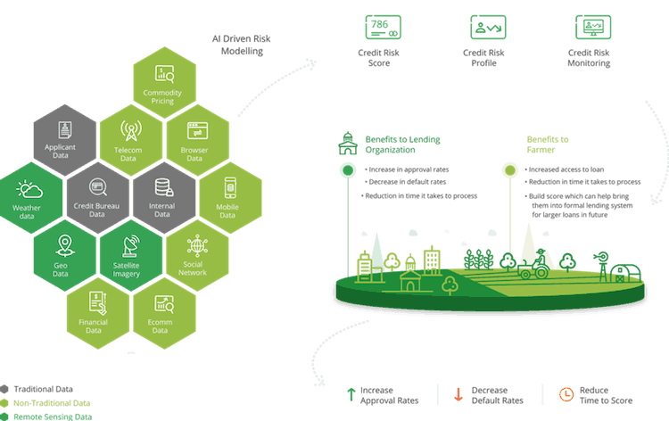

## Table of Contents

## What is agriculture alternative data?

Agriculture alternative data refers to new types of information that farmers and agricultural businesses use to make better decisions. This data comes from sources like satellite images, weather stations, and sensors in the fields. It helps farmers know more about their crops, soil, and weather conditions. By using this data, farmers can make choices that can lead to better crop yields and more efficient farming practices.

This kind of data is different from traditional data, like government reports or market prices, which farmers have used for a long time. Alternative data gives real-time and detailed information that can be very specific to a farmer's own fields. For example, with satellite images, a farmer can see which parts of their field are not getting enough water or nutrients. This allows them to take action quickly to improve those areas, saving time and resources.

## Why is alternative data important in agriculture?

Alternative data is important in agriculture because it gives farmers detailed and up-to-date information about their fields. This data, which comes from sources like satellites, weather stations, and soil sensors, helps farmers understand exactly what is happening in their fields at any given time. For example, a farmer can use satellite images to see which parts of their field are dry and need more water. This allows them to make quick decisions to improve their crop's health, which can lead to better harvests and more efficient use of resources.

Using [alternative data](/wiki/best-alternative-data) also helps farmers save money and time. Instead of guessing or using outdated information, farmers can rely on real-time data to make smart choices. This can mean using less water, fertilizer, and other resources because they know exactly what their crops need. Over time, this can add up to big savings and more sustainable farming practices. By making farming more precise, alternative data helps farmers grow more food with less waste, which is good for both the farmers and the environment.

## What are the sources of alternative data in agriculture?

Alternative data in agriculture comes from many places. One main source is satellite images. These pictures from space help farmers see their fields from above. They can spot dry spots, check how crops are growing, and even predict how the weather might affect their fields. Another important source is weather stations. These stations give farmers up-to-date information about rain, temperature, and wind. This helps farmers plan when to plant, water, and harvest their crops.

Another source of alternative data is soil sensors. These small devices are put in the ground and measure things like moisture, temperature, and nutrients. This helps farmers know exactly what their soil needs. Drones are also used to collect data. They fly over fields and take detailed pictures and videos. This can show farmers problems they might not see from the ground. Lastly, data from farm equipment, like tractors and harvesters, can tell farmers how their machines are working and how much they are using.

All these sources together give farmers a lot of information. By using this data, farmers can make better choices about their crops, save money, and help the environment. It's like having a big toolbox full of information to help them farm smarter.

## How can farmers collect alternative data?

Farmers can collect alternative data using different tools and technologies. One way is by using satellites that take pictures of their fields from space. These images help farmers see how their crops are growing and spot any problems like dry spots or pests. Farmers can also use drones to fly over their fields and take detailed pictures and videos. Drones can show things that are hard to see from the ground, like how evenly the crops are growing or where water is pooling.

Another way to collect data is by using soil sensors. These small devices are placed in the ground and measure things like moisture, temperature, and nutrients. This helps farmers know exactly what their soil needs without guessing. Weather stations are also important because they give farmers up-to-date information about rain, temperature, and wind. This helps them plan when to plant, water, and harvest their crops. Lastly, data from farm equipment like tractors and harvesters can tell farmers how their machines are working and how much they are using, which helps them save money and work more efficiently.

## What technologies are used to gather alternative data in agriculture?

Farmers use different technologies to gather alternative data in agriculture. One technology is satellites, which take pictures of fields from space. These pictures help farmers see how their crops are growing, spot dry spots, and predict weather effects. Another technology is drones, which fly over fields and take detailed pictures and videos. Drones can show problems that are hard to see from the ground, like uneven crop growth or water pooling.

Another important technology is soil sensors. These small devices are placed in the ground and measure things like moisture, temperature, and nutrients. This helps farmers know exactly what their soil needs without guessing. Weather stations are also used to gather data about rain, temperature, and wind. This information helps farmers plan when to plant, water, and harvest their crops. Lastly, data from farm equipment like tractors and harvesters can tell farmers how their machines are working and how much they are using, which helps them save money and work more efficiently.

## How can alternative data improve farming practices?

Alternative data helps farmers make better decisions by giving them detailed and up-to-date information about their fields. For example, satellite images can show farmers which parts of their field are dry and need more water. Soil sensors tell them exactly how much moisture and nutrients are in the ground. This means farmers can use just the right amount of water and fertilizer, saving money and helping the environment. By knowing exactly what their crops need, farmers can take quick action to improve crop health and increase yields.

Using alternative data also makes farming more efficient. Farmers can plan better because they have real-time data from weather stations and farm equipment. This helps them decide the best times to plant, water, and harvest. Drones can spot problems like pests or uneven growth, so farmers can fix these issues before they get worse. By using all this information, farmers can grow more food with less waste, making their farms more productive and sustainable.

## What are the challenges of using alternative data in agriculture?

Using alternative data in farming can be tough because it costs a lot of money. Farmers need to buy things like satellites, drones, and sensors to collect this data. They also need to learn how to use new technology, which can take time and be hard to understand. Sometimes, the data can be too much to handle, and farmers might not know how to use it the right way to make good decisions.

Another challenge is that the data can be hard to trust. Sometimes, the information from satellites or sensors might not be correct or up-to-date. This can lead to bad decisions that hurt the crops. Also, sharing this data with others can be a problem because farmers worry about their privacy and competition. They need to find a way to use the data to help their farms without letting others see too much of their business.

## How does alternative data help in predicting crop yields?

Alternative data helps farmers predict crop yields by giving them detailed information about their fields. For example, satellite images show how crops are growing and if there are any dry spots or other problems. Soil sensors tell farmers about the moisture and nutrients in the ground. By knowing these things, farmers can understand how well their crops are doing and guess how much they will harvest.

This data also helps farmers make better choices about when to plant, water, and harvest their crops. Weather stations give farmers real-time information about rain and temperature, which affects how crops grow. By using all this data, farmers can plan better and take action to improve their crop health. This makes their predictions about crop yields more accurate, helping them know how much food they will have at the end of the season.

## Can alternative data assist in managing agricultural risks?

Alternative data helps farmers manage risks by giving them detailed information about their fields and the weather. For example, satellite images can show if a part of the field is too dry or if there are signs of pests. Soil sensors tell farmers about the moisture and nutrients in the ground. This helps farmers know if their crops are at risk of not growing well. By knowing these things, farmers can take action early to fix problems before they get worse.

Weather stations also help farmers manage risks by providing real-time information about rain, temperature, and wind. This helps farmers plan better and avoid risks like planting too early or too late. Using all this data, farmers can make smarter choices about when to plant, water, and harvest their crops. This reduces the chance of losing their crops to bad weather or other problems, making farming safer and more predictable.

## What are the ethical considerations when using alternative data in agriculture?

Using alternative data in farming raises some important ethical questions. One big concern is privacy. When farmers use tools like satellites and drones, they might be sharing a lot of information about their fields. This data can be very valuable, but it can also be seen by other people or companies. Farmers need to be careful about who can see their data to protect their business and their land.

Another ethical issue is fairness. Not all farmers can afford to use these new technologies. This means that some farmers might have an advantage over others because they have more information. It's important to make sure that all farmers have a fair chance to use alternative data, so that everyone can benefit from it. This helps keep farming fair and helps everyone grow more food in a better way.

## How can alternative data be integrated into existing agricultural systems?

Farmers can add alternative data to their farming by using new tools and technology. They can put sensors in the ground to check soil health and use satellites or drones to take pictures of their fields. This data can be connected to their computers or phones. Special software can help them see all the information in one place. This way, farmers can make better choices about when to plant, water, and harvest their crops. They can also share this data with other farmers or experts to get advice and improve their farming methods.

It's important to make sure that the new data fits well with the old ways of farming. Farmers can start by using a little bit of alternative data and see how it helps. They can slowly add more data as they learn how to use it. Training and support from experts can help farmers understand and use the new technology. By taking it slow and getting help, farmers can make their farming more efficient and successful without big changes all at once.

## What future trends can we expect in the use of alternative data for agriculture?

In the future, more and more farmers will use alternative data to help them farm better. They will use even more advanced satellites and drones to get detailed pictures of their fields. These tools will become cheaper and easier to use, so more farmers can afford them. Farmers will also use more sensors in the ground to check soil health all the time. This will help them know exactly what their crops need, so they can grow more food without wasting resources.

Another trend we might see is that farmers will share their data with each other more. This will help them learn from each other and make better decisions. Special computer programs will get better at using all this data to give farmers advice. These programs will tell farmers the best times to plant, water, and harvest their crops. By using all this information, farming will become more efficient and help the environment, making it easier for farmers to grow more food for everyone.

## References & Further Reading

[1]: Bergstra, J., Bardenet, R., Bengio, Y., & Kégl, B. (2011). ["Algorithms for Hyper-Parameter Optimization."](https://papers.nips.cc/paper/4443-algorithms-for-hyper-parameter-optimization) Advances in Neural Information Processing Systems 24.

[2]: ["Advances in Financial Machine Learning"](https://www.amazon.com/Advances-Financial-Machine-Learning-Marcos/dp/1119482089) by Marcos Lopez de Prado

[3]: ["Machine Learning for Algorithmic Trading"](https://github.com/PacktPublishing/Machine-Learning-for-Algorithmic-Trading-Second-Edition) by Stefan Jansen

[4]: ["Satellite Data Applications for Agriculture and the Environment"](http://www.earthstat.org/) by Guy J-P. Schumann and Sarah J. Zappa

[5]: Hansen, P. R., & Lunde, A. (2005). [A Forecast Comparison of Volatility Models: Does Anything Beat a GARCH(1,1)?](https://onlinelibrary.wiley.com/doi/full/10.1002/jae.800) Journal of Applied Econometrics, 20(7), 873-889.