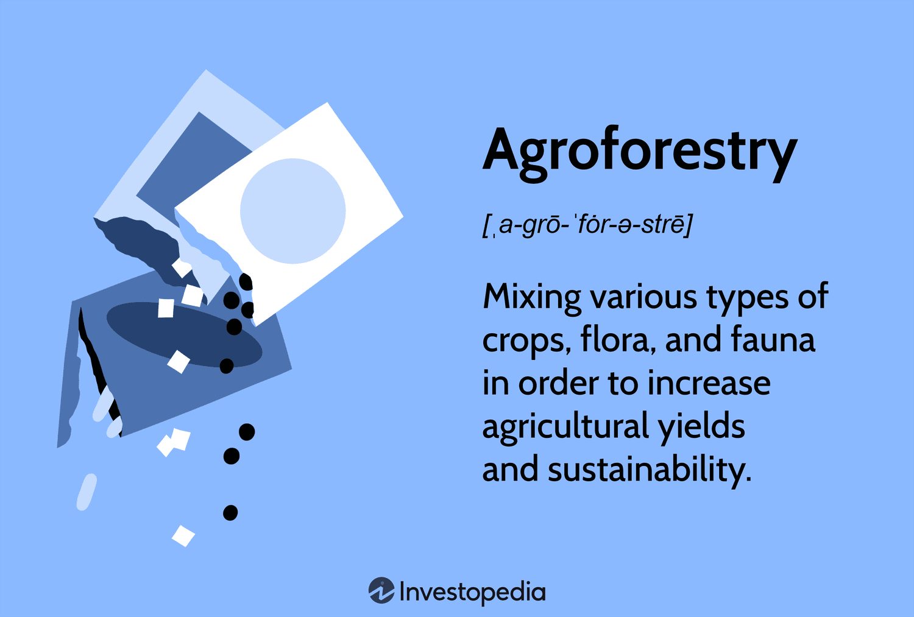

The modern world continually seeks solutions to merge economic interests with environmental sustainability. As the global population grows and resource demands increase, the need for innovative strategies to protect the environment while ensuring economic growth becomes ever more pressing. Forest management, agroforestry, and sustainable agriculture are vital components in this ongoing effort. These practices aim to balance the conservation of natural resources with the demands of agricultural production. 

At the same time, technological advancements such as algorithmic trading (also known as algo trading) are shaping global markets. Algorithmic trading uses complex algorithms to automate trading decisions, allowing for rapid execution and improved efficiency. It plays a significant role in optimizing financial outcomes and managing risks, which can be particularly beneficial for agricultural markets where price volatility often poses challenges.

This article explores how these diverse fields intersect to promote a responsible approach to agriculture and forestry while leveraging technology for financial sustainability. By integrating the principles of sustainable resource management with advanced financial technologies, it is possible to create systems that are both ecologically and economically viable. Understanding these connections can help us approach resource management and trading with greater awareness and effectiveness, ultimately leading to more resilient and sustainable global systems.

## Table of Contents

## Forest Management and Sustainable Practices

Forests are indispensable to the planet's ecological balance, performing a multitude of critical functions. They act as natural climate regulators by absorbing carbon dioxide and releasing oxygen through photosynthesis. Additionally, forests provide habitats for an enormous array of biodiversity, offering shelter and resources to countless species. They also supply raw materials such as timber, which are central to numerous industries. To maintain these benefits, effective forest management is essential, achieving a balance between economic yield and the conservation of ecological integrity.

A pivotal component of sustainable forest management is the practice of selective logging. This approach involves the careful selection and removal of certain trees, allowing younger trees and other vegetation to thrive and thereby sustaining the forest’s health. Unlike clear-cutting, which often results in habitat destruction and loss of biodiversity, selective logging minimizes environmental impact while still providing valuable timber resources.

Reforestation is another critical practice. This involves the replanting of trees in areas that have been depleted, ensuring that forests can regenerate and continue to provide their vital ecological services. Reforestation not only restores biodiversity but also enhances the ability of forests to sequester carbon, thus contributing to the mitigation of climate change.

Habitat preservation is equally important in sustainable forest management. This entails the protection of specific areas within forests that are crucial for the survival of certain species or ecosystems. Preserving these habitats maintains the ecological complexity of forests, supporting a wider array of species and ensuring the continuation of natural processes.

Sustainable forest management is closely aligned with global efforts to address climate change and the depletion of natural resources. Initiatives such as the United Nations’ Reducing Emissions from Deforestation and Forest Degradation (REDD+) program underscore the international commitment to protecting forest ecosystems as a means of reducing atmospheric carbon levels. By adopting sustainable practices, forest management contributes not only to environmental health but also to the economic stability of communities reliant on forest resources.

The integration of these practices—selective logging, reforestation, and habitat preservation—demonstrates a sophisticated approach to maintaining the health and productivity of forest ecosystems. Through these methods, sustainable forest management supports a model where conservation and economic interests are not mutually exclusive but are instead complementary forces driving both ecological and financial sustainability.

## Agroforestry: Bridging Agriculture and Forestry

Agroforestry represents a transformative approach to integrating trees and shrubs with traditional agricultural practices, including crops and livestock farming. This approach not only enhances biodiversity but also significantly contributes to the provision of ecosystem services. These include carbon sequestration, improved air and water quality, and habitat provision for various species. By combining woody perennials with agricultural and horticultural crops, agroforestry systems increase the heterogeneity of the landscape, which is beneficial for both the environment and agriculture.

One of the primary benefits of agroforestry is its ability to increase agricultural resilience against the adverse effects of climate change. Trees and shrubs in these systems play a crucial role in moderating microclimates, which helps reduce temperature variations and protect crops from extreme weather events. This moderation leads to more stable yields over time, increasing resilience especially in regions prone to climate variability.

Agroforestry also significantly improves soil health, a critical [factor](/wiki/factor-investing) for sustaining agricultural productivity. Trees and shrubs in agroforestry systems contribute organic matter to the soil through leaf litter and root decay, enhancing soil structure and fertility. These systems also aid in reducing soil erosion, a significant issue that affects agricultural lands worldwide. The roots of trees and shrubs bind the soil, preventing erosion caused by wind and water, which helps in maintaining soil quality and structure.

The global adoption of agroforestry practices is on the rise, with notable success in regions such as sub-Saharan Africa. This area has seen various implementations of agroforestry that focus on integrating local plant species with crops to improve food security and livelihoods. Studies in countries like Kenya and Niger have highlighted the effectiveness of agroforestry in increasing crop yields, conserving soil, and enhancing water retention.

The integration of agroforestry practices within conventional agriculture presents a compelling pathway to achieve sustainable agricultural productivity. By incorporating this approach, farmers can diversify their income sources, reduce their vulnerability to market and climate fluctuations, and contribute to environmental conservation efforts. This holistic approach not only fosters ecological balance but also promotes long-term agricultural sustainability.

## Sustainable Agriculture: Ensuring Future Food Security

Sustainable agriculture is a comprehensive approach that aims to produce food while preserving ecological health and ensuring economic viability. This method addresses the urgent need to balance food production with the conservation of natural resources, thereby safeguarding future food security.

Key strategies within sustainable agriculture include crop rotation, organic farming, and effective water management practices. Crop rotation involves alternating different types of crops in the same area across different seasons or years, which helps maintain soil fertility and reduces pest and disease cycles. This practice minimizes the need for chemical fertilizers and pesticides, contributing to a healthier ecosystem.

Organic farming takes a more holistic approach by avoiding synthetic inputs and emphasizing the use of natural fertilizers and pest control methods. This type of farming not only protects the environment but also enhances soil health by increasing organic matter and promoting biodiversity. The practice of organic farming is governed by standards and certifications, which vary by country, but typically share core principles of ecological balance and biodiversity conservation.

Water management is another critical aspect of sustainable agriculture. Efficient water use through techniques such as drip irrigation and rainwater harvesting can significantly reduce water wastage and ensure that crop needs are met without depleting local water sources. These methods are essential in regions where water scarcity is a major concern and are increasingly vital as global climate change alters precipitation patterns.

Agroforestry, the integration of trees and shrubs into crop and livestock systems, plays a significant role in sustainable agriculture. This practice enhances biodiversity, improves soil structure and fertility, and can lead to higher yields and more resilient agricultural systems. By providing shade and shelter, agroforestry systems can also mitigate the effects of climate change, such as extreme weather events and temperature fluctuations.

Innovative farming techniques are imperative for adapting to the challenges posed by climate change and the increasing global food demand. Precision agriculture, which makes use of technology such as GPS and remote sensing, allows farmers to optimize field-level management regarding crop farming. Techniques such as vertical farming and hydroponics are also emerging as viable solutions, particularly in urban areas where space is limited and soil quality is poor.

In summary, sustainable agriculture combines traditional practices with modern innovations to create systems that are robust, adaptable, and productive. By focusing on the integration of ecological principles and economic practices, sustainable agriculture not only meets the current food demands but also preserves the ability of future generations to meet their own needs.

## Algorithmic Trading: Enhancing Agricultural Markets

Algorithmic trading applies advanced computer algorithms to perform trades rapidly and at high frequencies, aiming to optimize financial outcomes by capturing small price discrepancies. This method leverages computational power and data analytics to make real-time trading decisions based on pre-set criteria or historical trends.

In agriculture, [algorithmic trading](/wiki/algorithmic-trading) can enhance market dynamics by managing risks and anticipating price fluctuations. These algorithms analyze vast datasets, encompassing weather patterns, crop reports, and market news, to predict supply and demand shifts and their potential impact on agricultural commodity prices. This predictive capability helps farmers and investors make informed decisions, ensuring better price stability and improved market access.

Algorithmic trading also facilitates hedging strategies and derivative instruments, allowing market participants to secure their positions against unforeseen price swings. For instance, a farmer can use futures contracts executed through algos to lock in a sale price for their produce, protecting them from adverse price drops caused by factors beyond their control.

Despite its benefits, algorithmic trading in agricultural markets demands stringent regulatory oversight to mitigate risks such as market manipulation and systemic instability. Rapid trades can inadvertently lead to artificial [volatility](/wiki/volatility-trading-strategies) or "flash crashes," where prices drop precipitously before quickly rebounding. Regulations are necessary to ensure that trading algorithms are transparent, robust, and fair, protecting market integrity and participants.

Careful monitoring and adaptation of trading algorithms are essential to harness their full potential while safeguarding against potential pitfalls. This balance plays a significant role in stabilizing agricultural markets, fostering a more resilient economic landscape, and contributing to sustainable financial sustainability.

## The Interconnectedness of Environmental and Financial Systems

Environmental health and financial markets have become increasingly interconnected, reflecting the intricate relationship between ecological systems and economic frameworks. The implementation of innovative practices such as agroforestry and algorithmic trading demonstrates this linkage, highlighting how environmental initiatives can contribute to financial sustainability and vice versa.

Agroforestry, which integrates trees and shrubs into agricultural landscapes, plays a vital role in diversifying income streams. By incorporating perennial crops, timber, and non-timber forest products into traditional farming systems, farmers can benefit from multiple sources of revenue. This diversity not only enhances the financial stability of rural communities but also fosters ecological benefits such as improved soil health, increased biodiversity, and reduced carbon footprints [1]. As such, agroforestry supports a more sustainable economy by aligning agricultural productivity with conservation efforts.

Algorithmic trading adds another layer of financial stability and predictability to agricultural markets. Through sophisticated algorithms and high-frequency trading methods, this technology can analyze vast amounts of market data to predict price trends and execute trades efficiently. For farmers and investors, this means better management of risks associated with market volatility and more informed decision-making processes. Algorithmic trading provides a mechanism for price stabilization, which is crucial for sectors like agriculture where market prices can be highly unpredictable due to factors such as weather conditions and global demand.

Together, agroforestry and algorithmic trading create a framework that supports environmental goals while enhancing financial resilience. Agroforestry contributes to ecosystem services and income diversification, helping communities withstand environmental and economic stresses. Simultaneously, algorithmic trading can ensure market efficiency and stability, fostering a favorable environment for sustainable agricultural practices. This synergy exemplifies how integrating environmental and financial strategies can lead to robust systems capable of responding to the multi-dimensional challenges of contemporary global markets.

The connection between environmental sustainability and financial systems underscores the importance of holistic approaches in securing both ecological health and economic prosperity. By promoting practices that contribute to the stability and resilience of both ecosystems and markets, there is an imperative to seek collaborative and innovative solutions towards global sustainability.

[1] Agroforestry contributes to improved ecosystem services and economic diversification, making it a valuable practice in achieving sustainable goals in various regions (Jose, S., "Agroforestry for Ecosystem Services and Environmental Benefits: An Overview", Springer).

## Conclusion: A Sustainable Future

The integration of forest management, agroforestry, sustainable agriculture, and algorithmic trading offers a comprehensive approach to maintaining ecological and economic health. By leveraging these practices, we can foster both environmental conservation and financial prosperity, ensuring the sustainability of our planet and economies. This approach emphasizes the critical balance needed between advancing technologies and managing natural resources carefully. 

Technological progress, such as algorithmic trading, presents new opportunities to enhance market efficiencies and stabilize agricultural markets through precise data analysis and rapid execution of trading strategies. For instance, using Python libraries like pandas and NumPy, traders can process vast datasets to derive insights and optimize trading performance. Ensuring robust regulations and ethical guidelines encourages the positive influence of these technologies while mitigating risks of market manipulation and volatility.

Meanwhile, embracing sustainable resource management practices in forestry and agriculture preserves and enhances ecological systems. Forest management strategies prioritize conservation and responsible resource use by combining selective logging and reforestation efforts. Agroforestry and sustainable agriculture improve soil health and biodiversity, presenting solutions to environmental challenges and supporting food security.

Collaborative innovation across technologies and sustainable practices is necessary to align our economic systems with global environmental goals. This collaboration requires stakeholders from various sectors, including technology, agriculture, and finance, to work together in creating policies and systems that promote sustainability while encouraging economic growth.

Ultimately, the synthesis of these approaches holds great promise for a sustainable future. As we continue to innovate and adapt, our collective efforts in integrating these fields will be essential to achieving long-term ecological health and financial resilience.

## References & Further Reading

[1]: Jose, S. (2009). ["Agroforestry for Ecosystem Services and Environmental Benefits: An Overview,"](https://link.springer.com/article/10.1007/s10457-009-9229-7) in Agroforestry for Ecosystem Services and Environmental Benefits. Springer.

[2]: Reducing Emissions from Deforestation and Forest Degradation (REDD+). ["United Nations Framework Convention on Climate Change (UNFCCC)."](https://www.unep.org/explore-topics/climate-action/what-we-do/redd)

[3]: J. Beddington et al. (2015). ["Achieving Food Security in the Face of Climate Change: Summary for Policy Makers from the Commission on Sustainable Agriculture and Climate Change."](https://ccafs.cgiar.org/resources/publications/achieving-food-security-face-climate-change-final-report-commission)

[4]: Marcos Lopez de Prado (2018). ["Advances in Financial Machine Learning."](https://www.amazon.com/Advances-Financial-Machine-Learning-Marcos/dp/1119482089) Wiley.

[5]: G. Richard Braswell, et al. (2005). ["Development of a Model for Predicting the Fusion of Algorithmic Trading Strategies."](https://www.researchgate.net/publication/378548435_Algorithmic_Trading_and_AI_A_Review_of_Strategies_and_Market_Impact) American Finance Association.

[6]: Stefan Jansen (2020). ["Machine Learning for Algorithmic Trading."](https://github.com/stefan-jansen/machine-learning-for-trading) Packt Publishing.