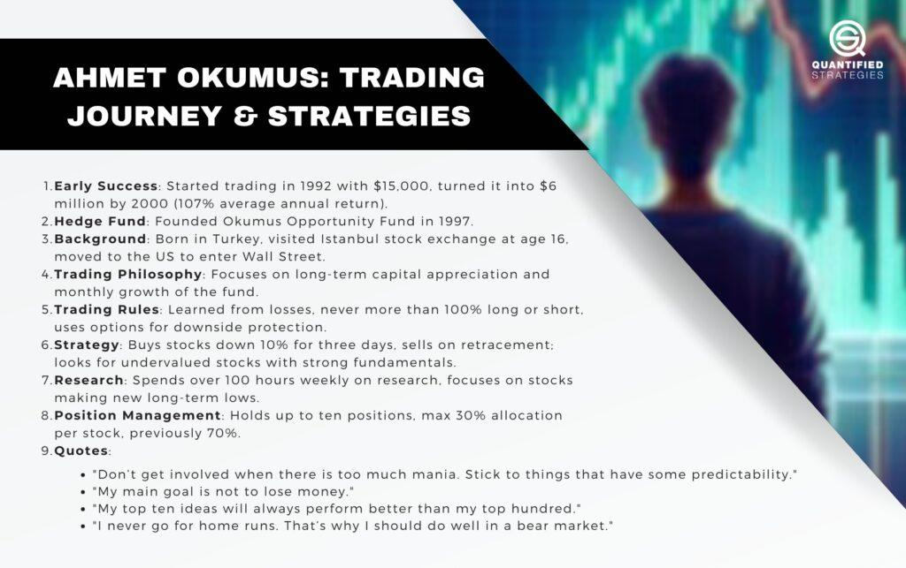

Ahmet Okumus stands out as a prominent figure in the world of algorithmic trading, commencing his journey from Istanbul and making significant strides onto Wall Street. His trading career is marked by exceptional success, driven by a unique philosophy that underpins his strategic decisions. Starting with a modest capital investment, Okumus demonstrated an outstanding average annual return of 107% from 1992 to 2000, illustrating his adeptness in navigating financial markets with precision and acumen.

Beyond his impressive financial achievements, Okumus garnered recognition through his feature in Jack Schwager's book, "Stock Market Wizards." In this book, he provided deep insights into his trading experiences, offering valuable lessons on the intricacies of stock market participation. His ability to share practical knowledge and reflections on his journey has fortified his reputation among peers and budding traders alike.

This article aims to expound on Okumus’ trading methodologies, which reflect a balance between disciplined research and strategic risk-taking. His adaptability in the face of market fluctuations underscores a nuanced understanding of stock trading dynamics, valuable for traders seeking to enhance their competitiveness in the financial markets. By examining Okumus' journey and strategies, we endeavor to unravel the components of his success, offering inspiration and actionable insights for traders at all levels.

## Table of Contents

## Ahmet Okumus' Early Life and Career

Ahmet Okumus was born in Turkey and demonstrated an interest in the financial markets at a young age. This interest was sparked following a visit to the Istanbul Stock Exchange when he was just 16 years old. This formative experience ignited a passion for trading that would eventually guide his career trajectory. Driven by his ambition, Okumus moved to the United States with the aspiration of establishing himself on Wall Street.

Upon arriving in the U.S., Okumus initially took on a variety of positions, each contributing to his expanding knowledge and experience in financial markets. His perseverance and dedication culminated in the early 1990s when he successfully founded his own money management firm. The firm quickly distinguished itself through Okumus' strategic approach to investing, garnering attention for its impressive performance.

Okumus' notable success during this period did not go unnoticed. His exceptional ability to generate high returns and his distinctive trading methodology earned him a mention in Jack Schwager's acclaimed book, "Stock Market Wizards." In the book, his strategies and insights into stock market trading were highlighted, cementing his reputation as a skilled trader and a respected figure in the financial community.

## Trading Strategies and Philosophy

Ahmet Okumus is distinguished by a methodical and research-intensive approach to trading, which involves an extensive commitment of over 100 hours of research per week. His strategy is predominantly value-focused, targeting stocks that have experienced substantial price declines, typically in the range of 60-70% from their highs. This approach allows Okumus to capitalize on potential undervaluation, seeking opportunities in stocks that may have been overlooked or undervalued by the broader market.

Okumus implements stringent selection criteria in his trading decisions, which includes a rigorous analysis of the company's fundamentals. He prioritizes stocks with sound financial health, evidenced by robust balance sheets and solid earnings performance. Additionally, strong management teams and a track record of substantial insider buying are also key factors in his investment decisions, as they indicate confidence from those closest to the company's operations.

A distinctive aspect of Okumus' trading philosophy is his contrarian stance on managing losses. Unlike the common practice among many traders to cut losses short, Okumus prefers to buy more of a stock that moves lower, provided it meets his fundamental criteria. This contrarian approach is grounded in his belief in the intrinsic value of his selected stocks. By averaging down, Okumus increases his investment in stocks he considers undervalued, reinforcing his position until the market corrects itself and reflects the stock’s true value.

Overall, Ahmet Okumus' disciplined approach and philosophy are reflective of a long-term value investing mindset, where patience and thorough research play critical roles in navigating the complexities of the stock market.

## Key Strategies and Market Approach

Ahmet Okumus has established a reputation for his innovative approach to managing risk and selecting investments in the stock market. A significant element of his strategy involves the use of options to mitigate downside risk. Specifically, Okumus employs options as a hedging mechanism, which was a strategy informed partly by feedback from his investors. This method allows him to protect his investments while maintaining the potential for gains.

A core aspect of Okumus' risk management strategy is his commitment to keeping his net exposure at no more than 100%, either long or short. This means that he does not exceed having full investment either in buying securities (long) or selling securities not owned (short), which effectively limits his potential loss and allows for better control over the [volatility](/wiki/volatility-trading-strategies) of his portfolio.

One of Okumus' unique tactics involves the use of cash-secured puts. This strategy is applied to stocks he is interested in purchasing. By writing cash-secured put options, Okumus collects a premium as he waits for the stock's price to decrease to his desired purchase level. This not only provides an income stream but also positions him to acquire stocks at lower prices if they meet his valuation criteria, or alternatively, to simply keep the premium if the stock does not decrease to the strike price.

Okumus is selective with his investments, typically maintaining a concentrated portfolio of only about ten stocks. He firmly believes that his top ten ideas have the potential to outperform more extensive portfolios. This concentration allows him to focus his research and resources more intensively on each selection, ensuring that each investment is scrutinized with a high level of due diligence. This approach also aligns with his belief in the power of in-depth research and understanding the fundamental aspects of each company within his portfolio.

## Handling Market Challenges

During the dot-com bubble burst of the late 1990s and early 2000s, Ahmet Okumus, like many investors, faced substantial setbacks. His losses stemmed from prematurely shorting internet stocks, a common pitfall during that exuberant period. This experience served as a critical learning point for Okumus, leading him to reassess and refine his trading strategies. 

Recognizing the unpredictability of market manias, Okumus decided to refrain from participating in such speculative frenzies. Instead, he reinforced his commitment to value investing principles and strict adherence to his research-intensive approach. By focusing on companies with solid fundamentals rather than speculative high-flyers, he aimed to mitigate exposure to volatile and unpredictable market swings.

Okumus's response to these challenges was not a complete overhaul of his strategies but a recalibration. He continued to trust in his disciplined approach, diligently conducting research and analysis, while being more cautious about timing and market sentiment. His ability to adapt is reflected in his willingness to learn and incorporate lessons from these experiences, ensuring his trading philosophy remained robust against market vicissitudes. This adaptability is exemplified by his strategy adjustments, such as increasing diversification when necessary and employing options to manage risk, enabling him to navigate turbulent periods while still capitalizing on emerging opportunities in the market.

This experience underscored the importance of remaining flexible yet committed to one's core principles, a balance that Okumus has successfully maintained throughout his career. His journey illustrates that while market conditions may change, steadfast dedication to a well-researched, disciplined investing approach can sustain long-term success.

## Conclusion: Insights and Inspiration

Ahmet Okumus' journey from the Istanbul Stock Exchange to Wall Street exemplifies how disciplined strategies and an adaptive mindset contribute to achieving remarkable success in trading. Starting with limited capital and facing numerous challenges, Okumus consistently demonstrated an ability to navigate complex market environments. His risk-averse strategies, rooted in a focus on value and sound fundamentals, allowed him to achieve substantial returns where others faltered.

Central to Okumus' success is his commitment to intensive research, which informs his investment decisions and mitigates risk. His ability to maintain this discipline, often involving over 100 hours of research weekly, underscores the importance of thorough preparation in trading. By selecting stocks based on stringent criteria, including significant insider buying and robust fundamentals, he demonstrates the efficacy of a value-focused approach.

Additionally, Okumus' willingness to adapt his strategies, particularly in response to market challenges such as the dot-com bubble burst, highlights the necessity of flexibility in trading. His experience during market downturns reinforced his approach to avoid speculative manias that are difficult to predict, illustrating a valuable lesson for traders in maintaining discipline and adhering to fundamental principles.

The lessons from Okumus' career offer insight into the importance of a disciplined approach and adaptability in trading. His journey serves as an inspiration for traders, emphasizing that consistent success is achievable through a commitment to research, calculated risk-taking, and learning from both successes and setbacks.

## References & Further Reading

[1]: Schwager, J. D. (2001). ["Stock Market Wizards: Interviews with America's Top Stock Traders."](https://www.amazon.com/Stock-Market-Wizards-Interviews-Americas/dp/0066620597) HarperBusiness.

[2]: Chan, E. P. (2009). ["Quantitative Trading: How to Build Your Own Algorithmic Trading Business."](https://github.com/ftvision/quant_trading_echan_book) Wiley.

[3]: Lopez de Prado, M. (2018). ["Advances in Financial Machine Learning."](https://www.amazon.com/Advances-Financial-Machine-Learning-Marcos/dp/1119482089) Wiley.

[4]: Jansen, S. (2020). ["Machine Learning for Algorithmic Trading: Mastering Data-Driven Finance."](https://github.com/stefan-jansen/machine-learning-for-trading) Packt Publishing.

[5]: Aronson, D. R. (2006). ["Evidence-Based Technical Analysis: Applying the Scientific Method and Statistical Inference to Trading Signals."](https://www.amazon.com/Evidence-Based-Technical-Analysis-Scientific-Statistical/dp/0470008741) Wiley.