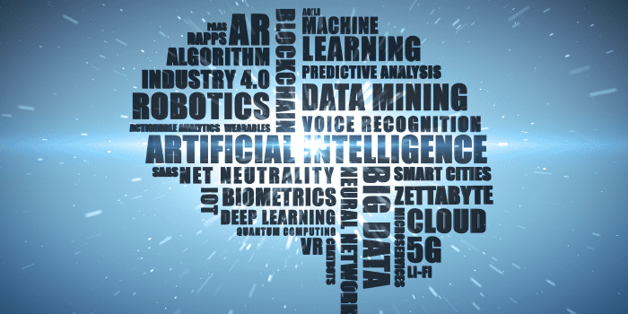

The integration of Artificial Intelligence (AI) in stock trading marks a revolutionary shift in how financial markets operate. AI, with its advanced computational power, is redefining the strategies and efficiency of stock trading, making it a crucial tool in today’s financial world.

Artificial Intelligence in stock trading encompasses the use of machine learning algorithms, data analytics, and predictive modeling to make more informed and timely trading decisions. By processing vast amounts of market data, AI systems can identify patterns and insights that are beyond human capacity. This includes analyzing market trends, financial news, and economic indicators, all at a speed and accuracy that significantly outpaces traditional methods.

The relevance of AI in today’s market cannot be overstated. In an era characterized by rapid information flow and high market volatility, AI provides a competitive edge. It enables traders and investors to process and react to market changes swiftly and effectively. Moreover, AI-driven analysis often leads to more nuanced and comprehensive market insights, enhancing the decision-making process.

## Table of Contents

## What is Artificial Intelligence (AI)?

Artificial Intelligence (AI) is a branch of computer science focused on creating systems capable of performing tasks that normally require human intelligence. These tasks include learning, reasoning, problem-solving, perception, and language understanding. AI operates on the principles of simulating human cognitive processes using algorithms, data, and computational power.

At its core, AI involves machine learning (ML), where machines learn from data. Machine learning enables AI systems to automatically learn and improve from experience without being explicitly programmed. This learning process is achieved through the development of algorithms that can review and interpret complex data, make decisions, and make predictions.

In the context of finance, AI’s fundamental principles are applied to analyze financial markets and make trading decisions. It uses quantitative methods to process vast datasets – ranging from stock prices and trading [volume](/wiki/volume-trading-strategy)s to economic indicators and global financial news. By analyzing this data, AI systems can identify patterns and insights that inform investment strategies.

AI in stock trading is characterized by its ability to process and analyze data at a speed and volume that is beyond human capability. This high-speed processing allows for real-time analysis of market trends, enabling traders to make quicker, more informed decisions. Additionally, AI’s predictive analytics can forecast market movements, contributing to strategic trading and risk management.

In summary, AI in stock trading represents the convergence of advanced computational algorithms, expansive data analytics, and [machine learning](/wiki/machine-learning) techniques. It stands as a transformative force in the financial sector, offering new ways to approach market analysis, trading strategies, and risk management.

## Evolution of AI in Finance

The journey of Artificial Intelligence (AI) in the financial sector is a fascinating tale of evolution, marked by gradual advancements and transformative breakthroughs. This evolution has seen AI grow from a theoretical concept to a fundamental component in modern financial practices, reshaping how financial markets operate.

**The Early Days**

AI's initial foray into finance during the late 20th century was modest, primarily focused on automating basic tasks. Early applications included rudimentary data processing and analysis tools, which helped financial institutions manage large volumes of data more efficiently. These tools, while primitive by today's standards, laid the groundwork for more complex AI applications.

**The Rise of Machine Learning**

The real game-changer came with the advent of machine learning (ML) and advanced data analytics. In the late 1990s and early 2000s, financial institutions began to explore the potential of ML to glean insights from vast amounts of financial data. This period saw the development of predictive models for stock trading, risk assessment algorithms, and the early stages of automated trading systems.

**Algorithmic Trading**

The mid-2000s marked a significant milestone with the introduction of [algorithmic trading](/wiki/algorithmic-trading). AI and ML algorithms started to be used extensively to execute complex trading strategies at speeds and volumes impossible for human traders. These algorithms could analyze market data, identify trading opportunities, and execute trades in milliseconds, leading to the rise of high-frequency trading.

**Big Data and AI Convergence**

The explosion of big data in the late 2000s and 2010s further accelerated AI's growth in finance. With more data available than ever before, AI systems could learn and adapt with greater accuracy, leading to more sophisticated trading algorithms, risk management tools, and financial forecasting models.

**The Advent of Robo-Advisors**

Another significant development was the introduction of robo-advisors in the 2010s. These AI-driven platforms democratized access to investment advice, offering personalized portfolio management services to a broader range of investors.

**AI Today**

Today, AI is integral to financial market operations. From automated trading systems and risk management to fraud detection and customer service, AI's role is deeply entrenched in the fabric of modern finance. Its advanced capabilities in analyzing market trends, predicting stock movements, and managing complex portfolios are indispensable tools for traders and investors.

The evolution of AI in finance is a testament to the relentless pursuit of efficiency, accuracy, and innovation in the financial sector. As AI continues to advance, its potential to further revolutionize stock trading and the broader financial landscape remains boundless.

## How AI is Transforming Stock Trading

### AI Stock Trading Mechanics

The application of AI algorithms in stock trading represents a sophisticated intersection of technology and finance. These algorithms, through their unique mechanics, have the capability to transform vast amounts of data into actionable trading strategies.

**Data Processing and Analysis**

AI algorithms begin by ingesting large volumes of data, which include historical stock prices, trading volumes, financial statements, and even global economic indicators. More advanced systems also analyze unstructured data like news articles, social media feeds, and financial reports. Using techniques from machine learning, these algorithms process and analyze this data to identify patterns, trends, and correlations that might be invisible to the human eye.

**Predictive Modeling**

One of the key functionalities of AI in stock trading is predictive modeling. By applying statistical techniques, AI algorithms can forecast future market movements and stock prices. These predictions are based on historical data trends and patterns, allowing traders to make informed decisions about entry and [exit](/wiki/exit-strategy) points in the market.

**Algorithmic Trading Strategies**

AI algorithms are instrumental in developing algorithmic trading strategies. They can execute trades at high speed and frequency, a practice known as high-frequency trading ([HFT](/wiki/high-frequency-trading-strategies)). These algorithms can make thousands of trades per day, capitalizing on minor price movements in the market. They are designed to identify profitable trading opportunities based on market conditions and automatically execute trades to maximize returns.

**Risk Management**

Risk management is another critical area where AI algorithms play a significant role. They assess various risk [factor](/wiki/factor-investing)s in real-time, including market [volatility](/wiki/volatility-trading-strategies) and [liquidity](/wiki/liquidity-risk-premium) risk. By doing so, they can dynamically adjust trading strategies to mitigate potential losses. AI-driven risk management models continuously learn and adapt, improving their accuracy in predicting and managing risks over time.

**Sentiment Analysis**

Advancements in AI have also led to the development of sentiment analysis tools. These tools evaluate the mood or sentiment of the market by analyzing news articles, social media posts, and financial blogs. Understanding market sentiment helps in predicting market trends and making strategic trading decisions.

**Continuous Learning and Adaptation**

A defining characteristic of AI in stock trading is its ability to learn continuously and adapt its strategies. Machine learning models used in these algorithms can update themselves as new data comes in, ensuring that the trading strategies evolve with the changing market conditions.

In essence, AI algorithms in stock trading are revolutionizing the way market analysis and trading are conducted. They bring a level of speed, efficiency, and analytical depth that enhances decision-making processes, leading to more strategic and informed trading practices. As AI continues to advance, its role in stock trading is set to become even more integral, shaping the future of the financial markets.

### Data Analysis

In AI-driven stock trading, the crux of making intelligent and informed decisions lies in the ability to analyze a diverse range of financial data comprehensively. AI systems are adept at dissecting and interpreting various forms of data that are crucial in understanding market dynamics and predicting future trends. Here are the key types of financial data AI analyzes:

**Market Trends**

AI algorithms are exceptionally skilled at identifying and analyzing market trends. They deep dive into historical price data, trading volumes, and price patterns to uncover trends that might indicate future market movements. This analysis includes looking at short-term fluctuations and long-term trends, providing insights into market [momentum](/wiki/momentum) and potential turning points.

**Financial News**

AI systems also analyze financial news, which can have a substantial impact on stock prices. Advanced natural language processing (NLP) techniques enable AI to parse news articles, financial reports, press releases, and even social media posts to gauge market sentiment. This involves identifying key words and phrases that indicate positive or negative sentiment and measuring their potential impact on specific stocks or the market as a whole.

**Economic Indicators**

AI algorithms process a range of economic indicators that influence the stock market. This includes macroeconomic data like GDP growth rates, unemployment rates, inflation, and [interest rate](/wiki/interest-rate-trading-strategies) changes. AI systems also analyze industry-specific indicators, such as manufacturing data, consumer spending, and sector-specific growth rates. By understanding these indicators, AI can predict how changes in the economy will affect different sectors and stocks.

**Company Financials**

In-depth analysis of company financial statements is another area where AI excels. AI systems scrutinize balance sheets, income statements, and cash flow statements to evaluate a company's financial health. This includes assessing profitability, revenue growth, debt levels, and liquidity. Such analysis is vital in determining the intrinsic value of stocks and making long-term investment decisions.

**Market Liquidity and Order Flow Data**

AI algorithms consider market liquidity and order flow data, which provide insights into buying and selling pressure in the market. Analyzing this data helps AI systems understand market depth, identify potential price movements, and execute trades at optimal prices.

**Global Events and Geopolitical Developments**

Finally, AI systems monitor global events and geopolitical developments that can impact the financial markets. This includes political elections, policy changes, international trade agreements, and geopolitical conflicts. AI's ability to quickly process and respond to these events is crucial in today’s interconnected global economy.

In essence, AI in stock trading leverages a multi-faceted approach to data analysis, covering everything from micro-level company data to macroeconomic indicators and global events. This comprehensive analysis is what gives AI an edge in making precise and timely stock trading decisions.

### Algorithmic Trading

Algorithmic trading, a cornerstone of modern finance, has been dramatically transformed by the integration of AI. This transformation is changing the landscape of trading, from how decisions are made to how trades are executed.

**Role of AI in Algorithmic Trading**

1. **Strategy Development**: AI plays a pivotal role in developing trading strategies. By analyzing historical data and identifying patterns, AI algorithms can formulate strategies that can predict market movements and execute trades based on these predictions. These strategies range from simple rule-based algorithms to complex models that adapt to changing market conditions.
2. **High-Frequency Trading (HFT)**: AI has been instrumental in advancing high-frequency trading. In HFT, algorithms execute a large number of orders at extremely high speeds, often in fractions of a second. AI enhances the effectiveness of HFT by analyzing market data in real-time, making quick decisions, and exploiting minute price movements for profit.
3. **Predictive Analytics**: AI algorithms use predictive analytics to forecast market trends. They utilize various machine learning techniques, like regression analysis, neural networks, and reinforcement learning, to predict stock prices and market movements. These predictions are then used to make automated trading decisions.
4. **Risk Management**: AI algorithms are increasingly used for risk management in algorithmic trading. They assess the risk level of certain trades or investment strategies and make decisions to mitigate potential losses. This includes diversifying portfolios, setting stop-loss orders, and adjusting strategies in response to market volatility.
5. **Sentiment Analysis**: AI tools are capable of performing sentiment analysis by processing unstructured data, such as news articles, social media posts, and financial reports. By gauging the market sentiment, AI algorithms can anticipate market reactions to events like earnings announcements, economic reports, or geopolitical developments.
6. **Optimization**: AI-driven algorithmic trading is not just about executing trades; it's also about optimizing them. AI algorithms can determine the best time to trade, the best order type to use, and the most efficient way to execute an order to minimize the market impact and transaction costs.

**Continuous Evolution and Learning**

AI in algorithmic trading is characterized by its ability to learn and evolve continuously. As new data comes in, AI models update and refine their strategies, making them more accurate over time. This continuous learning process is crucial in adapting to ever-changing market dynamics and maintaining a competitive edge in trading.

In conclusion, AI's role in algorithmic trading is multifaceted and influential. It offers a blend of speed, efficiency, accuracy, and adaptability, making it an indispensable tool in the world of stock trading. As AI technology advances, its capabilities in algorithmic trading are only expected to grow, further revolutionizing the field.

## Benefits of AI in Stock Trading

The integration of AI in stock trading has significantly enhanced the capabilities of market analysis, fundamentally changing the landscape of decision-making in trading. AI-driven market analysis is characterized by its depth, speed, and accuracy, offering a more nuanced understanding of the market. Here’s how AI is enhancing market analysis:

**Comprehensive Data Processing**

AI excels in processing vast and varied datasets that are beyond human capability to analyze manually. This includes not just structured data like price and volume but also unstructured data like news articles, social media posts, and financial reports. AI algorithms can swiftly sift through this data, extract relevant information, and identify patterns that may impact market movements.

**Real-Time Analysis**

One of the standout features of AI in market analysis is its ability to perform real-time analysis. AI systems can monitor and analyze market changes as they happen, providing traders with up-to-the-minute insights. This real-time analysis is crucial in fast-paced financial markets where conditions can change rapidly, and the timeliness of information is key to making informed decisions.

**Predictive Analytics**

AI utilizes predictive analytics to forecast future market trends and stock movements. By analyzing historical data and current market conditions, AI can make educated predictions about future market behavior. These predictions are invaluable in helping traders and investors make proactive decisions, rather than reactive ones.

**Sentiment Analysis**

AI has brought a new dimension to market analysis through sentiment analysis. By evaluating the tone and context of news articles, social media, and other textual data, AI can gauge the market sentiment. This helps in understanding how public perception and news events might influence the stock market, providing an emotional analysis to complement traditional financial analysis.

**Risk Assessment**

AI improves market analysis by enhancing risk assessment capabilities. It can identify potential risk factors in investment strategies and predict their impact on portfolio performance. This level of risk analysis helps traders and investors in making more risk-aware decisions, leading to better management of their investment portfolios.

**Enhanced Decision-Making**

AI-driven market analysis supports more informed and data-driven decision-making. By providing comprehensive, real-time, and predictive insights into the market, AI equips traders and investors with the knowledge needed to make decisions with greater confidence. It reduces reliance on intuition and guesswork, leading to more strategic and calculated trading moves.

In conclusion, AI has revolutionized market analysis in stock trading. Its ability to process and analyze data at an unprecedented scale and speed, combined with its predictive capabilities and risk assessment, has made it an indispensable tool for modern traders and investors. As AI technology continues to evolve, its role in enhancing market analysis and decision-making is only set to become more prominent.

## AI and Robo-Advisors

The integration of Artificial Intelligence (AI) in financial advising has led to the emergence and growth of robo-advisors. These AI-driven tools are reshaping investment advisory services by offering automated, algorithm-based portfolio management advice.

### Functionality of Robo-Advisors

Robo-advisors utilize AI to analyze a vast array of data points that influence investment decisions. They operate by:

1. **Collecting Financial Information**: Initially, they gather essential financial information from clients, including risk tolerance, investment goals, and time horizons.
2. **Algorithmic Portfolio Management**: Using complex algorithms, robo-advisors assess this data and automatically create and manage a diversified investment portfolio tailored to the client's specific needs.
3. **Continuous Monitoring and Rebalancing**: They continuously monitor market conditions and automatically rebalance portfolios to maintain alignment with the client's investment goals and risk levels.
4. **Tax Optimization**: Many robo-advisors include tax-loss harvesting features, which can help in reducing tax liabilities on investment gains.
5. **Low-Cost Operation**: Being automated, they typically have lower fees than traditional investment advisory services.

### Comparison with Traditional Advisory Services

While traditional human advisors have been the cornerstone of personalized investment advice, AI-driven robo-advisors offer several unique advantages:

1. **Accessibility and Convenience**: Robo-advisors are accessible 24/7 and can be accessed from anywhere, providing convenience and immediacy not always possible with human advisors.
2. **Data Processing Capability**: AI can process and analyze data at a scale and speed far beyond human capability, allowing for more nuanced and informed investment decisions.
3. **Reduced Emotional Bias**: AI-driven advice is based purely on data and algorithms, eliminating the emotional bias that can sometimes influence human advisors.
4. **Cost-Effectiveness**: Generally, robo-advisors come with lower fees due to their automated nature, making them an affordable option for investors.
5. **Personalization at Scale**: While traditional advisors offer a high level of personal interaction, robo-advisors can offer a degree of personalization in portfolio management that scales to a large number of clients.

However, traditional advisors still hold advantages in areas where human judgment and interaction are crucial. They excel in understanding complex financial situations, offering tailored advice during life-changing events, and providing emotional support during market volatility.

In conclusion, AI-driven robo-advisors and traditional human advisors each have their strengths, catering to different needs and preferences of investors. While robo-advisors offer efficiency, lower costs, and data-driven precision, human advisors provide personalized advice, emotional intelligence, and experience-driven judgment. The future of investment advisory services may well see a blend of both, leveraging the strengths of AI while retaining the irreplaceable human touch.

## Conclusion

The integration of AI in stock trading is not just a trend but a fundamental shift, reshaping how trading decisions are made, risks are managed, and efficiency is achieved.

As we look to the future, AI in stock trading is poised to continue its trajectory of growth and innovation. This technology is not just enhancing existing trading practices but is also opening new frontiers in the financial world. AI's ability to analyze vast amounts of data, learn from market patterns, and execute trades at unprecedented speeds is revolutionizing stock trading.

However, this journey is not without its challenges. Technical complexities, ethical considerations, and the need for comprehensive regulation are aspects that must be navigated with care. As we embrace the potential of AI, it's imperative to foster an environment where innovation is balanced with responsibility and transparency.

In conclusion, the impact and potential of AI in stock trading are profound. It represents a new era in the financial markets, one where data-driven insights, efficiency, and advanced risk management redefine what's possible in trading. As investors, traders, and financial institutions continue to leverage AI, the landscape of stock trading will evolve, reflecting the innovative spirit and transformative power of [artificial intelligence](/wiki/ai-artificial-intelligence).

## Frequently Asked Questions

This section aims to address common questions and misconceptions about AI in stock trading, providing clarity and insight into this rapidly evolving field.

**Is AI in Stock Trading Only Suitable for Professional Traders?**

No, AI in stock trading is not exclusively for professional traders. Many AI tools and platforms are designed to be user-friendly, making them accessible to investors of all levels, including beginners. However, it's important for any investor to understand the basics of stock trading and AI principles before fully relying on these technologies.

**Can AI Completely Replace Human Stock Traders?**

While AI significantly enhances stock trading by providing advanced data analysis and decision-making support, it cannot entirely replace human traders. AI excels in processing vast amounts of data and identifying patterns, but human traders bring unique insights, intuition, and ethical considerations, especially in complex or unforeseen market situations.

**How Safe and Secure is AI in Stock Trading?**

AI systems are generally built with a focus on safety and security, especially in financial applications like stock trading. However, like any technology, they are not immune to risks such as data breaches or technical errors. Investors should ensure they use AI platforms that prioritize security and have strong measures in place to protect data and financial transactions.

**Does Using AI Guarantee Higher Profits in Stock Trading?**

While AI can significantly improve market analysis and inform better trading decisions, it does not guarantee higher profits. The stock market is influenced by numerous unpredictable factors, and AI is a tool to aid in decision-making, not a foolproof solution to ensure profitability.

**How Does AI Handle Market Volatility?**

AI systems in stock trading are designed to analyze historical and real-time data to understand market trends, including volatility. They can adapt strategies based on changing market conditions. However, AI's effectiveness in extreme volatility may vary, and traders should combine AI insights with their market knowledge and risk management strategies.

**Are AI-Driven Robo-Advisors Better Than Human Financial Advisors?**

AI-driven robo-advisors offer a different approach compared to human advisors. They are efficient in handling large data sets and providing algorithm-based advice, often at a lower cost. However, human advisors offer personalized advice based on individual client needs, experiences, and emotional understanding. The choice depends on the investor's preference and investment goals.

**Will AI Make Traditional Stock Trading Obsolete?**

AI is transforming stock trading but not making traditional methods obsolete. Instead, it's creating a new paradigm where technology and traditional methods coexist, each complementing the other. Human insight and experience, combined with AI's analytical power, are shaping a more advanced and efficient stock trading landscape.

## References & Further Reading

- ["Artificial Intelligence in Finance: A Python-Based Guide"](https://www.amazon.com/Artificial-Intelligence-Finance-Python-Based-Guide/dp/1492055433) by Yves Hilpisch - A comprehensive guide exploring AI applications in finance, including stock trading.
- ["Trading Evolved: Anyone Can Build Killer Trading Strategies in Python"](https://www.amazon.com/Trading-Evolved-Anyone-Killer-Strategies-ebook/dp/B07VDLX55H) by Andreas Clenow - This book investigates into how to use Python for developing sophisticated trading strategies, incorporating AI elements.
- ["Machine Learning for Algorithmic Trading"](https://www.amazon.com/Machine-Learning-Algorithmic-Trading-alternative/dp/1839217715) by Stefan Jansen - A resourceful book for understanding how machine learning can be applied in algorithmic trading.