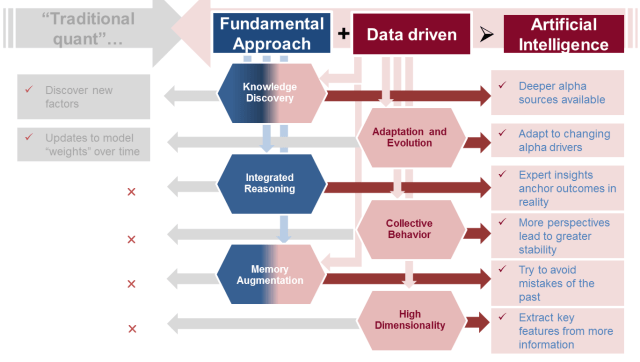

## Table of Contents

## What is an alpha strategy in finance?

An alpha strategy in finance is a way to try to beat the market. It's about finding ways to make more money than what you would get just by following the overall market trends. People who use alpha strategies look for special opportunities or use smart techniques to do better than average.

These strategies can involve things like picking certain stocks that might do better than others, or using complicated financial tools to make bets on how the market will move. The goal is to find an edge that lets you earn more than what everyone else is getting. But, alpha strategies can be risky, and they don't always work out as planned.

## How does artificial intelligence enhance traditional alpha strategies?

Artificial intelligence helps make traditional alpha strategies better by using computers to look at a lot of information really quickly. Instead of people having to go through piles of data and maybe missing something important, AI can find patterns and opportunities that humans might not see. For example, AI can look at news, social media, and financial reports all at once to figure out which stocks might go up or down. This means that people using alpha strategies can make smarter choices about where to put their money.

Also, AI can learn from what has happened before to make better guesses about what will happen next. This is called [machine learning](/wiki/machine-learning). By using this, AI can keep improving its predictions over time. So, instead of sticking to old ways of [picking](/wiki/asset-class-picking) stocks or other investments, AI can help change and improve those strategies. This can lead to finding new ways to make money that were hard to see before AI came along.

## What are the basic components of an AI-driven alpha strategy?

The basic components of an AI-driven alpha strategy include data collection and processing, machine learning algorithms, and decision-making tools. First, the strategy relies on gathering a huge amount of data from different places like stock prices, news articles, and social media. This data is then cleaned and organized so that the AI can use it easily. The more and better the data, the better the AI can understand what's going on in the market.

Next, machine learning algorithms are the heart of the strategy. These algorithms learn from the data to spot patterns and make predictions about which investments might do well. They can figure out things like which stocks are likely to go up in value or which markets are about to change direction. The algorithms keep learning and getting better over time, which means the strategy can adapt to new situations.

Finally, decision-making tools use the insights from the machine learning algorithms to make actual investment choices. These tools can suggest buying or selling certain stocks, or even automatically [carry](/wiki/carry-trading) out trades based on what the AI thinks is the best move. The goal is to use all this technology to find opportunities that other investors might miss, helping to beat the market and earn more money.

## Can you explain the difference between alpha and beta in the context of AI-driven strategies?

In the world of investing, alpha and beta are two important ideas that help us understand how investments perform. Alpha is all about trying to beat the market. It's like finding a secret way to make more money than everyone else. When we use AI to create alpha strategies, we're using smart computer programs to look at tons of data and find special opportunities that might make us more money than just following the market's ups and downs. It's like having a super smart friend who can spot the best deals before anyone else.

On the other hand, beta is about how much an investment moves along with the market. If the market goes up, a high-beta investment will go up even more, but if the market goes down, it will fall harder too. Beta is not about beating the market; it's about understanding how risky an investment is compared to the market as a whole. In AI-driven strategies, we use beta to help manage risk. By knowing how sensitive an investment is to market changes, we can use AI to make smarter choices about which investments to pick and when to make moves to protect our money.

## What are some common data sources used in AI-driven alpha strategies?

AI-driven alpha strategies use a lot of different kinds of information to make smart guesses about the market. Some of the most common sources are stock prices and trading volumes from stock exchanges. This information helps AI understand how stocks are moving and how much people are buying and selling them. Another big source is financial reports from companies. These reports tell AI about how much money a company is making, how much it's spending, and other important details that can affect its stock price. News articles are also really important because they can give clues about what's happening in the world that might change how the market behaves.

Besides these, social media is a newer but very useful source of data. People on platforms like Twitter or Reddit often talk about stocks and share their thoughts, which can influence market trends. AI can look at all these posts and figure out what people are thinking and feeling about certain investments. Economic indicators, like unemployment rates or inflation numbers, are also used because they give a bigger picture of how the economy is doing, which can affect stock prices. By putting all these pieces of information together, AI can find patterns and opportunities that help create better alpha strategies.

## How do machine learning algorithms identify alpha opportunities?

Machine learning algorithms help find alpha opportunities by looking at a lot of data from different places. They can spot patterns that might be too hard for people to see. For example, they can look at stock prices, news, and social media posts to figure out which stocks might go up or down. By doing this, the algorithms can find special chances to make money that other investors might miss. They can also learn from what has happened before, so they get better at predicting what might happen next.

These algorithms use different methods to find alpha. Some look for trends in the data, like if a stock usually goes up after a certain kind of news comes out. Others might use more complicated math to predict how stocks will move based on many different factors at once. By constantly learning and adjusting, the algorithms can keep finding new ways to beat the market. This means they can help investors make smarter choices about where to put their money, aiming to earn more than what the average investor gets.

## What are the challenges of implementing AI-driven alpha strategies?

One big challenge of using AI to find alpha is getting good data. AI needs a lot of information to work well, but not all data is easy to get or is good quality. Sometimes the data can be wrong or missing important pieces, which can make the AI's predictions less accurate. Also, the cost of getting and keeping all this data can be high, which might make it hard for smaller investors to use AI-driven strategies.

Another challenge is that AI models can be really complicated. It's not always easy to understand why the AI is making certain choices, which can make people feel unsure about trusting it. Plus, these models need a lot of computer power to run, and they need to be watched and updated all the time to keep working well. If the market changes in a way the AI hasn't seen before, it might not know how to react, which can lead to mistakes.

Lastly, there's the problem of other people using AI too. If everyone starts using the same AI strategies, it can make it harder to find unique opportunities. This means that the edge AI gives might not last long because everyone is trying to do the same thing. Also, there are rules and laws about using AI in investing that can change, and keeping up with them can be tough.

## How can AI-driven alpha strategies be evaluated for performance?

To see how well AI-driven alpha strategies are doing, you can look at a few key things. First, you check the returns, which means how much money the strategy makes over time. You want to see if it's making more money than just following the market. Another thing to look at is the risk, which is how much the strategy's value goes up and down. A good strategy should make more money without taking too much risk. You can also compare the strategy to other ways of investing to see if it's doing better than them.

Another way to evaluate these strategies is by looking at how well they stick to their goals. For example, if the strategy is supposed to find opportunities that others miss, you want to see if it's actually doing that. You can also use special numbers called performance metrics, like the Sharpe ratio, which tells you how much extra return you're getting for the risk you're taking. By keeping an eye on these things, you can tell if the AI-driven strategy is working well and helping you beat the market.

## What are the ethical considerations when using AI in alpha strategies?

Using AI in alpha strategies brings up some important ethical questions. One big issue is fairness. If only big investors with lots of money can use AI, it might not be fair to smaller investors who can't afford it. This could make the rich get richer and leave others behind. Also, AI can sometimes make mistakes or be biased because of the data it uses. If the data has problems, the AI might make choices that aren't fair or right, which can hurt people who are already struggling.

Another thing to think about is transparency. When AI makes decisions, it can be hard to understand why it chose to do something. This can make people feel unsure about trusting it, especially if they're putting their money into it. It's important for people using AI to be open about how it works and what it's doing, so everyone knows what's going on. Also, there are rules and laws about using AI in investing, and it's important to follow them to make sure everything is done the right way.

## How do advanced AI techniques like deep learning improve alpha strategy outcomes?

Deep learning, a type of AI, can make alpha strategies better by looking at a lot of data in a smart way. It's like having a super brain that can see patterns and connections in information that are too hard for people to notice. For example, [deep learning](/wiki/deep-learning) can study things like stock prices, news, and even what people are saying on social media to figure out which stocks might go up or down. By understanding these patterns, deep learning can help find special opportunities to make money that other investors might miss.

Also, deep learning can keep learning and getting better over time. It's not stuck doing the same thing; it can change and adapt to new situations in the market. This means that the strategies it helps create can stay ahead of the game, even when things change. By using deep learning, investors can make smarter choices about where to put their money, aiming to earn more than what the average investor gets.

## What are some case studies of successful AI-driven alpha strategies in the market?

One good example of a successful AI-driven alpha strategy is what happened at Renaissance Technologies. They use a fund called the Medallion Fund, which is famous for making a lot of money. They use AI and math to look at tons of data, like stock prices and other numbers, to find the best times to buy and sell. Their AI system can spot tiny patterns that people might miss. Because of this, the Medallion Fund has made a lot more money than the market average for many years. It shows how powerful AI can be in finding ways to beat the market.

Another example is Two Sigma, a company that also uses AI to help with investing. They use machine learning to look at all kinds of information, from news articles to social media posts, to predict how stocks will move. Two Sigma's AI can learn from what's happened before to make better guesses about what will happen next. This has helped them find good investments and make more money than just following the market. Their success shows that AI can help investors find new opportunities and make smarter choices.

These examples show how AI can be really helpful in finding alpha. By using smart computer programs to look at a lot of data, companies like Renaissance Technologies and Two Sigma have been able to do better than the market. This can give investors a big advantage and help them make more money.

## What future trends might impact the development of AI-driven alpha strategies?

In the future, more and more data will be available, which will help AI-driven alpha strategies get even better. As more things in the world become connected, like smart devices and the internet, there will be a lot more information for AI to look at. This could mean that AI can find even more patterns and opportunities that people can't see. Also, as computers get faster and better, AI will be able to process this data quicker and make smarter decisions. This could make alpha strategies more powerful and help investors find new ways to make money.

Another trend that might change AI-driven alpha strategies is the use of new kinds of AI, like [reinforcement learning](/wiki/reinforcement-learning). This type of AI can learn by trying different things and seeing what works best. It's like playing a game where the AI gets better over time by figuring out the best moves. This could help AI find new ways to beat the market that we haven't thought of yet. Also, as more people start using AI, there might be new rules and laws about how it can be used in investing. These rules could change how AI-driven strategies work and make sure they are used in a fair way.

## How can Risk Management and Dynamic Portfolio Optimization be effectively implemented?

AI technologies have significantly advanced the field of risk management and dynamic portfolio optimization in trading. By harnessing sophisticated analytical tools, AI facilitates the assessment and mitigation of trading risks in ways that were previously unattainable. One of the primary contributions of AI to risk management is its ability to process and interpret vast amounts of market data in real-time, allowing for the rapid identification of risk factors and their potential impact on portfolios.

AI-driven models employ real-time market analytics to dynamically adjust portfolios, optimizing asset allocations based on the latest market conditions. This dynamic adjustment is crucial to maintaining an optimal risk-return balance, as market variables are constantly in flux. For example, AI algorithms can leverage predictive analytics to forecast market trends and adjust investment strategies accordingly, reducing exposure to high-risk assets and increasing holdings in assets poised for growth.

Mathematically, the optimization of a portfolio can be described by considering constraints and objective functions, which AI algorithms are adept at solving. Given a set of assets, AI can employ advanced optimization techniques such as quadratic programming to minimize risk, calculated through the variance of returns, while maximizing expected returns. This can be expressed in the classic formulation:

$$

\min_{w} \frac{1}{2} w^T \Sigma w - \mu^T w 
$$

subject to:

$$

\sum_{i} w_i = 1 
$$
$$

w_i \geq 0 
$$

where $w$ is the vector of asset weights, $\Sigma$ denotes the covariance matrix of asset returns, and $\mu$ represents the vector of expected returns. AI systems can efficiently solve these optimization problems using numerical methods and adapt them dynamically as new data flows in.

Moreover, AI enhances ongoing risk evaluation through machine learning techniques that identify emerging risks before they manifest. Through the use of historical data and real-time analytics, AI algorithms can simulate various market scenarios and stress-test portfolios against these conditions. This predictive capability ensures that traders are not only reacting to market changes but are prepared for potential future market conditions.

By enabling continuous monitoring and adjustment of portfolios, AI assists traders in maintaining their strategic goals while managing downside risks effectively. As a result, traders are better equipped to navigate volatile markets, capitalize on opportunities, and mitigate losses during downturns, thus ensuring a sustainable approach to risk management and portfolio optimization.

## References & Further Reading

[1]: ["Advances in Financial Machine Learning"](https://www.amazon.com/Advances-Financial-Machine-Learning-Marcos/dp/1119482089) by Marcos Lopez de Prado

[2]: ["Artificial Intelligence in Financial Markets: Cutting Edge Applications for Risk Management, Portfolio Optimization, and Economics"](https://link.springer.com/book/10.1057/978-1-137-48880-0) by Christian L. Dunis, Peter W. Middleton, Andreas Karathanasopolous, and Konstantinos Theofilatos

[3]: ["Machine Learning for Algorithmic Trading"](https://github.com/stefan-jansen/machine-learning-for-trading) by Stefan Jansen

[4]: ["Quantitative Trading: How to Build Your Own Algorithmic Trading Business"](https://www.amazon.com/Quantitative-Trading-Build-Algorithmic-Business/dp/1119800064) by Ernest P. Chan

[5]: ["Evidence-Based Technical Analysis: Applying the Scientific Method and Statistical Inference to Trading Signals"](https://www.amazon.com/Evidence-Based-Technical-Analysis-Scientific-Statistical/dp/0470008741) by David Aronson

[6]: ["The Signal and the Noise: Why So Many Predictions Fail—But Some Don’t"](https://en.wikipedia.org/wiki/The_Signal_and_the_Noise) by Nate Silver

[7]: Bengio, Y., Léon Bottou, Y., Simard, P., & Ballas, N. (2021). ["Artificial Intelligence and Deep Learning for Financial Risk Management."](https://ieeexplore.ieee.org/document/726791) 

[8]: Froot, K. A., Scharfstein, D. S., & Stein, J. C. (1992). ["Herd on the Street: Informational Inefficiencies in a Market with Short-Term Speculation."](https://onlinelibrary.wiley.com/doi/abs/10.1111/j.1540-6261.1992.tb04665.x) Journal of Finance.