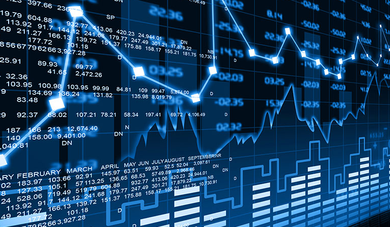

AI trading algorithms are not just a futuristic concept; they are here, reshaping the financial markets with their capacity to learn, adapt, and execute trades at a speed and volume unattainable by human traders.

An AI Trading Algorithm, at its core, is a set of programmed instructions designed to execute trades automatically based on input data. Unlike static algorithmic trading strategies, AI algorithms leverage the power of artificial intelligence, machine learning, and sometimes deep learning to digest vast amounts of market data, recognize complex patterns, predict market movements, and make decisions about when, how, and what to trade.

**👉 Trading is one of the fields where AI has been omnipresent for the longest time. See the many algorithmic trading strategies to be found in different fields: [Equities](https://wiki.paperswithbacktest.com/trading-strategies/equities), [Cryptocurrencies](https://wiki.paperswithbacktest.com/trading-strategies/cryptocurrencies), [Commodities](https://wiki.paperswithbacktest.com/trading-strategies/commodities), [Currencies](https://wiki.paperswithbacktest.com/trading-strategies/currencies), [Bonds](https://wiki.paperswithbacktest.com/trading-strategies/bonds), [Options](https://wiki.paperswithbacktest.com/trading-strategies/options).**

The financial landscape is increasingly embracing AI trading algorithms, acknowledging their role in enhancing market efficiency, liquidity, and the democratization of trading. From high-frequency trading firms to individual investors, AI algorithms are becoming indispensable tools for navigating the complexities of today's financial markets.

This article aims to unfold the intricate layers of AI trading algorithms, providing a clear, nuanced understanding of their mechanics and potential. It will demystify the science behind the systems and explore the strategies that are revolutionizing trading.

## Understanding AI Trading Algorithms

AI trading algorithms represent the zenith of computational finance, where machines imbued with artificial intelligence (AI) are programmed to carry out trading on financial markets. Unlike traditional algorithms that follow a set of static pre-defined rules, AI algorithms boast the ability to learn from data, identify patterns, adapt to new conditions, and make decisions with minimal human intervention.

The essence of an AI trading algorithm lies in its core components: machine learning models that can digest vast amounts of unstructured market data to predict market movements and execute trades based on probabilistic reasoning. These AI models range from simple linear regression used in predicting stock prices to complex neural networks modeled after human brain functions, capable of understanding intricate market dynamics.

The evolution of AI in trading is a narrative of progressive complexity and sophistication. Initial algorithmic strategies were rule-based, simple, and rigid, often leading to predictable and sometimes suboptimal market behaviors. As computational power surged and machine learning burgeoned, the financial industry witnessed a paradigm shift. Early systems could handle structured datasets and execute straightforward strategies like index fund rebalancing or arbitrage. Modern AI systems, however, parse and learn from new data in real-time, allowing for strategies that dynamically adjust to market conditions.

This transition from basic algorithmic to advanced AI trading has been spurred by data's explosive growth and the drive for competitive advantage in an increasingly complex market environment. Where traditional algorithms may falter in unpredictability, AI thrives, turning volatility and noise into opportunities for profit, thanks to its predictive analytics and adaptive learning capabilities.

These advanced AI trading systems have not just improved existing strategies but have also enabled new strategies that were previously unimaginable. They can simulate millions of trading scenarios, learn from market trends, and even understand sentiments expressed in news articles or financial reports, translating them into actionable trading decisions.

As we explore the realms of AI trading algorithms, it becomes evident that they are not just iterative improvements but revolutionary tools redefining the very fabric of financial trading.

## The Mechanics of AI Trading Algorithms

AI trading algorithms are the maestros of the financial orchestra, conducting trades with a precision and foresight that seems almost prescient. At their heart lies a complex mechanism that begins with data processing. These algorithms sift through terabytes of unstructured data — price movements, news articles, social media trends, economic reports — extracting relevant information that can influence market directions.

This is where pattern recognition comes into play. AI trading algorithms are adept at identifying patterns that are imperceptible to the human eye. Using historical data, they can detect recurring trends and anomalies, which feed into predictive models. These models forecast future market behavior with varying degrees of certainty, forming the basis upon which trading decisions are made.

The decision-making process in AI trading algorithms is a marvel of modern computing, combining several machine learning models to derive actionable trade signals. Neural networks, which mimic the human brain's interconnected neuron structure, are particularly prevalent. They can learn and improve over time, adjusting their internal parameters to better align predictions with actual market outcomes.

Deep learning, a subset of machine learning, takes this a step further by using complex neural networks with multiple layers (hence the 'deep' in deep learning) that enable the recognition of deeply embedded patterns within data. These advanced models can make sense of vast and varied datasets at a granular level, often leading to more nuanced and accurate market predictions.

## Benefits and Risks of AI Trading

The world of trading has been fundamentally altered by the integration of AI trading algorithms, which have brought unprecedented speed and efficiency to the markets. These powerful tools can process and analyze vast amounts of data far beyond human capability, delivering predictive insights that can lead to more informed and timely decisions. The power of AI lies in its ability to learn from data, identifying profitable trading opportunities, and executing trades at optimal moments, often within milliseconds.

However, the brilliance of AI trading is not without its shadows. **Overfitting** remains a significant risk, where an algorithm might perform exceptionally well on historical data but fails to generalize those findings to unseen market conditions. This can result in misleading predictions and potential losses. Market anomalies can also trip up AI systems, which may struggle to interpret events outside of their training data or recognize the significance of unprecedented events.

**Human oversight**, therefore, becomes an indispensable part of AI trading. It's essential to maintain a delicate balance where algorithms are monitored and guided by experienced traders. This symbiotic relationship ensures that the precision of AI is complemented by the nuanced understanding of a seasoned market player, creating a robust framework for trading that leverages the strengths of both artificial and human intelligence.

## AI Trading Strategies Explained

AI trading strategies have evolved to capitalize on various market dynamics, employing advanced algorithms that can adapt to changing conditions. One such strategy is **quantitative momentum**, which leverages statistical analysis to identify securities moving in a particular direction and capitalizes on the continuation of that movement. These algorithms analyze historical price data and market volumes to pinpoint trends that are likely to persist, allowing traders to enter and exit positions at pivotal moments to maximize gains.

Another cornerstone of AI trading is **mean reversion**, a strategy based on the assumption that prices and returns eventually move back towards the mean or average. This method is particularly effective in range-bound markets, where AI algorithms can detect deviations from a historical average price and trade on the expectation that prices will revert to that average over time.

**Sentiment analysis**, on the other hand, interprets market sentiment from various sources like news articles, social media, and financial reports to predict market movements. AI algorithms can process this vast and unstructured data, assessing the collective market emotions and positioning trades accordingly. For example, if the algorithm detects a predominately negative sentiment towards a particular stock, it might short sell that stock, predicting a potential decline in its price.

These strategies have been put into practice with notable success. One such case is an AI system that applied quantitative momentum to trade a basket of stocks, resulting in consistently above-average returns over a specified period. In another instance, an AI trading algorithm specializing in mean reversion successfully predicted price corrections in overvalued stocks, securing profits by executing timely trades. Meanwhile, sentiment analysis algorithms have been credited with predicting market turns during major economic events by gauging the mood and reactions of market participants.

## Market Analysis through AI

AI has significantly enhanced market analysis capabilities, transforming vast amounts of data into actionable insights more efficiently than humanly possible. AI excels at technical analysis, utilizing advanced algorithms to detect patterns and trends in market price data that might be indiscernible to the human eye. Through machine learning, these algorithms are continuously refined to identify profitable trading opportunities based on historical data.

In fundamental analysis, AI algorithms process **earnings reports**, **economic data**, and **news releases** to evaluate a company’s or asset's intrinsic value. They can sift through financial statements and relevant news faster than any human analyst, often providing a more nuanced analysis by combining quantitative data with qualitative information sources.

Sentiment analysis has also become a frontier where AI has a significant edge. By leveraging natural language processing (NLP), AI can gauge market sentiment from **social media chatter**, **news headlines**, and other textual data, enabling traders to understand the emotional dynamics that drive market movements.

When comparing AI's analytical capabilities with human traders, the speed and volume of data processing stand out as clear advantages for AI. While human traders can provide a nuanced understanding of context and may be adept at spotting outliers that AI might misinterpret as noise, AI offers a more comprehensive analysis by considering a multitude of factors simultaneously and adapting to new information in real-time.

## AI Across Markets

The application of AI trading strategies transcends various markets, leveraging the technology's unique ability to analyze and react to data rapidly. In the **stock market**, AI algorithms are used for price prediction, trading on earnings announcements, and even corporate event anticipation, such as mergers and acquisitions. They also assist in portfolio management, rebalancing based on real-time market movements to maintain risk profiles.

In the **forex market**, AI excels due to its capability to process and analyze the high volume of transactions and the influence of global events on currency values. AI trading systems can detect correlations and patterns between different currency pairs and economic indicators, making high-frequency trades in response to shifts in market sentiment.

**Commodity markets** also benefit from AI trading algorithms, particularly in predictive analytics for price fluctuations influenced by changes in supply, demand, and geopolitical factors. AI can analyze weather patterns, production data, and economic reports to make informed trades on commodities like oil, metals, and agricultural products.

**Cryptocurrencies** represent an exciting frontier for AI trading, where the technology thrives in an environment of high volatility and emerging patterns. AI trading bots are commonly used in this space to execute trades 24/7, capitalizing on opportunities that arise from social media trends and shifts in investor sentiment, often signaled by data points that traditional analysis would miss.

Across all these markets, AI's ability to process vast datasets and execute trades at speeds no human can match provides a significant edge. However, each market's unique characteristics require tailored AI strategies. For instance, the stock market's vast array of individual equities with complex interdependencies differs from the forex market's focus on currency pairs influenced by national economic indicators.

Commodities trading involves analyzing physical supply chains and consumption patterns, distinct from cryptocurrencies, which are heavily influenced by regulatory news and social media. Thus, AI systems are often specialized, designed to adapt to the particular data and trading rhythms of each market.

## Optimization and Limitations

Optimizing AI trading strategies is central to achieving a competitive edge in the financial markets. A pivotal aspect of optimization is the fine-tuning of machine learning algorithms, which involves adjusting the models to reduce error rates and improve predictive accuracy. Techniques like grid search, random search, and Bayesian optimization are commonly employed to systematically probe the hyperparameter space for optimal values, as detailed in the work of Bergstra et al. in "Algorithms for Hyper-Parameter Optimization."[1]

However, AI trading is not without its limitations. One of the most significant challenges is the risk of overfitting, where an algorithm may perform exceptionally well on historical data but fail to generalize to unseen market conditions. To counter this, practitioners use regularization techniques and validation methods to ensure the model's robustness. Another limitation is the model's susceptibility to market anomalies that can result in substantial losses if not anticipated. To mitigate such risks, AI models are often equipped with risk management protocols that can identify and adjust to these anomalies, such as rapid shifts in market sentiment or high-impact news events.

Furthermore, AI systems require vast amounts of quality data for training, which can be both expensive and difficult to procure. Incomplete or biased data can lead to skewed results, emphasizing the need for careful data curation. The computational complexity of AI models also poses challenges, necessitating powerful hardware and efficient algorithms to process data in a timely manner.

Despite these challenges, continuous advancements in computational power, data analysis techniques, and machine learning models are expanding the horizons for AI trading strategies. By acknowledging and addressing these limitations, traders can leverage AI to create sophisticated, adaptable, and robust trading strategies.

## Creating Your AI Trading Strategy

Creating your own AI trading strategy can seem daunting, but by breaking it down into manageable steps, the process becomes more accessible[2].

**Step 1: Define Your Objectives**
Start by clearly defining what you want to achieve with your AI trading algorithm. Are you focusing on short-term gains, risk reduction, diversification, or something else? Your objectives will guide the type of data you'll need and the machine learning models you'll use.

**Step 2: Selecting Data Sources**
Data is the lifeblood of AI trading strategies. You'll need historical price data, but you may also want to include volume, bid/ask spreads, and even macroeconomic data. High-quality, high-frequency, and clean data is crucial. Consider reputable sources like Bloomberg, Thomson Reuters, or Quandl for financial data.

**Step 3: Preprocessing Data**
Data rarely comes in a clean, algorithm-ready format. You'll need to preprocess it to handle missing values, outliers, and to create indicators that may serve as inputs for your models.

**Step 4: Choosing Machine Learning Models**
There's a wide range of machine learning models to choose from, each with its strengths. Neural networks are great for capturing non-linear relationships, while decision trees can be more interpretable. Start with simpler models, and as you gain confidence, you can experiment with more complex ones like deep learning.

**Step 5: Feature Engineering**
This involves transforming raw data into features that better represent the underlying problem to the predictive models. Features could include moving averages, oscillators, or even sentiment scores from news articles.

**Step 6: Model Training**
Using historical data, you train your model to recognize patterns and make predictions. This process involves adjusting the model parameters to minimize prediction error. Ensure you avoid overfitting by validating the model's performance on out-of-sample data.

**Step 7: Backtesting**
Backtesting involves running your model against historical data to see how it would have performed. This step is critical to understand the potential effectiveness of your strategy.

**Step 8: Optimization**
Based on backtesting results, you'll likely need to tweak your model. This could involve changing the features, adjusting model parameters, or even selecting a different model entirely.

**Step 9: Forward Testing**
Also known as paper trading, forward testing allows you to test your strategy in real-time with live data without risking actual capital.

**Step 10: Deployment**
Once you're confident in your strategy's robustness, you can start trading with real capital. Start small and scale up as you become more comfortable with the model's performance in live markets.

## Automation in AI Trading

The realm of fully automated AI trading strategies is one where machines execute trades based on criteria set by their human programmers, without the need for further human input. The primary advantages of such a system include the elimination of emotional decision-making, the ability to process vast amounts of data at speeds unattainable by humans, and the operation of trading strategies 24/7 without fatigue. These systems can identify opportunities and execute trades in fractions of a second, a pace that is impossible for a human trader to match, leading to potential efficiency gains and the possibility of exploiting short-lived market inefficiencies.

However, the automation of trading strategies is not without its disadvantages. Overfitting remains a risk, where an algorithm performs exceptionally well on historical data but fails to predict future market conditions accurately. Additionally, fully automated systems may struggle to interpret context that a human trader would understand intuitively, such as geopolitical events or shifts in market sentiment that haven't yet been reflected in the data. This limitation can lead to significant losses if the system doesn't adapt or pause in response to such events.

The balance between automation and human intervention is therefore crucial. While automation can handle repetitive tasks and process data with superior efficiency, human oversight is necessary to navigate the nuances of market dynamics that AI may misinterpret or overlook. Human traders can intervene to override or adjust AI decisions, taking into account the broader context that machines currently cannot fully grasp.

## Testing and Best Practices

Testing AI trading strategies is a critical component of the development process, ensuring that the model performs well not only on historical data but also under various market conditions. Backtesting is the first step, where the strategy is tested using historical data to simulate how it would have performed in the past. This requires a robust simulation of past markets, including realistic transaction costs, market impact, and liquidity constraints. The backtest should also account for the likelihood of extreme market events, often referred to as stress testing.

Best practices in **backtesting** include using out-of-sample data to validate the strategy, avoiding look-ahead bias where the strategy has access to information not available at the time of trade, and not overfitting the model to historical data such that it becomes too tailored to past events to be useful for future predictions.

**Forward-testing**, or paper trading, is where the strategy is applied to live market data, executing trades in simulation without real money. This step is crucial as it allows the developer to understand how the strategy would perform in real-time without the risk. It can reveal issues not apparent in backtesting, such as execution slippage or real-time data integrity problems[3].

## Monitoring and Updating AI Strategies

Monitoring and updating AI trading strategies is crucial to maintaining their effectiveness in dynamic financial markets. Real-time monitoring tools are vital for tracking the performance of AI algorithms, ensuring they operate within expected parameters and identifying any deviations that may signal a need for intervention. These tools can include custom dashboards that display live trading metrics, automated alerts for performance anomalies, and integration with market data feeds to monitor for significant events that could impact trading conditions.

Continual updates and refinements are equally important. Financial markets evolve, and AI strategies that aren't updated may become less effective over time. This involves retraining the AI models with new data, fine-tuning parameters, and even redesigning the strategy if market conditions have changed significantly. The key is to maintain a balance between stability and adaptability—frequent changes can lead to instability, while infrequent updates can cause obsolescence.

To implement these updates effectively, a version control system for algorithms can be useful to track changes and manage multiple variations of strategies. Additionally, employing a rigorous testing environment for any updates before they are deployed to the live trading system can mitigate the risk of unexpected issues.

## Latest Developments and Future Outlook

The landscape of AI trading is rapidly advancing, with the latest developments focusing on enhanced machine learning models, greater data processing capabilities, and the incorporation of alternative data into trading algorithms. For instance, reinforcement learning, an area of machine learning inspired by behavioral psychology, is gaining traction in creating algorithms that learn to make decisions by interacting with a dynamic environment. This is particularly relevant for trading, where markets are continuously fluctuating.

Another significant development is the use of **natural language processing** (NLP) to interpret news, social media, and financial reports to gauge market sentiment and make predictive models more responsive to real-world events. The integration of quantum computing into financial trading is also on the horizon, promising the ability to process complex trading algorithms at unprecedented speeds.

Looking ahead, the future of AI trading is poised to be shaped by the increasing availability of **big data** and the continuous improvement of computational power. AI algorithms will likely become more autonomous, with the ability to self-adjust in real-time to changing market conditions. There's also a trend towards more transparent AI models that provide insights into their decision-making processes, aiding regulatory compliance and trust among users.

As for potential breakthroughs, the industry might see the rise of AI that can simulate trading markets internally to create countless hypothetical scenarios and strategies, offering a sort of '**evolutionary**' approach to algorithm development. Additionally, collaborative AI, where multiple AI systems share insights and learn from each other, could significantly enhance predictive accuracy and decision-making speed.

## AI Trading for Beginners

For beginners eager to explore AI trading, the journey starts with education. Acquire a foundational understanding of financial markets, trading principles, and basic algorithmic trading concepts before delving into AI-specific topics. Online courses, such as those offered by Coursera or Udemy, can be valuable resources. They often cover the basics of machine learning and its application in trading.

Once you have a grounding in the basics, practice coding in languages commonly used in AI trading, like Python, which has libraries specifically designed for data analysis and machine learning such as pandas, NumPy, and scikit-learn. Open-source trading platforms like Zipline or Backtrader allow you to develop and backtest trading strategies with historical data.

Simulation tools are also crucial for practice. Paper trading platforms enable you to test your AI trading algorithms without financial risk. Many brokerage firms offer such tools, replicating the real-world market experience with virtual money. This practice will help you understand the behavior of your algorithm under live market conditions.

Additionally, engaging with communities on platforms like QuantConnect can provide support and insight as you build and refine your AI trading strategies. These communities often share strategies, offer feedback, and provide a way to test your algorithms in competitions[4].

## Advanced Topics for Seasoned Traders

Seasoned traders looking to deep dive into advanced AI trading topics can explore deep learning and neural networks to analyze complex patterns within vast datasets. Deep learning, particularly with convolutional and recurrent neural network architectures, has shown promise in predicting stock market trends and price movements by processing sequential data for patterns over time.

Collaborative AI/human trading strategies are emerging as a sophisticated approach. These strategies combine the computational power of AI with the nuanced understanding of human traders. The AI component can manage data-intensive tasks, while the human element applies contextual judgment to adjust strategies in response to unforeseen events.

Optimizing and fine-tuning AI trading strategies involve rigorous testing, including **sensitivity analysis** to understand how different input variables affect trading outcomes. Regularly updating the models to incorporate new data and adjusting for market changes is essential to maintain an edge. Traders should also consider **ensemble methods** that combine the predictions of various models to improve accuracy and reduce the risk of overfitting.

## Risk Management in AI Trading

Risk management in AI trading is paramount, as the speed and complexity of algorithms can amplify both gains and risks. A comprehensive risk management strategy for AI trading includes setting limits on trade sizes, imposing maximum daily loss thresholds, and implementing kill switches that halt trading if certain risk parameters are breached. It is also crucial to diversify trading strategies to spread risk across different assets and market conditions.

Automated risk controls are typically integrated into AI trading systems. These controls are designed to monitor positions and market conditions in real-time, automatically reducing or closing positions if the market moves against them or if volatility spikes. They can also adjust leverage based on the algorithm's current performance and historical market conditions.

Developing contingency plans involves preparing for scenarios such as system failures, market crashes, or other extraordinary events. This includes having backup systems in place, ensuring proper failover mechanisms are operational, and having manual intervention procedures clearly outlined for times when automated systems need to be overridden.

## Performance Metrics and Strategy Adjustments

Key performance metrics for evaluating AI trading algorithms include the Sharpe ratio, which measures risk-adjusted returns; the maximum drawdown, which assesses the largest single drop from peak to bottom in the value of a portfolio; and the Sortino ratio, similar to the Sharpe ratio but focusing only on downside volatility. Other vital metrics are the win-to-loss ratio, the percentage of winning trades versus losing trades; and the expectancy, which calculates the average amount one can expect to win (or lose) per trade.

Adjusting strategies based on these metrics often involves a careful analysis of the algorithm's performance over time. Techniques for making adjustments include optimizing parameters such as entry/exit thresholds, stop-loss levels, and position sizes. Rebalancing the portfolio in response to changing market conditions, retraining the algorithm with new data to prevent overfitting, and conducting periodic reviews to compare algorithm performance against benchmark indices are also essential practices.

For a thorough understanding of these metrics and the adjustment techniques, "Quantitative Trading: How to Build Your Own Algorithmic Trading Business" by Ernest P. Chan provides both the theoretical underpinnings and practical advice on how to evaluate and refine trading strategies. This resource is invaluable for traders who wish to apply scientific methods to their trading practices[[5].

## Conclusion

The transformative potential of AI trading algorithms is not just a projection—it's an ongoing revolution. These sophisticated systems can analyze vast datasets, adapt to new information, and execute trades at speeds and volumes far beyond human capabilities. They're changing the face of financial markets, making them more efficient, and in many ways, more competitive.

Embracing the evolution of AI in trading means recognizing the power of machine learning models and their ability to predict market movements with a level of accuracy previously unseen. It's about understanding the significance of real-time data processing and the edge that sophisticated pattern recognition can provide.

However, the landscape is complex and ever-changing. It requires a commitment to continuous learning and adaptation. For traders, both novice and experienced, the call to action is clear: educate yourselves on the nuances of AI trading, engage with the technology, and consider how its integration into your trading strategies could be advantageous.

💡 **Read more:**

- Trading strategies papers with code on [Equities](https://wiki.paperswithbacktest.com/trading-strategies/equities), [Cryptocurrencies](https://wiki.paperswithbacktest.com/trading-strategies/cryptocurrencies), [Commodities](https://wiki.paperswithbacktest.com/trading-strategies/commodities), [Currencies](https://wiki.paperswithbacktest.com/trading-strategies/currencies), [Bonds](https://wiki.paperswithbacktest.com/trading-strategies/bonds), [Options](https://wiki.paperswithbacktest.com/trading-strategies/options)
- [A curated list](https://github.com/paperswithbacktest/awesome-systematic-trading) of awesome libraries, packages, strategies, books, blogs, and tutorials for systematic trading
- [A bunch of datasets](https://huggingface.co/paperswithbacktest) for quantitative trading
- [A website to help you](https://paperswithbacktest.com/) become a quant trader and achieve financial independence

## References & Further Reading

[1]: Bergstra, J., Bardenet, R., Bengio, Y., & Kégl, B. (2011). ["Algorithms for Hyper-Parameter Optimization."](https://papers.nips.cc/paper_files/paper/2011/hash/86e8f7ab32cfd12577bc2619bc635690-Abstract.html) Advances in Neural Information Processing Systems 24.

[2]: ["Advances in Financial Machine Learning"](https://www.amazon.com/Advances-Financial-Machine-Learning-Marcos/dp/1119482089) by Marcos Lopez de Prado

[3]: ["Evidence-Based Technical Analysis: Applying the Scientific Method and Statistical Inference to Trading Signals"](https://www.wiley.com/en-gb/Evidence+Based+Technical+Analysis:+Applying+the+Scientific+Method+and+Statistical+Inference+to+Trading+Signals-p-9780470008744) by David Aronson

[4]: ["Machine Learning for Algorithmic Trading"](https://www.amazon.com/Machine-Learning-Algorithmic-Trading-intelligence/dp/9918608013) by Stefan Jansen

[5]: ["Quantitative Trading: How to Build Your Own Algorithmic Trading Business"](https://www.amazon.com/Quantitative-Trading-Build-Algorithmic-Business/dp/0470284889) by Ernest P. Chan