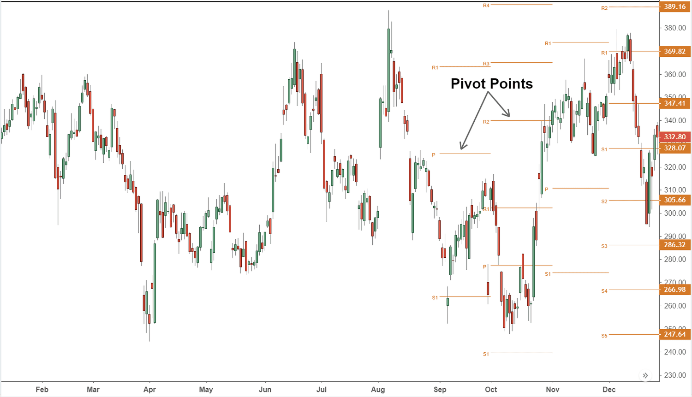

In the ever-evolving world of finance, understanding stock market terminology is crucial for investors. The stock market is a complex ecosystem where numerous factors influence the dynamics of asset prices and investment decisions. Among these factors, key concepts such as air pocket stocks and algorithmic trading play significant roles in shaping market behaviors and trends.

Air pocket stocks refer to situations where individual stock prices or the broader market experience sudden, precipitous drops due to unforeseen negative news. This phenomenon is akin to an aircraft encountering an air pocket, leading to a rapid descent. Such incidents can be alarming but often present opportunities for astute investors to reassess and buy at lower prices.



On the other hand, algorithmic trading involves the use of sophisticated mathematical models and algorithms to execute trades at high speeds based on predefined criteria. This method leverages computational power to process information quickly, providing both speed and efficiency in executing trades. However, it can also amplify market movements and contribute to volatility, especially during abrupt stock price changes like those seen in air pocket scenarios.

This article aims to demystify these terms, providing insights into their implications and how they interact in the broader financial landscape. By exploring the intricacies of air pocket stocks and algorithmic trading, we aim to equip investors with a deeper understanding of these critical concepts and their impact on market dynamics. As we navigate the intricate world of stock market investment terminology, we acknowledge the importance of continuous learning and adaptation to keep pace with the ever-changing financial environment.

## Table of Contents

## Understanding Air Pocket Stocks

Air pocket stocks are characterized by an abrupt and pronounced decline in their market price, akin to the sensation an airplane experiences when it hits an air pocket and momentarily drops. This phenomenon typically results from unforeseen adverse news that negatively impacts investor perception and confidence in a particular stock. The sudden descent in stock valuation can be attributed to several factors, including disappointing earnings reports, shifts in market sentiment, and certain technical indicators that signal potential downturns.

Negative earnings reports are significant triggers for air pocket stocks. When a company fails to meet or exceed market expectations regarding its financial performance, the immediate response from investors is often to sell off shares, leading to a precipitous drop in stock prices. Such reactions are frequently magnified by market sentiment, as the prevailing mood among investors can exacerbate the speed and magnitude of the stock's decline. For instance, if the wider market sentiment is already bearish, the impact of an earnings miss can be significantly more severe.

Technical indicators also play a crucial role in the emergence of air pocket stocks. Traders often rely on technical analysis to make investment decisions, and certain indicators, such as moving averages or trend lines, can signal the potential for a stock to lose value rapidly. Once these technical indicators suggest a downward trend, it can lead to a self-fulfilling prophecy, as [algorithmic trading](/wiki/algorithmic-trading) systems programmed to follow these indicators pick up on the signals and initiate sell orders automatically.

Despite their dramatic nature, air pocket stocks can present lucrative opportunities for astute investors. The sharp price declines can render these stocks undervalued in the short term, offering a potential entry point for investors with a thorough understanding of the stock's fundamental value. Those adept at analyzing market fundamentals can differentiate between an unjustified panic-induced sell-off and a legitimate long-term decline in stock value. This capability allows them to capitalize on short-term market inefficiencies, buying into stocks at a steep discount and potentially reaping significant returns when the market corrects itself.

In summary, while air pocket stocks can be daunting and often lead to apprehension among investors, they also offer unique opportunities to buy high-potential stocks at reduced prices. Understanding the triggers and characteristics of air pocket stocks can aid investors in navigating these tumultuous situations and leveraging them for potential gains.

## Algorithmic Trading and Its Impact

Algorithmic trading involves the use of sophisticated algorithms to automatically execute trades based on specific pre-programmed criteria, such as timing, price, or [volume](/wiki/volume-trading-strategy). This approach leverages computational power to perform tasks that would be challenging and time-consuming for human traders, such as analyzing multiple markets and executing trades at optimal timings.

One of the key impacts of algorithmic trading is its ability to amplify market movements. This occurs when algorithms trigger rapid buying or selling actions in response to market conditions, thus exacerbating price changes. For instance, during periods of high [volatility](/wiki/volatility-trading-strategies) or unexpected market news, algorithmic trading systems may identify trends and react in milliseconds, leading to intensified market fluctuations. This can be particularly observed in scenarios involving air pocket stocks, where swift price declines are further accelerated by automated sell orders.

While the speed and efficiency of algorithmic trading can enhance market [liquidity](/wiki/liquidity-risk-premium) and execution speeds, it also contributes to market volatility. Algorithms programmed with specific threshold triggers can initiate large volumes of trades, resulting in swift price swings. This is especially evident during air pocket events, where algorithmic trading can escalate sell-offs as systems react to price drops, potentially leading to a feedback loop of volatility.

Understanding algorithmic trading is crucial for navigating modern financial markets. Investors must recognize how these systems function and their potential effects on market dynamics. It is vital for market participants to comprehend the algorithms' decision processes and the criteria under which they operate. Additionally, investors should be aware of the regulatory frameworks governing algorithmic trading to manage risks effectively.

To further illustrate the impact of algorithmic trading, consider the use of python in implementing a simple moving average crossover strategy:

```python
import numpy as np
import pandas as pd

# Example price data
data = {'prices': [100, 102, 101, 103, 107, 110, 115, 113, 118, 120]}
df = pd.DataFrame(data)

# Calculate short-term and long-term moving averages
df['short_mavg'] = df['prices'].rolling(window=3).mean()
df['long_mavg'] = df['prices'].rolling(window=5).mean()

# Generate buy and sell signals
df['signal'] = 0
df['signal'][2:] = np.where(df['short_mavg'][2:] > df['long_mavg'][2:], 1, 0)  # Buy when short_mavg crosses above long_mavg
df['positions'] = df['signal'].diff()

print(df)
```

In this example, the `short_mavg` and `long_mavg` represent short-term and long-term moving averages, respectively. Trading signals are generated when the short-term average crosses the long-term average, prompting buy or sell decisions. Although this is a simplistic illustration, algorithmic trading systems can execute much more complex and high-frequency strategies. Understanding these mechanics empowers investors to better anticipate and manage the impact of algorithmic trading on their investment portfolios.

## The Interplay Between Air Pocket Stocks and Algo Trading

Algorithmic trading, characterized by the deployment of complex algorithms to execute trades automatically, plays a significant role in the behavior of air pocket stocks. This automated trading can intensify the impact of air pocket stocks by initiating rapid buy or sell orders in response to sudden price movements. When a stock experiences a sudden drop, algorithms may automatically trigger sell orders, intensifying the decline through increased selling pressure. Such mechanisms can result in a feedback loop where falling prices trigger more sell orders, leading to further declines.

One common algorithmic strategy that can impact air pocket stocks is the use of stop-loss orders. Stop-loss orders are set by traders to automatically sell a security when its price falls to a predetermined level. While designed to limit potential losses, during an air pocket event, these orders can contribute to a cascade effect. As the price of a stock drops, stop-loss orders may be triggered en masse, leading to increased market sell-offs and further downward pressure on the stock's price. This chain reaction of selling can cause prices to fall more sharply than they might in the absence of algorithmic influences.

Historical case studies provide insight into the interaction between algorithmic trading and air pocket stocks. For example, the "Flash Crash" of May 6, 2010, is often cited as a prominent instance where algorithmic trading exacerbated a rapid market decline. During this event, the Dow Jones Industrial Average plunged nearly 1,000 points within minutes, largely due to high-frequency trading algorithms executing trades at a rapid pace. The crash highlighted how algorithmic trading mechanisms, lacking human oversight in fast-moving markets, can amplify sudden price movements, transforming minor disturbances into major market events.

To understand the mechanics of how algorithmic trading can affect air pocket stocks, consider a simplified example using Python. 

```python
import numpy as np

# Simulating an air pocket event with algorithmic trading influence

# Initial stock price
stock_price = 100  

# Price drop percentage indicative of an air pocket
price_drop_threshold = 0.05  

# Simulating the price impact of triggered stop-loss orders
def simulate_price_drop(initial_price, impact_factor, iterations):
    prices = [initial_price]
    for _ in range(iterations):
        drop = np.random.normal(loc=impact_factor, scale=0.01)
        new_price = prices[-1] * (1 - drop)
        prices.append(new_price)
    return prices

# Applying the function to simulate an air pocket event
price_impact = simulate_price_drop(stock_price, price_drop_threshold, 10)
print(price_impact)
```

In this example, a basic simulation demonstrates how a price drop can be incrementally exacerbated by algorithmic trading, illustrating the potential for an initial dip to trigger successive automated responses. Understanding the interplay between algorithmic trading and air pocket stocks is essential for investors and regulatory bodies to manage risks and maintain market stability effectively.

## Investor Strategies in Dealing with Air Pocket Stocks

Diversification is a fundamental strategy for investors aiming to mitigate the risks associated with air pocket stocks. By spreading investments across various asset classes, sectors, or geographic regions, investors can reduce the impact of a single stock's adverse performance on their overall portfolio. This strategy minimizes specific risks that affect only certain stocks or industries.

For instance, portfolio diversification might include a mix of stocks, bonds, real estate, and commodities. If one sector underperforms due to an air pocket event, the well-diversified investor can be insulated by gains or stability in other segments of their portfolio. Mathematically, diversification aims to lower portfolio variance, $\sigma^2_p$, defined as:

$$
\sigma^2_p = \sum_{i=1}^N w_i^2 \sigma_i^2 + \sum_{i=1}^N \sum_{j=1, j \neq i}^N w_i w_j \sigma_i \sigma_j \rho_{ij}
$$

where $w_i$ is the weight of the asset, $\sigma_i$ is the standard deviation, and $\rho_{ij}$ is the correlation between assets $i$ and $j$.

Investors can also employ stop-loss orders to safeguard against sudden price declines typical of air pocket situations. A stop-loss order automatically sells a security when its price falls to a predetermined level, thereby capping potential losses without requiring real-time decision-making. This automated strategy is especially useful in scenarios where algorithmic trading exacerbates price volatility, leading to rapid market movements.

Thorough research and a disciplined approach further aid investors in navigating times of volatility. Fundamental analysis of a company's financial health, earnings potential, and industry position, alongside technical analysis of price charts and market trends, can better prepare investors to weather volatile periods. Investors should set clear investment goals and adhere to a long-term strategy, avoiding emotional decisions driven by market fluctuations.

In air pocket events, astute investors may recognize buying opportunities, as prices can drop irrationally in the short term. Capitalizing on these opportunities requires a deep understanding of both market fundamentals and trading technologies. Staying informed about the latest financial tools and algorithmic patterns allows investors to make strategic decisions, optimizing entry and [exit](/wiki/exit-strategy) points during turbulent market phases.

Ultimately, effectively managing air pocket stock risks involves a mix of diversification, strategic tools like stop-loss orders, comprehensive market analysis, and leveraging technological advancements. By adopting these strategies, investors can improve their resilience and capitalize on potential market disruptions.

## Regulatory Perspectives and Measures

Regulatory bodies worldwide play a critical role in maintaining stock market integrity, especially during the occurrence of air pocket stocks. These sudden and significant drops in stock prices can lead to market instability if not adequately managed. To mitigate the risks associated with such events, regulators employ several mechanisms, including trading halts and circuit breakers, which are essential tools designed to temporarily pause trading on an exchange to prevent panic-induced selling.

Trading halts are a tactical response employed by exchanges in reaction to large, rapid market declines. These halts can occur due to a variety of triggers, such as significant news releases, unusual market activity, or breaches in established price bands. By pausing trading, exchanges provide investors the necessary time to assimilate information more fully, reducing the potential for hasty, emotionally-driven decisions that could exacerbate market volatility.

Circuit breakers, on the other hand, are pre-defined points used to curb trading by halting exchange activity. These are set at various trigger thresholds, typically defined as percentage declines in major market indices. For example, according to the U.S. Securities and Exchange Commission, these circuit breakers come into play when the S&P 500 index drops by 7% (Level 1), 13% (Level 2), and 20% (Level 3) from the previous day's close. Upon reaching these levels, trading is paused for a specified time across all equity markets, providing a market-wide stabilization mechanism.

It is imperative for investors to understand these regulatory mechanisms, as they can prevent impulsive decisions during turbulent phases. Familiarity with trading halts and circuit breakers can help investors develop strategies to protect their portfolios against market volatility. Moreover, awareness of these measures equips investors with the knowledge necessary to navigate the complex interactions between air pocket stocks and the broader market system effectively.

In summary, through these regulatory measures, authorities aim to maintain a stable and orderly market environment, safeguarding investors against the severe repercussions of market turmoil.

## The Future of Stock Market Dynamics

As technology continues to advance, the nature of trading and market dynamics will inevitably transform. Emerging trends such as blockchain and Artificial Intelligence (AI) hold the potential to redefine the interaction between air pocket stocks and algorithmic trading. Blockchain technology, known for its decentralized and secure nature, can introduce new levels of transparency and efficiency in trading operations. By providing a tamper-proof ledger of transactions, blockchain can reduce fraud and ensure the integrity of trade data, potentially minimizing abrupt price drops characteristic of air pocket stocks.

Meanwhile, AI's ability to process vast amounts of data and identify patterns can enhance the predictive accuracy of trading algorithms. Machine learning techniques can detect market trends and anomalies with greater precision, aiding in the anticipation of air pocket events. For example, using historical data, AI systems can be trained to recognize the precursors of a sudden stock drop, thereby allowing for more proactive trading strategies.

The synthesis of blockchain and AI could also lead to the development of smart trading systems that not only execute trades based on predefined criteria but can adapt to changing market conditions. Such systems could help to mitigate the exacerbation of air pocket effects by algorithms through dynamic adjustments of trading strategies in real-time.

To ensure future-proof investing, it is crucial for investors to stay informed about these technological advancements. Continuous education and adaptation to new tools and methodologies will enable investors to navigate the evolving landscape of stock market dynamics effectively. The ability to leverage new technologies could provide a competitive edge in predicting and responding to market shifts, thus enhancing overall investment strategies.

## Conclusion

In the complex landscape of stock market investing, having a firm grasp of key terminologies is essential for making informed decisions. Air pocket stocks and algorithmic trading, two critical concepts in the financial world, are intricately interconnected and significantly shape market behavior and investor strategies. Air pocket stocks, known for their sudden and dramatic price declines, often arise from unanticipated news or events. These volatile movements can be further intensified by algorithmic trading, where predetermined algorithms may trigger rapid buying or selling, sometimes exacerbating price fluctuations.

Algorithmic trading, with its efficiency and speed, has revolutionized how markets operate, yet it also introduces new layers of complexity and potential volatility. As such, investors must constantly update their understanding of market mechanics and the tools available to navigate them. Continuous learning and adaptation are crucial in staying ahead, as the financial landscape consistently evolves with technological advancements and regulatory changes. Understanding the interconnectedness of these terms not only aids in risk management but also in identifying potential opportunities within the ever-dynamic financial markets.

## References & Further Reading

[1]: Kirilenko, A. A., Kyle, A. S., Samadi, M., & Tuzun, T. (2017). ["The Flash Crash: The Impact of High-Frequency Trading on an Electronic Market."](https://www.jstor.org/stable/26652722) The Journal of Finance, 72(3), 967-998.

[2]: Aldridge, I. (2013). ["High-Frequency Trading: A Practical Guide to Algorithmic Strategies and Trading Systems."](https://onlinelibrary.wiley.com/doi/pdf/10.1002/9781119203803.fmatter) Wiley.

[3]: Patterson, S. (2012). ["Dark Pools: The Rise of the Machine Traders and the Rigging of the U.S. Stock Market."](https://www.amazon.com/Dark-Pools-Machine-Traders-Rigging/dp/0307887189) Crown Business.

[4]: Hendershott, T., Jones, C. M., & Menkveld, A. J. (2011). ["Does Algorithmic Trading Improve Liquidity?"](https://onlinelibrary.wiley.com/doi/full/10.1111/j.1540-6261.2010.01624.x) American Economic Review, 101(7), 3260-3290.

[5]: Chan, E. (2009). ["Quantitative Trading: How to Build Your Own Algorithmic Trading Business."](https://github.com/ftvision/quant_trading_echan_book) Wiley.