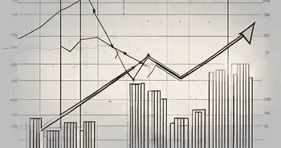

## Table of Contents

## What are air pocket stocks?

Air pocket stocks are stocks that experience a sudden drop in price, often due to unexpected bad news or market reactions. This drop can feel like hitting an air pocket while flying, where the plane suddenly drops, causing a feeling of weightlessness. Investors might see the value of their stocks fall quickly, which can be scary and lead to panic selling.

These stocks can recover if the company addresses the issues causing the drop, or if the market stabilizes. However, it's important for investors to stay calm and not make hasty decisions. Understanding why the stock fell and looking at the company's overall health can help decide whether to hold onto the stock or sell it. Keeping a long-term perspective is key when dealing with air pocket stocks.

## How do air pocket stocks differ from other types of stocks?

Air pocket stocks are different from other stocks because they go through big, sudden price drops. These drops happen fast and can surprise investors. It's like when you're on a plane and it suddenly drops because of an air pocket. Other stocks might go up and down slowly over time, but air pocket stocks can lose value quickly because of bad news or other unexpected events.

Unlike regular stocks, air pocket stocks can make investors feel scared and unsure. When the price drops a lot, people might start selling their stocks quickly, which can make the price drop even more. Regular stocks usually don't have these big, sudden changes. They might go up or down, but it's usually more gradual. With air pocket stocks, it's important to stay calm and think about the company's future before deciding to sell or keep the stock.

## What causes an air pocket in the stock market?

An air pocket in the stock market happens when a stock's price suddenly drops a lot. This can be because of bad news about the company, like a big loss or a problem with their products. It can also happen because of things happening in the world, like a war or a big change in the economy. When this bad news comes out, people start selling their stocks quickly, which makes the price fall even more.

Sometimes, the price drop can be because of rumors or just because a lot of people are selling at the same time. This can make the stock feel like it's falling through the air, just like a plane hitting an air pocket. It's important for investors to not panic and to think about the company's future before deciding what to do with their stocks.

## Can you provide examples of air pocket stocks?

One example of an air pocket stock is when a big company like Enron suddenly lost a lot of value in 2001. Enron was a big energy company, but people found out they were hiding how much money they were losing. When this news came out, the stock price dropped very fast. People who owned Enron stock lost a lot of money because they didn't expect this to happen.

Another example is when the stock of a company called Lehman Brothers fell a lot in 2008. Lehman Brothers was a big bank, but they had a lot of bad loans. When the economy started to have problems, people realized Lehman Brothers was in trouble. The stock price went down very quickly, and the company even went bankrupt. This was a big shock to investors who thought Lehman Brothers was safe.

## How can investors identify potential air pocket stocks?

Investors can spot potential air pocket stocks by watching the news about the companies they own. If there's talk about a company having big problems, like losing a lot of money or having issues with their products, it might be a sign that the stock could drop suddenly. It's also important to look at how the company is doing compared to others in the same industry. If a company is doing much worse than its competitors, it could be at risk of an air pocket.

Another way to identify these stocks is by paying attention to how the stock has been moving. If the price has been going up a lot very quickly, it might be more likely to fall fast if bad news comes out. Investors should also keep an eye on the overall market. If the market is feeling nervous or if there are big changes happening in the world, like a war or a big economic change, stocks might be more likely to have an air pocket. By staying informed and watching these signs, investors can be ready for sudden drops in stock prices.

## What are the risks associated with investing in air pocket stocks?

Investing in air pocket stocks can be risky because the price can drop suddenly and a lot. This can happen because of bad news about the company or big changes in the world. When the price falls, investors can lose a lot of money quickly. If many people start selling their stocks at the same time, it can make the price drop even more. This can be scary and might make investors want to sell their stocks in a panic, which could lead to even bigger losses.

Another risk is that it can be hard to predict when an air pocket will happen. Even if a company looks good now, unexpected problems can come up and cause the stock price to fall. This unpredictability can make it hard for investors to know when to buy or sell the stock. It's important for investors to stay calm and think about the long-term health of the company before making any decisions. By understanding these risks, investors can be better prepared to handle the ups and downs of air pocket stocks.

## What strategies can be used to mitigate risks when investing in air pocket stocks?

One way to lower the risks of investing in air pocket stocks is to spread out your money. Instead of putting all your money into one stock, you can invest in different stocks or even different types of investments like bonds or real estate. This way, if one stock suddenly drops a lot, you won't lose all your money. It's like not putting all your eggs in one basket. By spreading out your investments, you can protect yourself from big losses if an air pocket happens.

Another strategy is to stay informed and keep a long-term view. Pay attention to news about the companies you invest in and the overall market. If you hear about problems that could cause a stock to drop, you might want to sell some of your shares or not buy more. But don't panic and sell everything right away. Think about the company's future and whether it can recover from the problems. Sometimes, a stock that drops a lot can go back up if the company fixes its issues. By staying calm and looking at the big picture, you can make better decisions and reduce the risks of air pocket stocks.

## How do air pocket stocks impact the overall market?

When air pocket stocks happen, they can shake up the whole market. If a big company's stock suddenly drops a lot, it can make people worried about other stocks too. They might start selling their other stocks, thinking that the same thing could happen to them. This can cause the prices of many stocks to go down, making the whole market feel shaky. It's like when one person starts running in a crowd, and soon everyone is running too, even if they don't know why.

But air pocket stocks don't always affect the whole market in a big way. If the company that has the air pocket is small or if the problem is specific to that company, the impact might not spread much. People might see it as a one-time thing and not get too worried. Still, it's a good reminder for everyone to be careful and think about what could go wrong with their investments. By staying calm and looking at the big picture, investors can handle these sudden drops better and keep the market from getting too wild.

## What role do economic indicators play in the formation of air pocket stocks?

Economic indicators can help show when air pocket stocks might happen. These indicators are like signs that tell us how the economy is doing. If these signs show that the economy is getting weaker, like if more people are losing their jobs or if prices are going up a lot, it can make investors worried. When investors are worried, they might start selling their stocks, which can cause the price of some stocks to drop suddenly. This is how bad economic news can lead to air pocket stocks.

But economic indicators can also help investors be ready for air pocket stocks. If investors keep an eye on these signs, they can see trouble coming and maybe sell their stocks before the price drops a lot. Or they might decide to keep their stocks if they think the company can handle the economic problems. By understanding economic indicators, investors can make smarter choices and protect their money from big, sudden losses.

## How can advanced technical analysis help in predicting air pocket stocks?

Advanced technical analysis can help investors spot air pocket stocks by looking at charts and patterns. These tools can show how a stock has been moving over time. If a stock has been going up a lot very quickly, it might be more likely to have an air pocket. Technical analysis can also show when a stock is overbought, which means a lot of people have bought it and the price might be too high. If the price starts to drop after being overbought, it could be a sign that an air pocket is coming.

By using technical indicators like moving averages and the Relative Strength Index (RSI), investors can see when a stock might be about to drop suddenly. Moving averages can show the general direction of the stock's price, and if the price starts to fall below these averages, it might be a warning sign. The RSI can tell if a stock is overbought or oversold. If the RSI is very high and then starts to go down, it could mean the stock is about to have an air pocket. By keeping an eye on these technical signs, investors can be ready for sudden drops and make better decisions about their investments.

## What are the historical trends of air pocket stocks and their recovery patterns?

Over the years, air pocket stocks have shown some common patterns. When a stock suddenly drops a lot, it often happens because of bad news about the company or big changes in the world. For example, when Enron had big problems in 2001, its stock price fell very fast. Another time was when Lehman Brothers went bankrupt in 2008, causing its stock to drop a lot. These sudden drops can make investors feel scared and start selling their stocks, which can make the price fall even more. But not all air pocket stocks are the same. Some happen because of problems with just one company, while others can be because of bigger economic issues.

The recovery of air pocket stocks can be different each time. Sometimes, a stock can bounce back if the company fixes its problems. For example, after a big drop, a company might change its leaders or find new ways to make money, which can help the stock price go up again. But sometimes, the stock might not recover if the problems are too big or if the company goes out of business. It's hard to predict how long it will take for a stock to recover, but usually, it depends on how the company handles the bad news and how the overall market is doing. Investors who stay calm and look at the big picture can sometimes make good choices about whether to keep their stocks or sell them.

## How do global economic events influence the occurrence and severity of air pocket stocks?

Global economic events can make air pocket stocks happen more often and make them worse. When big things happen around the world, like a war or a big change in the economy, it can make investors worried. If they hear about these events, they might start selling their stocks quickly, which can cause the price of some stocks to drop a lot. For example, if there's a big economic crisis, like the one in 2008, many stocks can have air pockets because people are scared and want to get their money out of the market.

The severity of air pocket stocks can also depend on how big the global event is and how it affects different countries. If the event is really bad and affects a lot of places, it can make the stock market very shaky. This can lead to bigger and more sudden drops in stock prices. But if the event is smaller or only affects a few places, the impact on air pocket stocks might not be as bad. By understanding how global events can shake up the market, investors can be more ready for sudden drops and make better choices about their investments.

## What are investor strategies in dealing with air pocket stocks?

Diversification is a fundamental strategy for investors aiming to mitigate the risks associated with air pocket stocks. By spreading investments across various asset classes, sectors, or geographic regions, investors can reduce the impact of a single stock's adverse performance on their overall portfolio. This strategy minimizes specific risks that affect only certain stocks or industries.

For instance, portfolio diversification might include a mix of stocks, bonds, real estate, and commodities. If one sector underperforms due to an air pocket event, the well-diversified investor can be insulated by gains or stability in other segments of their portfolio. Mathematically, diversification aims to lower portfolio variance, $\sigma^2_p$, defined as:

$$
\sigma^2_p = \sum_{i=1}^N w_i^2 \sigma_i^2 + \sum_{i=1}^N \sum_{j=1, j \neq i}^N w_i w_j \sigma_i \sigma_j \rho_{ij}
$$

where $w_i$ is the weight of the asset, $\sigma_i$ is the standard deviation, and $\rho_{ij}$ is the correlation between assets $i$ and $j$.

Investors can also employ stop-loss orders to safeguard against sudden price declines typical of air pocket situations. A stop-loss order automatically sells a security when its price falls to a predetermined level, thereby capping potential losses without requiring real-time decision-making. This automated strategy is especially useful in scenarios where [algorithmic trading](/wiki/algorithmic-trading) exacerbates price [volatility](/wiki/volatility-trading-strategies), leading to rapid market movements.

Thorough research and a disciplined approach further aid investors in navigating times of volatility. Fundamental analysis of a company's financial health, earnings potential, and industry position, alongside technical analysis of price charts and market trends, can better prepare investors to weather volatile periods. Investors should set clear investment goals and adhere to a long-term strategy, avoiding emotional decisions driven by market fluctuations.

In air pocket events, astute investors may recognize buying opportunities, as prices can drop irrationally in the short term. Capitalizing on these opportunities requires a deep understanding of both market fundamentals and trading technologies. Staying informed about the latest financial tools and algorithmic patterns allows investors to make strategic decisions, optimizing entry and [exit](/wiki/exit-strategy) points during turbulent market phases.

Ultimately, effectively managing air pocket stock risks involves a mix of diversification, strategic tools like stop-loss orders, comprehensive market analysis, and leveraging technological advancements. By adopting these strategies, investors can improve their resilience and capitalize on potential market disruptions.

## References & Further Reading

[1]: Kirilenko, A. A., Kyle, A. S., Samadi, M., & Tuzun, T. (2017). ["The Flash Crash: The Impact of High-Frequency Trading on an Electronic Market."](https://www.jstor.org/stable/26652722) The Journal of Finance, 72(3), 967-998.

[2]: Aldridge, I. (2013). ["High-Frequency Trading: A Practical Guide to Algorithmic Strategies and Trading Systems."](https://onlinelibrary.wiley.com/doi/pdf/10.1002/9781119203803.fmatter) Wiley.

[3]: Patterson, S. (2012). ["Dark Pools: The Rise of the Machine Traders and the Rigging of the U.S. Stock Market."](https://www.amazon.com/Dark-Pools-Machine-Traders-Rigging/dp/0307887189) Crown Business.

[4]: Hendershott, T., Jones, C. M., & Menkveld, A. J. (2011). ["Does Algorithmic Trading Improve Liquidity?"](https://onlinelibrary.wiley.com/doi/full/10.1111/j.1540-6261.2010.01624.x) American Economic Review, 101(7), 3260-3290.

[5]: Chan, E. (2009). ["Quantitative Trading: How to Build Your Own Algorithmic Trading Business."](https://github.com/ftvision/quant_trading_echan_book) Wiley.