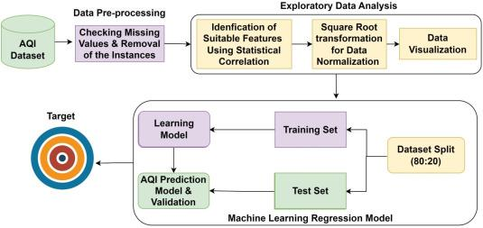

## Table of Contents

## What is air quality forecasting and why is it important?

Air quality forecasting is when scientists predict how clean or polluted the air will be in the future. They use computers and special tools to look at things like weather, how much pollution factories and cars make, and other stuff that can change the air. This helps them guess what the air will be like tomorrow or even a few days from now.

It's important because knowing about air quality can help people stay healthy. If the air is going to be bad, people can stay inside or wear masks. It also helps doctors and hospitals get ready for more people who might get sick from bad air. Plus, it can help governments make rules to make the air cleaner for everyone.

## How can machine learning be used to improve air quality forecasting?

Machine learning can make air quality forecasting better by looking at a lot of data and finding patterns that people might miss. It can use information like weather reports, how much traffic there is, and what factories are doing to guess how clean the air will be. By learning from past air quality data, machine learning models can predict future air quality more accurately. For example, if a model sees that high temperatures and lots of cars usually mean bad air, it can warn people before it happens.

These models can also keep getting better over time. As they get more data, they can adjust their predictions to be more accurate. This is called "training" the model. For instance, if a model predicts bad air but it turns out to be okay, it can learn from that mistake and do better next time. This way, the forecasts become more reliable, helping people make better decisions about their health and daily activities.

## What are the common pollutants monitored in air quality forecasting?

In air quality forecasting, people keep an eye on several common pollutants that can harm our health and the environment. Some of the main ones are particulate matter, which comes in two sizes: PM2.5 and PM10. PM2.5 is tiny and can get deep into our lungs, while PM10 is a bit bigger but still harmful. Another big pollutant is ground-level ozone (O3), which forms when other pollutants mix with sunlight. Nitrogen dioxide (NO2) and sulfur dioxide (SO2) are also important to watch. These come from burning fuel in cars and power plants.

Carbon monoxide (CO) is another pollutant that's tracked. It comes from things like car exhaust and can be dangerous in high amounts. Volatile organic compounds (VOCs) are also monitored. They come from things like paints and cleaning supplies and can affect air quality. By keeping track of these pollutants, scientists can predict when the air might be bad and help people stay safe.

## What data sources are typically used for air quality forecasting?

Air quality forecasting uses a lot of different data sources to make good predictions. One big source is weather data, like temperature, wind speed, and humidity. These things can change how pollutants move and mix in the air. Another source is satellite data, which can show where pollutants are coming from and how they are spreading. Also, ground-based sensors are really important. These sensors are placed in cities and other places to measure the air right where people live and work.

Another key data source is information about human activities that make pollution. This includes data on traffic, how much factories are working, and how people are using energy. For example, if there's a lot of traffic, more pollutants will be in the air. Historical air quality data is also used. By looking at past air quality, forecasters can see patterns and use them to predict what might happen next. All these different pieces of data help make air quality forecasts as accurate as possible, so people can be ready for changes in the air they breathe.

## How does the GAGNN model work in the context of air quality forecasting?

The GAGNN model, which stands for Graph Attention-based Graph Neural Network, is a type of [machine learning](/wiki/machine-learning) model used for air quality forecasting. It works by treating different locations as points on a graph, where each point (or node) represents a place with air quality sensors. The connections (or edges) between these points show how pollutants can move from one place to another. The GAGNN model uses a special kind of attention mechanism to figure out which connections are most important for predicting air quality. This means it can focus on the most relevant data, like how pollutants from a factory might affect nearby areas more than distant ones.

In simple terms, the GAGNN model looks at a lot of data from different places and figures out how pollution moves around. It uses this information to make better guesses about future air quality. By paying more attention to the most important connections between places, the model can predict things like how a sudden increase in traffic in one area might lead to higher pollution levels in nearby areas. This makes the forecasts more accurate and helps people and governments make better plans to protect air quality.

## What are the key features of the GAGNN model that make it effective for air quality forecasting?

The GAGNN model is effective for air quality forecasting because it uses a graph to represent different locations and how they are connected. This means it can see how pollution moves from one place to another, like how smoke from a factory might affect nearby neighborhoods. The key feature here is the attention mechanism, which helps the model focus on the most important connections between places. For example, it can pay more attention to how pollution from a busy highway might impact nearby areas than distant ones. This makes the model's predictions more accurate because it can better understand how pollution spreads.

Another important feature of the GAGNN model is its ability to handle complex data. It can take in a lot of information, like weather data, traffic data, and sensor readings from different locations, and use it all to make better forecasts. By learning from this data over time, the model gets better at predicting air quality. This is really helpful for making sure people know when the air might be bad so they can take steps to stay safe.

## How do you preprocess data for use in machine learning models like GAGNN?

To get data ready for machine learning models like GAGNN, you need to clean it up first. This means fixing any missing or wrong information. For example, if a sensor didn't work one day, you might fill in that missing data with the average from other days. You also need to make sure all the data is in the same format. If one sensor measures temperature in Celsius and another in Fahrenheit, you'd convert everything to the same unit. This step is called normalization, and it helps the model understand the data better.

After cleaning the data, you organize it into a graph structure that GAGNN can use. Each place with a sensor becomes a point on the graph, and the lines connecting them show how pollutants move from one place to another. You might also add other information, like weather data or traffic data, to each point. This makes the model's predictions more accurate because it can see how different things affect air quality. By turning the data into a graph and making sure it's clean and consistent, you help the GAGNN model learn and make better forecasts.

## What are the challenges faced when implementing machine learning models for air quality forecasting?

One big challenge with using machine learning models for air quality forecasting is getting good data. Air quality can change a lot from one place to another, so you need a lot of sensors to get accurate information. Sometimes, sensors break or give wrong readings, which can mess up the model's predictions. Also, the data needs to be cleaned up and put into the right format, which takes a lot of time and work. For example, if you're using a model like GAGNN, you have to turn all the data into a graph, which can be tricky.

Another challenge is that air quality is affected by many things, like weather, traffic, and how factories are working. All these things can change quickly and unpredictably, so it's hard for the model to keep up. The model has to learn from a lot of data to make good predictions, but even then, it might not be perfect. Sometimes, the model might think the air will be bad when it's actually okay, or the other way around. This means you always have to check the model's predictions and update it with new data to make sure it stays accurate.

## How can the performance of air quality forecasting models like GAGNN be evaluated?

To check how well a model like GAGNN works for air quality forecasting, scientists use special numbers called metrics. These metrics tell them how close the model's guesses are to what actually happens. One common way to do this is by using a number called the Mean Absolute Error (MAE). This is the average difference between what the model predicts and what really happens. If the MAE is small, it means the model's guesses are usually pretty close to the real air quality. Another way is to use the Root Mean Square Error (RMSE), which also shows how far off the predictions are, but it gives more weight to bigger mistakes. Scientists might also look at the R-squared value, which tells them how much of the air quality changes the model can explain. If R-squared is close to 1, the model is doing a good job.

Besides numbers, scientists also do something called cross-validation. This means they split the data into different parts and use some parts to train the model and other parts to test it. They do this many times with different splits to make sure the model works well no matter which data it sees. This helps them see if the model is good at guessing air quality in different situations. They might also compare the model's predictions to simpler methods, like just using the air quality from the day before to guess what it will be like tomorrow. If the model does better than these simple methods, it shows that it's really helping to make better forecasts.

## What advancements have been made in air quality forecasting using machine learning in recent years?

In recent years, machine learning has made big steps forward in how we predict air quality. One big improvement is the use of [deep learning](/wiki/deep-learning) models, which can learn from a lot of data to make better guesses about the air. For example, models like GAGNN use special graphs to see how pollution moves between different places. This helps them make more accurate predictions by understanding how pollution spreads. Another advancement is the use of real-time data from satellites and ground sensors. This lets models keep up with quick changes in air quality, making their forecasts more reliable and helpful for people and governments.

Another exciting development is the use of ensemble methods, where scientists combine different models to make even better predictions. By using several models together, they can get a more complete picture of air quality. Also, machine learning models are getting better at handling missing data and noisy information, which makes them more useful in real-world situations. These advancements mean that air quality forecasts are becoming more accurate and timely, helping people stay safe and healthy by knowing when the air might be bad.

## How can air quality forecasting models be integrated into public health and environmental policy?

Air quality forecasting models can be a big help for public health and environmental policy. By using these models, governments can make rules and plans to keep the air clean. For example, if a model predicts that the air will be bad because of traffic, the government might decide to limit cars on the road during those times. This can help protect people's health by reducing pollution. Also, public health officials can use the forecasts to warn people when the air might be dangerous, so they can stay inside or wear masks. This way, fewer people get sick from bad air.

These models can also help in making long-term plans to improve the environment. By looking at the data over time, policymakers can see where pollution is coming from and make rules to reduce it. For example, if factories are a big source of pollution, the government might make them use cleaner technology. This not only helps the air today but also makes it better for the future. By using air quality forecasts, governments can make smarter decisions that keep people healthy and the environment clean.

## What future research directions are promising for enhancing air quality forecasting with machine learning?

One promising direction for future research in air quality forecasting with machine learning is improving how models handle real-time data. Right now, models like GAGNN use graphs to see how pollution moves, but they could be even better if they could quickly update their predictions as new data comes in. This would mean using more advanced algorithms that can learn and adapt on the fly, making the forecasts more accurate and timely. For example, integrating more real-time data from satellites and ground sensors could help models catch sudden changes in air quality, like a sudden spike in pollution from a traffic jam or a factory.

Another exciting area is developing models that can better understand the complex mix of factors affecting air quality. This means using machine learning to look at weather, traffic, and human activities all at once, and figuring out how they interact. Researchers could work on creating models that not only predict air quality but also explain why the air is getting better or worse. By doing this, they can help policymakers make better rules to keep the air clean. For instance, if a model can show that a certain type of factory is causing most of the pollution, the government could focus on making those factories cleaner.

## References & Further Reading

[1]: Zhang, X., Ding, Y., & Jin, L. (2019). ["Air Quality Prediction through Machine Learning Based on Multimodal Data Fusion: A Review."](https://www.sciencedirect.com/science/article/pii/S1535610825001175) Applied Sciences.

[2]: Zheng, Y., Liu, F., & Hsieh, H. P. (2013). ["U-Air: When Urban Air Quality Inference Meets Big Data."](https://dl.acm.org/doi/abs/10.1145/2487575.2488188) Proceedings of the 19th ACM SIGKDD International Conference on Knowledge Discovery and Data Mining.

[3]: Shaban, K., Kadri, A., & Rezk, E. (2016). ["Urban Air Pollution Monitoring System with Forecasting Models"](https://ieeexplore.ieee.org/abstract/document/7370876) in Internet of Things and Big Data Analytics Toward Next-Generation Intelligence.

[4]: Vourlidas, A., & Howard, R. A. (2006). ["Satellite Data: A Cost-effective Means for Pollution Control."](https://ui.adsabs.harvard.edu/abs/2006ApJ...652..763T/abstract) Eos, Transactions American Geophysical Union.

[5]: Lo, S., & Nguyen, H. (2020). ["A Real-time Air Quality Forecasting System for Smart Cities Using Deep Learning"](https://ieeexplore.ieee.org/document/8907358) in 2020 7th NAFOSTED Conference on Information and Computer Science (NICS).