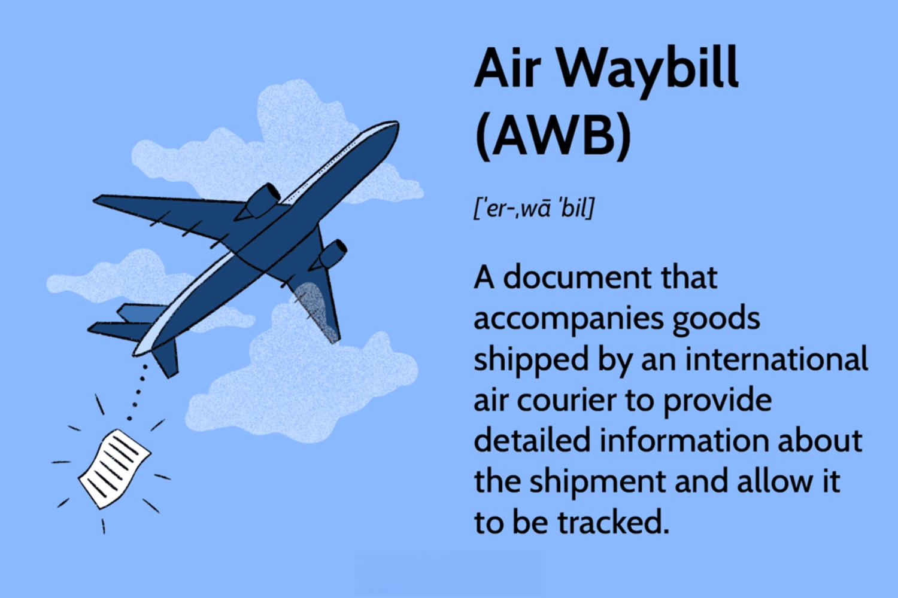

The rapid evolution of freight transportation has led to the adoption of advanced tools and methodologies such as Air Waybill (AWB) shipping documentation. An AWB is a critical document that serves as a contract between the shipper and the carrier. This document specifies the shipper's and consignee's details, a description of the goods, and any special handling requirements. As the logistics and freight industry evolves, so does the need for efficient documentation and tracking systems to ensure seamless operations.

In recent years, the logistics sector has witnessed a significant transformation, largely driven by technological advancements. These developments have opened up opportunities for innovation, particularly in the integration of documentation platforms with algorithmic trading systems. Algorithmic trading, traditionally associated with financial markets, is now increasingly relevant in optimizing freight transportation operations. By analyzing vast amounts of data, these algorithms enhance route optimization, cost efficiency, and demand forecasting, thereby reducing human error and speeding up transactions.

This article explores the intersection of AWB documentation and the rising influence of algorithmic trading in the freight transportation sector. It investigates how these technologies are transforming traditional shipping procedures, facilitating a shift towards more streamlined, paperless logistics processes. Moreover, the article will provide insights into the ways in which this integration provides opportunities for efficiency, cost reduction, and improved service quality, giving logistics companies a competitive edge in the modern economy. As such, understanding this intersection is crucial for companies that aim to remain agile and adaptive in an ever-evolving industry landscape.

## Table of Contents

## Understanding Air Waybill Documentation

An Air Waybill (AWB) is a fundamental instrument in the international freight transportation industry, functioning as both a receipt issued by an airline for goods and as evidence of the contract of carriage. It provides comprehensive details crucial for the transportation of goods by air, encompassing the shipper's name and address, the consignee's details, a description of the goods, and any specific handling requirements. 

The AWB serves multiple purposes and is classified into two types: the Master Air Waybill (MAWB) and the House Air Waybill (HAWB). The MAWB is used for shipments contracted directly with an airline, whereas the HAWB is utilized for shipments managed by freight forwarders who consolidate multiple shipments under a single MAWB. This segregation ensures clarity and accountability in shipping operations.

One of the pivotal functions of the AWB is its role in customs clearance processes. It serves as a key document that enables compliance with local and international regulations. By providing a detailed account of the goods being transported, the AWB aids in customs inspection and facilitates the smooth passage of goods across borders. Compliance with regulatory frameworks is essential to avoid delays, fines, or legal complications, and the AWB is an integral part of this compliance matrix.

With the advent of digitalization in the logistics sector, the AWB process has undergone significant transformation. The traditional paper-based AWB has evolved, paving the way for electronic Air Waybills (e-AWB), which align with the broader paperless movement in logistics. Digitalization has enhanced efficiency by reducing paperwork, minimizing errors, and expediting processing times. The e-AWB system also provides improved data accuracy and facilitates real-time tracking of shipments, thus enhancing supply chain visibility for all stakeholders involved. As the logistics industry continues to embrace digital innovations, the AWB remains a critical component in streamlining freight transportation operations.

## The Role of Algorithmic Trading in Freight Transportation

Algorithmic trading, a technology traditionally utilized in financial markets, is increasingly influencing the field of freight transportation. By utilizing sophisticated algorithms, logistics companies can optimize routes, enhance cost efficiency, and forecast demand with precision. These algorithms are capable of analyzing extensive datasets to identify trends and automate decision-making processes efficiently.

The deployment of [algorithmic trading](/wiki/algorithmic-trading) in freight transportation offers several advantages. Chief among them is the minimization of human error, alongside enhanced transactional speed and accuracy. By automating repetitive and complex tasks, companies can reduce operational inefficiencies and respond more dynamically to market changes.

A core component of algorithmic trading involves the parsing of historic and real-time data to model potential future events. This predictive capability enables companies to adjust their supply chains preemptively, mitigating possible delays and optimizing resource allocation. For instance, algorithms can process variables such as weather forecasts, traffic patterns, and fuel prices to determine the most efficient transportation routes in real-time.

Moreover, the principles of algorithmic trading can revolutionize bidding and pricing strategies within freight logistics. Automated systems can dynamically adjust bids based on fluctuating demand and slot availability, ensuring competitive pricing while maximizing profit margins. Furthermore, these tools provide enhanced risk management capabilities, allowing companies to hedge against potential disruptions by analyzing market [volatility](/wiki/volatility-trading-strategies) and historical performance data.

In summary, the implementation of algorithmic trading in freight transportation signifies a crucial step towards modernizing logistics operations. By harnessing the power of data-driven insights, companies can achieve substantial improvements in efficiency, cost management, and service delivery. As this technology evolves, its integration into freight logistics will likely drive further advancements, underscoring the importance of digital transformation within the industry.

## Integrating AWB Documentation with Algorithmic Trading

The integration of Air Waybill (AWB) documentation systems with algorithmic trading tools has unlocked new efficiencies and capabilities in logistics operations. This fusion allows for the automated collection and analysis of AWB data, enhancing supply chain visibility and management. By streamlining processes, logistics companies can better track shipments in real time and utilize predictive analytics to forecast delivery schedules and identify potential delays.

Automated systems process large volumes of AWB data quickly and accurately, facilitating the seamless flow of information across the supply chain. This capability is vital in a rapidly changing logistics environment where timely decisions are crucial. Through the use of advanced algorithms, companies can link AWB data to trading algorithms, providing predictive insights into market volatility and enabling them to adjust shipping plans accordingly. For example, a sudden change in fuel prices or a spike in demand can be swiftly responded to by optimizing routes or altering cargo loads. In doing so, businesses can improve cost efficiency and minimize risks associated with fluctuating market conditions.

The ability to anticipate and react to changes contributes to significant cost savings. By reducing operational inefficiencies and enhancing the accuracy of logistics processes, businesses not only cut costs but also improve customer service. Customers benefit from increased transparency and reliability, resulting in higher satisfaction and loyalty.

This integration is further exemplified by the use of [machine learning](/wiki/machine-learning) techniques that continuously refine the algorithms based on historical data and new patterns. For example, machine learning models can be trained to recognize trends in shipping delays or to optimize routing decisions, leading to even greater efficiencies. 

In conclusion, merging AWB documentation with algorithmic trading principles represents a powerful strategy for modernizing logistics operations. It establishes a dynamic system capable of adapting to real-time data and market trends, ultimately transforming how freight transportation is managed to achieve better economic and customer outcomes.

## Challenges and Opportunities

Integrating Air Waybill (AWB) documentation with algorithmic trading systems presents several challenges and opportunities in the freight transportation sector. One of the primary concerns is data privacy and cybersecurity. As more logistics operations become digitized, ensuring the security of sensitive shipment information is vital. Cyber threats can compromise data integrity, leading to potential financial losses and reputational damage. Implementing robust cybersecurity measures and complying with data protection regulations is essential to mitigate these risks.

Another notable challenge is the substantial initial setup cost associated with integrating these advanced systems. Companies must invest in infrastructure, software, and training to effectively utilize algorithmic tools for AWB management. This investment requires a thorough understanding of the logistics industry and algorithmic systems, necessitating expertise that may not currently exist within all organizations. Moreover, the implementation of these systems can face resistance from employees accustomed to traditional methods. Overcoming this resistance involves change management strategies and education on the benefits of digital solutions.

Compliance with international regulations is another critical aspect that companies must address. Each country may have unique regulatory requirements for shipping documentation and algorithmic trading systems, which organizations must navigate to ensure smooth operation across borders. Failing to comply can result in legal repercussions and disruptions to the supply chain.

Despite these challenges, the integration of AWB documentation with algorithmic trading systems offers numerous opportunities. For instance, enhanced transparency in the supply chain can be achieved through real-time data analysis and tracking, allowing for proactive decision-making. This transparency can also lead to improved sustainability by optimizing routes and reducing fuel consumption, contributing to lower carbon footprints.

Moreover, integrating these technologies can bolster supply chain resilience, allowing companies to adapt swiftly to market changes and disruptions. Real-time data and predictive analytics enable logistics companies to anticipate issues and adjust their strategies accordingly. Organizations that successfully implement these systems can achieve significant competitive advantages by optimizing operations, reducing costs, and improving service quality.

In conclusion, while challenges such as data privacy, setup costs, and compliance exist, the integration of AWB documentation with algorithmic systems holds immense potential for enhancing the logistics sector. Companies prepared to address these issues can position themselves favorably in a rapidly evolving market landscape.

## Conclusion

The integration of Air Waybill (AWB) documentation with algorithmic trading systems represents a significant evolution in the freight transportation sector. This synergy is at the forefront of the industry's move towards a more digitized and efficient future. As the logistics landscape becomes increasingly competitive, the adoption of these advanced technologies is not merely advantageous but essential for maintaining relevance and achieving operational excellence.

Despite facing obstacles such as data privacy concerns and the necessity for technical expertise, the potential benefits of integrating AWB documentation with algorithmic systems are substantial. These technologies offer the promise of enhanced operational efficiency, cost reduction, and superior service quality. This potential ensures that companies willing to invest in and adapt to these technological advancements will see a promising future.

For organizations to fully capitalize on these opportunities, they must embrace agility and adaptability. This involves continuous innovation, upskilling the workforce, and maintaining an openness to change. As technology continues to advance at a rapid pace, the ability to swiftly incorporate new tools and methodologies will be crucial for success.

The imminent transformation and growth of the logistics sector herald exciting possibilities. Companies that effectively harness the capabilities of AWB and algorithmic trading will not only ensure their competitiveness but also contribute to shaping the future of freight transportation. The industry's shift towards digital solutions promises more streamlined operations and enhanced resilience, setting the stage for a more efficient global logistics network.

## References & Further Reading

[1]: ["IATA Cargo and Mail Supply Chain"](https://www.iata.org/en/programs/cargo/), International Air Transport Association.

[2]: ["The Air Waybill (AWB): A quick overview"](https://medium.com/@klear-stack/what-is-air-waybill-awb-a-complete-overview-746de0dfa168), FedEx.

[3]: Köse, E., & Başdere, M. (2016). ["Algorithmic Approaches in Freight Flow Management."](https://www.parisdiscoveryguide.com/ile-de-la-cite.html) European Journal of Operational Research.

[4]: Gans, N., & Croson, R. (2008). ["Supplier Negotiation and the Air Cargo Revenue Management Problem."](https://onlinelibrary.wiley.com/doi/10.1111/deci.12369) Operations Research.

[5]: ["The Future of Freight: More Information, More Transparency, More Innovation"](https://www2.deloitte.com/us/en/insights/focus/transportation/future-of-transport-industry.html), Organisation for Economic Co-operation and Development (OECD).