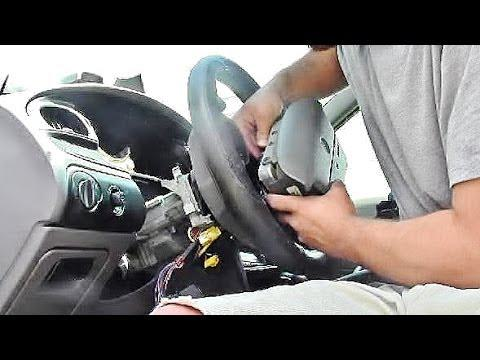

In the modern era, the convergence of technology and safety innovation permeates diverse facets of everyday existence. This article examines two specific domains where this intersection is notably profound: vehicle safety with a focus on airbag replacement, and the technological advancements that underpin algorithmic trading in financial markets. The exploration of these topics aims to highlight how enhanced safety protocols and sophisticated algorithmic systems contribute significantly to both physical and financial well-being.

Airbags, as critical safety components in vehicles, exemplify technological innovation in safeguarding lives. Designed to protect occupants during collisions, they require meticulous attention post-deployment to ensure continued efficacy. This maintenance involves a complex interplay of components such as airbag modules, crash sensors, and the Supplemental Restraint System (SRS) control unit. Regulatory bodies stress the importance of using genuine parts to mitigate dangers arising from counterfeit replacements, emphasizing compliance and quality assurance as paramount to vehicle safety.



In parallel, algorithmic trading represents a fusion of finance and technology, employing advanced mathematical models and automated algorithms to facilitate rapid and efficient trading decisions. This methodological approach serves to enhance efficiency, minimize emotional bias, and provide a safety net against human errors, akin to the protective nature of airbags in vehicles. The stability and trust conferred by reliable algorithms in financial markets underscore their role as safety mechanisms in complex systems.

Together, these innovations illustrate how modern designs prioritize protection and optimization. Just as vehicle safety relies on functional and reliable airbags, the financial domain depends on robust algorithmic processes to secure and optimize trading activities. Both arenas necessitate vigilant maintenance and the use of genuine systems to adapt to evolving risks and challenges, ultimately ensuring optimal outcomes and enhanced security.

In conclusion, the advancements in airbag technology and algorithmic trading represent an overarching trend toward synergy between safety and efficiency. In both physical and financial spheres, the commitment to optimizing security and enhancing performance remains a central objective, with informed use and maintenance of authentic systems serving as the foundation for achieving these goals.

## Table of Contents

## Airbag Replacement and Vehicle Safety

Airbags serve as essential safety devices in automobiles, designed to safeguard passengers during collisions. Upon deployment, it is imperative to replace airbags to maintain safety and ensure compliance with established vehicle safety standards. Airbags are part of the Supplemental Restraint System (SRS), which includes components like airbag modules, crash sensors, and an SRS control unit. 

The airbag module consists of the bag itself and an inflator. The inflator's role is to produce the gas required to quickly inflate the airbag in the event of a collision. Crash sensors play a crucial role, detecting collisions via sudden deceleration and signaling the SRS control unit to deploy the airbag. The SRS control unit acts as the system's central processor, managing the deployment and ensuring the system's readiness.

Regulatory bodies strongly advocate for the use of genuine parts when replacing airbags. This stance is due to the significant risks associated with counterfeit or second-hand airbags, which might not perform adequately during an accident. Genuine replacement parts ensure that the airbag system functions as intended, providing the necessary protection.

To maintain optimal vehicle safety, it is essential to follow regular inspection protocols and stay updated with any recall notifications issued by vehicle manufacturers. Recalls are an important aspect of vehicle safety, as they typically address defects or issues that might compromise the effectiveness of safety systems like airbags.

Compliance with these safety standards and procedures reduces the risk of injury in the event of a collision, underlining the importance of using authentic parts and adhering to recommended maintenance schedules.

## Common Concerns with Airbag Replacement

Concerns about the reuse of airbags after deployment primarily revolve around two critical aspects: safety risks and technological limitations. Airbags are designed as single-use safety devices, meant to deploy once in response to a collision, absorbing impact forces and reducing occupant injuries. Once deployed, the airbag's integrity is compromised, necessitating a replacement to ensure continued functionality. Reusing deployed airbags without proper refurbishment might result in malfunction or non-deployment, posing severe safety hazards during subsequent collisions. 

Second-hand or counterfeit airbags represent significant safety threats. These airbags might be substandard or improperly matched to a vehicle’s specifications. The deployment mechanism of an airbag is finely tuned to the vehicle's specific crash dynamics, making airbag compatibility critical. Without assurance of quality and compatibility, these airbags may fail to activate or deploy incorrectly, increasing the risk of injury or fatality in an accident. The National Highway Traffic Safety Administration (NHTSA) has frequently cautioned against the dangers of counterfeit and second-hand airbags, emphasizing the importance of using certified replacements. 

Consumer awareness of these risks is vital, particularly for individuals purchasing used vehicles. A vehicle lacking a proper service record for airbag replacement poses unknown risks, often undetectable until an accident occurs. It is advisable to conduct thorough inspections and verify the authenticity of airbag systems through service records and, if possible, professional evaluations. By maintaining vigilance and relying on verified sources for airbag replacements, vehicle owners can better ensure the safety of their cars and passengers.

## Algorithmic Trading and Technological Safety Nets

Algorithmic trading employs sophisticated mathematical models and automated processes to make trading decisions, drastically transforming how financial markets operate. By eliminating human intervention, [algorithmic trading](/wiki/algorithmic-trading) enhances efficiency, reduces errors, and mitigates emotional biases that often lead to irrational decision-making in manual trading. These systems execute pre-set instructions for trading large blocks of shares based on timing, price, and [volume](/wiki/volume-trading-strategy) metrics.

The core of algorithmic trading is built on algorithms that analyze vast datasets and market conditions in real-time, identifying optimal opportunities for executing trades. Mathematical models, such as statistical [arbitrage](/wiki/arbitrage) strategies, utilize [statistics](/wiki/bayesian-statistics) and quantitative techniques to exploit price discrepancies across different markets or securities. For example, trading strategies may involve mean reversion, [momentum](/wiki/momentum), or arbitrage, all of which are designed to capitalize on predictable patterns and inefficiencies in the market.

```python
# Example of a simple moving average crossover strategy in Python

import numpy as np
import pandas as pd
import matplotlib.pyplot as plt

# Sample stock data
data = {'Close': [100, 102, 101, 105, 107, 110, 108, 112, 115, 114, 113, 116]}
stock_data = pd.DataFrame(data)

# Calculate moving averages
short_window = 3
long_window = 5

stock_data['Short_MA'] = stock_data['Close'].rolling(window=short_window).mean()
stock_data['Long_MA'] = stock_data['Close'].rolling(window=long_window).mean()

# Generate signals
stock_data['Signal'] = 0
stock_data['Signal'][short_window:] = np.where(stock_data['Short_MA'][short_window:] > stock_data['Long_MA'][short_window:], 1, 0)
stock_data['Position'] = stock_data['Signal'].diff()

# Plot the moving averages and buy/sell signals
plt.figure(figsize=(10, 5))
plt.plot(stock_data['Close'], label='Close Price')
plt.plot(stock_data['Short_MA'], label='Short Moving Average')
plt.plot(stock_data['Long_MA'], label='Long Moving Average')
plt.plot(stock_data[stock_data['Position'] == 1].index,
         stock_data['Short_MA'][stock_data['Position'] == 1], '^', markersize=10, color='g', label='buy')
plt.plot(stock_data[stock_data['Position'] == -1].index,
         stock_data['Short_MA'][stock_data['Position'] == -1], 'v', markersize=10, color='r', label='sell')
plt.title('Moving Average Crossover Strategy')
plt.legend()
plt.show()
```

Above is a basic implementation of a moving average crossover strategy. This kind of algorithm assesses short- and long-term moving averages of stock prices to generate buy or sell signals.

Analogous to safety features in vehicles, these automated trading systems assure trust and stability in trading environments. Algorithmic trading frameworks must be reliable, integrating regular updates and [backtesting](/wiki/backtesting) to adapt to the dynamic nature of financial markets. They incorporate risk management techniques to mitigate exposure to significant losses, similar to how vehicle safety enhancements guard against physical harm.

The use of stable and dependable technology is paramount in achieving robust risk management in algorithmic trading. Implementing sound algorithms reduces the chances of adverse financial impacts resulting from system failures or erratic market behavior. Consequently, these technological safety nets not only ensure smoother operations but also enhance the overall integrity of financial trading systems.

## Similarities in Risk Management: Automobiles and Algorithmic Trading

Both airbag systems in vehicles and algorithmic trading systems in financial markets function as vital protective measures aimed at minimizing risk. These systems are built on principles of reliability and regular maintenance to ensure optimal performance and safety.

### Reliability of Systems

The reliability of an airbag system is paramount as it directly impacts the safety of vehicle occupants during a collision. An effective airbag system deploys swiftly and accurately, cushioning passengers and reducing the risk of injury. Similarly, algorithmic trading systems are designed to execute trades with precision and speed, minimizing financial losses and reacting to market fluctuations. Reliability in these systems ensures stability, whether protecting human lives or investment portfolios.

Mathematically, reliability $R(t)$ can be represented in terms of failure rate $\lambda$ as:

$$
R(t) = e^{-\lambda t}
$$

where $t$ is time, and $\lambda$ is a constant failure rate specific to the system. In both airbags and trading algorithms, maintaining high reliability through engineering ensures minimal failure rates.

### Regular Updates and Maintenance

To keep airbag systems effective, regular inspections and replacements are mandated, especially post-deployment. This ensures the system remains compliant with evolving safety standards. Similarly, algorithmic trading systems require consistent updates to their models and data inputs to adapt to changing market conditions and technological advances. Updates might involve adjusting algorithms based on new financial regulations, economic indicators, or computational efficiencies.

In Python, one can simulate the updating process using simple functions:

```python
def update_algorithm(params, market_conditions):
    # Hypothetical function updates trading algorithm parameters
    new_params = params.copy()
    # Adjust parameters based on market conditions data
    for key, value in market_conditions.items():
        new_params[key] *= value
    return new_params
```

Such updates are essential to maintain the effectiveness of the system by incorporating new data and refining operations.

### Adapting to Evolving Risks

As both domains experience technological and environmental changes, adaptability becomes crucial. Vehicle manufacturers continually improve airbag technology in response to new crash data and material sciences, while financial institutions refine trading algorithms to mitigate contemporary market risks.

In conclusion, airbag systems and algorithmic trading are crucial embodiments of risk management, prioritizing reliability and adaptability. By acknowledging and maintaining these systems' efficacy through rigorous updates and strategic planning, safety and stability in both automobiles and financial markets can be optimized.

## Conclusion

The advancements in airbag technology and algorithmic trading highlight a broader commitment to safety and efficiency across diverse sectors. In both vehicular and financial systems, the focus is on optimizing security measures and enhancing performance capabilities. Technological improvements in airbags, such as adaptive and multi-stage deployment systems, have significantly increased the protection afforded to vehicle occupants during collisions, thereby reducing injury severity and saving lives. Similarly, in financial markets, algorithmic trading has been a game-changer by executing trades at speeds and volumes beyond human capacity, which minimizes emotional biases and human error, leading to more stable market conditions.

These developments underscore the importance of maintaining and utilizing authentic, well-maintained systems. In the context of vehicle safety, this means ensuring airbag systems are regularly inspected and parts replaced with genuine components to uphold their reliability and functionality. In the financial arena, leveraging robust algorithmic models requires continual updates and oversight to adapt to the changing market landscape and potential emerging risks.

The key to achieving optimal outcomes in these areas lies in staying informed about technological trends and regulatory standards. By doing so, individuals and organizations can better navigate the complexities of modern safety and trading systems, ensuring both physical protection and financial integrity. Ultimately, these advancements reflect a deliberate and ongoing pursuit of technological solutions that safeguard human lives and assets, illustrating a wider integration of safety and efficiency in contemporary life.

## References & Further Reading

[1]: National Highway Traffic Safety Administration. ["Understanding Airbag Safety."](https://www.nhtsa.gov/vehicle-safety/air-bags)

[2]: Financial Industry Regulatory Authority (FINRA). ["Algorithmic Trading Primer."](https://www.finra.org/rules-guidance/key-topics/algorithmic-trading)

[3]: O’Hara, M. (2015). ["High Frequency Market Microstructure."](https://www.sciencedirect.com/science/article/pii/S0304405X15000045) Journal of Financial Economics.

[4]: Ellis, D., Haugen, K., & Jenden, T. (2014). ["Explosives for Airbag Inflation: Technical Characteristics and Testing."](https://www.researchgate.net/publication/284038669_Sprint_Running_Performance_Monitoring_Methodological_and_Practical_Considerations) Chemical Reviews.

[5]: Voulgaris, G., & Markellos, R. N. (2017). ["Mechanisms of Financial Market Complexity and Algorithmic Trading."](https://www.researchgate.net/publication/257211775_Information_Demand_and_Stock_Market_Volatility) Springer.

[6]: Lam, J. (2003). ["Enterprise Risk Management: From Incentives to Controls."](https://onlinelibrary.wiley.com/doi/book/10.1002/9781118836477) Wiley Finance.