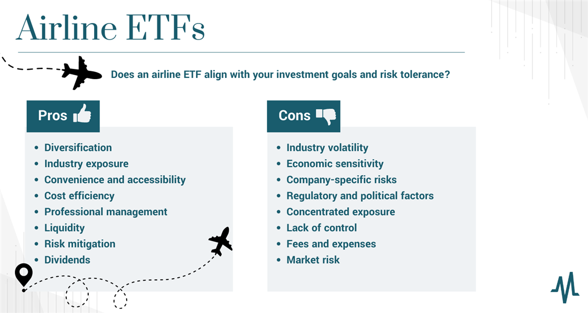

In recent years, the airline industry has attracted increasing attention from investors. This interest is largely driven by the sector's consistent demand for air travel and its potential for growth, fueled by rising global travel, expanding middle classes in emerging markets, and technological advancements in aircraft efficiency. For investors seeking to capitalize on these trends, exchange-traded funds (ETFs) offer a compelling investment vehicle. These funds provide a diversified approach, enabling investment across a broad array of airline stocks, which helps in mitigating the risk associated with investing in individual airline companies.

The airline industry, however, is not without its challenges. Factors such as economic downturns, fluctuating fuel prices, and regulatory hurdles can impact the profitability of airlines. Nonetheless, the use of algorithmic trading alongside ETFs has opened new avenues for investors. Algorithmic trading employs computer algorithms to execute trades based on predefined criteria, potentially enhancing trading efficiency, improving liquidity, and minimizing costs. This integration can offer investors opportunities to optimize returns by swiftly adapting to market changes.



This article explores the intersection of these themes, examining the benefits and challenges of airline industry ETFs and the transformative role of algorithmic trading within this context. By understanding these elements, investors can make informed decisions about entering or expanding their involvement in the airline sector through ETFs.

## Table of Contents

## Understanding Airline Industry ETFs

An airline industry ETF (Exchange-Traded Fund) constitutes a collection of stocks from companies operating within the airline sector. These financial instruments are structured to mimic the performance of airline companies or a specific index associated with the aviation industry. By aggregating a diverse range of airline stocks, an ETF provides investors with comprehensive exposure to the airline sector without necessitating the management of individual airline stocks. This approach can prove advantageous for investors seeking simplified methods to engage with the airline industry's performance.

One of the notable advantages of airline industry ETFs is the diversification they offer. By holding shares of multiple airline companies, investors can mitigate the risks associated with investing in a single airline's stock. This diversified exposure can reduce the impact of an individual company's poor performance on the overall investment portfolio.

Airline industry ETFs also cater to investors by offering a convenient means of tracking the entire airline industry without requiring in-depth knowledge of each company's individual financials. By investing in an ETF, investors gain the ability to indirectly own shares in numerous airline companies through a single financial vehicle. This trackability makes it easier for individuals to align their investments with the broader trends and performance metrics of the aviation industry.

Among the various airline industry ETFs available, the U.S. Global Jets [ETF](/wiki/etf-trading-strategies) is one of the most prominent. This ETF primarily incorporates major airlines, aircraft manufacturers, and airports, providing a comprehensive overview of the broader airline sector. The diversity within such an ETF can include large carriers like Delta Air Lines and American Airlines, as well as low-cost carriers and regional airlines. By investing in an ETF like the U.S. Global Jets ETF, investors benefit from a strategic array of industry stakeholders that collectively drive the performance of the aviation sector.

In summary, airline industry ETFs offer an effective and efficient method for investors to gain exposure to the airline industry. By pooling various airline stocks into one investment fund, these ETFs minimize the complexity involved with individual stock management, allowing investors to focus on broader market trends and performance indicators associated with aviation.

## Benefits of Investing in Airline Industry ETFs

Exchange-traded funds (ETFs) have become increasingly popular among investors looking to gain exposure to specific sectors, such as the airline industry. These ETFs present several benefits that make them an attractive option for both novice and seasoned investors. 

**Diversification**

One of the primary advantages of investing in airline industry ETFs is diversification. A single ETF holds a wide array of airline stocks, effectively spreading risk across numerous companies within the industry. This diversification reduces the impact of poor performance by any single company on the overall investment, thus stabilizing potential returns. By investing in an ETF, individuals gain exposure to the broader airline sector without the complexities involved in managing multiple individual stocks.

**Cost-Effectiveness**

ETFs generally bear lower expense ratios compared to traditional mutual funds, making them a cost-effective choice for investors. This cost advantage arises from the passive management style of ETFs, where they aim to track an index rather than outperform it, requiring fewer resources and management oversight. Lower fees directly translate to higher net returns for investors, making ETFs an attractive vehicle for those looking to maximize gains while minimizing costs.

**Liquidity**

Liquidity represents another significant benefit of airline industry ETFs. These funds are traded on stock exchanges, offering investors the ability to buy and sell shares with relative ease and flexibility. The high [liquidity](/wiki/liquidity-risk-premium) of ETFs allows investors to quickly respond to market conditions by adjusting their portfolio as needed. This feature is particularly appealing to those seeking to capitalize on short-term market movements or hedge against potential downturns.

**Professional Management**

Although ETFs are often passively managed, they still benefit from the expertise of fund managers who are responsible for selecting and maintaining the composition of stocks within the fund. These professionals analyze the market and adjust the holdings to align with the ETF's objectives, providing investors with access to expert management without the need for extensive personal research or decision-making. This professional oversight adds an additional layer of confidence for investors, challenging between individual stock selection and market analysis. 

In summary, airline industry ETFs offer a compelling blend of diversification, cost-effectiveness, liquidity, and professional management, making them a prudent investment choice for those looking to capitalize on the growth and dynamics of the airline sector.

## Challenges and Risks of Airline Industry ETFs

The airline industry, although lucrative, is characterized by several inherent challenges and risks, particularly when investing through exchange-traded funds (ETFs).

**Market Volatility**: The airline industry is notably susceptible to fluctuations due to its sensitivity to various external factors. Economic downturns can severely reduce travel demand as businesses and consumers cut back on spending. Similarly, fuel price volatility profoundly affects airline profitability since fuel costs constitute a significant portion of operational expenses. In addition, geopolitical events—such as conflicts, pandemics, or travel restrictions—can lead to abrupt disruptions in air travel operations and revenues.

**Cyclical Nature**: Airlines experience cycles of growth and contraction in tandem with the global economy. During periods of economic expansion, travel demand typically increases, leading to higher revenues and profit margins for airline companies. Conversely, in economic recessions, demand declines, leading to overcapacity and decreased profitability. This cyclical behavior poses a challenge to consistent returns on investment in airline industry ETFs, requiring investors to consider broader economic indicators when strategizing.

**Regulatory Changes**: The airline industry is heavily regulated, with frequent updates to emissions standards, safety protocols, and operational guidelines. Regulatory changes aimed at reducing carbon emissions and enhancing passenger safety can result in increased compliance costs for airlines. New policies can require significant capital investments in newer, more efficient aircraft or technology updates. These additional costs can squeeze profit margins and impact the overall financial health of airlines, thus affecting the performance of airline-focused ETFs.

Understanding these risks is crucial for investors seeking to navigate the complexities of the airline industry through ETFs. Managing these risks involves careful analysis of market trends, economic conditions, and regulatory landscapes to make informed investment decisions.

## The Role of Algorithmic Trading in Airline Industry ETFs

Algorithmic trading has revolutionized the way trades are executed in financial markets, and its application to airline industry ETFs is no exception. This trading approach employs sophisticated computer algorithms to [carry](/wiki/carry-trading) out trades, adhering to pre-set rules and conditions. By automating these processes, [algorithmic trading](/wiki/algorithmic-trading) significantly enhances trading efficiency, leading to benefits such as improved liquidity and reduced trading costs.

In the context of airline industry ETFs, where market conditions can change rapidly due to variables such as fuel prices and geopolitical events, algorithmic trading stands out for its ability to swiftly process large volumes of market data. This capability provides traders with a competitive advantage, enabling them to respond promptly to changes in market dynamics and seize trading opportunities that might otherwise be missed through manual trading processes.

Moreover, algorithmic trading helps mitigate the impacts of high-frequency fluctuations in stock prices which are commonplace in airline stocks due to their sensitivity to various external factors like economic cycles and regulatory environments. Algorithms are particularly adept at identifying optimal entry and [exit](/wiki/exit-strategy) points in the market, which can be especially beneficial when dealing with the volatile nature of the airline industry. For example, an algorithm might be programmed to execute trades when an airline stock reaches a specific price threshold relative to historical data and market trends.

To illustrate, consider an algorithm designed to monitor the price movements of an airline ETF such as the U.S. Global Jets ETF. This algorithm could use technical indicators (e.g., moving averages or relative strength indexes) to decide when to buy or sell ETF shares. A simple Python implementation might involve importing relevant libraries (e.g., `pandas` for data manipulation and `numpy` for numerical operations) and setting up the algorithm to analyze streaming data, as shown below:

```python
import pandas as pd
import numpy as np

# Load historical price data for the airline ETF
data = pd.read_csv('airline_etf_prices.csv')

# Calculate moving averages
data['Short_MA'] = data['Close'].rolling(window=20).mean()
data['Long_MA'] = data['Close'].rolling(window=50).mean()

# Define trading signals
data['Signal'] = np.where(data['Short_MA'] > data['Long_MA'], 1, 0)

# Determine trade action: buy (+1), sell (-1), hold (0)
data['Trade'] = data['Signal'].diff()

# Implement trading strategy
for index, row in data.iterrows():
    if row['Trade'] == 1:
        print(f"Buy signal on {row['Date']}")
    elif row['Trade'] == -1:
        print(f"Sell signal on {row['Date']}")
```

In practice, more sophisticated algorithms may incorporate a variety of data inputs and employ [machine learning](/wiki/machine-learning) techniques to improve decision-making. By leveraging the precision and speed of algorithmic trading, investors in airline industry ETFs can optimize their trading strategies, potentially leading to enhanced returns while navigating the inherent complexities of this sector.

## Strategic Approaches to Investing in Airline Industry ETFs

Investing strategically in airline industry ETFs requires a multifaceted approach that leverages both algorithmic trading and traditional investment strategies. By doing so, investors can enhance portfolio performance and mitigate sector-specific risks.

Algorithmic trading strategies are invaluable for optimizing entry and exit points. These computer-driven tactics utilize quantitative models to determine the most advantageous times to buy and sell ETF shares. For example, an algorithm might be designed to execute trades when a specific price level is breached or an economic indicator changes. This automation ensures that trades are executed quickly and efficiently, reducing the impact of human emotions and errors. A basic algorithmic trading strategy in Python might identify such optimal points by employing moving averages as follows:

```python
# Import necessary libraries
import pandas as pd
import numpy as np

# Sample trading algorithm based on moving averages
def trade_signal(prices, short_window=40, long_window=100):
    signals = pd.DataFrame(index=prices.index)
    signals['price'] = prices
    signals['short_mavg'] = prices.rolling(window=short_window, min_periods=1, center=False).mean()
    signals['long_mavg'] = prices.rolling(window=long_window, min_periods=1, center=False).mean()

    # Generate buy/sell signals
    signals['signal'] = 0.0
    signals['signal'][short_window:] = np.where(signals['short_mavg'][short_window:] > signals['long_mavg'][short_window:], 1.0, 0.0)   
    signals['positions'] = signals['signal'].diff()

    return signals

# Example usage
# Assume `price_data` is a pandas Series of ETF prices
signals = trade_signal(price_data)
```

Regular assessment of portfolio diversification is also crucial in reducing exposure to risks inherent to the airline industry. This involves balancing airline industry ETFs with other asset classes or sectors that have low correlation with the airline sector. By doing so, investors can limit the negative impact of sector-specific downturns.

Monitoring economic indicators and fuel prices is imperative since they significantly affect airline performance and, consequently, the associated ETFs. Key economic indicators include GDP growth rates, employment data, and consumer confidence levels, which provide insights into potential demand for air travel. Fuel prices are particularly relevant given that fuel costs are a major component of airline operating expenses. Investors can keep track of [crude oil](/wiki/crude-oil) prices and geopolitical events that might affect supply chains to anticipate shifts in airline financial performance.

In conclusion, a strategic approach to investing in airline industry ETFs should blend algorithmic trading for timely market moves, comprehensive diversification tactics to hedge sector risks, and diligence in monitoring economic and commodity-based indicators to make informed decisions.

## Conclusion

Airline industry ETFs offer investors a strategic avenue to enter a sector characterized by dynamic growth and constant demand. These investment vehicles provide diversification by allowing exposure to a broad array of airline stocks within a single product, which can mitigate the risks associated with holding individual airline equities. Managed by experts, these ETFs aim to deliver steady returns by leveraging industry insights and market conditions.

However, investing in airline industry ETFs is not without its challenges. The sector is inherently volatile, influenced by economic cycles, fuel price fluctuations, regulatory changes, and geopolitical tensions. These factors can significantly affect airline profitability and, consequently, the ETF's performance. Therefore, understanding and managing these risks is crucial for investors.

The integration of algorithmic trading into airline industry ETF strategies presents a potential enhancement to traditional investment approaches. By using sophisticated algorithms, investors can execute trades based on a multitude of market data, optimizing entry and exit points. This method can enhance liquidity, reduce trading costs, and provide a competitive edge in a rapidly moving market. Algorithmic trading could be a valuable tool in maximizing returns while navigating the complexities of the airline industry.

In summary, while airline industry ETFs offer attractive opportunities through diversification and professional management, investors must be mindful of the intrinsic risks. The incorporation of algorithmic trading strategies can further refine these investment strategies, potentially leading to optimized returns.

## FAQs

**What are the most prominent airline industry ETFs available?**

Several ETFs offer exposure to the airline industry by holding stocks of major airline companies. One of the most recognized is the U.S. Global Jets ETF (JETS), which includes a comprehensive selection of U.S. and international airline stocks. Another notable option is the SPDR S&P Transportation ETF (XTN), which also invests in airlines along with other transportation-related companies, providing a broader industry exposure. These ETFs are designed to provide diversified investment opportunities while reflecting the overall performance of the airline sector.

**How do algorithmic trading strategies apply to ETFs?**

Algorithmic trading strategies in ETFs utilize programmed instructions to automatically execute trades based on defined criteria. In the context of airline industry ETFs, algorithms can be designed to analyze market trends, historical data, and economic indicators such as oil prices and passenger load factors. Algorithms can optimize the timing of trades by identifying patterns and signals that might indicate advantageous buy or sell opportunities. For instance, a moving average crossover strategy could be implemented in Python as follows:

```python
import numpy as np
import pandas as pd

def moving_average_crossover(data, short_window=40, long_window=100):
    signals = pd.DataFrame(index=data.index)
    signals['price'] = data['Close']
    signals['short_mavg'] = data['Close'].rolling(window=short_window, min_periods=1).mean()
    signals['long_mavg'] = data['Close'].rolling(window=long_window, min_periods=1).mean()
    signals['signal'] = 0.0
    signals['signal'][short_window:] = np.where(
        signals['short_mavg'][short_window:] > signals['long_mavg'][short_window:], 1.0, 0.0)
    signals['positions'] = signals['signal'].diff()
    return signals
```

**What are the primary risks associated with airline industry ETFs?**

Airline industry ETFs are subject to several risks due to the volatile nature of the airline sector. Market [volatility](/wiki/volatility-trading-strategies) driven by economic downturns, fluctuating fuel prices, and geopolitical events can significantly impact airline profitability. The cyclical nature of the industry further introduces risks as travel demand varies with economic conditions. Additionally, regulatory changes, particularly those related to environmental policies and safety standards, can impose new operational costs on airlines, affecting their financial performance and, consequently, the value of ETFs holding airline stocks.

**How can investors mitigate the impact of market volatility in airline ETFs?**

Investors can employ several strategies to mitigate exposure to market volatility in airline ETFs. Diversification is a key tactic, where holding a mix of sectors and asset types can help buffer against airline industry-specific downturns. Additionally, incorporating algorithmic trading strategies can aid in optimizing entry and exit points, thus minimizing losses. Monitoring economic indicators like gross domestic product (GDP) growth and energy prices can also provide foresight into potential volatility-driven market shifts, allowing investors to adjust their portfolios proactively. Lastly, setting stop-loss orders and using options strategies can further help manage risk effectively.

## References & Further Reading

[1]: Xie, Y., Wang, H., & Zhang, X. (2019). ["Algorithmic Trading Systems: Advanced Gap Research and Practice."](https://www.nature.com/articles/s41566-020-00744-0) SpringerLink.

[2]: Karatzas, I., & Shreve, S. E. (1998). ["Methods of Mathematical Finance."](https://link.springer.com/book/10.1007/978-1-4939-6845-9) Springer.

[3]: ["ETFs for the Long Run: What They Are, How They Work, and Simple Strategies for Successful Long-Term Investing"](https://www.amazon.com/ETFs-Long-Run-Strategies-Successful/dp/0470138947) by Lawrence Carrel

[4]: Frey, R., Gabih, S., & Wunderlich, R. (2012). ["Portfolio Optimization under Partial Information with Expert Opinions."](https://research.wu.ac.at/ws/files/19819470/Frey.pdf) Finance and Stochastics.

[5]: BlackRock. (2021). ["ETFs: Tools for Building a Bridge to the Future of Investing."](https://www.blackrock.com/us/financial-professionals/investments/products/core-etfs) BlackRock Viewpoint.