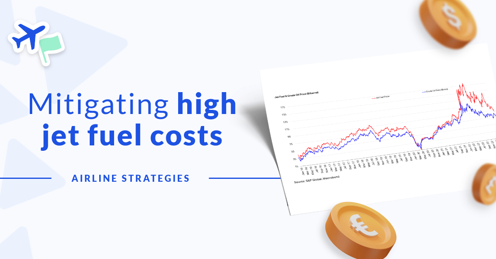

## Table of Contents

## What are the basic concepts of oil price risk in the airline industry?

Oil price risk in the airline industry refers to the uncertainty and potential financial impact that fluctuating oil prices can have on an airline's operations. Airlines rely heavily on jet fuel, which is derived from crude oil, to power their aircraft. When oil prices rise, the cost of jet fuel increases, which can lead to higher operating expenses for airlines. This increase in costs can squeeze profit margins, especially if airlines are unable to pass these costs onto passengers through higher ticket prices. Conversely, when oil prices fall, airlines can benefit from lower fuel costs, which can improve their profitability.

To manage oil price risk, airlines often use various hedging strategies. Hedging involves using financial instruments like futures contracts, options, and swaps to lock in fuel prices for future periods. By doing so, airlines can protect themselves against sudden spikes in oil prices. For example, if an airline hedges a portion of its fuel needs at a certain price and the market price later rises above that level, the airline can save money. However, hedging also comes with its own risks, such as the potential for losses if oil prices move in the opposite direction than expected. Therefore, airlines must carefully balance the benefits and risks of hedging to effectively manage their exposure to oil price fluctuations.

## How do oil prices affect airline operations and profitability?

Oil prices have a big impact on how airlines run and how much money they make. When oil prices go up, the cost of jet fuel, which airlines need to fly their planes, also goes up. This means airlines have to spend more money just to keep flying. If they can't charge passengers more for tickets, their profits go down. Sometimes, airlines might have to cut back on flights or services to save money. On the other hand, when oil prices go down, it's good for airlines because they pay less for fuel. This can help them make more money or even lower ticket prices to attract more passengers.

To handle the ups and downs of oil prices, airlines often use a strategy called hedging. Hedging is like making a bet on what oil prices will be in the future. Airlines can use special financial tools to lock in a price for fuel ahead of time. If oil prices go up after they've hedged, they save money because they're paying the lower price they locked in. But if oil prices go down, they might end up paying more than they need to. So, airlines have to be smart about when and how much they hedge to make sure it helps them more than it hurts.

## What are the common strategies airlines use to manage oil price risk?

Airlines use several strategies to manage the risk of changing oil prices. One common strategy is hedging. Hedging means airlines can buy fuel at a set price for the future. They do this by using financial tools like futures contracts, options, and swaps. If oil prices go up after they hedge, airlines save money because they pay the lower price they locked in. But if oil prices go down, they might pay more than they need to. So, airlines have to be careful about how much and when they hedge.

Another strategy is to be more efficient with fuel. Airlines can do this by using newer, more fuel-efficient planes, planning better flight routes, and training pilots to fly in ways that save fuel. By using less fuel, airlines can reduce the impact of high oil prices on their costs. They might also change their ticket prices. If oil prices go up a lot, airlines might raise ticket prices to cover the extra cost. But they have to be careful because if ticket prices go up too much, fewer people might want to fly.

Sometimes, airlines also look at other ways to make money or save costs. They might start charging for things like checked bags or onboard meals, or they might cut back on less profitable routes. By doing these things, airlines can make up for higher fuel costs and keep their business running smoothly even when oil prices change.

## Can you explain the use of futures contracts in oil price risk management for airlines?

Airlines use futures contracts to manage the risk of changing oil prices. A futures contract is like a promise to buy fuel at a certain price on a future date. If an airline thinks oil prices might go up, they can buy a futures contract now to lock in a lower price. This way, if oil prices do go up, the airline won't have to pay the higher price. They'll pay the price they locked in with the futures contract.

But using futures contracts can be tricky. If oil prices go down after the airline buys the futures contract, they might end up paying more for fuel than they would if they just bought it at the current market price. So, airlines have to guess what will happen to oil prices in the future. They need to balance the risk of paying too much if prices go down with the benefit of saving money if prices go up. This helps them plan their costs better and keep their business running smoothly.

## How do airlines utilize options to hedge against oil price volatility?

Airlines use options to hedge against oil price [volatility](/wiki/volatility-trading-strategies) by buying the right, but not the obligation, to buy fuel at a set price in the future. An option is like a safety net. If oil prices go up, the airline can use the option to buy fuel at the lower price they locked in. This helps them save money because they don't have to pay the higher market price. But if oil prices go down, the airline can just let the option expire and buy fuel at the lower market price instead.

Using options gives airlines more flexibility than futures contracts. With futures, they have to buy the fuel no matter what happens to the price. But with options, they can choose whether to use them or not. This can be really helpful because it lets airlines protect themselves from big price jumps without locking themselves into a bad deal if prices fall. It's like having insurance against high oil prices, but without the risk of losing out if prices drop.

## What role do swaps play in an airline's oil price risk management strategy?

Swaps are another tool airlines use to manage the risk of changing oil prices. A swap is like a deal between the airline and another party, usually a bank. The airline agrees to pay a fixed price for fuel over a certain time, and in return, the bank agrees to pay the airline the difference if the market price goes above that fixed price. This helps the airline because it knows exactly how much it will pay for fuel, no matter what happens to oil prices.

Using swaps can be really helpful for airlines. If oil prices go up, the bank pays the airline the difference, so the airline's costs stay the same. But if oil prices go down, the airline has to pay the bank the difference. This means the airline might miss out on savings if prices drop a lot. Still, swaps give airlines a way to plan their fuel costs and protect themselves from big price jumps, which can help them keep their business running smoothly.

## How can airlines implement a successful hedging program to manage oil price risks?

To implement a successful hedging program, airlines need to first understand their fuel needs and how much they want to protect against price changes. They should look at how much fuel they use each year and decide what part of that they want to hedge. This could be a certain percentage, like 50% or 70%, depending on how much risk they want to take. Airlines also need to think about how long they want to hedge for. Some might hedge for a few months, while others might go for a year or more. It's important to keep checking and changing the hedging plan as oil prices and the airline's needs change.

Once they have a plan, airlines can use different tools like futures contracts, options, and swaps to hedge. They might use futures to lock in a price for fuel, options to have the choice to buy at a set price if it helps, and swaps to pay a fixed price and get help if the market price goes up. It's a good idea to mix these tools to spread out the risk. Airlines should also work with experts who know a lot about oil markets and hedging. By doing this, they can make smart choices and keep their costs under control even when oil prices jump around.

## What are the advantages and disadvantages of different hedging instruments for airlines?

Airlines can use futures contracts to lock in a price for fuel in the future. This can be good because it helps them know exactly how much they will pay, even if oil prices go up. But it can also be bad if oil prices go down, because then they might end up paying more than they need to. Futures are simple to use but they don't give airlines any choice if prices change in their favor.

Options give airlines more flexibility. They can buy the right to get fuel at a certain price, but they don't have to if it's not a good deal. This is great because it lets them save money if oil prices go up, and they can just let the option go if prices go down. The downside is that options cost money upfront, and if oil prices stay the same or go down, airlines lose that money. So, options can be more expensive and a bit more complicated to manage.

Swaps are another tool where airlines agree to pay a fixed price for fuel, and a bank pays them if the market price goes up. This is helpful because it keeps their fuel costs steady, no matter what happens to oil prices. But if oil prices go down, airlines have to pay the bank the difference, which means they miss out on savings. Swaps can be a bit more complex to set up, but they help airlines plan their costs better.

## How do airlines assess and measure the effectiveness of their oil price risk management strategies?

Airlines assess and measure the effectiveness of their oil price risk management strategies by looking at how well they can control their fuel costs. They do this by comparing the actual price they paid for fuel with what they would have paid if they didn't hedge. If the actual price is lower, it means their hedging strategy worked well. They also look at their profit margins to see if hedging helped them make more money or at least kept their costs from going up too much. By keeping an eye on these numbers, airlines can tell if their strategies are helping them manage oil price risks effectively.

Another way airlines measure the effectiveness of their strategies is by using special financial tools and models. These tools help them see how much risk they're taking and how well their hedging is working. They can run different scenarios to see what would happen if oil prices go up or down. This helps them make better decisions and adjust their strategies if needed. By using these tools, airlines can make sure they're doing a good job at managing oil price risks and keeping their business running smoothly.

## What advanced techniques can airlines use to optimize their oil price risk management?

Airlines can use advanced techniques like dynamic hedging to optimize their oil price risk management. Dynamic hedging means they keep changing their hedging strategy based on what's happening with oil prices. They might use computer models to predict how oil prices will move and adjust their futures, options, and swaps accordingly. This way, they can take advantage of good price changes and protect themselves from bad ones. It's like playing a game where they're always trying to make the best move based on the latest information.

Another technique is to use more sophisticated financial tools, like collars. A collar is when an airline buys an option to sell fuel at a high price and another option to buy fuel at a low price. This helps them set a range for their fuel costs, so they know the most they'll have to pay and the least they can get. It's like having a safety net that keeps their costs from going too high or too low. By using these advanced techniques, airlines can manage their oil price risks better and keep their business running smoothly even when oil prices jump around.

## How do global economic factors influence airline oil price risk management strategies?

Global economic factors like the strength of different countries' currencies, inflation rates, and overall economic growth can really change how airlines manage their oil price risks. When the economy is doing well, people might fly more, so airlines might be okay with taking more risks with oil prices. But if the economy is struggling, airlines might be more careful and hedge more to make sure they don't lose money on fuel costs. Also, if the currency of the country where an airline is based gets weaker, it can make oil more expensive because oil is usually bought in U.S. dollars. So, airlines might need to change their hedging strategies to deal with this.

Another important [factor](/wiki/factor-investing) is what's happening in the oil market itself. Things like political problems in oil-producing countries, decisions by oil cartels like OPEC, and new technology for finding and using oil can all make oil prices go up and down. Airlines have to watch these things closely and adjust their hedging plans. For example, if there's a big political problem that might make oil prices go up, airlines might use more futures or options to lock in prices now. By keeping an eye on these global economic factors, airlines can make smarter choices about how to manage their oil price risks and keep their business running smoothly.

## What case studies demonstrate successful and unsuccessful oil price risk management in the airline industry?

Southwest Airlines is a good example of successful oil price risk management. They started hedging fuel prices in the late 1990s and kept doing it even when oil prices were low. This paid off big time when oil prices shot up in the 2000s. While other airlines were struggling with high fuel costs, Southwest saved a lot of money because they had locked in lower prices. Their smart hedging strategy helped them keep ticket prices low and stay profitable, even when oil prices were high. This shows how important it is to stick with a good hedging plan, even when things seem okay.

On the other hand, Delta Air Lines had a tough time with oil price risk management in the early 2000s. They didn't hedge enough when oil prices started going up. This meant they had to pay a lot more for fuel than they expected. It hurt their profits and made it hard for them to compete with other airlines that had better hedging plans. Delta learned from this and started hedging more, but it took a while for them to recover. This case shows how not hedging enough can lead to big problems when oil prices go up suddenly.

## References & Further Reading

[1]: "Airline Fuel Hedging in the US: The Case of Southwest Airlines" by Christopher J. O'Brien, Journal of Air Transport Management, 2013.

[2]: ["Jet Fuel Hedging Strategies: Options and Conflicts in Long-Term Contracts"](https://www.sciencedirect.com/science/article/pii/S0965856418315131) by Fan Wang and Huseyin Topaloglu, Management Science, 2020.

[3]: Culp, Christopher L. "The ART of Risk Management: Alternative Risk Transfer, Capital Structure, and the Convergence of Insurance and Capital Markets." John Wiley & Sons, 2002.

[4]: "The Oil Market and Airline Risk Management: A Primer on Oil Price Risk Hedging" by Abderrahmane Selmi and Besma Smida, Journal of Air Transport Studies, 2016.

[5]: Hull, John C. "Options, Futures, and Other Derivatives." 9th Edition, Pearson, 2014.

[6]: ["Algorithmic Trading & DMA: An Introduction to Direct Access Trading Strategies"](https://archive.org/details/algorithmictradi0000john) by Barry Johnson.

[7]: "The Use of Derivatives in Financial Risk Management: A Study of Southwest Airlines" by Andrew Inkpen and Michael H. Moffett, Thunderbird School of Global Management.