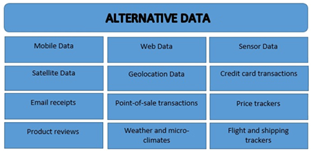

## Table of Contents

## What is alternative data in the context of airlines?

Alternative data in the context of airlines refers to information that comes from sources outside of traditional financial statements and company reports. This can include data like flight booking numbers, passenger traffic, and even satellite images of airport activity. Airlines and investors use this data to get a better understanding of how well an airline is doing, beyond what they can see in regular financial reports.

For example, by looking at the number of flights booked or the number of passengers, analysts can predict future revenue and see trends that might not be obvious from financial statements alone. This kind of data helps airlines make smarter decisions about routes, pricing, and other business strategies. It also helps investors decide whether to buy or sell airline stocks based on real-time operational insights.

## How can alternative data be sourced for airlines?

Alternative data for airlines can be sourced from many places. One way is by using data from booking platforms like Expedia or Kayak. These platforms show how many people are booking flights, which can tell us about how busy airlines might be in the future. Another source is data from credit card companies. When people buy plane tickets with their credit cards, this information can show how much money is being spent on flights.

Another way to get [alternative data](/wiki/best-alternative-data) is through satellite images. These images can show how many planes are at an airport, which can tell us how busy that airport is. Social media is also a good source. People often post about their travel plans on social media, and this can give clues about where people are flying to and how often. By looking at all these different kinds of data, airlines and investors can get a better picture of what's happening in the airline industry.

## What types of alternative data are relevant to the airline industry?

Alternative data for the airline industry can come from many places. One type is booking data from travel websites like Expedia or Kayak. This data shows how many people are booking flights, which can help predict how busy airlines will be. Another type is credit card transaction data. When people use their credit cards to buy plane tickets, this information can tell us how much money is being spent on flights.

Satellite images are also a useful source of alternative data. These images can show how many planes are at an airport, which gives a good idea of how busy that airport is. Social media is another important source. People often share their travel plans on platforms like Twitter or Instagram, and this can provide clues about where people are flying to and how often they are traveling.

By looking at all these different kinds of data, airlines and investors can get a better understanding of the industry. This helps them make smarter decisions about routes, pricing, and other business strategies. It also helps investors decide whether to buy or sell airline stocks based on real-time operational insights.

## How can airlines use alternative data to improve operational efficiency?

Airlines can use alternative data to improve their operational efficiency by looking at things like booking numbers and passenger traffic. For example, if they see that a lot of people are booking flights to a certain place, they can add more flights to that route. This helps them use their planes better and make more money. They can also see if some flights are not full and maybe change the times or prices to get more people to fly on those flights.

Another way airlines can use alternative data is by looking at satellite images and social media. Satellite images can show how busy an airport is, which helps airlines plan how many staff they need and when. Social media can tell them where people want to go on vacation, so they can plan their routes better. By using all this information, airlines can make their operations smoother and save money, which makes them more efficient.

## What are the benefits of using alternative data for airlines?

Using alternative data helps airlines understand their business better. They can see how many people are booking flights and where they want to go. This information helps airlines plan their routes and flights better. If they see a lot of people booking flights to a certain place, they can add more flights there. This way, they can make more money and use their planes more efficiently. It also helps them see if some flights are not full, so they can change the times or prices to get more passengers.

Alternative data also helps airlines save money and work better. By looking at satellite images, airlines can see how busy an airport is. This helps them plan how many staff they need and when. Social media can show where people want to go on vacation, so airlines can plan their routes to match what people want. Using all this information makes airlines' operations smoother and helps them spend less money. This makes the whole airline business more efficient and successful.

## What are the challenges and limitations of using alternative data in the airline industry?

Using alternative data in the airline industry can be tricky because it's not always easy to get. Some data, like booking numbers or credit card transactions, might be hard to access because it's private or protected. Also, airlines might need to pay a lot of money to get this data from companies that collect it. Another problem is that the data might not be complete or accurate. For example, not everyone uses social media to talk about their travel plans, so the data from social media might not show the full picture.

Another challenge is that alternative data can be hard to understand and use. It often comes in big amounts and from many different places, so it can take a lot of time and special skills to make sense of it all. Airlines need people who know how to look at this data and turn it into useful information. Also, even if the data is good, it might not always be right for making decisions. For example, just because a lot of people are talking about a place on social media doesn't mean they will actually buy tickets to go there. So, airlines have to be careful about how they use this data to make choices.

## How does alternative data help in predicting airline demand and pricing?

Alternative data helps airlines predict demand by looking at things like booking numbers and credit card transactions. When airlines see a lot of people booking flights to a certain place, they know that demand for that route is high. They can then add more flights or increase the size of the planes they use on that route. This helps them make sure they have enough seats for everyone who wants to fly. Credit card data also shows how much money people are spending on flights, which helps airlines understand how much people are willing to pay.

This information also helps airlines set their prices better. If they see that demand for a certain route is going up, they might raise the prices for those flights. But if they see that not many people are booking flights on a certain route, they might lower the prices to attract more passengers. By using alternative data, airlines can change their prices to match what people want and how much they are willing to spend. This makes sure they can fill their planes and make more money.

## Can alternative data improve customer satisfaction in airlines? If so, how?

Alternative data can help airlines make customers happier by understanding what they want better. For example, by looking at booking data and social media, airlines can see where people want to go and plan more flights to those places. If customers see that their favorite destinations have more flights, they are more likely to book with that airline. Also, if airlines see that a lot of people are complaining about long waits at the airport, they can use satellite images to see how busy the airport is and add more staff to help customers faster. This makes the travel experience smoother and more enjoyable for everyone.

Another way alternative data helps is by helping airlines set better prices. When airlines look at credit card data, they can see how much people are willing to pay for flights. If they see that people are not booking flights because the prices are too high, they can lower the prices to make it easier for more people to fly. This makes customers happier because they feel like they are getting a good deal. By using alternative data to understand and meet customer needs, airlines can improve how satisfied their customers are with their service.

## What role does machine learning play in analyzing alternative data for airlines?

Machine learning helps airlines make sense of the big amounts of alternative data they get. It can look at things like booking numbers, credit card data, and social media posts to find patterns that people might not see. For example, [machine learning](/wiki/machine-learning) can figure out which routes are getting more popular and when people like to travel. This helps airlines plan their flights better and make sure they have enough seats for everyone who wants to fly.

Machine learning also helps airlines set their prices in a smart way. By looking at all the data, it can tell when people are willing to pay more for flights and when they want cheaper tickets. This way, airlines can change their prices to match what people want. Using machine learning makes it easier for airlines to use alternative data to make their customers happier and run their business better.

## How can airlines ensure the privacy and security of alternative data?

Airlines need to be careful with alternative data because it often includes private information about people. They should follow rules like the General Data Protection Regulation (GDPR) in Europe or other privacy laws in different countries. This means they have to keep data safe and only use it in ways that people agree to. Airlines can do this by using strong security measures like encryption to protect data when it's being sent and stored. They should also make sure only the right people can see the data by using things like passwords and access controls.

Another way airlines can keep alternative data private and secure is by working with trusted companies that collect and share the data. These companies should also follow strict rules about privacy and security. Airlines can check that these companies are doing a good job by asking for reports and making sure they have good security practices. By taking these steps, airlines can use alternative data to help their business while still keeping people's information safe.

## What case studies exist where alternative data has significantly impacted airline operations?

One good example of alternative data helping airlines is when American Airlines used data from booking websites to see which flights were popular. They saw that a lot of people were booking flights to Hawaii, so they added more flights there. This helped them make more money because they had more seats for people who wanted to go to Hawaii. It also made their customers happy because it was easier to find flights to their favorite place.

Another example is when Delta Air Lines used social media data to understand what people wanted. They saw that a lot of people were talking about wanting to fly to Europe during the summer. Delta then added more flights to Europe during those months. This made it easier for people to travel when they wanted to, and Delta made more money from the extra flights. By using alternative data, Delta could give their customers what they wanted and improve their business.

## What future trends are expected in the use of alternative data within the airline industry?

In the future, airlines will use even more alternative data to make their business better. They will use new kinds of data like weather patterns and health data to plan their flights. For example, if they see that a storm is coming, they can change their flight schedules to avoid delays. Also, if there is a health crisis, like a flu outbreak, they can use health data to know which places might have fewer people traveling. This helps them plan their flights to match what people want and need.

Another trend is that airlines will use more advanced technology like [artificial intelligence](/wiki/ai-artificial-intelligence) (AI) to understand alternative data. AI can look at big amounts of data quickly and find patterns that people might miss. For example, AI can see if more people are booking flights to a certain place because of a big event happening there. Airlines can then add more flights to that place to make sure they can take everyone who wants to go. By using AI and other new technology, airlines can make their customers happier and run their business more smoothly.

## References & Further Reading

[1]: Bergstra, J., Bardenet, R., Bengio, Y., & Kégl, B. (2011). ["Algorithms for Hyper-Parameter Optimization."](https://papers.nips.cc/paper/4443-algorithms-for-hyper-parameter-optimization) Advances in Neural Information Processing Systems 24.

[2]: ["Advances in Financial Machine Learning"](https://www.amazon.com/Advances-Financial-Machine-Learning-Marcos/dp/1119482089) by Marcos Lopez de Prado

[3]: ["Evidence-Based Technical Analysis: Applying the Scientific Method and Statistical Inference to Trading Signals"](https://www.amazon.com/Evidence-Based-Technical-Analysis-Scientific-Statistical/dp/0470008741) by David Aronson

[4]: ["Machine Learning for Algorithmic Trading"](https://github.com/PacktPublishing/Machine-Learning-for-Algorithmic-Trading-Second-Edition) by Stefan Jansen

[5]: ["Quantitative Trading: How to Build Your Own Algorithmic Trading Business"](https://books.google.com/books/about/Quantitative_Trading.html?id=j70yEAAAQBAJ) by Ernest P. Chan