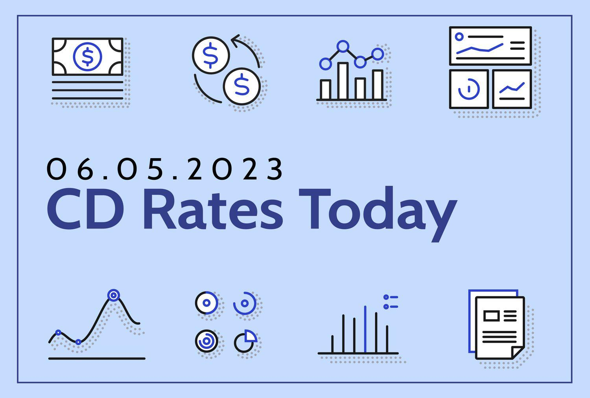

The aviation industry, a cornerstone of global connectivity and commerce, has been plagued by persistent consumer issues that affect millions of passengers each year. Common problems such as flight delays, cancellations, and lost luggage are not only inconveniences but also contribute to significant financial and emotional distress. Addressing these complaints is crucial, as unresolved issues can erode consumer trust and loyalty, ultimately impacting an airline's reputation and profitability.

Airlines operate in an ecosystem that is deeply interconnected with technological advancements, including the burgeoning field of algorithmic trading. Algorithmic trading, which involves using computer algorithms to execute trades based on various market signals, finds relevance in the airline industry as consumer sentiment and public complaints increasingly impact airline stock prices. The correlation between passenger dissatisfaction and market performance underscores the economic significance of addressing consumer issues effectively.

The purpose of this article is to explore the intricacies of common airline complaints, identify the airlines that frequently face the most consumer grievances, and comprehend how data analysis and technological tools can provide actionable insights. By examining these aspects, stakeholders can understand the broader impact of customer satisfaction on the financial dynamics of the airline industry and leverage this understanding to improve service and operational efficiency.

## Table of Contents

## Understanding Common Airline Complaints

Airline complaints are a significant aspect of the aviation industry, with passengers frequently citing delays, cancellations, and lost luggage as primary concerns. Such issues directly impact consumer satisfaction and can cause substantial financial and emotional distress to affected individuals.

**Frequent Issues Faced by Passengers**  
Delays in flight operations are one of the most common complaints among airline passengers. These delays can stem from various causes, such as technical malfunctions, adverse weather conditions, or inefficiencies in scheduling. Flight cancellations, while less frequent than delays, result in more significant disruption to travel plans and often lead to rebooking challenges and extended waiting periods in airports. Lost or mishandled luggage contributes further to passenger dissatisfaction, creating logistical headaches and personal distress.

**Customer Service Challenges**  
Customer service quality plays a pivotal role in how passengers perceive these operational issues. Airlines often struggle with providing timely and effective assistance, exacerbating the frustration and dissatisfaction of passengers. Inadequate communication, unresponsive staff, and insufficient resolution mechanisms can all negatively impact customer satisfaction. The quality of customer service is crucial not just in addressing immediate passenger grievances but in shaping long-term consumer perceptions of the airline.

**Case Studies of High-Profile Complaints**  
High-profile cases of airline complaints illustrate the severe impacts these issues can have. For example, incidents of passengers being denied boarding against their will, or shown inappropriate customer service responses, have gained considerable media attention. Such cases highlight systemic problems within airline operations and trigger widespread public criticism.

**Financial and Emotional Toll on Consumers**  
The financial implications of airline complaints can be substantial for consumers. Delays and cancellations often lead to additional expenses, such as accommodation costs, meals, and alternative transport arrangements, not to mention the indirect costs associated with missed business opportunities or personal events. The emotional toll includes stress, anxiety, and frustration, which are intensified when complaints remain unresolved or inadequately addressed.

In conclusion, understanding the nature and impact of common airline complaints is essential for both consumers and operators within the industry. Addressing these issues not only enhances consumer satisfaction but also strengthens the resilience and reputation of airlines in an increasingly competitive market.

## Identifying the Worst Airlines for Consumer Issues

To identify the worst airlines concerning consumer issues, it is crucial first to establish the criteria used for assessment. The primary metrics considered are the [volume](/wiki/volume-trading-strategy) and severity of passenger complaints related to delays, cancellations, lost luggage, and customer service inadequacies. These factors contribute significantly to customer dissatisfaction and, consequently, to the airline's overall performance reputation.

Recent data from regulatory bodies and independent surveys provide insights into airline performance. For instance, the U.S. Department of Transportation compiles reports on the number of complaints filed against each airline, which are publicly accessible and serve as a basis for evaluating airline service quality. These reports typically include metrics such as:

- **On-time performance**: The percentage of flights that depart and arrive within the scheduled times. Delays are a common source of complaints and reflect on operational efficiency.
- **Cancellation rate**: The frequency with which flights are canceled, causing significant inconvenience to passengers.
- **Baggage handling**: The number of incidents involving lost, damaged, or delayed luggage.
- **Customer service ratings**: Feedback related to passenger interactions with airline staff, both onboard and when handling complaints or service issues.

Airlines that frequently appear in these reports with negative metrics tend to earn a poor service reputation. Notable mentions often include carriers that have been consistently highlighted for subpar service. According to various consumer reports and analyses, airlines such as Spirit Airlines, Frontier Airlines, and American Airlines have been intermittently criticized for issues ranging from customer service to operational inefficiencies.

The impact of a negative reputation extends beyond customer dissatisfaction; it can have substantial economic consequences for an airline. Poor service can result in decreased customer loyalty and reduced repeat business. Moreover, public perception and consumer sentiment are increasingly influential in the financial markets, affecting an airline's stock performance.

The relationship between service quality and stock performance can be explored using [algorithmic trading](/wiki/algorithmic-trading) models, which analyze data such as consumer sentiment. A negative shift in public perception, often based on an uptick in complaints or high-profile service failures, can trigger sell-offs by traders using automated systems. This reaction can negatively influence an airline's stock price, reinforcing the need for airlines to invest in service improvements.

In summary, identifying the worst airlines concerning consumer issues involves examining both quantitative performance data and qualitative consumer feedback. Such analysis underscores the importance of maintaining high service standards to ensure consumer satisfaction and sustain financial stability.

## How Algorithmic Trading Relates to the Airline Industry

Algorithmic trading, also known as automated trading, refers to the use of computer programs and systems to execute financial market transactions at optimal speeds and conditions. Over the past few years, algorithmic trading has found increasing applications across various industries, including finance, commodities, and currencies. It makes use of complex algorithms to analyze a massive volume of financial data and identify trading opportunities, often leveraging minute market inefficiencies.

In the airline industry, the impact of consumer sentiment and complaints is particularly significant. Consumer feedback, especially negative sentiment from delays and poor service experiences, can drastically influence the stock prices of major airline companies. Algorithms designed to track and interpret such consumer data can anticipate market trends, allowing traders to make informed decisions. For instance, a sudden influx of consumer complaints reported across various platforms might signal potential future disruptions in service and operations, which could lead to a drop in an airline's stock price.

Algorithmic trading systems capitalize on these signals by integrating sentiment analysis tools that scan news headlines, social media activities, and consumer reviews to ascertain public sentiment. These systems can quickly recognize patterns or spikes in negative sentiment and execute trades based on these indicators. For example, a trading algorithm might monitor hashtags related to a specific airline on social media. Upon detecting a sharp rise in complaints, the algorithm could trigger a sell order for that airline's stocks, predicting a likely dip in share price.

Historical market reactions provide insight into the effectiveness of these trading approaches. For instance, when an airline experiences a high-profile service failure—such as widespread cancellations due to technical issues—media coverage and consumer backlash are typically swift. Algorithmic systems tuned to react to such external stimuli can adjust their trading strategies, causing notable fluctuations in stock prices. 

One famous example is the United Airlines incident in April 2017, where a passenger was forcibly removed from an overbooked flight. The news rapidly spread across global media, leading to significant public outrage and pushed United Continental Holdings Inc.'s share price down by over 2% in the days following the incident. Algorithmic trading systems that had integrated sentiment analysis might have responded to the negative press and social media dynamics, executing trades that capitalized on the fluctuation in United's stock price.

In conclusion, the connection between algorithmic trading and the airline industry exemplifies the awareness of trading strategies to real-world consumer dynamics. By leveraging consumer sentiment analysis, these systems allow market participants to anticipate price movements and optimize their trading decisions in response to the complex interplay of airline operations and public perception.

## Strategies for Airlines to Address Consumer Issues

Airlines globally confront numerous consumer issues, prompting the need for effective strategies to enhance customer satisfaction. Implementing consumer feedback systems stands as a crucial first step in addressing these challenges. By establishing robust feedback channels, airlines can gather valuable insights directly from passengers, enabling them to identify and rectify service shortcomings promptly. Successful feedback mechanisms should integrate multi-channel approaches, including in-flight surveys, mobile applications, and social media platforms. By actively listening to consumer concerns and demonstrating responsiveness, airlines can foster improved customer relations and service quality.

Incorporating technology and [artificial intelligence](/wiki/ai-artificial-intelligence) (AI) into operations offers airlines significant potential to minimize delays and enhance customer experiences. AI-driven predictive analytics can forecast potential disruptions by analyzing variables such as weather patterns, air traffic, and aircraft maintenance requirements. For instance, implementing a [machine learning](/wiki/machine-learning) algorithm that processes historical delay data can help optimize flight schedules, thereby reducing the incidence of delays. By embracing technology, airlines can automate routine processes, decrease human error, and ensure smoother operations, ultimately improving customer satisfaction.

Several airlines have successfully transformed their consumer ratings by adopting innovative strategies. For example, Delta Air Lines' investment in operational reliability and customer service initiatives has led to improved on-time performance and higher consumer satisfaction. Delta's implementation of real-time baggage tracking through its mobile application is a practical illustration of using technology to enhance the customer experience. By providing passengers with transparency regarding the location of their luggage, Delta effectively mitigates one of the most common consumer complaints — lost baggage.

Transparency and accountability play vital roles in establishing consumer trust and loyalty. Airlines that cultivate a transparent culture by openly communicating about flight delays, cancellations, and other disruptions tend to garner more consumer goodwill. Initiatives such as publishing on-time performance [statistics](/wiki/bayesian-statistics) and offering clear compensation policies for disrupted travel underscore an airline's commitment to accountability. Moreover, fostering transparency in pricing structures and ancillary fees builds trust, as passengers appreciate clarity regarding the total cost of their travel.

In conclusion, the airline industry can significantly enhance consumer satisfaction by employing strategic measures focused on feedback systems, technological advancements, and transparency. By prioritizing consumer needs and leveraging data-driven approaches, airlines can not only address existing challenges but also position themselves more favorably in a competitive market.

## Conclusion

Addressing airline complaints is crucial for enhancing consumer satisfaction levels, as it directly impacts passengers’ perceptions and experiences. Resolving these issues not only helps maintain customer loyalty but also improves the airline's image, ultimately contributing to its market position and financial success. With growing competition, an airline's ability to efficiently address customer issues can become a key differentiator.

Consumer issues are intrinsically linked to the economic performance of airlines. Delays, cancellations, and lost luggage not only strain customer relations but can also lead to financial setbacks such as compensations and operational costs. Moreover, these consumer complaints often feed into public sentiment, which can influence stock prices. The infamous case of United Airlines in 2017, when a violent passenger removal resulted in a significant public backlash and a sharp decline in its stock price, exemplifies the economic consequences of ignoring consumer satisfaction.

The future of the airline industry in this era of data and technology is geared towards leveraging advanced solutions to enhance service delivery and operational efficiency. By harnessing big data, airlines can predict passenger needs and improve upon bottlenecks that traditionally result in complaints. Machine learning algorithms are increasingly employed to foresee potential delays and optimize customer service processes, thus minimizing the likelihood of dissatisfaction.

For sustainable growth, continuous improvement and responsiveness to consumer needs must remain at the forefront of airline strategies. Implementing effective feedback systems, ensuring transparency in operations, and maintaining accountability will foster a culture of trust and reliability. These practices help in transforming sporadic complaints into opportunities for innovation and advancement.

Ultimately, an airline's commitment to addressing consumer complaints and enhancing service quality is vital for its long-term success. A forward-thinking approach, combined with a robust technological framework, will not only improve satisfaction but also solidify an airline's standing in an increasingly competitive industry.

## References & Further Reading

[1]: Forbes. (2020). ["The Airlines With The Most Customer Complaints."](https://www.forbes.com/sites/laurabegleybloom/2020/05/20/ranked-best-worst-airlines-america-2020/)

[2]: U.S. Department of Transportation. (2022). ["Air Travel Consumer Reports."](https://www.transportation.gov/individuals/aviation-consumer-protection/air-travel-consumer-reports-2022)

[3]: López de Prado, M. (2018). ["Advances in Financial Machine Learning."](https://www.amazon.com/Advances-Financial-Machine-Learning-Marcos/dp/1119482089) Wiley.

[4]: Jansen, S. (2020). ["Machine Learning for Algorithmic Trading: Predictive Models to Extract Signals from Market and Alternative Data for Systematic Trading Strategies with Python."](https://www.amazon.com/Machine-Learning-Algorithmic-Trading-alternative/dp/1839217715) Packt Publishing.

[5]: Aronson, D. (2011). ["Evidence-Based Technical Analysis: Applying the Scientific Method and Statistical Inference to Trading Signals."](https://www.wiley.com/en-us/Evidence+Based+Technical+Analysis%3A+Applying+the+Scientific+Method+and+Statistical+Inference+to+Trading+Signals-p-9780470008744) Wiley.

[6]: Chan, E. P. (2009). ["Quantitative Trading: How to Build Your Own Algorithmic Trading Business."](https://github.com/ftvision/quant_trading_echan_book) John Wiley & Sons.