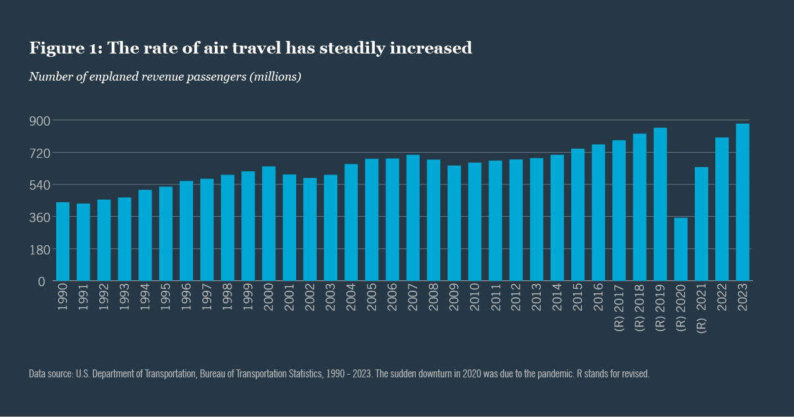

## Table of Contents

## What are Airport Revenue Bonds?

Airport Revenue Bonds are a type of bond that airports use to raise money. When an airport needs to build new facilities or improve existing ones, it can issue these bonds. Investors buy the bonds, and the airport uses the money to make the improvements. In return, the airport promises to pay back the investors with interest over time. The payments come from the money the airport makes from things like landing fees, passenger fees, and renting space to shops and restaurants.

These bonds are considered safe because they are backed by the revenue the airport earns. If the airport does well and more people use it, it can make more money and pay back the bonds easily. However, if fewer people use the airport, it might struggle to make the payments. Because of this, investors look at how busy the airport is and how well it is managed before deciding to buy the bonds. Overall, Airport Revenue Bonds help airports grow and improve without using taxpayer money directly.

## How do Airport Revenue Bonds differ from general obligation bonds?

Airport Revenue Bonds and general obligation bonds are two different ways that governments or public entities can borrow money. The main difference is where the money comes from to pay back the bonds. Airport Revenue Bonds are paid back using the money the airport makes from its operations, like fees from passengers and airlines, and money from shops and restaurants at the airport. This means that if the airport does well, it can easily pay back the bonds, but if it doesn't do well, it might have trouble.

On the other hand, general obligation bonds are backed by the full faith and credit of the government that issues them. This means that the government promises to use its power to raise taxes or use other general funds to pay back these bonds. Because of this, general obligation bonds are often seen as safer for investors, since the government has more ways to get the money to pay them back. However, this also means that taxpayers might have to pay more if the government needs to raise taxes to cover the bond payments.

In summary, Airport Revenue Bonds rely on the specific revenue from the airport, while general obligation bonds rely on the broader financial resources of the government. This difference affects how safe investors think the bonds are and how the payments are made.

## What are the primary sources of revenue for Airport Revenue Bonds?

The main ways airports make money to pay back Airport Revenue Bonds are from the fees they charge airlines and passengers. When airplanes land at the airport, the airlines have to pay a landing fee. Also, when people fly, they might have to pay a passenger facility charge. These fees add up and help the airport earn money to pay back the bonds.

Another big source of money comes from the shops, restaurants, and other businesses at the airport. Airports rent out space to these businesses, and the rent money goes into the airport's funds. People often spend money at these places while they wait for their flights, so this can be a lot of money for the airport. Together, these sources help the airport have enough money to pay back the bonds and keep running smoothly.

## Can you explain the process of issuing Airport Revenue Bonds?

When an airport wants to build new things or fix old ones, it can issue Airport Revenue Bonds to get the money it needs. The first step is for the airport to decide how much money it needs and what it will use the money for. Then, the airport works with a bank or a financial advisor to figure out the details of the bonds, like how long they will last and what interest rate they will pay. Once everything is set, the airport asks a group called a bond rating agency to look at the plan and give it a rating. This rating tells investors how safe the bonds are.

After the bonds get a rating, the airport can start selling them. It does this by having a big sale where investors can buy the bonds. The airport might work with banks or other companies to help sell the bonds to as many people as possible. When investors buy the bonds, they give the airport the money it needs for its projects. In return, the airport promises to pay back the investors over time, using the money it makes from things like landing fees, passenger fees, and rent from shops and restaurants at the airport. This way, the airport can grow and improve without using taxpayer money directly.

## What are the risks associated with investing in Airport Revenue Bonds?

Investing in Airport Revenue Bonds can be risky because the money to pay back the bonds comes from what the airport earns. If fewer people use the airport, it might not make enough money to pay back the investors. Things like a bad economy, a big health crisis, or even new travel rules can make fewer people fly, which means less money for the airport. Also, if the airport doesn't manage its money well or if it spends too much on building new things, it might struggle to pay back the bonds.

Another risk is that the interest rates might change. If interest rates go up after you buy the bonds, new bonds might pay more interest than yours. This can make your bonds worth less if you want to sell them before they are paid back. Also, the bonds are only as good as the airport's promise to pay them back. If the airport goes bankrupt or has big problems, it might not be able to pay back the investors at all. So, it's important to think about these risks before deciding to invest in Airport Revenue Bonds.

## How are Airport Revenue Bonds rated by credit rating agencies?

Credit rating agencies look at many things when they rate Airport Revenue Bonds. They check how much money the airport makes from things like landing fees, passenger fees, and rent from shops and restaurants. They also look at how well the airport is run and if it has a good plan for using the money it gets from the bonds. If the airport is busy and makes a lot of money, the bonds might get a high rating, which means they are seen as safe for investors.

On the other hand, if the airport doesn't make much money or if it has a lot of debt, the bonds might get a lower rating. This means they are seen as riskier. The rating agencies also think about what could go wrong, like a bad economy or fewer people flying. If these things could hurt the airport's money a lot, the bonds might get a lower rating. So, the rating shows how likely it is that the airport will be able to pay back the investors.

## What role do Airport Revenue Bonds play in airport development and expansion?

Airport Revenue Bonds help airports grow and get better. When an airport wants to build new things like bigger terminals or longer runways, it can use these bonds to get the money it needs. Instead of using taxpayer money, the airport borrows money from investors who buy the bonds. The airport then uses the money to make the improvements it wants. This way, the airport can keep up with more people flying and make the airport a nicer place for everyone.

The money to pay back the bonds comes from what the airport earns. This includes fees from airlines when they land their planes, fees from passengers, and rent from shops and restaurants at the airport. If the airport does well and more people use it, it can easily pay back the investors. This makes Airport Revenue Bonds a good way for airports to grow without putting a big burden on taxpayers. It helps airports stay modern and handle more flights and passengers, which is important for the places they serve.

## How do changes in air travel demand impact the performance of Airport Revenue Bonds?

Changes in how many people want to fly can really affect how well Airport Revenue Bonds do. If more people start flying, the airport makes more money from things like landing fees and passenger fees. This extra money helps the airport pay back the bonds more easily. It also means the airport can keep growing and improving, which makes it even more attractive to passengers and airlines. So, when air travel demand goes up, it's good news for the people who invested in the bonds.

On the other hand, if fewer people want to fly, it can be tough for the airport. Less money coming in from fees and shops means it might be hard for the airport to make the payments on the bonds. Things like a bad economy, health scares, or new travel rules can make fewer people fly. If the airport can't make enough money, it might struggle to pay back the investors. This makes Airport Revenue Bonds riskier when air travel demand goes down.

## What are the tax implications for investors in Airport Revenue Bonds?

When you invest in Airport Revenue Bonds, you get to enjoy some tax benefits. The interest you earn from these bonds is usually not taxed by the federal government. This means you get to keep more of the money you make from the bonds. Some states also don't tax this interest, but it depends on where you live and where the airport is located. So, it's a good idea to check the rules in your state to see if you have to pay any state taxes on the interest.

However, there are a few things to keep in mind. If you sell your Airport Revenue Bonds before they mature and make a profit, you might have to pay capital gains tax on that profit. Also, if you use the money from these bonds to pay for things like college tuition, you might be able to get some special tax breaks. But these rules can be tricky, so it's always smart to talk to a tax advisor to make sure you understand all the tax implications of investing in Airport Revenue Bonds.

## How do regulatory changes affect the issuance and management of Airport Revenue Bonds?

Regulatory changes can have a big impact on how airports issue and manage Airport Revenue Bonds. When new rules come out, they might change how much money airports can charge for things like landing fees or passenger fees. If the rules make it harder for airports to earn money, it might be tougher for them to pay back the bonds. Also, new regulations might make it more expensive or complicated for airports to build new things or improve old ones, which could affect how much they need to borrow and how they use the money from the bonds.

On the other hand, some regulatory changes might help airports and make Airport Revenue Bonds safer for investors. For example, if the government gives airports more freedom to set their own fees or if new rules help airports attract more passengers, the airports could make more money. This would make it easier for them to pay back the bonds. It's important for investors to keep an eye on regulatory changes because they can change how risky or safe the bonds are.

## What are some case studies of successful Airport Revenue Bond projects?

One successful example of an Airport Revenue Bond project is the expansion of Denver International Airport. A few years ago, the airport needed to build a new concourse to handle more passengers and bigger airplanes. They issued Airport Revenue Bonds to get the money they needed. The project was a big success because more people started flying through Denver, and the airport made a lot of money from fees and shops. This extra money helped them pay back the bonds easily, and now the airport can handle even more flights and passengers.

Another good example is the modernization of Hartsfield-Jackson Atlanta International Airport. The airport wanted to update its facilities to make them nicer and more efficient. They used Airport Revenue Bonds to pay for the improvements, like new baggage systems and better terminals. The project worked out well because more people liked using the airport, and it made more money from fees and businesses inside the airport. This money helped them pay back the bonds without any problems, and now the airport is one of the best in the world.

## What advanced financial strategies can be used to optimize the returns from Airport Revenue Bonds?

One way to get more out of Airport Revenue Bonds is by using a strategy called bond laddering. This means buying bonds that mature at different times. For example, you could buy some bonds that will be paid back in one year, some in three years, and some in five years. This way, you can get your money back at different times and use it to buy new bonds if interest rates go up. It also helps spread out the risk because if something bad happens to the airport, you won't lose all your money at once.

Another strategy is to use a bond swap. This is when you sell your old bonds and use the money to buy new ones that might pay more interest or have a better rating. If interest rates go up, you can swap your old bonds for new ones with a higher interest rate. This can help you make more money over time. But you need to be careful because you might have to pay taxes on any profit you make from selling the old bonds, so it's important to think about that before you decide to do a swap.

## What are revenue bonds?

Revenue bonds represent a category of municipal bonds that differ fundamentally from general obligation bonds by being secured by specific revenue streams rather than relying on taxation. These financial instruments have become instrumental in funding projects that generate their own income, making them particularly suitable for ventures that carry the potential to produce consistent financial returns.

Primarily, revenue bonds are utilized to finance initiatives such as toll roads, public utilities, and airports. The core attribute of these bonds lies in their dependence on the revenue generated by the specific project they finance. This distinctive feature offers both advantages and challenges to issuers. The repayment to bondholders is primarily contingent on the successful operation and revenue generation of the underlying project. Consequently, while revenue bonds allow municipalities to undertake large-scale, income-generating infrastructure projects without imposing a tax burden, they also entail a higher risk, as the repayment hinges on the project's ability to sustain its income streams.

The logic behind revenue bonds can be illustrated through the following simplified formula representing the repayment structure:

$$
\text{Bond Repayment} = \text{Revenue from Project} - \text{Operational Costs}
$$

In this equation, the funds available for covering interest payments and the eventual repayment of principal are determined by subtracting the operational costs from the total revenue generated by the project. This underscores the critical importance of efficient project management and revenue forecasting in the context of revenue bonds. 

Overall, revenue bonds offer a flexible mechanism for funding projects by aligning repayment obligations with the economic success of the ventures they support, thereby fostering a direct correlation between infrastructure development and financial solvability.

## References & Further Reading

[1]: Federal Aviation Administration (FAA). ["Guidance on Airport Revenue Bonds."](https://www.faa.gov/airports/airport_compliance)

[2]: Lopez, A. (2011). ["Financing Airport Infrastructure: The Use of Airport Revenue Bonds."](https://crsreports.congress.gov/product/pdf/R/R43327) Transportation Research Record.

[3]: Schwieterman, J. P., & Schulz, K. (2002). ["Airline Access to Airport Facilities and Exclusive Use: Implications for Airport Revenue Bonds."](https://fraser.stlouisfed.org/title/rand-mcnally-bankers-directory-105/july-1920-583405/content/fulltext/rmbd_192007_06_newyork) Transportation Research Board.

[4]: Gonzalez, G. H., & Vickery, G. (2016). ["The Role of Algorithmic Trading Enhancements in the Municipal Bond Market."](https://www.sciencedirect.com/science/article/pii/S152550502400619X) SSRN.

[5]: Vickery, J. I. (2016). ["Is Algorithmic Trading Good for Liquidity? Evidence from the Moving Market-Opening Decision."](https://vickery-rebecca-j-.freenovelread.com/418461-surviving_with_love) Reserve Bank of Australia.