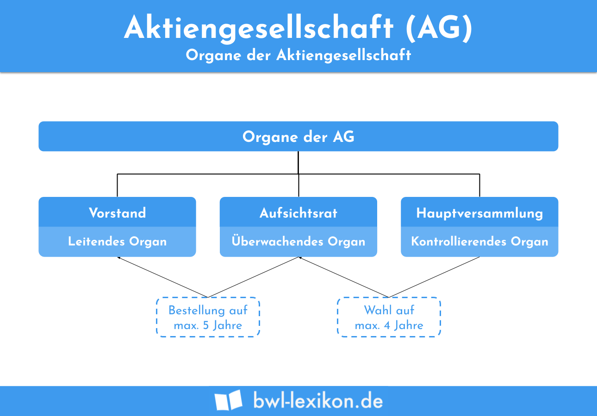

Understanding the evolution of corporate structures is crucial in today's global business environment. As markets become increasingly interconnected, the need for transparent, efficient, and adaptable corporate frameworks becomes more pressing. One such framework that has played a prominent role in Europe, particularly in Germany, is the Aktiengesellschaft (AG). This structure of a public limited company allows for shares to be available to the public and traded on stock exchanges, embodying principles of shareholder protection and corporate transparency.

An Aktiengesellschaft is distinct not only in its legislative origins but also in its operational dynamics. It is governed by stringent legal requirements designed to maintain a balance between the interests of various stakeholders, including shareholders, management, and employees. This article explores the intricacies of AG companies, analyzing how they navigate complex regulatory landscapes and contribute to the financial markets.

Significantly, the AG structure also impacts modern financial strategies such as algorithmic trading. This form of trading, characterized by the use of advanced algorithms and high-speed data processing, is becoming increasingly prevalent. AGs utilize their robust organizational frameworks to embrace these technological advancements, enhancing their trading efficiencies and decision-making capabilities.

For shareholders, the AG model offers a unique blend of protections and opportunities. Their involvement in corporate governance through mechanisms like voting rights in general meetings ensures that their voices are heard in crucial decisions. At the same time, the public nature of AGs allows for potentially significant capital accumulation and risk mitigation through diversified investments.

Overall, understanding the nuances of the Aktiengesellschaft is essential for investors, policy-makers, and business professionals. This knowledge not only aids in better decision-making but also enhances one's ability to navigate and influence a rapidly changing economic landscape.

## Table of Contents

## What is Aktiengesellschaft (AG)?

An Aktiengesellschaft (AG) is a form of public limited company that operates within the framework of German corporate law, designed to facilitate public investment by making shares available for purchase and trade on stock exchanges. This corporate structure is entrenched in a legal framework aimed at maximizing protection for shareholders while ensuring transparency in corporate governance. The concept of an AG is a cornerstone of German commercial activity and is mirrored in several other European jurisdictions.

The origin of the Aktiengesellschaft can be traced back to initiatives focused on channeling capital from a broad group of investors for large ventures. This structure allows companies to pool significant financial resources, while also distributing risk among numerous shareholders. German corporate law, particularly the Aktiengesetz (AktG), sets forth the regulations governing AGs, which are rigorously enforced to maintain the integrity of the financial markets. These regulations encompass aspects such as financial disclosure, corporate governance, and shareholder rights.

For an entity to qualify as an AG, it must adhere to stringent legal and financial criteria, often requiring substantial initial capital and robust governance frameworks. Regulatory oversight ensures AGs operate within defined parameters, with regular audits and reporting obligations aimed at safeguarding investor interests and maintaining market stability. This vigilance in regulatory compliance is pivotal for maintaining investor confidence and fostering a transparent market environment.

Prominent examples of AGs include several large German corporations that have become leaders on the global stage. Notable among these are Volkswagen AG, BMW AG, and the Mercedes-Benz Group AG, each a testament to the capabilities and appeal of the AG structure. These companies have successfully leveraged the AG model for growth, benefiting from the expansive capital-raising potential and enhanced corporate prestige associated with this designation. Through the strategic management and distinct corporate guidelines dictated by the AG framework, these companies continue to thrive in competitive international markets.

## Corporate Structure of AGs

AGs, or Aktiengesellschaften, adopt a distinct corporate structure characterized by a two-tier board system. This system includes a management board (Vorstand) and a supervisory board (Aufsichtsrat), each playing a critical role in the governance and operation of the company.

The management board is responsible for the day-to-day operations and executive management of the AG. This board implements corporate strategies and decisions and manages business activities including production, marketing, and financing. The members of the management board are executives appointed by the supervisory board for a term specified by the company’s articles of association.

The supervisory board, in contrast, functions primarily as an oversight entity. Its responsibilities include monitoring the management board's activities, advising on strategic decisions, and representing the interests of shareholders. The supervisory board has the authority to appoint and dismiss members of the management board, ensuring accountability and alignment with shareholder interests. This board provides strategic input and ensures that the management board runs the company in accordance with legal regulations and corporate policies.

Shareholders of an AG hold voting rights that allow them to influence company policies and board elections. These rights are exercised during general meetings, where shareholders can vote on critical issues such as the composition of the supervisory board, approval of financial statements, and changes in company statutes. Shareholders thus play a direct role in shaping corporate governance and strategic direction.

Employee representation on the supervisory board can be a legal requirement for AGs, dependent on the company's size and the particular legislative framework governing corporate governance in the relevant jurisdiction. In Germany, legislation like the Mitbestimmungsgesetz (Codetermination Act) mandates that a certain portion of supervisory board seats be allocated to employee representatives, ensuring that employees have a voice in corporate matters. This requirement typically applies to larger corporations and emphasizes a balanced approach to stakeholder representation.

The unique two-tier board system of AGs aims to separate management and oversight to enhance transparency, foster accountability, and align the corporation's operations with the interests of various stakeholders, including shareholders and employees. This structure is instrumental in maintaining robust corporate governance, contributing to the effective and efficient functioning of AGs in the broader market context.

## Establishing an AG

Setting up an Aktiengesellschaft (AG) involves a structured process that ensures legal and financial foundations are robustly established. The initial step in the formation of an AG is drafting the articles of association, which serve as the fundamental legal document governing the company's operations. These articles define the company's purpose, structure, and the rights and responsibilities of its shareholders and boards. They must be comprehensive and adhere to the laws specified in the Aktiengesetz, or German Stock Corporation Act.

A critical requirement for forming an AG is meeting the minimum share capital, currently set at €50,000 under German law. This capital must be fully subscribed, emphasizing the commitment to financial stability from the outset. The share capital is divided into shares, offered to the public and private investors, ensuring potential for broad-based shareholder participation.

The incorporation of an AG is formalized through legal authentication by a notary, who certifies that all statutory requirements have been satisfied. Once authenticated, the company must register with the commercial registry (Handelsregister). This registry entry is a public record and includes key information such as company name, registered office, share capital, and details of the management and supervisory boards.

The registration process is aimed at guaranteeing transparency and accountability, thereby protecting shareholder interests. It ensures that all necessary legal conditions are met prior to the commencement of business activities. The due diligence exercised in this process underscores the stringent regulatory framework within which AGs operate, fostering trust and integrity from the inception of the company.

## AGs in Algorithmic Trading

Algorithmic trading, the use of computer algorithms to automate and enhance trading strategies, has gained significant traction among Aktiengesellschaft (AG) companies. These organizations leverage the precision and efficiency of advanced technology, integrating it seamlessly into their trading operations. By employing data-driven strategies, AGs can make more informed and timely decisions in the financial markets.

The incorporation of [algorithmic trading](/wiki/algorithmic-trading) within AGs demands a sophisticated IT infrastructure. This infrastructure serves as the backbone for executing high-speed trading strategies and processing large volumes of data in real-time. The organizational structure of AGs, typically characterized by a two-tier board system, supports such integration by ensuring that decision-making processes are efficient and well-coordinated across different levels of management.

AGs utilize algorithmic trading primarily to improve trading efficiencies, reduce transaction costs, and manage risks more effectively. By harnessing statistical and computational techniques, they can analyze market trends, predict price movements, and execute trades with minimal human intervention. This strategic move towards automation allows AGs to remain competitive in rapidly changing financial markets.

Moreover, scalability is a critical [factor](/wiki/factor-investing) for AGs when implementing algorithmic trading strategies. The ability to scale operations effectively depends on both technological capability and a well-defined corporate governance structure. A robust governance framework ensures that the integration of algorithmic trading aligns with the overall strategic objectives of the company, while also addressing regulatory and compliance requirements.

In summary, the involvement of AGs in algorithmic trading underscores a commitment to leveraging technology for enhanced trading outcomes. Through strategic investments in IT infrastructure and adherence to scalable processes, these companies can optimize their trading activities while maintaining a strong governance framework.

## Advantages of the AG Structure

Aktiengesellschafts (AGs) offer several significant advantages within corporate structures, contributing to their popularity among businesses in Germany and beyond.

Firstly, AGs have the ability to raise substantial capital by offering shares to the public through stock exchanges. This access to public markets allows companies to secure significant funding for expansion, research and development, and other strategic initiatives. This capacity to mobilize considerable financial resources is crucial for companies aiming to compete on a global scale.

Another advantage of the AG structure is the limitation of liability for individual shareholders. Unlike partnerships or sole proprietorships where personal assets can be at risk, shareholders in an AG are only liable to the extent of their investment in the company. This limited liability encourages investment by reducing the financial risk exposure for investors.

AGs also facilitate professional management that operates independently from daily shareholder involvement. The separation of ownership and management allows companies to employ experienced executives to run the company efficiently and strategically without direct interference from shareholders, who may not have the necessary expertise to manage business operations effectively.

Furthermore, the public listing of AGs on stock exchanges enhances their visibility and credibility. Being a publicly traded entity subjects the AG to market scrutiny and regulatory requirements, which can improve corporate governance and operational transparency. This increased visibility can attract more investors and business opportunities.

In summary, the AG structure's ability to gather large amounts of capital while limiting shareholder liability, combined with professional management and the advantages of a public listing, makes it a highly attractive corporate form for businesses seeking sustainable growth and competitiveness in today's market.

## Regulatory Oversight and Obligations

Aktiengesellschafts (AGs) in Germany and similar structures in several European countries operate under stringent regulatory frameworks to ensure transparency, protect investors, and maintain market integrity. One of the fundamental requirements is adherence to comprehensive financial disclosure obligations. This includes the preparation and presentation of annual financial statements that conform to national accounting standards, such as the German Commercial Code (Handelsgesetzbuch, HGB) or International Financial Reporting Standards (IFRS) for companies engaged in international operations. These financial statements must be audited by independent auditors to verify their accuracy and fairness.

Publicly listed AGs face additional layers of reporting and transparency requirements beyond those applicable to private counterparts. These publicly traded corporations must consistently provide detailed and timely information to investors and regulatory bodies, such as the Bundesanstalt für Finanzdienstleistungsaufsicht (BaFin) in Germany. Regular disclosures include quarterly and annual reports, complemented by ad-hoc notifications concerning significant company events or changes in financial performance. They are also required to maintain transparency in executive compensation and disclose potential conflicts of interest that could impact shareholder value.

The regulatory environment mandates a balanced approach to corporate governance, requiring the establishment of internal controls and compliance systems to prevent fraudulent activities and ensure compliance with legal standards. AGs must conduct regular internal audits to assess and improve these controls, aligning their operations with evolving regulatory expectations and industry best practices.

Furthermore, German corporate laws enforce stringent capital maintenance requirements, ensuring that companies maintain sufficient equity levels to cover their operational and investment needs. This involves maintaining a minimum share capital and adhering to rules governing the distribution of profits to shareholders, potentially impacting decisions on dividend payments. Compliance with these requirements supports the financial stability and sustainability of AGs, reinforcing investor confidence and market stability.

## Conclusion

The Aktiengesellschaft (AG) corporate structure presents a unique combination of stringent regulatory oversight, active shareholder participation, and effective management operations. This amalgamation ensures not only transparency and accountability but also provides a robust framework for corporate governance. One of the notable aspects of AGs that highlights their adaptability is their significant involvement in algorithmic trading. This modern financial strategy leverages advanced technological frameworks that AGs are well-equipped to adopt, thanks to their structured approach to governance and decision-making. 

The integration of algorithmic trading within AGs allows these corporations to optimize their trading processes by employing data-driven strategies, enhancing their ability to respond swiftly to market changes while ensuring compliance with regulations. This adaptability underscores the relevance of the AG structure in the continuously evolving financial landscape, making it a strategic asset for companies seeking competitive advantages.

For investors, policy-makers, and business professionals, comprehending the intricacies of AGs becomes crucial. It allows for informed decision-making regarding investments, regulatory frameworks, and corporate governance strategies. The AG model, with its capacity for raising substantial capital while mitigating individual shareholder liability, serves as a compelling blueprint for public companies aiming to achieve long-term sustainability and growth. Understanding its operational nuances can significantly impact investment choices and policy development in today's global market environment.

## References & Further Reading

[1]: Siems, M. (2018). ["Comparative Company Law"](https://www.bloomsbury.com/us/comparative-company-law-9781509909360/). Cambridge University Press.

[2]: Baums, T. (2003). ["The German Banking Sector: Competition, Consolidation and Contentious Issues."](https://www.jstor.org/stable/pdf/840568.pdf) Journal of Financial Regulation and Compliance, 11(2).

[3]: Hopt, K. J. (2011). ["Comparative Corporate Governance: The State of the Art and International Regulation."](https://www.jstor.org/stable/25766180) Oxford Journal of Legal Studies, 59(1).

[4]: ["Advances in Financial Machine Learning"](https://www.wiley.com/en-us/Advances+in+Financial+Machine+Learning-p-9781119482086) by Marcos Lopez de Prado.

[5]: Kübler, F. (2005). ["Fusionskontrolle und Übernahmepolitik im Europäischen Binnenmarkt."](https://fis.uni-bamberg.de/bitstream/uniba/3106/1/Europaeische_FusionskontrolleOCRseA2.pdf) Zeitschrift für Wirtschaftsrecht (ZIP), 24.

[6]: ["Corporate Finance: Theory and Practice"](https://www.wiley.com/en-us/Corporate+Finance%3A+Theory+and+Practice%2C+6th+Edition-p-9781119841623) by Pierre Vernimmen et al.

[7]: Müller, J. (2004). ["Investor Protection in the UK and Germany: Law and Finance Revolution or Evolution?"](https://onlinelibrary.wiley.com/doi/10.1111/j.1540-6261.2011.01713.x) European Company and Financial Law Review. 

[8]: ["Understanding the Company: Corporate Governance and Theory"](https://www.amazon.com/Understanding-Company-Corporate-Governance-Theory/dp/1107146070) by Barnali Choudhury and Martin Petrin.