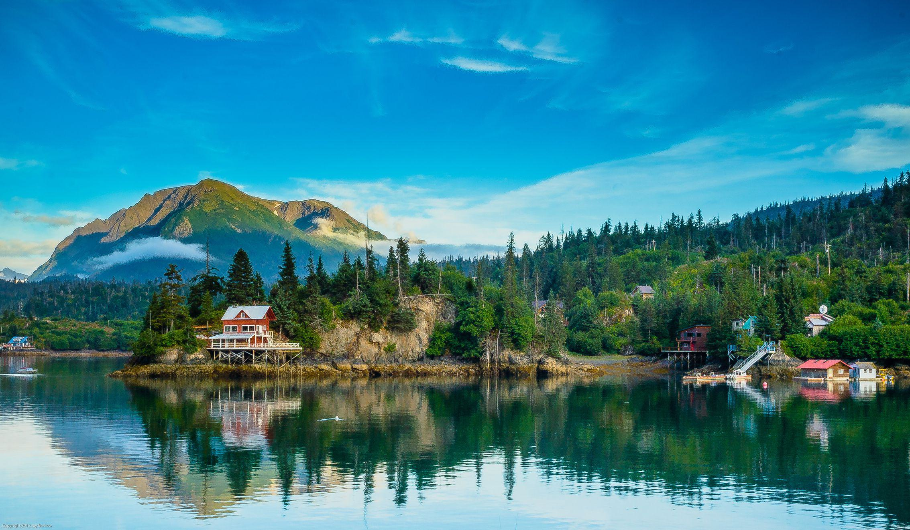

## Table of Contents

## What is the Alaska Permanent Fund?

The Alaska Permanent Fund is a special fund set up by the state of Alaska. It was created in 1976 to save some of the money the state makes from oil. The idea is to use this money for the future, so Alaska can have money even after the oil runs out. Every year, a part of the money from oil goes into the fund, and it is managed to grow over time.

The fund also gives money back to the people of Alaska. Each year, every person who lives in Alaska gets a check from the fund. This is called the Permanent Fund Dividend. It's a way to share the state's oil wealth with all its residents. The amount of money people get can change from year to year, depending on how well the fund is doing.

## How was the Alaska Permanent Fund established?

The Alaska Permanent Fund was set up in 1976. The people of Alaska voted to create it because they wanted to save some of the money they were making from oil. They knew the oil would not last forever, so they wanted to put some of the money away for the future. The idea was to invest the money and let it grow over time, so that Alaska would have money even after the oil was gone.

To get the fund started, the state put 25% of its oil money into it every year. This money comes from the oil that is taken out of the ground in Alaska. The fund is managed by a special group of people called the Alaska Permanent Fund Corporation. They make sure the money is invested wisely and that it grows over time. Every year, some of the money from the fund is given back to the people of Alaska as a check, called the Permanent Fund Dividend. This way, everyone in Alaska gets to share in the state's oil wealth.

## What is the purpose of the Alaska Permanent Fund?

The Alaska Permanent Fund was made to save money for the future. Alaska makes a lot of money from oil, but people knew that the oil would not last forever. So, they decided to put some of that money into a special fund. The fund is like a big savings account that grows over time. The goal is to have money for Alaska even after the oil is gone.

Every year, part of the money from the oil goes into the fund. This money is then invested to make it grow bigger. The fund is managed carefully to make sure it keeps getting bigger. Also, every year, the fund gives money back to the people of Alaska. This money is called the Permanent Fund Dividend, and it's like a check that every person in Alaska gets. This way, everyone in the state can share in the wealth from the oil.

## How does the Alaska Permanent Fund work?

The Alaska Permanent Fund works by taking some of the money that Alaska makes from oil and putting it into a special savings account. This account was started in 1976, and every year, 25% of the state's oil money goes into it. The money in the fund is then invested in things like stocks and bonds to help it grow over time. The idea is to save this money for the future, so that Alaska will have money even after the oil runs out.

The fund is managed by a group called the Alaska Permanent Fund Corporation. They make sure the money is invested wisely and that the fund keeps growing. Every year, a part of the money from the fund is given back to the people of Alaska. This money is called the Permanent Fund Dividend, and it's like a check that every person in Alaska gets. The amount of money people get can change from year to year, depending on how well the fund is doing. This way, everyone in Alaska gets to share in the wealth from the oil.

## Who manages the Alaska Permanent Fund?

The Alaska Permanent Fund is managed by a group called the Alaska Permanent Fund Corporation. They are in charge of making sure the money in the fund is used wisely. The corporation invests the money in things like stocks and bonds to help it grow over time. Their main job is to make sure the fund keeps getting bigger so that it can help Alaska in the future.

The people who work at the Alaska Permanent Fund Corporation are chosen carefully. They have to know a lot about money and investing. The corporation follows rules set by the state to make sure they are doing a good job. This way, the money saved from oil can be used to help everyone in Alaska for a long time.

## What is the Alaska Permanent Fund Dividend (PFD)?

The Alaska Permanent Fund Dividend (PFD) is money that the state of Alaska gives to its residents every year. It comes from the Alaska Permanent Fund, which saves some of the money Alaska makes from oil. The idea is to share the state's oil wealth with everyone who lives in Alaska. Every person who has lived in Alaska for a full year gets a check, and this check is called the PFD.

The amount of money people get from the PFD can change each year. It depends on how well the Alaska Permanent Fund is doing. If the fund grows a lot, people might get more money. If it doesn't grow as much, they might get less. The PFD is a way to make sure everyone in Alaska benefits from the state's oil, even if they don't work in the oil industry.

## How is the amount of the PFD determined each year?

The amount of the Alaska Permanent Fund Dividend (PFD) each year depends on how well the Alaska Permanent Fund is doing. The fund makes money from investing in things like stocks and bonds. Every year, the people who manage the fund figure out how much money they can give away without hurting the fund's growth. They look at the fund's earnings and decide what part of those earnings can be shared with the people of Alaska.

This decision is made by the Alaska Legislature. They look at the money the fund made in the past year and then decide on a percentage of that money to be given out as the PFD. This percentage can change, so the amount of the PFD is different every year. The goal is to balance giving money to the people while also making sure the fund keeps growing for the future.

## What are the sources of revenue for the Alaska Permanent Fund?

The main source of money for the Alaska Permanent Fund comes from the oil that is taken out of the ground in Alaska. Every year, the state puts 25% of its oil money into the fund. This oil money comes from taxes and royalties that oil companies pay to the state for drilling in Alaska.

Besides oil money, the fund also grows by investing the money it has. The people who manage the fund put the money into things like stocks and bonds. These investments can make more money, which helps the fund get bigger over time. This way, the fund can keep growing even when the oil money is not coming in as much.

## How has the Alaska Permanent Fund performed historically?

The Alaska Permanent Fund has done pretty well over the years. It started in 1976 with just the money from oil, but now it's grown a lot because of smart investing. By the end of 2022, the fund was worth over $77 billion. That's a lot of money! The fund has had some ups and downs, just like any big investment, but overall, it has grown bigger and bigger. The people who manage the fund work hard to make sure it keeps growing, even when the oil money isn't coming in as much.

One of the big reasons the fund has done well is because it invests in a lot of different things. It puts money into stocks, bonds, and even real estate. This helps spread out the risk, so if one type of investment doesn't do well, the others might still be doing okay. Over the years, the fund has made money from these investments, which has helped it grow even more. The people of Alaska are happy about this because it means they get more money in their yearly checks from the fund.

## What are the investment strategies of the Alaska Permanent Fund?

The Alaska Permanent Fund uses a mix of different investments to grow its money. It puts money into stocks, which are parts of companies, and bonds, which are like loans to companies or governments. The fund also invests in real estate and other things like infrastructure. This mix of investments helps spread out the risk, so if one type of investment doesn't do well, the others might still be okay. The people who manage the fund look at a lot of different things to decide where to put the money, like how the economy is doing and what might happen in the future.

The main goal of the fund's investment strategy is to make sure the money keeps growing over time. They try to balance the need to make money now with the need to keep the fund strong for the future. The fund has to be careful not to take too many risks, but it also can't be too safe, or it won't grow enough. By investing in a lot of different things and always keeping an eye on how the world is changing, the Alaska Permanent Fund tries to make sure it can keep giving money to the people of Alaska for a long time.

## How does the Alaska Permanent Fund impact Alaska's economy?

The Alaska Permanent Fund helps the economy of Alaska in big ways. Every year, the fund gives money to the people of Alaska through the Permanent Fund Dividend. This money lets people spend more on things they need and want, which helps stores and businesses in Alaska. When people spend more, it can make the economy grow because businesses might hire more people or open new stores. The fund also helps the state have money for the future, even when the oil money runs out. This means Alaska can keep its economy strong even after the oil is gone.

The fund also makes Alaska a more attractive place for people to live and work. Knowing they will get a yearly check from the fund can make people want to move to Alaska or stay there. This can bring more workers to the state, which is good for businesses. Plus, the fund's investments can help create jobs in other parts of the economy, like real estate and infrastructure. Overall, the Alaska Permanent Fund plays a big role in keeping Alaska's economy healthy and growing.

## What are the future challenges and considerations for the Alaska Permanent Fund?

The Alaska Permanent Fund faces some big challenges in the future. One of the biggest is that the oil in Alaska won't last forever. When the oil runs out, the fund won't get as much money from oil anymore. This means the people who manage the fund need to keep investing the money wisely to make sure it keeps growing. They also need to be careful about how much money they give out every year as the Permanent Fund Dividend. If they give out too much, the fund might not have enough money left for the future.

Another challenge is that the world is changing fast. Things like the economy, technology, and even the weather can affect how well the fund's investments do. The people who manage the fund have to keep up with these changes and adjust their investments to make sure the fund stays strong. They also have to think about how to balance giving money to the people of Alaska now with saving enough for the future. It's a big job, but it's important for keeping Alaska's economy healthy for a long time.

## References & Further Reading

[1]: McGuire, D. (2010). ["Alaska Permanent Fund: A Model for the Global Resource Curse?"](https://www.fs.usda.gov/pnw/pubs/journals/pnw_2010_mcguire003.pdf) Alaska Center for the Environment.

[2]: Goldsmith, S. (2012). ["The Alaska Permanent Fund Dividend: A Case Study in Implementation of a Basic Income Guarantee."](https://iseralaska.org/static/legacy_publication_links/bien_xiii_ak_pfd_lessons.pdf) University of Alaska Anchorage.

[3]: Braun, D., & Ohlin, H. (2020). ["Algorithmic Trading Strategies"](https://www.researchgate.net/publication/378548435_Algorithmic_Trading_and_AI_A_Review_of_Strategies_and_Market_Impact) John Wiley & Sons.

[4]: ["Sovereign Wealth Funds: Alaska Permanent Fund"](https://en.wikipedia.org/wiki/Alaska_Permanent_Fund) Sovereign Wealth Fund Institute.

[5]: King, S. (2023). ["The Role of Sovereign Wealth Funds in the Global Economy: A Comprehensive Guide"](https://www.weforum.org/stories/2023/11/sovereign-wealth-funds-are-playing-an-increasingly-important-role-in-economies-everywhere/) Palgrave Macmillan.