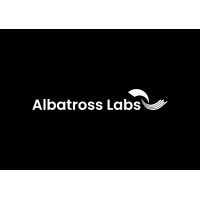

## Table of Contents

## What is Albatross Labs?

Albatross Labs is a company that works on making computer programs smarter. They use something called artificial intelligence, or AI, to help computers learn and do things on their own. The company was started by some people who used to work at big tech companies like Google and DeepMind. They want to use AI to solve big problems in different areas like health care, business, and science.

The team at Albatross Labs is made up of experts who know a lot about AI and how to use it. They work together to create new ways for computers to understand and use information. Their goal is to make AI tools that can help people in their everyday lives, making things easier and more efficient. By doing this, they hope to make a big difference in the world.

## When was Albatross Labs founded?

Albatross Labs was started in 2021. It was created by people who used to work at big tech companies like Google and DeepMind. They wanted to use their knowledge to make a new company that focuses on artificial intelligence.

The founders of Albatross Labs believe that AI can help solve big problems in many areas. They want to use AI to make things better in health care, business, and science. Their goal is to create smart computer programs that can help people every day.

## Who are the founders of Albatross Labs?

Albatross Labs was started by people who used to work at big tech companies like Google and DeepMind. Their names are Alex Irpan, Lasse Espeholt, and Wendelin Boehmer. They wanted to use what they learned at these big companies to make a new company that focuses on [artificial intelligence](/wiki/ai-artificial-intelligence).

Alex, Lasse, and Wendelin believe that AI can help solve big problems in many areas. They want to use AI to make things better in health care, business, and science. Their goal is to create smart computer programs that can help people every day.

## What are the main products or services offered by Albatross Labs?

Albatross Labs works on making computer programs smarter using artificial intelligence. They create tools that help computers learn and do things on their own. These tools can be used in many different areas like health care, business, and science. The main focus of Albatross Labs is to build AI that can solve big problems and make life easier for people.

One of the main services they offer is helping other companies use AI in their work. They provide expert advice and custom solutions to fit the needs of different businesses. This means they can help a hospital use AI to better care for patients, or help a company use AI to make their work more efficient. By doing this, Albatross Labs aims to make a big difference in the world.

## In which industries does Albatross Labs operate?

Albatross Labs works in many different areas. They use artificial intelligence to help solve problems in health care. This means they can help hospitals and doctors use AI to take better care of their patients. They also work in business, where they help companies use AI to make their work easier and faster. This can save time and money for the companies.

Another area where Albatross Labs operates is science. They use AI to help scientists with their research. This can lead to new discoveries and better ways of understanding the world. By working in these different areas, Albatross Labs wants to make a big difference and help people every day.

## What is the mission statement of Albatross Labs?

Albatross Labs wants to use artificial intelligence to make life better for people. They believe that AI can help solve big problems in many areas like health care, business, and science. Their mission is to create smart computer programs that can learn and do things on their own, making things easier and more efficient for everyone.

The team at Albatross Labs is made up of experts who know a lot about AI. They work together to build tools that can be used by other companies and organizations. By doing this, they hope to make a big difference in the world and help people in their everyday lives.

## How does Albatross Labs contribute to technological innovation?

Albatross Labs contributes to technological innovation by making computer programs smarter with artificial intelligence. They create tools that help computers learn and do things on their own. This means they can solve big problems in areas like health care, business, and science. By using AI, they help hospitals take better care of patients, make companies work more efficiently, and help scientists with their research. This leads to new discoveries and better ways of doing things.

The team at Albatross Labs is made up of experts who used to work at big tech companies like Google and DeepMind. They bring a lot of knowledge and experience to their work. They help other companies use AI by giving them expert advice and custom solutions. This helps businesses use AI in ways that fit their needs. By doing this, Albatross Labs is pushing the boundaries of what AI can do and making a big difference in the world.

## What are some notable achievements or milestones of Albatross Labs?

Albatross Labs has made big steps in using artificial intelligence to help solve problems. They started in 2021 and quickly grew to be known for their work in health care, business, and science. One of their big achievements is helping hospitals use AI to take better care of patients. They made tools that can look at a lot of medical information and find patterns that doctors might miss. This helps doctors make better decisions and can save lives.

Another milestone for Albatross Labs is their work in business. They helped companies use AI to make their work easier and faster. For example, they made programs that can handle a lot of data and find ways to save time and money. This has made businesses more efficient and helped them grow. Their work in science is also important. They use AI to help scientists with their research, leading to new discoveries and better understanding of the world.

These achievements show how Albatross Labs is making a big difference. They are using their knowledge and skills to create smart computer programs that help people every day. By doing this, they are pushing the boundaries of what AI can do and making the world a better place.

## Can you describe the company culture at Albatross Labs?

The company culture at Albatross Labs is all about teamwork and learning. Everyone at Albatross Labs works together to use artificial intelligence to solve big problems. They share ideas and help each other grow. The team is made up of experts who used to work at big tech companies like Google and DeepMind. They bring a lot of knowledge and experience to the table. This makes the workplace fun and exciting because everyone is always learning something new.

Another important part of the culture at Albatross Labs is their focus on making a difference. They want to use AI to help people in health care, business, and science. This gives everyone at the company a sense of purpose. They know their work can change lives and make the world better. The team is driven by this goal and works hard every day to reach it. This shared mission creates a positive and supportive atmosphere where everyone feels valued and motivated.

## What partnerships or collaborations has Albatross Labs engaged in?

Albatross Labs has worked with many different groups to make their AI tools better. They have teamed up with hospitals to help doctors use AI to take better care of patients. This means they can look at a lot of medical information and find patterns that might be hard to see. By doing this, they help doctors make better decisions and can save lives. They also work with businesses to make their work easier and faster. Albatross Labs helps companies use AI to handle a lot of data and find ways to save time and money. This makes businesses more efficient and helps them grow.

Another important collaboration for Albatross Labs is with scientists. They use AI to help with research in different fields of science. This leads to new discoveries and a better understanding of the world. By working together with these groups, Albatross Labs can use their knowledge and skills to create smart computer programs that help people every day. These partnerships show how Albatross Labs is making a big difference by using AI to solve big problems in many areas.

## How does Albatross Labs approach sustainability and social responsibility?

Albatross Labs cares about making the world a better place. They use artificial intelligence to help solve big problems in health care, business, and science. This helps make life easier and better for people. They also think about how their work can help the environment. By using AI to make businesses more efficient, they can help save energy and reduce waste. This is part of their goal to be sustainable and help the planet.

Another way Albatross Labs shows social responsibility is by working with different groups to make a difference. They team up with hospitals to help doctors take better care of patients. They also work with businesses to make them work better and with scientists to help with research. By doing this, they help make the world a better place. Their mission is to use AI to solve problems and help people every day, which is a big part of being socially responsible.

## What are the future plans or upcoming projects for Albatross Labs?

Albatross Labs is always looking ahead to new ways to use artificial intelligence to help people. They want to keep working on making AI tools that can solve big problems in health care, business, and science. One of their future plans is to make AI even smarter so it can understand and use information better. This will help doctors make better decisions and help companies work more efficiently. They also want to use AI to help with more scientific research, which could lead to new discoveries and better ways of understanding the world.

Another important project for Albatross Labs is to make their AI tools easier for everyone to use. They want to create programs that are simple and can help people in their everyday lives. This means working on new ways to make AI more user-friendly, so more people can benefit from it. By doing this, they hope to reach more people and make a bigger difference in the world. Their goal is to keep pushing the boundaries of what AI can do and use it to make life better for everyone.

## References & Further Reading

[1]: ["Advances in Financial Machine Learning"](https://www.amazon.com/Advances-Financial-Machine-Learning-Marcos/dp/1119482089) by Marcos Lopez de Prado

[2]: ["High-Frequency Trading: A Practical Guide to Algorithmic Strategies and Trading Systems"](https://www.amazon.com/High-Frequency-Trading-Practical-Algorithmic-Strategies/dp/1118343506) by Irene Aldridge

[3]: ["Quantitative Trading: How to Build Your Own Algorithmic Trading Business"](https://www.amazon.com/Quantitative-Trading-Build-Algorithmic-Business/dp/1119800064) by Ernest P. Chan

[4]: ["Machine Learning for Algorithmic Trading"](https://github.com/stefan-jansen/machine-learning-for-trading) by Stefan Jansen

[5]: ["Evidence-Based Technical Analysis: Applying the Scientific Method and Statistical Inference to Trading Signals"](https://www.amazon.com/Evidence-Based-Technical-Analysis-Scientific-Statistical/dp/0470008741) by David Aronson