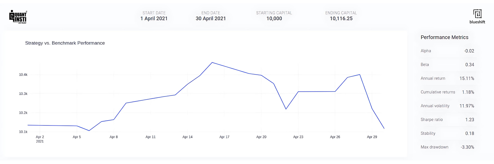

Algorithmic trading refers to the use of computer algorithms to automate the process of trading financial instruments, including stocks, bonds, and commodities. These algorithms are designed to execute trades rapidly and efficiently based on predetermined criteria such as price, volume, and timing. The significance of algorithmic trading in financial markets has grown tremendously in recent years, accounting for a substantial portion of trading activity. Its ability to process vast amounts of data at high speeds allows traders to capitalize on fleeting market opportunities and enhance liquidity.

The concept of "alea," derived from Latin, signifies uncertainty and chance. In the context of trading, alea represents the inherent unpredictability and risk present in financial markets. Trading strategies, whether discretionary or algorithmic, must embrace this uncertainty due to the multifaceted nature of market dynamics. In algorithmic trading, alea plays a crucial role as it challenges traders and developers to construct models that can anticipate and manage market fluctuations and rare events. This requires sophisticated risk management techniques to ensure that trading remains within acceptable risk parameters while maximizing potential returns.



The purpose of this article is to explore the intersection of alea and algorithmic trading, focusing on the Alea blog as a resource for traders interested in navigating this complex landscape. By examining the blog's contributions to the discourse on algorithmic strategies and risk assessment, readers will gain insights into managing uncertainty effectively. This exploration will highlight the significance of the Alea blog in providing educational content, fostering community interaction, and empowering traders to make informed decisions in unpredictable market conditions.

## Table of Contents

## What is Alea in Trading?

Alea, a term derived from the Latin word for "dice" or "chance," signifies uncertainty and is a foundational concept in both classical and modern trading literature. In trading, alea encapsulates the unpredictable elements that influence market behaviors and outcomes, which cannot be entirely forecasted or controlled. This notion of uncertainty is central to trading theories, which assert that markets are often subject to random fluctuations due to myriad factors, including investor sentiment, geopolitical events, and economic shifts.

Incorporating uncertainty is a critical consideration for developing trading strategies. Traders and algorithm designers need to account for alea when making decisions, as ignoring these elements could result in unexpected losses. Acknowledging uncertainty involves accepting that while statistical models and historical data can project potential future outcomes, they cannot guarantee results—there is always an inherent risk that the market will behave contrary to predictions.

Algorithmic trading is particularly influenced by alea due to its reliance on programmed strategies that execute trades based on predefined criteria. Despite the sophistication of algorithmic systems in analyzing vast datasets and identifying patterns, they are bound by the unpredictability of the markets. The key challenge in [algorithmic trading](/wiki/algorithmic-trading) is managing and mitigating the risks associated with uncertainty. Algorithms are crafted to respond to specific scenarios, but unexpected market events, such as sudden economic announcements or political changes, can impact performance unpredictably.

Quantitative risk management techniques are employed within algorithmic trading to address these challenges. Measures such as stop-loss orders, diversifying strategies, and stress-testing models under various scenarios are implemented to cushion the impact of adverse market movements. The ability to adapt strategies to new information is imperative, as markets are continuously evolving entities influenced by uncontrollable real-world factors.

Moreover, the role of alea underscores the importance of continuous monitoring and updating of algorithmic systems to remain relevant under changing market conditions. Algorithm designers must implement adaptive learning mechanisms, such as [machine learning](/wiki/machine-learning), to enhance the capacity of trading systems to learn from new data and refine their strategies accordingly.

In summary, alea represents the inherent unpredictability in markets that both challenges and shapes algorithmic trading strategies. It necessitates sophisticated risk management approaches and continuously adaptive systems to navigate and capitalize on the volatile nature of financial markets. Understanding and addressing the implications of alea are crucial for traders aiming to achieve consistent performance in algorithmic trading environments.

## The Alea Blog: An Overview

The Alea Blog serves as a comprehensive resource for traders seeking to enhance their understanding and expertise in algorithmic trading strategies. Designed to cater to both novice and experienced traders, the blog offers an array of content tailored to various skill levels and interests in the financial trading domain. 

For beginners, the Alea Blog provides foundational guides that aim to introduce the basic concepts and mechanics of algorithmic trading. These guides cover essential topics such as understanding trading algorithms, the importance of [backtesting](/wiki/backtesting), and essential programming languages like Python utilized in strategy development.

For those with advanced knowledge, the blog delves deeper into sophisticated trading strategies, offering insights into complex quantitative models and techniques. This includes discussions on statistical [arbitrage](/wiki/arbitrage), high-frequency trading, machine learning applications, and real-time data analysis, presenting traders with opportunities to refine their strategies and grasp cutting-edge methods.

In addition to educational content, the Alea Blog provides thorough market analysis, offering readers in-depth evaluations of current market trends and predictions. This analysis is crucial for traders aiming to make informed decisions based on quantitative data and market sentiment.

The Alea Blog also fosters a vibrant community of traders through interactive features such as forums and comment sections. These platforms allow participants to engage in discussions, share insights, and collaborate on trading strategies. The blog actively promotes community interaction by encouraging collaboration on algorithmic projects and collective market analysis. Networking opportunities are plentiful, with the blog regularly highlighting upcoming trader meetups and workshops, facilitating knowledge exchange and professional connections among its readers.

By offering a diverse range of content and encouraging community engagement, the Alea Blog positions itself as an indispensable tool for traders interested in the ever-evolving world of algorithmic trading.

## Topics Covered in Alea Blog

The Alea Blog serves as a comprehensive resource for traders, offering a wide range of content tailored to cater to both novice and experienced algorithmic traders. Its focus on quantitative analysis and strategy development is pivotal, providing insights and tutorials designed to enhance understanding and implementation of algorithmic trading methods. Traders can explore various quantitative models, including time-series analysis, regression models, and machine learning techniques, all of which form the backbone of many successful trading strategies. These resources often include step-by-step tutorials and practical examples, enabling traders to apply these methods to their trading activities effectively.

Risk management is another critical topic extensively discussed on the blog. Effective risk management strategies are essential for any algorithmic trading system to address market [volatility](/wiki/volatility-trading-strategies) and ensure sustainability. The blog offers a wealth of information on various risk control techniques, such as value-at-risk (VaR) calculations, diversification strategies, and tail risk hedging. By understanding and applying these techniques, traders can better protect their portfolios from unexpected market movements and enhance their overall trading performance.

Market trends analysis and case studies are regularly presented on the platform, providing readers with real-world applications of algorithmic trading strategies. These case studies often feature detailed analyses of historical market data, enabling traders to understand how specific strategies perform under different market conditions. This data-driven approach allows traders to refine their strategies, improve predictive accuracy, and develop a deeper understanding of market dynamics.

The Alea Blog also extends its educational offerings by providing resources for algorithmic trading enthusiasts. These resources include a curated selection of [books](/wiki/algo-trading-books), webinars, and courses designed to deepen traders' knowledge and skills. These materials cover a wide range of topics, from introductory concepts to advanced trading techniques, catering to all levels of expertise. Through these resources, traders can continue their education and stay informed about the latest trends and innovations in the field of algorithmic trading, maintaining a competitive edge in an ever-evolving financial landscape.

## Algorithmic Trading Strategies Highlighted

Algorithmic trading, a cornerstone of modern financial markets, leverages complex algorithms to execute trades at speeds and frequencies beyond human capability. Within this sophisticated trading environment, the Alea blog frequently highlights several popular algorithmic trading strategies, each uniquely leveraging data-driven approaches and technological tools to optimize outcomes.

One widely discussed strategy is **mean reversion**, which is based on the assumption that the price of a security will tend to revert to its average over time. This strategy involves identifying securities that have deviated from their historical averages, predicting their potential return to these averages, and executing trades accordingly. Using statistical analysis, traders employ moving averages and standard deviation bands to formulate and trigger buy or sell signals. For example, if the price of a stock falls significantly below its historical average, an algorithm might automatically execute a buy order, anticipating a rebound.

Another strategy explored on the blog is **[trend following](/wiki/trend-following)**, which seeks to capitalize on the [momentum](/wiki/momentum) of market trends. Unlike mean reversion, trend following focuses on identifying and riding the direction of the market. This strategy utilizes tools like moving averages and momentum indicators to determine when to enter or [exit](/wiki/exit-strategy) trades. The appeal of trend following lies in its simplicity; the strategy does not predict market reversals but instead profits from sustained movements in one direction.

**Arbitrage** is yet another sophisticated strategy featured prominently on the Alea blog. This involves exploiting price differentials across different markets or instruments. High-frequency trading (HFT) is often used in this context, where algorithms are employed to identify and act on fleeting opportunities in real-time. For example, if a stock is trading at a lower price on one exchange than another, an algorithm can simultaneously buy from the lower-priced exchange and sell at the higher-priced one, capturing the price difference as profit.

**Sentiment analysis**, a more modern approach, incorporates natural language processing (NLP) and machine learning to gauge the sentiment of news articles, social media, and other textual data. By analyzing the tone and context of such content, algorithms can infer market sentiment and predict movements, making it another powerful tool in an algorithmic trader's arsenal.

The Alea blog emphasizes the pivotal role of big data and technology in executing these strategies. Algorithms rely heavily on vast datasets to identify patterns and make informed decisions. Machine learning models are increasingly being integrated to refine predictions and improve the accuracy of trades. These technological advancements enable the continual evolution of trading strategies, fostering an environment where innovation leads to real-world financial gains.

For instance, a simple Python script utilizing libraries like NumPy and Pandas can be used to backtest a mean reversion strategy. Here is a basic example:

```python
import numpy as np
import pandas as pd
from pandas_datareader import data as pdr

# Fetch historical data
stock_data = pdr.get_data_yahoo('AAPL', start='2020-01-01', end='2022-01-01')

# Calculate moving average
stock_data['Moving Average'] = stock_data['Close'].rolling(window=20).mean()

# Simple mean reversion strategy
stock_data['Signal'] = 0
stock_data['Signal'][stock_data['Close'] < stock_data['Moving Average']] = 1
stock_data['Signal'][stock_data['Close'] > stock_data['Moving Average']] = -1

# Backtest performance
stock_data['Returns'] = stock_data['Close'].pct_change()
stock_data['Strategy Returns'] = stock_data['Returns'] * stock_data['Signal'].shift(1)

# Output cumulative returns of the strategy
cumulative_return = (1 + stock_data['Strategy Returns']).cumprod() - 1
print(cumulative_return.tail(1))
```

Such code snippets further illustrate how algorithmic traders use programming to implement and test their strategies before deploying them in the markets. This rigorous approach to strategy development exemplifies the comprehensive treatment of algorithmic trading topics on the Alea blog, making it an invaluable resource for traders seeking to harness the power of technology in financial markets.

## Impact of Alea on Trading Outcomes

Algorithmic trading, while a powerful tool, inherently operates amidst significant uncertainty or "alea," which can markedly influence trading outcomes. Alea encompasses the unpredictability and risk present in financial markets, prompting the necessity for robust strategies to mitigate potential adverse effects.

**Influence of Alea on Trading Results**

Uncertainty in trading significantly affects decision-making processes and outcomes. Alea in algorithmic trading manifests through market volatility, unexpected economic indicators, and unanticipated geopolitical events that can lead to drastic price shifts. These elements present challenges in executing trades at optimal times or values, potentially altering expected returns. For instance, the sudden announcement of a significant policy change can lead to swift market reactions that are difficult to predict or adjust for in real-time.

**Problem-Solving Methods and Tools**

One approach to managing alea is through diversification, which involves spreading investments across various assets or markets to reduce the impact of any single adverse event. Additionally, implementing stop-loss orders can limit potential losses by automatically selling a security when it reaches a predetermined price threshold.

Risk management tools, such as Value at Risk (VaR) and stress testing, also provide frameworks to anticipate potential losses in extreme scenarios. By analyzing historical data to predict potential losses within a specific confidence interval, VaR helps traders understand their exposure to risk. Stress testing, on the other hand, evaluates how trading strategies perform under extreme market conditions, helping traders adjust their approaches to withstand negative outcomes.

Advanced algorithmic strategies may employ machine learning techniques to adapt to alea. For example, [reinforcement learning](/wiki/reinforcement-learning) algorithms can be designed to learn trading strategies from observing market behaviors and reacting accordingly without explicit programming of the trading rules. Python, with libraries like TensorFlow or PyTorch, allows for the development of sophisticated models that can predict market trends and refine strategies.

```python
import numpy as np
from sklearn.model_selection import train_test_split
from sklearn.ensemble import RandomForestRegressor

# Sample code to illustrate a basic machine learning approach for trading strategy
# Assuming data is a pandas dataframe with market features and target as price changes

# Splitting data into training and test sets
X = data.drop(['price_change'], axis=1)
y = data['price_change']
X_train, X_test, y_train, y_test = train_test_split(X, y, test_size=0.2, random_state=42)

# Training a RandomForestRegressor model
model = RandomForestRegressor(n_estimators=100, random_state=42)
model.fit(X_train, y_train)

# Predicting and evaluating
predictions = model.predict(X_test)
```

**Trader Stories and Testimonials**

Many traders have shared experiences of managing alea, highlighting both successes and lessons learned. A seasoned trader might recount leveraging a robust risk management strategy to minimize losses during a market downturn. Conversely, novice traders have documented experiences of substantial losses due to overconfidence or inadequate preparation for alea-driven market volatilities.

Testimonials frequently underscore the necessity of continuous learning and adaptation. Traders often stress the importance of not only technical analysis but also maintaining an awareness of global events that could trigger market movements. Engaging with trading communities and blogs, such as the Alea blog, helps individuals stay informed and exchange strategies in managing uncertainty.

In conclusion, understanding and navigating alea remains crucial for trading success. While complete elimination of uncertainty is impossible, effectively managing its impact through strategic diversification, advanced technology, and community engagement can significantly enhance trading outcomes.

## Building a Trading Community

The Alea blog serves as a vital platform for fostering a robust community of algorithmic traders who share a common interest in the complexities of trading strategies and market dynamics. This community aspect is integral for both novice and experienced traders seeking to exchange ideas and enhance their trading acumen.

Collaborative projects on the Alea blog often involve pooling resources and expertise to tackle complex trading challenges. For instance, participants may engage in the joint development of algorithmic models or contribute to open-source projects that benefit the broader trading community. These collaborations enable traders to leverage collective knowledge, ultimately refining trading strategies and improving overall accuracy. Shared strategies often emerge from these collaborations, giving members access to diverse methodologies and insights that individual efforts might miss.

In addition to collaboration, collective market analysis is a hallmark of the Alea community. By sharing real-time data, market insights, and predictive models, traders can make more informed decisions. The blog acts as a hub where community members post analyses, compare different market outlooks, and debate potential trading scenarios. These interactions enrich the community's understanding of market mechanisms, enhancing their ability to anticipate market shifts.

Networking opportunities on the Alea blog are abundant. The platform frequently promotes online meetups and webinars, allowing traders from different geographical locations to connect and share their experiences. These events often feature guest speakers who are experts in algorithmic trading, offering valuable insights and professional advice. Additionally, the blog encourages regional trader meetups, fostering personal connections and the exchange of localized market knowledge.

Such networking events not only strengthen the community fabric but also open potential pathways for professional collaborations. Members can form partnerships, share resources, or even initiate co-trading ventures, thus maximizing their trading potential through shared skills and experiences.

Overall, the Alea blog's emphasis on community building is pivotal in creating a supportive environment where traders can thrive through collaboration, shared knowledge, and extensive networking opportunities. This fundamental community aspect helps traders navigate the uncertainties inherent in financial markets, fostering a collaborative spirit that is essential for success in algorithmic trading.

## Future Trends in Algorithmic Trading

Algorithmic trading continues to evolve, with uncertainty (alea) playing a crucial part in shaping its future. Alea embodies the inherent unpredictability within financial markets, which can significantly influence trading strategies. As we forecast future trends, it is expected that the role of alea in algorithmic trading will become even more prominent, driving developments aimed at better managing uncertainty.

Technological innovations are likely to be at the forefront of these advancements. Quantum computing is one anticipated development that could revolutionize algorithmic trading. With its potential to process vast amounts of data exponentially faster than classical computers, quantum computing might offer new approaches to managing alea in trading strategies by enhancing predictive modeling and simulation capabilities. For example, quantum algorithms could be used to calculate risk and return distributions more accurately, thereby improving decision making in uncertain market conditions.

Another significant technological trend is the advancement of [artificial intelligence](/wiki/ai-artificial-intelligence) (AI) and machine learning (ML). These technologies can learn from massive datasets to generate predictive models that account for alea. Innovations such as [deep learning](/wiki/deep-learning) and reinforcement learning are poised to enhance the ability to identify patterns and correlations that are not immediately apparent using traditional methods. Algorithms equipped with AI capabilities could autonomously adapt to new market conditions as they evolve, thus mitigating the risks associated with alea.

The integration of blockchain technology into algorithmic trading systems also presents opportunities to handle alea effectively. Blockchain's decentralized nature provides transparency and security, which can reduce fraud and operational risks associated with transactions, contributing to a more stable trading environment.

Despite these innovations, several challenges remain. Managing the vast and complex datasets requisite for advanced AI models poses significant obstacles. Ensuring data accuracy, dealing with noise, and avoiding overfitting are critical for successful implementation. Solutions may involve developing more robust data preprocessing techniques and adopting hybrid models that combine AI with expert systems to validate model outputs.

Regulatory challenges also loom as automated systems become more prevalent. Regulatory bodies will need to ensure that these systems do not amplify market volatility or unfairly advantage certain players. Developing frameworks that balance innovation with stability will be imperative.

Furthermore, as algorithmic strategies become increasingly data-driven, issues surrounding data privacy and security will require attention. Enhanced encryption methods and improved cybersecurity protocols will be necessary to protect sensitive information and maintain trust in algorithmic trading systems.

In conclusion, as new technologies emerge, the future of algorithmic trading will be shaped by the ability to effectively manage alea. By leveraging quantum computing, AI, and blockchain, traders can enhance their adaptability to market changes, thus potentially mitigating risk and improving outcomes. However, addressing the accompanying challenges will be crucial to realizing these advancements in an equitable and secure manner.

## Conclusion

Understanding alea, or uncertainty, in algorithmic trading is crucial for navigating today's intricate financial markets. Algorithmic trading, characterized by the use of sophisticated mathematical models and rapid data analysis, naturally integrates alea as traders strive to anticipate market movements and manage risk. Recognizing and managing this uncertainty is fundamental to the development of robust trading strategies that can adapt to unforeseen market conditions.

The Alea Blog emerges as an invaluable resource that emphasizes the educational imperatives of understanding uncertainty and offers traders a comprehensive guide to managing it effectively. Through its array of content, whether it’s beginner tutorials or advanced strategy discussions, the blog serves as a beacon for both novice and seasoned traders aiming to enhance their algorithmic trading skills. By fostering a community where traders can collaborate, share insights, and engage in thoughtful discourse, the Alea Blog not only educates but also empowers its audience to refine their approach to trading challenges.

Exploring the Alea Blog further can provide traders with cutting-edge strategies and insights that can significantly influence their trading outcomes. As the financial landscape continues to evolve with technological advancements, the blog remains instrumental in equipping traders with the knowledge and tools required to stay ahead. Engaging with this platform allows traders to stay informed about the latest trends and techniques in algorithmic trading, ensuring they are well-prepared to handle the complexities of market uncertainties effectively.

## References & Further Reading

[1]: ["Advances in Financial Machine Learning"](https://www.amazon.com/Advances-Financial-Machine-Learning-Marcos/dp/1119482089) by Marcos Lopez de Prado.

[2]: ["Quantitative Trading: How to Build Your Own Algorithmic Trading Business"](https://books.google.com/books/about/Quantitative_Trading.html?id=j70yEAAAQBAJ) by Ernest P. Chan.

[3]: ["Machine Learning for Algorithmic Trading"](https://github.com/stefan-jansen/machine-learning-for-trading) by Stefan Jansen.

[4]: Bergstra, J., Bardenet, R., Bengio, Y., & Kégl, B. (2011). ["Algorithms for Hyper-Parameter Optimization."](https://dl.acm.org/doi/10.5555/2986459.2986743) Advances in Neural Information Processing Systems 24.

[5]: ["Evidence-Based Technical Analysis: Applying the Scientific Method and Statistical Inference to Trading Signals"](https://www.amazon.com/Evidence-Based-Technical-Analysis-Scientific-Statistical/dp/0470008741) by David Aronson.