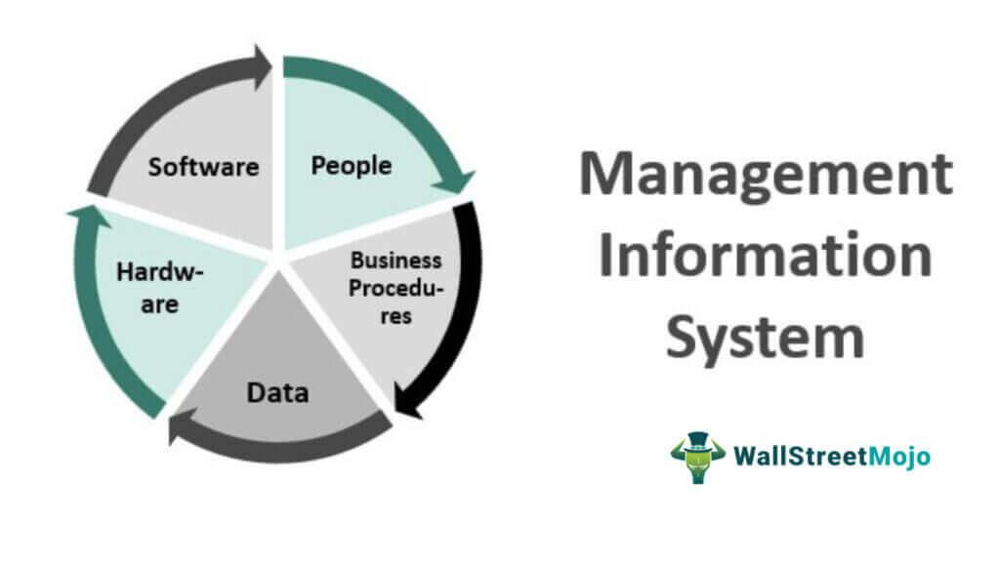

In the fast-paced world of trading, the integration of technology has become pivotal. Automated trading systems, commonly referred to as algorithms or 'algos', have gained widespread adoption across global markets. These sophisticated systems draw on vast datasets and complex computational models to execute trades with precision and speed that surpasses human capabilities. As technological advancements continue to reshape the trading landscape, the importance of complementing algorithmic trading with robust warning systems and alert notifications has come to the fore.

Efficient warning systems and alert notifications serve as critical components within modern trading infrastructures. They provide traders with timely insights into economic announcements, price fluctuation patterns, and technical indicator changes. By enabling quick responses to market stimuli, these systems enhance market responsiveness and trading efficiency. The seamless integration of automated trading systems with alert mechanisms ensures that traders are constantly aware of important market dynamics, facilitating informed decision-making processes.



The intersection of warning systems and algorithmic trading presents numerous opportunities to optimize trading strategies. While algorithms offer the advantage of executing trades with high speed and accuracy, alerts add an extra layer of vigilance by informing traders of potential market shifts or emerging opportunities. This symbiotic relationship contributes to improved profitability by ensuring that trading actions are both timely and informed.

As the trading ecosystem continues to evolve, the relationship between automated trading systems and alert notifications remains central to achieving sustained success. This article explores how these technologies work together to elevate trading proficiency, acknowledging both their benefits and challenges.

## Table of Contents

## Understanding Warning Systems in Trading

Warning systems in trading are essential tools designed to notify traders about specific market conditions or triggers, enabling them to make informed and timely decisions. These systems play a crucial role in modern trading environments, especially in markets characterized by volatility and rapid changes.

Firstly, the primary function of warning systems is to alert traders to various market events. These include economic announcements, significant price movements, and changes in technical indicators. Economic announcements are regularly scheduled reports, such as employment data or GDP numbers, which can significantly influence market behavior. By receiving timely notifications about such events, traders can prepare to adjust their trading strategies accordingly.

Furthermore, price movement alerts are indispensable in a trading landscape where asset prices can fluctuate rapidly. Sudden spikes or drops can present both opportunities and risks, and having immediate alerts allows traders to act swiftly. Technical indicators, like moving averages or relative strength index (RSI), also play a vital role in these systems. Changes in these indicators can signal potential market entry or [exit](/wiki/exit-strategy) points, which are critical for executing profitable trades.

To ensure that traders receive information promptly, these alerts are delivered through various channels. Common methods include emails, SMS, and push notifications on trading platforms or mobile apps. The choice of delivery channel can depend on the trader's preference and the urgency of the alert. Push notifications offer real-time alerts which are crucial for fast decision-making, especially during high-[volatility](/wiki/volatility-trading-strategies) periods.

Efficient warning systems are indispensable for quick decision-making in markets prone to volatility. They equip traders with the necessary tools to respond to market conditions proactively. By providing real-time data and alerts, these systems not only enhance a trader's ability to react promptly but also improve overall trading efficacy. This prevents missed opportunities and reduces the chances of significant losses in rapidly changing market scenarios.

## Alert Notifications in Algorithmic Trading

Alert notifications are a crucial aspect of [algorithmic trading](/wiki/algorithmic-trading), providing timely and relevant market updates that assist in making informed trading decisions. In algorithmic trading, which involves the use of computer programs to execute a large number of trading orders at high speeds, alerts enable traders and systems to respond promptly to market conditions. These notifications are essential for executing trades at optimal times, thus enhancing trading efficiency and effectiveness.

Algorithmic trading relies extensively on pre-programmed strategies that are activated based on specific predefined conditions. Alert notifications can trigger the execution or suspension of these trading algorithms. For instance, an alert for a significant price movement of a security might initiate buy or sell orders based on the parameters set within the trading algorithm. This mechanism ensures that trades are conducted in alignment with the strategic objectives, such as entering or exiting positions at desired levels to capitalize on market opportunities.

Moreover, by providing real-time market updates, alert notifications help in minimizing losses and maximizing gains. These alerts enable swift movements in response to sudden market shifts, such as volatile price spikes or economic announcements that could affect asset values. The immediacy of alerts allows traders to adjust their positions accordingly, thereby ensuring that trading strategies reflect the most current market data.

Incorporating alert notifications into algorithmic trading systems requires a robust infrastructure that can handle high-frequency data and execute trades with minimal latency. This might involve leveraging technologies such as message queues, real-time data feeds, and distributed computing environments to ensure that alerts are delivered instantaneously and actions are taken without delay.

Python, a popular programming language in the financial technology community, can be used to implement these systems effectively. Python libraries like NumPy for numerical computations, pandas for data manipulation, and libraries such as APScheduler for scheduling regular notifications or tasks, offer comprehensive tools to build responsive alert systems. For instance, a simple Python script using the yfinance library can monitor stock prices and trigger alerts:

```python
import yfinance as yf  # For more datasets, visit: https://paperswithbacktest.com/datasets
import time

def check_stock_price(ticker, threshold_price):
    stock = yf.Ticker(ticker)
    data = stock.history(period="1d")
    current_price = data['Close'].iloc[-1]
    if current_price >= threshold_price:
        send_alert(ticker, current_price)

def send_alert(ticker, price):
    print(f"Alert: {ticker} has reached the price of ${price}")

if __name__ == "__main__":
    while True:
        check_stock_price("AAPL", 150)
        time.sleep(60)  # Check every minute
```

Overall, alert notifications empower traders by providing them with instantaneous information and the ability to make quick trading decisions. In algorithmic trading, where speed and accuracy are paramount, these alerts play an integral role in ensuring that the trading algorithms execute as intended, thereby optimizing trading outcomes.

## Benefits of Integrating Warning and Alert Systems in Algo Trading

Incorporating warning and alert systems into algorithmic trading offers several key advantages that can enhance trading performance. These systems ensure traders do not miss critical market events by providing timely and actionable insights. The real-time information enables traders to respond promptly, thereby gaining a competitive edge over those who rely solely on manual analysis or delayed reporting. 

By delivering precise alerts at the exact moment they are needed, traders can execute trades with enhanced precision. This responsiveness can lead to improved profitability as trades are executed under optimal conditions, minimizing the impact of unfavorable market fluctuations. Furthermore, integrating automated notifications reduces the need for constant manual oversight, allowing traders to maintain their vigilance without the exhaustive need to monitor markets continuously. This automation helps in streamlining trading operations, focusing human effort where it is most impactful.

Additionally, automated alerts can be tailored to specific trading strategies, ensuring that notifications are relevant and aligned with the trader's objectives. These tailored alerts allow for better resource allocation and more strategic decision-making, as traders can concentrate solely on high-priority alerts that fit their market perspective. 

The automation extends to the capacity of handling larger volumes of data and making faster decisions than would be feasible manually, thereby capitalizing on even small market movements. As a result, integrating alert systems with algorithmic trading platforms not only increases efficiency but also allows traders to optimize their strategies continuously, adapting to market conditions seamlessly. 

Overall, the successful integration of alert and warning systems with automated trading algorithms represents a technological advancement that supports traders in maintaining a proactive and profitable stance in the ever-evolving financial markets.

## Challenges and Considerations

While the integration of warning and alert systems with algorithmic trading offers significant advantages, it also brings notable challenges and considerations that traders must address. One prominent issue is the potential for these systems to induce a false sense of security, which can lead to overreliance. Traders might become complacent, assuming that automated alerts will manage all critical aspects of trading, which can result in neglect of essential manual oversight and strategic decision-making.

Technical failures or delays in notification delivery present another significant risk. Automated systems can experience glitches or lag in processing and transmitting data due to server issues, network disruptions, or software bugs. Such delays can lead to missed trading opportunities or, in some cases, unintended execution of trades during unfavorable market conditions. It is crucial for traders to implement backup protocols and constantly monitor system performance to mitigate such risks.

Security is a paramount concern when employing automated systems. Alerts and notifications can be susceptible to unauthorized access or tampering, potentially leading to the dissemination of false information. This can create a domino effect, triggering incorrect trading actions and substantial financial losses. Ensuring robust security measures, such as encryption, authentication, and regular audits, is essential to protect trading systems from fraudulent activities.

Continual testing and optimization of alert parameters are necessary to adapt to the dynamic nature of financial markets. Market conditions evolve, and what constitutes a significant market event today may not hold the same importance tomorrow. Traders need to periodically reassess and adjust their alert criteria and thresholds to align with changing trends and volatility. This involves analyzing past performance, identifying patterns, and using [machine learning](/wiki/machine-learning) techniques to forecast and adapt to new market scenarios.

In conclusion, while warning and alert systems are invaluable tools in algorithmic trading, traders must remain vigilant to potential challenges. Balancing automated alerts with manual oversight, ensuring robust security protocols, and perpetually refining system parameters are critical steps in maintaining the efficacy of these systems in an ever-evolving trading environment.

## Case Studies and Examples

Algorithmic trading, enhanced through the integration of warning systems and alert notifications, plays a crucial role in modern financial markets. A prominent example of the successful use of these systems is seen in the 2010 Flash Crash. During this event, firms with robust alert systems managed to reduce losses by promptly reacting to unusual market conditions. For instance, Waddell & Reed's automated trading system utilized warning signals to adjust trading strategies amidst rapid market changes, highlighting the potential of these systems to mitigate adverse impacts.

Conversely, failures in warning systems can lead to significant trading losses. In August 2012, Knight Capital Group experienced a substantial loss due to an algorithmic glitch that went unnoticed by their alert system. This incident resulted in a loss of $440 million within 45 minutes, underscoring the need for effective alert mechanisms and thorough testing to prevent such costly errors.

Several trading platforms effectively employ warning and alert systems. MetaTrader 5, for example, offers sophisticated alert functionalities that notify traders of critical price levels or economic news, enabling timely decision-making. TradingView, another renowned platform, utilizes customizable alerts, allowing traders to set specific conditions for notifications, seamlessly integrating with algorithmic strategies.

These instances demonstrate the significant role of warning and alert systems in both maximizing profits and minimizing losses in algorithmic trading, emphasizing the importance of robust and well-configured alert mechanisms.

## Conclusion

Warning systems and alert notifications have become essential components of the modern trading environment, facilitating the seamless operation and execution of trades. By integrating these systems with algorithmic trading, traders can enhance their operational efficiency and reduce response times to market changes. This synergy allows for more precise decision-making and improved execution, crucial in volatile and fast-moving markets.

However, the reliance on these systems necessitates a balanced approach. While technology offers significant advantages, traders must maintain a layer of manual oversight and strategic planning. This balance ensures that while automated processes handle routine tasks, critical judgments and strategic decisions benefit from human insight and experience. 

The field of algorithmic trading is continuously evolving, propelled by technological advancements and insights from market dynamics. As these systems become more sophisticated, the potential for achieving a more intuitive and profitable trading experience increases. Advances in areas such as machine learning and real-time data processing hold the promise of even more proactive and responsive trading strategies. Ultimately, the continual refinement and progression of warning and alert systems are set to redefine trading efficiency, ensuring that they remain pivotal in future market operations.

## References & Further Reading

[1]: Bergstra, J., Bardenet, R., Bengio, Y., & Kégl, B. (2011). ["Algorithms for Hyper-Parameter Optimization."](https://dl.acm.org/doi/10.5555/2986459.2986743) Advances in Neural Information Processing Systems 24.

[2]: ["Advances in Financial Machine Learning"](https://www.amazon.com/Advances-Financial-Machine-Learning-Marcos/dp/1119482089) by Marcos Lopez de Prado

[3]: ["Evidence-Based Technical Analysis: Applying the Scientific Method and Statistical Inference to Trading Signals"](https://www.amazon.com/Evidence-Based-Technical-Analysis-Scientific-Statistical/dp/0470008741) by David Aronson

[4]: ["Machine Learning for Algorithmic Trading"](https://github.com/PacktPublishing/Machine-Learning-for-Algorithmic-Trading-Second-Edition) by Stefan Jansen

[5]: ["Quantitative Trading: How to Build Your Own Algorithmic Trading Business"](https://www.amazon.com/Quantitative-Trading-Build-Algorithmic-Business/dp/1119800064) by Ernest P. Chan