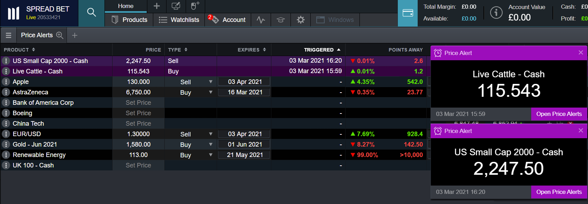

## Table of Contents

## What is an alert system?

An alert system is a tool that sends out warnings or notifications to people when something important happens. It can be used for many things, like telling people about bad weather, emergencies, or important news. The system can send messages through phones, emails, sirens, or even radio and TV broadcasts. This helps people stay safe and informed because they get the information quickly.

There are different kinds of alert systems for different needs. For example, a weather alert system tells people about storms or hurricanes so they can prepare or evacuate. An emergency alert system might be used by schools or workplaces to let everyone know about a fire or a lockdown. These systems are important because they help people react fast and stay safe during dangerous situations.

## What are the common types of alert systems?

There are several common types of alert systems that people use every day. One type is the weather alert system. This system tells people about dangerous weather like storms, hurricanes, or tornadoes. It sends out warnings so people can get ready or leave the area if they need to. Another type is the emergency alert system. This one is used by places like schools, offices, or cities to let people know about emergencies like fires, shootings, or other dangerous situations. It helps everyone stay safe by giving them quick information.

Another common alert system is the health alert system. This type sends out warnings about health issues like disease outbreaks or pandemics. It helps people know what to do to stay healthy and safe. There are also security alert systems that businesses and homes use. These systems send alerts if someone breaks in or if there's a security problem. They help keep people and their things safe.

Lastly, there are technical alert systems that companies use to monitor their computer networks and systems. These alerts tell them if something goes wrong with their technology, like a server going down or a cyber attack happening. This helps them fix problems quickly and keep their business running smoothly. All these alert systems are important because they help people stay safe and informed.

## How do alert systems work?

Alert systems work by detecting certain events or conditions and then sending out notifications to people who need to know. These systems use sensors, data feeds, or other technology to keep an eye on things like weather, security, or health issues. When something important happens, like a storm coming or a fire starting, the system quickly sends out an alert. This alert can go to phones, computers, or even loud sirens, depending on what the system is set up to do.

Once the alert is sent, it reaches people through different ways. For example, a weather alert might come as a text message or a special sound on your phone. An emergency alert at school might make a loud noise and show a message on screens around the building. The goal is to get the information to as many people as possible, as fast as possible, so they can take action to stay safe. Different alert systems use different methods, but they all work to keep people informed and ready for whatever might happen.

## What are the benefits of using an alert system?

Using an alert system has many benefits. It helps people stay safe by giving them important information quickly. When something dangerous happens, like a storm or a fire, the alert system sends out a warning. This gives people time to get ready or leave the area. It can save lives because people know what to do and when to do it.

Alert systems also help keep things running smoothly. For example, if a business uses a technical alert system, it can fix problems with their computers or networks fast. This means less downtime and more work getting done. In schools or workplaces, an emergency alert system can help everyone know what to do during a crisis, making sure everyone stays safe and calm.

## What industries commonly use alert systems?

Many industries use alert systems to keep people safe and informed. In the healthcare industry, hospitals and clinics use health alert systems to warn about disease outbreaks or other health emergencies. This helps doctors and nurses take quick action to protect patients and staff. The weather industry also uses alert systems a lot. Meteorologists send out weather alerts to tell people about storms, hurricanes, or tornadoes so they can prepare or evacuate if needed.

The education and business sectors also rely on alert systems. Schools use emergency alert systems to inform students and staff about dangers like fires or lockdowns. This helps everyone know what to do to stay safe. In businesses, security and technical alert systems are common. Security alerts tell people if there's a break-in or other security issues, while technical alerts help fix computer or network problems fast, keeping the business running smoothly.

Other industries like transportation and manufacturing also use alert systems. In transportation, alert systems can warn drivers or passengers about road conditions or delays. In manufacturing, alert systems can notify workers about machine malfunctions or safety hazards. All these industries use alert systems to help keep people safe, informed, and ready for any situation.

## How can an alert system be implemented in a small business?

A small business can implement an alert system by choosing a system that fits their needs. They might need a security alert system to keep their building safe, or a technical alert system to watch over their computers and networks. They can start by looking at different alert systems online or talking to other business owners about what they use. Once they pick a system, they need to set it up. This could mean putting sensors around the building or installing software on their computers. They should make sure everyone in the business knows how the system works and what to do when an alert goes off.

After setting up the alert system, the business should test it often to make sure it's working right. They can do this by setting off test alerts and seeing how everyone reacts. It's also important to keep the system updated and fix any problems quickly. This way, the alert system will help the business stay safe and run smoothly. By using an alert system, a small business can be ready for emergencies and keep their people and things safe.

## What are the key components of an effective alert system?

An effective alert system needs a few important parts to work well. First, it needs good sensors or data feeds to watch for things like bad weather, security problems, or health issues. These sensors need to be reliable and quick to spot any trouble. Next, the system needs a way to send out alerts fast. This could be through text messages, emails, or even loud sirens. The alerts should be clear and easy to understand so people know what to do right away.

Another key part is making sure everyone knows how the alert system works. People need to be trained on what the different alerts mean and what actions to take. It's also important to test the system often to make sure it's working right. This means setting off test alerts and seeing how everyone reacts. Keeping the system updated and fixing any problems quickly is also crucial. By having all these parts, an alert system can help keep people safe and informed when something important happens.

## How do you choose the right alert system for your needs?

Choosing the right alert system for your needs starts with figuring out what you need it for. Think about the kinds of problems or emergencies you might face. If you live in a place with lots of storms, you might need a weather alert system. If you run a business, you might need a security alert system to keep your building safe or a technical alert system to watch over your computers. Once you know what you need, look at different systems and see which ones can do what you need them to do. You can read reviews online or talk to other people who use alert systems to see what they like and don't like.

After [picking](/wiki/asset-class-picking) a few systems that seem good, think about how easy they are to use and set up. Some systems might need special equipment or software, while others might be simpler. Make sure the system you choose can send alerts in a way that works for you, like text messages or emails. It's also a good idea to pick a system that you can test and update easily. This way, you can be sure it will work well when you need it. By thinking about all these things, you can choose an alert system that will keep you safe and informed.

## What are the latest technologies used in modern alert systems?

Modern alert systems use new technologies to make them work better and faster. One big technology is the use of smartphones. Alerts can now be sent directly to your phone as a text message or a special notification. This means you can get important information quickly, no matter where you are. Another technology is the use of the internet and cloud services. This lets alert systems send out messages to a lot of people at the same time, and it also makes it easy to update the system and keep it working well.

Another important technology is the use of [artificial intelligence](/wiki/ai-artificial-intelligence) (AI) and [machine learning](/wiki/machine-learning). These technologies help the alert system learn from past events and get better at predicting when something bad might happen. For example, AI can help a weather alert system predict a storm more accurately. There are also new sensors and devices that can detect problems faster and more reliably. These sensors can be used in security systems to spot intruders or in health systems to monitor for disease outbreaks. All these technologies help make alert systems more effective at keeping people safe and informed.

## How can alert systems be integrated with other systems?

Alert systems can be connected with other systems to make them work even better. For example, a security alert system in a building can be linked to the fire alarm system. If there's a fire, the security system can send out an alert to everyone in the building, telling them to leave right away. This helps keep people safe because they get the information quickly from both systems. Another way to connect alert systems is with computer networks. If there's a problem with the network, like a cyber attack, the alert system can send a message to the IT team so they can fix it fast. This helps keep the business running smoothly.

Also, alert systems can work with health monitoring systems. In a hospital, if a patient's health suddenly gets worse, the health monitoring system can send an alert to the doctors and nurses. This way, they can come help the patient quickly. By connecting alert systems with other systems, people can get important information faster and stay safer. It makes the whole system work better because everything is working together.

## What are the challenges and limitations of alert systems?

Alert systems can face some challenges and limitations. One big problem is false alarms. Sometimes the system might think there's a problem when there isn't one, and this can make people stop paying attention to the alerts. It's also hard to make sure the alerts reach everyone who needs to know. If people don't have their phones or can't hear the siren, they might miss the alert. Another challenge is keeping the system working well all the time. It needs regular updates and checks to make sure it's ready for any emergency.

Another limitation is that alert systems can be expensive to set up and maintain. Small businesses or communities might not have enough money to get a good system. Also, the system needs to be easy to use so that everyone can understand the alerts and know what to do. If it's too complicated, people might get confused or not take the right action. Lastly, alert systems depend a lot on technology, and if the technology fails, like during a power outage, the system might not work when it's needed the most.

## How can the effectiveness of an alert system be measured and improved?

To measure the effectiveness of an alert system, you can look at how fast the alerts reach people and if they understand what to do. You can also see if the alerts help keep people safe during emergencies. One way to do this is by keeping track of how many false alarms happen. If there are too many false alarms, people might start ignoring the alerts. Another way is to ask people if they got the alert and if it was clear and helpful. Testing the system often and seeing how everyone reacts can also show if it's working well.

To improve an alert system, you can use the information from your tests and feedback. If people are missing the alerts, you might need to use different ways to send them, like more text messages or louder sirens. If there are too many false alarms, you can work on making the sensors or technology better so they don't go off when there's no real problem. Keeping the system updated and fixing any issues quickly will also help it work better. By listening to what people say and making changes, you can make the alert system more effective at keeping everyone safe and informed.

## References & Further Reading

[1]: Bergstra, J., Bardenet, R., Bengio, Y., & Kégl, B. (2011). ["Algorithms for Hyper-Parameter Optimization."](https://dl.acm.org/doi/10.5555/2986459.2986743) Advances in Neural Information Processing Systems 24.

[2]: ["Advances in Financial Machine Learning"](https://www.amazon.com/Advances-Financial-Machine-Learning-Marcos/dp/1119482089) by Marcos Lopez de Prado

[3]: ["Evidence-Based Technical Analysis: Applying the Scientific Method and Statistical Inference to Trading Signals"](https://www.amazon.com/Evidence-Based-Technical-Analysis-Scientific-Statistical/dp/0470008741) by David Aronson

[4]: ["Machine Learning for Algorithmic Trading"](https://github.com/PacktPublishing/Machine-Learning-for-Algorithmic-Trading-Second-Edition) by Stefan Jansen

[5]: ["Quantitative Trading: How to Build Your Own Algorithmic Trading Business"](https://www.amazon.com/Quantitative-Trading-Build-Algorithmic-Business/dp/1119800064) by Ernest P. Chan