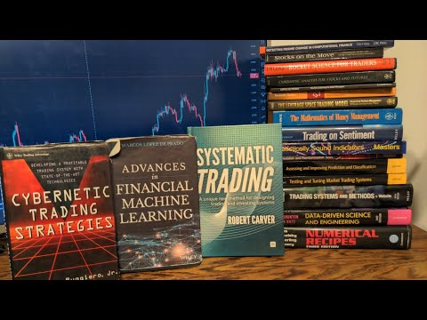

## Table of Contents

## What is algorithmic trading and why is it important for beginners to understand?

Algorithmic trading, often called algo-trading, is when computers use math formulas to buy and sell stocks, currencies, or other financial things very quickly. Instead of people making these decisions, a computer program follows a set of rules to decide when to trade. This can happen in milliseconds, much faster than a human could ever do it. Many big financial companies use algorithmic trading because it can handle lots of trades at once and can take advantage of small price changes that happen very quickly.

It's important for beginners to understand algorithmic trading because it's a big part of today's financial markets. Knowing about it helps you see how prices can move in ways that might not make sense if you only think about human decisions. Also, if you're thinking about starting to trade yourself, understanding algo-trading can help you make better choices. You'll know that some of the price movements you see are because of these computer programs, and you can learn to work with or around them.

## What are the foundational books that a beginner should start with to learn algorithmic trading?

If you're new to algorithmic trading, a good starting book is "Algorithmic Trading: Winning Strategies and Their Rationale" by Ernie Chan. This book is great for beginners because it explains things in a simple way. It talks about how to make trading strategies using math and computers. Ernie Chan also shares examples of strategies that have worked before, which can give you ideas for your own trading.

Another helpful book is "Quantitative Trading: How to Build Your Own Algorithmic Trading Business" by Dr. Ernest P. Chan. This one is also by Ernie Chan, but it focuses more on how to start your own trading business. It covers the basics of setting up a trading system, managing risks, and even how to keep your trading going while you're not watching it. Both of these [books](/wiki/algo-trading-books) are good because they are written in a way that's easy to understand, even if you're just starting out.

Lastly, "Python for Algorithmic Trading" by Yves Hilpisch is a great choice if you want to learn how to use the Python programming language for trading. This book teaches you how to write code to create trading strategies. It's perfect for beginners because it starts with the basics of Python and then shows you how to use it for algo-trading. By reading these books, you'll get a solid foundation in [algorithmic trading](/wiki/algorithmic-trading) and be ready to start your own journey in this exciting field.

## How can intermediate traders use books to improve their understanding of trading strategies?

Intermediate traders can use books to deepen their understanding of trading strategies by focusing on more advanced topics and real-world applications. A good book for this level is "The New Trading for a Living" by Dr. Alexander Elder. This book goes beyond the basics and explains more complex strategies like using multiple timeframes and understanding market psychology. It also gives practical advice on how to manage trades and handle emotions, which are crucial for intermediate traders looking to improve their skills. By reading books like this, intermediate traders can learn from experienced traders and apply new strategies to their own trading.

Another useful book for intermediate traders is "Trading in the Zone" by Mark Douglas. This book focuses on the mental side of trading, which is often overlooked but very important. It helps traders understand how to control their emotions and stay disciplined, which can make a big difference in their success. By working on their mindset, intermediate traders can improve their ability to stick to their trading plans and make better decisions. Reading books that cover both strategy and psychology can help intermediate traders become more well-rounded and effective in their trading.

## What are some must-read books for developing custom algorithms and trading systems?

If you want to develop custom algorithms and trading systems, "Advances in Financial Machine Learning" by Marcos López de Prado is a must-read. This book dives deep into how to use [machine learning](/wiki/machine-learning) to create trading strategies. It covers topics like how to handle big data, how to avoid common mistakes in data analysis, and how to test your strategies to make sure they work. Even though it's a bit advanced, it's worth the effort because it gives you the tools to build powerful trading systems that can adapt to changing markets.

Another great book for building custom algorithms is "Python for Algorithmic Trading" by Yves Hilpisch. This book is perfect if you're learning to code or want to use Python to create your trading strategies. It starts with the basics of Python and then shows you how to use it to analyze financial data, create trading algorithms, and even automate your trades. By following the examples in this book, you can learn how to build your own trading systems step-by-step, which is really helpful if you're just starting to develop custom algorithms.

## Which books provide insights into the psychological aspects of algorithmic trading?

"Trading in the Zone" by Mark Douglas is a great book for understanding the psychological side of trading, including algorithmic trading. It explains how our emotions can affect our trading decisions. The book teaches you how to stay calm and focused, even when the market is moving fast. This is really important for algorithmic traders because they need to trust their systems and not let fear or excitement make them change their plans.

Another helpful book is "The Psychology of Trading" by Brett N. Steenbarger. This book looks at how traders can improve their mental game. It talks about how to handle stress and keep a good mindset while trading. For algorithmic traders, understanding these psychological principles can help them stick to their strategies and not panic when things don't go as planned. By reading these books, you can learn how to manage your emotions and make better trading decisions.

## What are the best resources for learning about high-frequency trading techniques?

If you want to learn about high-frequency trading techniques, "High-Frequency Trading: A Practical Guide to Algorithmic Strategies and Trading Systems" by Irene Aldridge is a great book to start with. It explains the basics of high-frequency trading in a way that's easy to understand. The book talks about how these traders use computers to buy and sell things very quickly. It also covers the different strategies they use and how they make money from tiny price changes that happen in milliseconds. This book is good for beginners because it breaks down complex ideas into simple terms.

Another useful resource is "Flash Boys: A Wall Street Revolt" by Michael Lewis. This book tells the story of how high-frequency trading works in the real world. It's not a technical guide, but it helps you understand the big picture and the impact of high-frequency trading on the market. The book follows a group of people trying to fix the problems caused by high-frequency trading. By reading this, you can see how these techniques affect regular traders and why they are so important in today's markets.

## How can books on quantitative analysis enhance an expert trader's skills?

Books on quantitative analysis can help expert traders by giving them new ways to look at the market. These books teach traders how to use math and data to make better decisions. For example, "Quantitative Trading" by Ernie Chan shows how to build trading systems using numbers and [statistics](/wiki/bayesian-statistics). By learning these methods, expert traders can find new patterns and opportunities that they might miss otherwise. This can help them make more money and be better at predicting what the market will do next.

Also, these books help expert traders stay up-to-date with the latest tools and techniques. The field of quantitative analysis is always changing, with new ideas and technology coming out all the time. "Advances in Financial Machine Learning" by Marcos López de Prado talks about using machine learning to improve trading strategies. By reading books like this, expert traders can learn how to use these new tools to make their trading systems even better. This keeps them ahead of other traders who might not be using the latest methods.

## What are the latest books that cover cutting-edge technologies in algorithmic trading?

"Advances in Financial Machine Learning" by Marcos López de Prado is a great book for learning about the newest technology in algorithmic trading. It talks about how to use machine learning to make better trading strategies. Machine learning is a type of computer science that helps computers learn from data and make decisions. This book shows you how to use it to analyze big data and find patterns that can help you trade better. It also teaches you how to avoid common mistakes when working with data and how to test your strategies to make sure they work.

Another book that covers new technology in algorithmic trading is "Python for Algorithmic Trading" by Yves Hilpisch. This book focuses on using the Python programming language to build trading systems. Python is popular because it's easy to learn and has lots of tools for working with numbers and data. The book starts with the basics of Python and then shows you how to use it to create trading algorithms. It also covers how to automate your trades, which means letting the computer do the buying and selling for you. By reading this book, you can learn how to use the latest technology to build your own trading systems.

## Which books offer case studies and real-world applications of algorithmic trading?

"Algorithmic Trading: Winning Strategies and Their Rationale" by Ernie Chan is a great book for learning about real-world examples of algorithmic trading. Ernie Chan shares different strategies that have worked in the past and explains why they were successful. He uses case studies to show how these strategies were used in actual markets. This helps readers understand how to apply these ideas to their own trading. The book also talks about how to use math and computers to make trading decisions, which is really helpful for seeing how these strategies work in practice.

Another good book for real-world applications is "Quantitative Trading: How to Build Your Own Algorithmic Trading Business" by Dr. Ernest P. Chan. This book not only explains how to build trading systems but also gives examples of how these systems have been used successfully. It includes case studies that show how different strategies were applied in real markets. By reading these examples, you can see how to use the strategies in your own trading. The book also covers how to manage risks and keep your trading going even when you're not watching it, which are important parts of running a trading business.

## What are the recommended readings for understanding risk management in algorithmic trading?

"Quantitative Trading: How to Build Your Own Algorithmic Trading Business" by Dr. Ernest P. Chan is a great book for learning about risk management in algorithmic trading. It explains how to handle the risks that come with using computers to trade. The book talks about different ways to measure risk and how to use these measurements to make better trading decisions. It also gives examples of how to set up rules to stop trading if things go wrong, which can help protect your money. By reading this book, you can learn how to manage the risks of algo-trading in a way that makes sense for your own trading business.

Another helpful book is "Advances in Financial Machine Learning" by Marcos López de Prado. This book goes into detail about how to use math and computers to manage risk. It talks about how to use data to predict what might happen in the market and how to use this information to make safer trading choices. The book also covers how to test your trading strategies to make sure they work and how to adjust them if they don't. By understanding these ideas, you can better protect yourself from losing money and make your trading more successful.

## How do books on machine learning and AI intersect with algorithmic trading strategies?

Books on machine learning and AI can help people who trade using computers by teaching them new ways to make trading plans. These books show how to use computers to learn from past market data and find patterns that can predict what will happen next. For example, "Advances in Financial Machine Learning" by Marcos López de Prado explains how to use machine learning to create better trading strategies. It talks about how to handle big data, avoid common mistakes, and test your strategies to make sure they work. By reading these books, traders can learn to build systems that can adapt to changing markets and make better decisions.

Another important book is "Python for Algorithmic Trading" by Yves Hilpisch. This book teaches how to use the Python programming language to create trading algorithms. Python is easy to learn and has many tools for working with numbers and data, which makes it perfect for algorithmic trading. The book starts with the basics of Python and then shows how to use it to analyze financial data and automate trades. By using machine learning and AI, traders can make their systems smarter and more efficient. This means they can find new opportunities and make more money, all while using the latest technology.

## What are the top books for experts looking to stay updated with global market trends and regulations?

"Global Financial Markets: Issues and Strategies" by Ian H. Giddy is a great book for experts who want to stay updated on global market trends and regulations. This book explains how different markets around the world work and how they are connected. It talks about things like currency trading, how to invest in different countries, and what rules you need to follow. By reading this book, experts can learn about the latest trends in global finance and understand how new regulations might affect their trading strategies. It's written in a way that's easy to understand, even if you're already an expert in trading.

Another useful book is "The Handbook of Global Securities Operations" by David Loader. This book focuses on the practical side of working in global markets. It covers topics like how to settle trades in different countries, how to handle risks when trading globally, and what regulations you need to know about. The book is full of real-world examples and case studies that show how these rules and trends affect trading. By reading this, experts can stay on top of the latest changes in global markets and make sure they are following all the right rules. It's a great resource for anyone who wants to keep their trading strategies up-to-date with what's happening around the world.

## Curated List of Algo Trading Books

### Market Microstructure and Basics

Grasping the essentials of market microstructure is foundational to succeeding in algorithmic trading. This realm investigates deep into the intricacies of how orders are placed, executed, and cleared in financial markets. It uncovers the very heartbeat of trading and, thus, equips traders to design better, more informed strategies. To navigate this intricate domain, a couple of books stand out as premier resources.

**"Trading and Exchanges" by Larry Harris**

- **Description**: Harris offers a comprehensive insight into the operational mechanics of financial markets. The book discusses everything from the players in the markets, like traders and brokers, to the nitty-gritty of order placement and execution.
- **Best Suited For**: Beginners to intermediate learners who wish to grasp the foundational aspects of market operations.
- **Unique Aspects**: The book’s strength lies in its exhaustive coverage and real-world examples that shed light on market dynamics from various angles.
- 👉 [Amazon.com](https://www.amazon.com/Trading-Exchanges-Market-Microstructure-Practitioners/dp/0195144708)

**"Algorithmic Trading & DMA" by Barry Johnson**

- **Description**: Johnson dives into both the theoretical and practical aspects of algorithmic trading and direct market access (DMA). It provides insights into trading strategies, order routing, and market structure.
- **Best Suited For**: Intermediate traders or those transitioning from traditional to algorithmic trading.
- **Unique Aspects**: The blend of theory with actionable insights, especially the discussion on DMA and its impact on markets, sets this book apart.
- 👉 [Amazon.com](https://www.amazon.com/Algorithmic-Trading-DMA-introduction-strategies/dp/0956399207)

Understanding these basics is akin to mastering the alphabet before penning a poem. It’s not just about placing orders; it's about knowing when, why, and how those orders interact with the market's vast ecosystem. As algorithmic strategies become more complex, a profound understanding of these fundamentals will always serve as a robust scaffold, upon which more advanced techniques can be reliably built.

### Statistics, Econometrics, and Technical Analysis

Statistics and econometrics arm traders with tools to model financial data, while technical analysis provides the lens to interpret past market movements to predict future price trends. These disciplines underpin many algorithmic trading strategies, offering a framework to test hypotheses and optimize trading signals.

**"Schaum's Outline of Statistics and Econometrics"**

- **Description**: This book serves as a concise tutorial on both statistics and econometrics, breaking down complex concepts into digestible units, aided by solved problems and supplementary exercises.
- **Best Suited For**: Beginners and students looking for a refresher or introduction to the topic.
- **Unique Aspects**: Its outline format is ideal for quick learning, making the book a favorite for exam preparation or crash courses.
- 👉 [Amazon.com](https://www.amazon.com/Schaums-Outline-Statistics-Econometrics-Outlines/dp/0071755470)

**"Technical Analysis of the Financial Markets" by John J. Murphy**

- **Description**: Murphy provides a comprehensive guide to trading methodologies, chart patterns, and indicators. This tome is considered the bible of technical analysis, touching upon everything from Dow Theory to the latest computer technology.
- **Best Suited For**: Beginners to intermediate traders aiming to deepen their knowledge in technical analysis.
- **Unique Aspects**: The depth and breadth of coverage on the topic, combined with practical applications, make this a go-to reference for many traders.
- 👉 [Amazon.com](https://www.amazon.com/Technical-Analysis-Financial-Markets-Comprehensive/dp/0735200661)

Statistical tools empower traders to discern patterns, test strategies, and make informed decisions. Meanwhile, technical analysis offers visual cues and heuristic methods, helping traders to navigate the vast ocean of financial data. Both fields, when combined, equip traders with a robust arsenal, enabling them to approach markets scientifically and strategically.

### Machine Learning and Advanced Techniques

Machine learning (ML) has been at the forefront of many industries, and algorithmic trading is no exception. By applying ML techniques, traders can automatically identify patterns from large datasets, make predictions, and adapt to new data, giving them a significant edge in the markets.

**"Advances in Financial Machine Learning" by Marcos Lopez de Prado**

- **Description**: De Prado offers a blend of financial theory and advanced ML methods. The book investigates into topics like meta-labeling, ensemble methods, and feature engineering specifically tailored for the financial domain.
- **Best Suited For**: Intermediate to expert traders who already possess a foundational understanding of ML and want to adapt advanced techniques for trading.
- **Unique Aspects**: Unlike traditional ML books, this resource provides a deep dive into the intricacies of applying ML to financial data, ensuring techniques are both theoretically sound and practically applicable.
- 👉 [Amazon.com](https://www.amazon.com/Advances-Financial-Machine-Learning-Marcos/dp/1119482089)

**"Machine Learning for Algorithmic Trading" by Stefan Jansen**

- **Description**: Jansen's work is a comprehensive guide that combines the principles of ML with real-world trading strategies. It covers the entire algo trading pipeline, from data acquisition and preprocessing to strategy evaluation.
- **Best Suited For**: Beginners to intermediate traders and data scientists transitioning into the finance domain.
- **Unique Aspects**: This book is notable for its hands-on approach, offering Python code snippets, practical exercises, and real-world case studies to ensure effective learning.
- 👉 [Amazon.com](https://www.amazon.com/Machine-Learning-Algorithmic-Trading-alternative/dp/1839217715)

**"Neural Networks in Finance: Gaining Predictive Edge in the Market" by Paul D. McNelis**

- **Description**: This book dives deep into the application of neural networks in the world of finance, providing insights into how these powerful algorithms can be used for forecasting and trading.
- **Best Suited For**: Intermediate readers familiar with the basics of neural networks and looking to apply them in the financial domain.
- **Unique Aspects**: McNelis blends theoretical constructs with practical applications, highlighting the transformational role neural networks play in capturing non-linearities in financial markets.
- 👉 [Amazon.com](https://www.amazon.com/Neural-Networks-Finance-Predictive-Academic/dp/0124859674)

Machine learning's ability to analyze vast amounts of data and predict market movements makes it an invaluable tool in the trader's toolkit. By integrating these advanced techniques, traders can create more flexible, adaptive, and potentially profitable strategies in the ever-evolving financial markets.

### Practical Guides and Strategy Building

Mastering the theoretical aspects of algorithmic trading is just one part of the journey. Equally critical is the practical application — the ability to translate those theories into profitable trading strategies. The following books are meticulously chosen to guide traders in this endeavor:

**"Algorithmic Trading: A Practitioner's Guide" by Jeffrey Bacidore**

- **Description**: Bacidore dives deep into the operational aspects of algo trading. Covering topics ranging from order routing to market impact, this book gives readers the tools needed to navigate the intricacies of algorithmic strategies in real-world settings.
- **Best Suited For**: Intermediate traders who have a grasp of the basics and are looking to implement and optimize their strategies.
- **Unique Aspects**: The book's focus on the practical challenges of algorithmic trading and solutions to those challenges makes it a must-read for traders looking to operationalize their strategies.
- 👉 [Amazon.com](https://www.amazon.com/Algorithmic-Trading-Practitioners-Jeffrey-Bacidore/dp/0578715236)

**"Building Winning Algorithmic Trading Systems" by Kevin J. Davey**

- **Description**: Davey, a recognized figure in algorithmic trading, offers a step-by-step guide on building, evaluating, and implementing robust algo trading systems. The book also sheds light on the pitfalls to avoid and strategies to enhance profitability.
- **Best Suited For**: Both beginners looking for a structured approach to building trading systems and advanced traders seeking to refine their techniques.
- **Unique Aspects**: Davey's book is enriched by his personal experiences, and he shares several of his own systems, offering readers a peek into the strategies of a seasoned trader.
- 👉 [Amazon.com](https://www.amazon.com/Building-Winning-Algorithmic-Trading-Systems/dp/1118778987)

**"Quantitative Trading: How to Build Your Own Algorithmic Trading Business" by Ernie Chan**

- **Description**: Chan breaks down the quantitative trading process, from formulating ideas to risk management. His insights into backtesting and pitfalls ensure readers avoid common mistakes.
- **Best Suited For**: Beginners to intermediate traders interested in starting their quantitative trading venture.
- **Unique Aspects**: The book offers actionable advice on setting up a quantitative trading business, from capital requirements to technology infrastructure.
- 👉 [Amazon.com](https://www.amazon.com/Quantitative-Trading-Build-Algorithmic-Business/dp/0470284889)

By delving into these resources, traders can harness the combined wisdom of industry experts, ensuring they are well-equipped to navigate the complex and ever-evolving world of algorithmic trading.

### Cutting-Edge Developments and Future Insights

In the swiftly evolving world of algorithmic trading, staying updated on the latest technological advancements is indispensable. The frontier of algo trading is consistently pushed by new innovations and methodologies. To aid traders in staying ahead of the curve, we present a collection of pioneering books that dive into the future of trading:

**"Trading at the Speed of Light" by Donald MacKenzie**

- **Description**: MacKenzie uncovers the intricate relationship between high-frequency trading and cutting-edge technologies. The book investigates into how trading firms utilize advanced tech, from microwave transmissions to undersea cables, to gain minute advantages in speed.
- **Best Suited For**: Intermediate to expert traders who wish to understand the implications of technology in high-frequency trading.
- **Unique Aspects**: The profound research into the socio-technical networks surrounding high-frequency trading and how minute speed advantages can yield significant results.
- 👉 [Amazon.com](https://www.amazon.com/Trading-Speed-Light-Algorithms-Transforming/dp/0691211388)

**"All-in On AI" by Thomas H. Davenport and Nitin Mittal**

- **Description**: Davenport and Mittal explore the transformative power of artificial intelligence in the financial markets. They present a compelling argument on how AI is reshaping trading strategies, risk management, and the broader financial landscape.
- **Best Suited For**: Beginners to experts keen on comprehending the expansive impact of AI on trading and finance.
- **Unique Aspects**: Comprehensive case studies and insights from industry leaders provide a hands-on perspective on the applications and challenges of AI in trading.
- 👉 [Amazon.com](https://www.amazon.com/All-AI-Companies-Artificial-Intelligence/dp/1647824699)

**"Flash Boys: A Wall Street Revolt" by Michael Lewis**

- **Description**: Lewis offers a gripping narrative on high-frequency trading and its implications on Wall Street. He reveals the secretive world of computerized trading and the individuals trying to reform it.
- **Best Suited For**: Anyone, from novices to experts, interested in the ethical and operational implications of high-frequency trading.
- **Unique Aspects**: An intriguing exposé of the loopholes and dark corners of the modern financial system, enriched with personal stories and investigations.
- 👉 [Amazon.com](https://www.amazon.com/Flash-Boys-Wall-Street-Revolt/dp/0393351599)

For those immersed in algo trading, these readings are invaluable. They not only offer a vision of what lies ahead but also equip traders with the knowledge to leverage emerging technologies to their advantage.

## Additional Resources and Free Material

The journey of mastering algo trading doesn't stop at traditional publications. The digital realm offers a plethora of resources, many of which are freely accessible. Delving into these can supplement your learning and keep you at the forefront of algorithmic trading innovations:

**"Neural Networks & Deep Learning" by Michael Nielsen**

- **Description**: An insightful dive into neural networks, this digital book elucidates the intricacies of deep learning. Nielsen's engaging prose ensures that complex topics are broken down for comprehensibility without sacrificing depth.
- **Best Suited For**: Beginners to intermediate learners interested in merging deep learning with financial strategies.
- **Unique Aspects**: The book seamlessly integrates interactive Python exercises, allowing readers to immediately apply the concepts they learn.
- 👉 [Free book](https://jingyuexing.github.io/Ebook/Machine_Learning/Neural%20Networks%20and%20Deep%20Learning-eng.pdf)

**"QuantStart" - Online Portal**

- **Description**: This website provides articles, tutorials, and guides on various aspects of quantitative finance, including backtesting, machine learning, and quantitative trading strategies.
- **Best Suited For**: Ranging from beginners to experts, there's content for everyone keen on diving deep into quantitative strategies.
- **Unique Aspects**: The active community provides forums where learners can discuss topics, share insights, and seek guidance.
- 👉 [Website](https://www.quantstart.com/)

**"QuantEcon" - Open Source Code Repository**

- **Description**: An extensive resource offering code, notebooks, and lectures related to quantitative economics. It's a treasure trove for anyone wanting to merge economic theories with algorithmic strategies.
- **Best Suited For**: Intermediate to expert algorithmic traders with an interest in economic dynamics.
- **Unique Aspects**: The platform’s integration of Python and Julia code with theoretical concepts helps bridge the gap between learning and practical implementation.
- 👉 [GitHub](https://github.com/QuantEcon)

**"Financial Data Science" by Yves Hilpisch**

- **Description**: This online resource dives deep into financial data science, offering Python-based examples, case studies, and interactive Jupyter notebooks.
- **Best Suited For**: Intermediate learners and above who want to harness the power of data science in finance.
- **Unique Aspects**: The repository is continuously updated, reflecting the latest in financial data science methodologies.
- 👉 [Website](https://home.tpq.io/)

Expanding your horizons by exploring these additional resources ensures a holistic approach to your learning journey in algo trading, making sure you're well-equipped to tackle the dynamic challenges of the trading world.

## References & Further Reading

[1]: [O'Hara, M. (1995). Market microstructure theory. Blackwell.](https://www.wiley.com/en-us/Market+Microstructure+Theory-p-9780631207610)

[2]: [Prado, M. L. de. (2018). Advances in Financial Machine Learning. Wiley.](https://www.wiley.com/en-us/Advances+in+Financial+Machine+Learning-p-9781119482086)