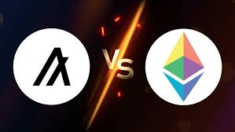

## Table of Contents

## What are Algorand and Ethereum?

Algorand is a type of blockchain technology that helps people send and receive money quickly and safely. It was created to solve some problems that other blockchains have, like being slow and using a lot of energy. Algorand uses a special way to agree on transactions called "Pure Proof of Stake," which makes it fast and green. This means you can use Algorand to pay for things or move money around without waiting a long time or worrying about it being safe.

Ethereum is another blockchain that lets people do more than just send money. It's like a big computer that anyone can use to run special programs called "smart contracts." These programs can do things automatically, like making sure a deal happens only if certain rules are followed. Ethereum is very popular and has been around for a while, but it can be slow and expensive to use sometimes. People are working on making Ethereum faster and cheaper, which is called Ethereum 2.0.

## What is the main purpose of Algorand and Ethereum?

The main purpose of Algorand is to provide a fast and secure way to send and receive money. It was designed to overcome the challenges faced by other blockchains, such as slow transaction times and high energy use. Algorand uses a method called "Pure Proof of Stake" to make sure transactions happen quickly and in an environmentally friendly way. This makes it a good choice for people who want to move money around without waiting a long time or worrying about safety.

Ethereum's main purpose is to allow people to do more than just send money; it's a platform where you can run special programs called "smart contracts." These programs can automatically [carry](/wiki/carry-trading) out actions based on certain conditions, like making sure a deal goes through only if specific rules are met. Ethereum has been popular for a long time, but it can sometimes be slow and costly to use. That's why people are working on improving it with something called Ethereum 2.0, which aims to make transactions faster and cheaper.

## How does the consensus mechanism of Algorand differ from Ethereum?

Algorand uses a consensus mechanism called "Pure Proof of Stake." This means that instead of using a lot of computers to solve hard math problems like Bitcoin does, Algorand picks a small group of people to agree on transactions. These people are chosen based on how much of the Algorand [cryptocurrency](/wiki/cryptocurrency) they own. This way, transactions can happen very quickly and it doesn't use a lot of energy. It's like [picking](/wiki/asset-class-picking) a few trusted friends to make a decision instead of asking everyone in a big group.

Ethereum, on the other hand, currently uses a consensus mechanism called "Proof of Work." This is similar to Bitcoin's method, where computers compete to solve math problems to add new transactions to the blockchain. It can be slow and uses a lot of energy because so many computers are working at the same time. However, Ethereum is moving to a new system called "Proof of Stake," which will be more like Algorand's method. In this new system, people will be chosen to agree on transactions based on how much Ethereum they hold, making it faster and more energy-efficient.

## What are the transaction speeds and costs on Algorand compared to Ethereum?

Algorand is known for being fast and cheap. It can handle many transactions per second, often around 1,000 or more. This makes it quick for sending money or doing other things on the blockchain. The cost to send a transaction on Algorand is usually very low, often just a few cents. This makes it a good choice if you want to move money around without spending a lot.

Ethereum, on the other hand, can be slower and more expensive. Before its upgrades, it could only handle around 15 to 30 transactions per second. This means you might have to wait longer for your transaction to go through. The cost of sending a transaction on Ethereum can change a lot, sometimes going up to several dollars during busy times. But Ethereum is working on getting better with Ethereum 2.0, which should make it faster and cheaper in the future.

## How do Algorand and Ethereum approach scalability?

Algorand tackles scalability by using a method called "Pure Proof of Stake." This means it picks a small group of people to agree on transactions quickly, instead of having lots of computers solving hard problems. Because of this, Algorand can handle many transactions per second, often around 1,000 or more. This makes it fast and good for lots of people using it at the same time. The costs to send transactions are also very low, which helps when you need to do a lot of things on the blockchain without spending too much money.

Ethereum has faced challenges with scalability, mainly because it used to rely on "Proof of Work," where many computers compete to solve math problems. This made it slower, only handling around 15 to 30 transactions per second, and more expensive, especially during busy times. But Ethereum is working on a big update called Ethereum 2.0, which will switch to a "Proof of Stake" system. This should make Ethereum faster and cheaper, allowing it to handle more transactions per second and reduce the costs. This way, Ethereum hopes to become more scalable and easier for lots of people to use.

## What programming languages are used for smart contract development on Algorand and Ethereum?

For smart contract development on Algorand, the main programming language used is called PyTeal. PyTeal is a Python-based language that makes it easier for developers to write smart contracts. It's designed to be user-friendly so that people who know Python can start writing smart contracts without learning a whole new language. Algorand also supports another language called TEAL, which is lower-level and more direct, but PyTeal is often preferred because it's easier to use.

On Ethereum, the primary language for smart contract development is Solidity. Solidity is specifically created for Ethereum and looks a bit like JavaScript, which many developers already know. This makes it easier for them to start writing smart contracts on Ethereum. Besides Solidity, Ethereum also supports other languages like Vyper, which is designed to be more secure and easier to read than Solidity. But Solidity is the most commonly used because it's well-supported and has a big community of developers using it.

## How do the governance models of Algorand and Ethereum differ?

Algorand has a governance model where people who hold Algorand's cryptocurrency can vote on important decisions about the future of the network. It's like a big meeting where everyone with Algorand coins gets a say. They can vote on things like how to improve the system or what new features to add. This makes sure that the people using Algorand have a voice in how it grows and changes. It's a way to keep the community involved and make sure the network stays fair and useful for everyone.

Ethereum's governance is a bit different. It doesn't have a formal voting system like Algorand. Instead, changes to Ethereum are often decided by a group of developers and people who work on the project. They talk about ideas and make decisions together, but there's no official vote from everyone who holds Ethereum. If the community doesn't like a change, they can choose to use a different version of Ethereum, called a "fork." This way, Ethereum can still change and improve, but it's more about working together and less about everyone voting.

## What are the environmental impacts of Algorand versus Ethereum?

Algorand is designed to be good for the environment. It uses a method called "Pure Proof of Stake" to agree on transactions. This means it doesn't need lots of computers working hard and using a lot of electricity like some other blockchains do. Because of this, Algorand uses much less energy, which is better for the planet. If you care about the environment, Algorand is a good choice because it helps keep the air clean and uses fewer resources.

Ethereum, on the other hand, currently uses a lot of energy because it uses a method called "Proof of Work." This means lots of computers are working all the time to solve hard problems, which uses a lot of electricity. But Ethereum is working on changing to a new method called "Proof of Stake," which is more like Algorand's way. Once Ethereum makes this change, it should use a lot less energy and be better for the environment. Until then, Ethereum uses more energy and has a bigger impact on the environment than Algorand.

## How do Algorand and Ethereum handle network security?

Algorand keeps its network safe using a method called "Pure Proof of Stake." This means it picks a small group of people to check and agree on transactions. These people are chosen based on how much Algorand cryptocurrency they have. Because it's a small group, it's easier to keep things secure. If someone tries to do something bad, it's harder for them to trick everyone because the group is small and they're all working together to keep the network safe. This way, Algorand can be both fast and secure at the same time.

Ethereum currently uses a different method called "Proof of Work" to keep its network safe. This means lots of computers are working to solve hard math problems to agree on transactions. It's like a big competition where the first computer to solve the problem gets to add the transaction to the blockchain. This makes it hard for anyone to cheat because they would need a lot of computers to win the competition. But Ethereum is changing to a new method called "Proof of Stake," which is more like Algorand's way. This should make Ethereum more secure and use less energy, but for now, it still uses "Proof of Work" and a lot of computers to keep things safe.

## What are the key DeFi applications on Algorand and Ethereum?

On Algorand, some of the main DeFi applications include Algofi and Tinyman. Algofi lets people lend and borrow money using Algorand's cryptocurrency. It's like a bank where you can put in your money to earn interest or take out a loan if you need it. Tinyman is like a big marketplace where people can trade different types of cryptocurrencies on Algorand. It's easy to use and helps people swap their coins quickly and safely.

Ethereum has a lot of DeFi applications, with some of the most popular ones being Uniswap, Aave, and Compound. Uniswap is a big trading platform where people can exchange different cryptocurrencies without needing a middleman. It's like a big online market where you can swap your coins with anyone else. Aave and Compound are both places where people can lend and borrow money. They work a bit like Algofi on Algorand, but they're on Ethereum and have been around for a while, so they have a lot of users.

## How do Algorand and Ethereum support interoperability with other blockchains?

Algorand supports interoperability with other blockchains through something called the Algorand Standard Assets (ASA) and smart contracts. This means you can create tokens on Algorand that can be used or traded on other blockchains. Algorand also works with projects like the Inter-Blockchain Communication (IBC) protocol, which helps different blockchains talk to each other. This makes it easier for people using Algorand to move their money or assets to other networks without too much trouble.

Ethereum has a few ways to support interoperability with other blockchains too. One big way is through projects like Polkadot and Cosmos, which are designed to help different blockchains work together. Ethereum also has something called wrapped tokens, where you can take a token from another blockchain and use it on Ethereum. This makes it possible to use different cryptocurrencies on Ethereum even if they started on another network. As Ethereum grows and changes, it's working on making these connections even stronger so that more people can use different blockchains together easily.

## What future developments are planned for Algorand and Ethereum?

Algorand has some big plans for the future. They want to make their network even faster and easier to use. They're working on adding more features to their smart contracts, so people can do even more cool things with them. Algorand also wants to grow its community and make it easier for other blockchains to work with them. They're always thinking about how to make their system better for the environment too, so they can keep using less energy. All these changes are to make sure Algorand stays a good choice for people who want to send money quickly and safely.

Ethereum is also planning some big changes, especially with something called Ethereum 2.0. This update will make Ethereum faster and cheaper to use. They're switching from their old way of agreeing on transactions, called "Proof of Work," to a new way called "Proof of Stake," which is better for the environment. Ethereum also wants to make it easier for different blockchains to work together, so people can move their money and assets around more easily. These changes should help Ethereum keep being a popular place for people to use smart contracts and DeFi applications.

## References & Further Reading

[1]: Micali, S., Algorand (2019). "Algorand's Innovative Technology and Design." Retrieved from [https://www.algorand.com/technology](https://www.sciencedirect.com/science/article/pii/S030439751930091X)

[2]: Buterin, V. (2013). "Ethereum: A Next-Generation Smart Contract and Decentralized Application Platform." Retrieved from [https://ethereum.org/en/whitepaper](https://ethereum.org/content/whitepaper/whitepaper-pdf/Ethereum_Whitepaper_-_Buterin_2014.pdf)

[3]: Wood, G. (2014). "Ethereum: A Secure Decentralised Generalised Transaction Ledger - Byzantium Version." Retrieved from [https://ethereum.github.io/yellowpaper/paper.pdf](https://www.semanticscholar.org/paper/ETHEREUM%3A-A-SECURE-DECENTRALISED-GENERALISED-LEDGER-Wood/3c50bb6cc3f5417c3325a36ee190e24f0dc87257)

[4]: Narayanan, A., Bonneau, J., Felten, E., Miller, A., & Goldfeder, S. (2016). "Bitcoin and Cryptocurrency Technologies." Princeton University Press.

[5]: "Blockchain Revolution: How the Technology Behind Bitcoin and Other Cryptocurrencies is Changing the World" by Don Tapscott and Alex Tapscott. 

[6]: Antonopoulos, A. M. (2018). "Mastering Ethereum: Building Smart Contracts and DApps." O'Reilly Media.

[7]: "The Infinite Machine: How an Army of Crypto-hackers is Building the Next Internet with Ethereum" by Camila Russo. 

[8]: Chen, W., Zhang, Z., Yi, P., Qin, X., & Feng, W. (2020). "A Survey on Ethereum Systems Security: Vulnerabilities, Attacks and Defenses." Journal of Parallel and Distributed Computing, 144, 141-153. 

[9]: Pustilnik, J. (2021). "The Cryptocurrency Inheritance Problem: A Legal Perspective on Just Solutions and Recommended Practices." American University Business Law Review, 10(2), 344-371.