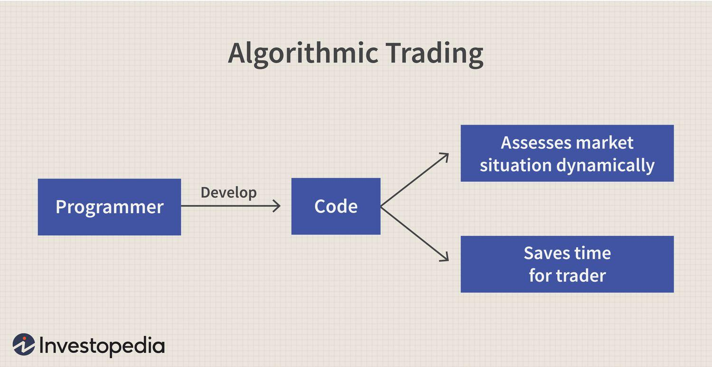

## Table of Contents

## What is an algorithm?

An algorithm is like a recipe or a set of instructions that tells a computer how to do something. It's a step-by-step plan that helps solve a problem or complete a task. Just like following steps to bake a cake, a computer follows the steps in an algorithm to get a job done.

Algorithms are used in many everyday things, like when you search for something on the internet or when your phone suggests the next word as you type. They help make decisions and find solutions quickly and efficiently. By breaking down complex problems into smaller, manageable steps, algorithms make it easier for computers to process information and perform tasks.

## How are algorithms used in trading?

In trading, algorithms are used to make decisions about buying and selling stocks, currencies, or other financial products. These algorithms analyze lots of data, like stock prices, news, and market trends, to find the best times to trade. They can work much faster than humans, so they can spot opportunities and make trades in seconds.

Traders use these algorithms to set rules for when to buy or sell. For example, an algorithm might be told to buy a stock if its price goes above a certain level, or to sell if it drops below another level. This helps take emotion out of trading, which can lead to better decisions. Many big trading companies use these algorithms because they can handle more trades and do them more accurately than people can.

## What are the basic types of trading algorithms?

There are several basic types of trading algorithms that traders use. One type is the trend-following algorithm. This kind of algorithm looks at the price movements of stocks or other things you can trade. If it sees a pattern where the price is going up, it might decide to buy more. If it sees the price going down, it might sell. It's like trying to ride a wave in the ocean, buying when the wave is going up and selling when it goes down.

Another type is the mean reversion algorithm. This one works on the idea that prices will eventually go back to their average. So, if a stock's price goes way up, this algorithm might decide to sell, thinking the price will come back down. If the price goes way down, it might buy, thinking the price will go back up. It's like betting that things will return to normal after being too high or too low.

A third type is the [arbitrage](/wiki/arbitrage) algorithm. This one looks for price differences between different places where you can buy or sell the same thing. For example, if a stock is cheaper on one exchange than another, the algorithm might buy it where it's cheap and sell it where it's more expensive. This can make a quick profit if done right. These are just a few examples, and traders often mix and match different types to make their own special algorithms.

## How do algorithms help in making trading decisions?

Algorithms help in making trading decisions by quickly analyzing lots of data that would take humans a long time to look through. They can check stock prices, news, and market trends to find the best times to buy or sell. This means they can spot opportunities and make trades much faster than people can. For example, if an algorithm sees that a stock's price is going up, it might decide to buy more of that stock right away, before the price goes even higher.

Another way algorithms help is by taking emotions out of trading. People can get scared or excited and make bad decisions because of their feelings. But algorithms follow set rules and don't get nervous or greedy. So, they can stick to a plan and make more consistent choices. For instance, if an algorithm is told to sell a stock when it reaches a certain price, it will do that without second-guessing, which can lead to better results over time.

## What is high-frequency trading and how does it use algorithms?

High-frequency trading ([HFT](/wiki/high-frequency-trading-strategies)) is a type of trading where computers make a lot of trades very quickly. It uses special algorithms to look at lots of data and make decisions in just a few seconds or even less. These algorithms are designed to find tiny differences in prices and make trades to take advantage of them. HFT is all about speed, trying to be the first to buy or sell and make a small profit from each trade.

HFT uses algorithms to do things like arbitrage, where the algorithm spots a stock that's a little cheaper on one exchange than another and buys it on the cheaper exchange to sell on the more expensive one. Another thing HFT algorithms do is [market making](/wiki/market-making), where they put both buy and sell orders into the market to make it easier for others to trade, and they earn a little bit of money from each trade they help with. Because these algorithms can work so fast, they can make many trades in a day, adding up to big profits over time.

## Can you explain the role of machine learning in algorithmic trading?

Machine learning plays a big role in [algorithmic trading](/wiki/algorithmic-trading) by helping computers learn from past data to make better trading decisions. It's like teaching a computer to spot patterns in stock prices or market trends. For example, a [machine learning](/wiki/machine-learning) algorithm might look at lots of old stock data to figure out what usually happens before a stock goes up or down. Then, it can use what it learned to predict what might happen next and decide when to buy or sell.

In algorithmic trading, machine learning helps make algorithms smarter over time. Instead of following the same set of rules all the time, these algorithms can change and improve as they see more data. This means they can get better at finding good trading opportunities and making more money. For traders, using machine learning in their algorithms can lead to better results because the computer keeps learning and adapting to new information.

## What are the benefits of using algorithms in trading?

Using algorithms in trading helps traders make decisions faster and more accurately. Computers can look at a lot of information in a short time, like stock prices, news, and market trends. This means they can spot good times to buy or sell much quicker than a person could. Algorithms also take the emotions out of trading. People can get scared or excited and make bad choices because of their feelings, but algorithms stick to the plan and make decisions based on data, not feelings.

Another big benefit is that algorithms can work all the time without getting tired. They can keep an eye on the markets 24/7 and make trades whenever it's a good time, even in the middle of the night. This can lead to more trades and more chances to make money. Plus, algorithms can handle a lot of trades at once, which is something that would be hard for a person to do. This makes trading more efficient and can help traders make more profit over time.

## What are the potential risks and challenges associated with algorithmic trading?

Using algorithms in trading can be risky because they depend a lot on the data they use. If the data is wrong or outdated, the algorithm might make bad trades. Also, algorithms follow rules set by people, so if those rules are not good or if the market changes in a way the rules don't expect, the algorithm could lose money. Another risk is that many traders use similar algorithms, which can lead to a lot of people making the same trades at the same time. This can make the market move in big, unexpected ways, like what happened during the "Flash Crash" of 2010.

There are also challenges in making sure the algorithms work well. They need to be fast and able to handle a lot of information without slowing down. This means traders need good technology and fast internet connections. Keeping the algorithms up to date is another challenge. Markets change all the time, so algorithms need to be changed and improved to keep working well. This can take a lot of time and money. Plus, there are rules and laws about trading that need to be followed, which can be hard to do when using complex algorithms.

## How has algorithmic trading impacted market efficiency and liquidity?

Algorithmic trading has made markets more efficient by making it easier and faster to buy and sell things like stocks. Computers can look at a lot of information quickly and decide when to trade. This means prices can change to match what people want to buy or sell more quickly. Because algorithms can work all the time, they help keep the market moving smoothly, even when people are not trading. This can make the market more fair because everyone has a better chance to get the prices they want.

Algorithmic trading has also helped increase [liquidity](/wiki/liquidity-risk-premium), which means there are more people and computers ready to buy or sell at any time. When there are more trades happening, it's easier for someone to sell their stocks without waiting too long to find a buyer. This is good for the market because it means people can trade more easily and quickly. But sometimes, if too many algorithms are making the same trades at the same time, it can cause big, quick changes in the market, which can be risky.

## What regulatory considerations should be taken into account with algorithmic trading?

When it comes to algorithmic trading, there are important rules and laws that traders need to follow. Governments and financial groups have set up these rules to make sure trading is fair and safe. For example, traders need to make sure their algorithms don't do things that could hurt the market, like making prices go up and down too quickly. They also need to keep good records of their trades so that if something goes wrong, they can show what happened. This helps keep the market honest and stops people from cheating.

Another thing to think about is how to make sure the algorithms follow these rules. Traders need to test their algorithms carefully before using them in the real market. They also need to watch their algorithms all the time to make sure they are working the way they should. If something goes wrong, they need to be able to stop the algorithm quickly. This can be hard because algorithms can make a lot of trades very fast, but it's important to keep the market safe and fair for everyone.

## How can one develop and test a trading algorithm?

To develop a trading algorithm, you start by figuring out what you want the algorithm to do. You might want it to buy stocks when they go up in price or sell them when they go down. Once you know what you want, you write down the rules for the algorithm to follow. This can be done using computer code, where you tell the computer exactly what to look for and what to do. After writing the code, you need to make sure it works the way you want it to. This is where testing comes in.

Testing a trading algorithm is important to make sure it will work well in the real market. You can start by using old market data to see how your algorithm would have done in the past. This is called [backtesting](/wiki/backtesting). You run your algorithm on this old data to see if it makes good trades and makes money. If it doesn't work well, you can change the rules and try again. Once you're happy with how it works on old data, you can try it out in a practice market, called a simulated environment, where you can see how it does in real-time without using real money. If it still looks good, you might be ready to use it in the real market, but always keep an eye on it to make sure it's working right.

## What advanced strategies are used in algorithmic trading by experts?

Experts in algorithmic trading often use advanced strategies like [statistical arbitrage](/wiki/statistical-arbitrage). This strategy looks for small differences in the prices of related stocks or other things you can trade. The algorithm buys the cheaper one and sells the more expensive one, hoping to make a profit when the prices come back together. It's like betting that two things that usually move together will keep doing so, even if they get a little out of sync for a while. This strategy needs a lot of data and fast computers to work well, but it can be very effective.

Another advanced strategy is called pairs trading. This is a bit like statistical arbitrage but focuses on just two stocks that are related. For example, if you have two companies that make similar products, their stock prices might move together a lot. If one stock goes up a lot more than the other, the algorithm might sell the one that went up and buy the one that didn't. The idea is to make money when the prices come back to being more similar. This strategy can be good because it doesn't depend on the whole market going up or down, just on the two stocks getting back in line with each other.

Machine learning is also a big part of advanced algorithmic trading. Traders use machine learning algorithms to look at lots of old data and find patterns that might help them make better trades. These algorithms can learn over time and get better at finding good opportunities. For example, a machine learning algorithm might learn that certain news stories or economic reports often lead to stock prices going up or down. By using this knowledge, the algorithm can make smarter trades. This makes trading more like a science, where you can keep improving your methods based on what you learn from the data.

## What are the challenges and risks?

Despite its numerous advantages, algorithmic trading also presents a set of challenges and risks that market participants must carefully consider. One primary concern is the technical dependency inherent in algorithmic trading systems. These systems rely heavily on stable internet connections and continuous power supply to function efficiently. Any disruptions in these technical infrastructures can halt trading operations, potentially causing significant financial losses. For instance, a temporary internet outage or a power failure can prevent the timely execution of trades, leading to missed opportunities or unfavorable trade outcomes. 

Another critical risk associated with algorithmic trading is its dependence on historical data for strategy development. While algorithms are designed to analyze vast amounts of past market data to predict future price movements, this reliance can lead to the development of over-optimized models. Overfitting may occur when an algorithm is excessively tailored to historical data patterns, capturing noise rather than the actual market signal. This means that while the algorithm may perform exceptionally well on back-tested data, it might fail to adapt to new or unexpected market conditions that arise in real-time trading environments.

An illustration of such an overfitting problem can be depicted using the concept of statistical model validation:

$$

\text{Error} = \text{Bias}^2 + \text{Variance} + \text{Irreducible Error} 
$$

In this formula, bias refers to the error introduced by oversimplifying the model, while variance refers to the error caused by the model’s complexity. Over-optimization can result in high variance, where the model is too complex and captures noise from the training data.

To mitigate these risks, traders and developers must implement robust risk management and system monitoring protocols. Regular system stress-testing and adherence to best practices in algorithm development, such as cross-validation and out-of-sample testing, can help ensure that algorithms are resilient to technical failures and adaptable to changes in market conditions. Furthermore, ongoing supervision and regulatory oversight play crucial roles in addressing the systemic risks posed by algorithmic trading, ensuring that these technologies contribute to market efficiency without compromising stability.

## References & Further Reading

[1]: ["Advances in Financial Machine Learning"](https://www.amazon.com/Advances-Financial-Machine-Learning-Marcos/dp/1119482089) by Marcos Lopez de Prado

[2]: ["Evidence-Based Technical Analysis: Applying the Scientific Method and Statistical Inference to Trading Signals"](https://www.amazon.com/Evidence-Based-Technical-Analysis-Scientific-Statistical/dp/0470008741) by David Aronson

[3]: ["Machine Learning for Algorithmic Trading"](https://github.com/stefan-jansen/machine-learning-for-trading) by Stefan Jansen

[4]: ["Quantitative Trading: How to Build Your Own Algorithmic Trading Business"](https://www.amazon.com/Quantitative-Trading-Build-Algorithmic-Business/dp/1119800064) by Ernest P. Chan

[5]: Bergstra, J., Bardenet, R., Bengio, Y., & Kégl, B. (2011). ["Algorithms for Hyper-Parameter Optimization."](https://dl.acm.org/doi/10.5555/2986459.2986743) Advances in Neural Information Processing Systems 24.