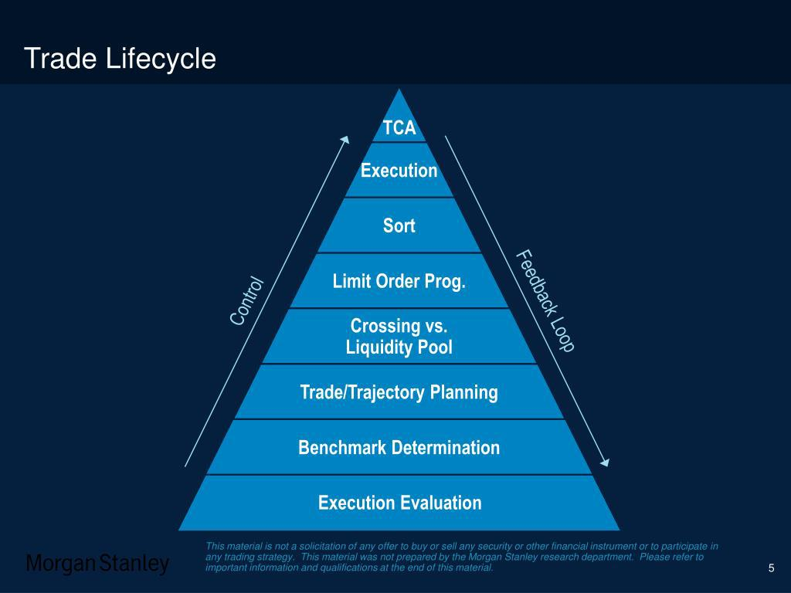

Algorithmic trading is the process of using computer algorithms to automate trading decisions and execute trades in financial markets. This approach allows for the rapid processing of large volumes of data and the execution of transactions at high speed, often exploiting minute price differentials across various markets. Algorithmic trading is significant in modern financial markets as it enhances liquidity, reduces transaction costs, and mitigates human biases in decision making. It is widely used by institutional investors, hedge funds, and other market participants to implement complex trading strategies.

Execution benchmarks are critical tools used in assessing the performance of trading algorithms. They serve as standards or points of reference to evaluate how effectively an algorithm executes buy or sell orders relative to market conditions. These benchmarks help traders understand the efficiency of their trading strategies by providing insight into the cost and quality of trade execution. Common execution benchmarks include Volume Weighted Average Price (VWAP), Time Weighted Average Price (TWAP), and participation rate, each of which offers a different perspective on trade execution performance.



Measuring algorithm performance against these benchmarks is crucial as it allows traders and investors to gauge the effectiveness of their algorithms, identify areas for improvement, and ensure optimal execution strategies. A successful algorithmic strategy aims to meet or exceed these benchmarks, thereby achieving better trade execution and improving overall trading performance. By continually striving to surpass execution benchmarks, traders can enhance their competitive edge, reduce costs, and maximize profitability.

## Table of Contents

## Understanding Algorithmic Execution Benchmarks

Algorithmic execution benchmarks serve as pivotal tools in quantifying the performance of trading algorithms within financial markets. Their primary purpose is to provide a standard against which the effectiveness of trading strategies can be evaluated, primarily focusing on the efficiency and cost-effectiveness of executing orders. By benchmarking, traders are equipped with a framework to quantify the success of their algorithms in terms of how closely they align with certain performance metrics.

Execution benchmarks come in several forms, each tailored to particular trading needs and objectives. Three common types include Volume Weighted Average Price (VWAP), Time Weighted Average Price (TWAP), and participation rate.

1. **Volume Weighted Average Price (VWAP)**: This benchmark calculates the average price a security has traded at throughout the day, based on both volume and price. It is defined by the formula:
$$
   VWAP = \frac{\sum_{i=1}^{N} P_i \cdot Q_i}{\sum_{i=1}^{N} Q_i}

$$

   where $P_i$ is the price and $Q_i$ is the quantity of the i-th trade. VWAP is widely used to assess whether the algorithm executed trades at a good price compared to the market average over a specified period.

2. **Time Weighted Average Price (TWAP)**: Unlike VWAP, TWAP focuses on dividing an order evenly over a set period, minimizing the market impact by ignoring trade volumes. This benchmark is given by:
$$
   TWAP = \frac{\sum_{i=1}^{N} P_i}{N}

$$

   where $P_i$ is the price at each interval. TWAP is advantageous for traders who prioritize consistent execution over time, especially in markets with thin liquidity.

3. **Participation Rate**: This benchmark measures the degree to which a trading algorithm participates in the total volume of the market, typically represented as a percentage. It guides the trader in aligning execution with market activity, aimed at maintaining a consistent level of execution relative to overall market volume.

Benchmarks are fundamental for the development and refinement of trading algorithms. They offer a quantitative basis for comparing the performance of different algorithms and identifying areas for improvement. This is crucial in a landscape where minuscule margins can define profitability. Execution benchmarks enable traders to optimize strategies, ensuring trades are executed at favorable prices, thus reducing costs associated with market impact.

Moreover, by utilizing benchmarks like VWAP or TWAP, traders can design algorithms that adhere to specific objectives, such as minimizing price impact or adhering to a risk management framework. Benchmark assessments drive a feedback loop that informs algorithmic adjustments and strategic planning, ultimately enhancing trading outcomes.

Through systematic evaluation using execution benchmarks, traders can continuously evolve their approaches, leveraging the capacity for improved data analytics and algorithmic precision to gain competitive advantages in the ever-dynamic financial markets.

## Types of Execution Benchmarks

Execution benchmarks in [algorithmic trading](/wiki/algorithmic-trading) are essential tools for assessing the performance of trading algorithms. Among the most commonly used benchmarks are Volume Weighted Average Price (VWAP), Time Weighted Average Price (TWAP), and implementation shortfall. Each serves a distinct purpose and has unique characteristics, advantages, and limitations.

**Volume Weighted Average Price (VWAP):**

VWAP is calculated by taking the total dollar amount traded for every transaction and dividing it by the total shares traded over a particular time frame. It is represented mathematically as:

$$
VWAP = \frac{\sum (Price_i \times Volume_i)}{\sum Volume_i}
$$

where $Price_i$ is the price of each transaction, and $Volume_i$ is the volume of each transaction.

**Advantages and Limitations:**

VWAP is beneficial for traders looking to execute large orders without disturbing the market. It serves as a fair value indicator, helping traders assess whether they achieved a better price for their trades compared to the average market trend during that time frame. However, VWAP may not be suitable for quickly changing markets since it lags in fast-moving conditions. Moreover, it doesn't capture information outside the benchmark period and may not account for overnight news or events impacting prices.

**Example and Usage:**

A trader might use VWAP to execute a large stock order in a way that the execution price is close to the average trading price during the trading day. Large institutional investors often aim to buy below VWAP or sell above it to ensure cost-effective trades.

**Time Weighted Average Price (TWAP):**

TWAP, unlike VWAP, divides the total price of trades by the number of trades over a specified period. It is calculated as follows:

$$
TWAP = \frac{1}{n} \sum_{i=1}^{n} Price_i
$$

where $Price_i$ refers to the price at different time intervals, and $n$ is the number of time intervals considered.

**Advantages and Limitations:**

The TWAP benchmark is advantageous for executing trades uniformly across a given period, minimizing impact by spreading transactions over time. This characteristic makes it less sensitive to sudden market fluctuations. However, TWAP ignores [volume](/wiki/volume-trading-strategy) data, making it potentially less effective in markets where trade volume varies significantly.

**Example and Usage:**

A trader executing a large order over an entire trading day might use TWAP to ensure that an equal portion of shares is traded at regular intervals, thus mitigating the impact on the market price.

**Implementation Shortfall:**

Implementation shortfall measures the difference between the decision price, where a trading decision is made, and the final execution price. It considers various costs, such as market impact and opportunity costs. The formula for implementation shortfall is:

$$
\text{Implementation Shortfall} = (P_{decision} - P_{execution}) \times \text{Shares Executed} + \text{Other Costs}
$$

**Advantages and Limitations:**

Its primary advantage is that it captures the total cost of executing a trade, including explicit and implicit costs, offering a comprehensive view of trading performance. Nonetheless, calculating implementation shortfall can be challenging due to its requirement of accurate forecasts for what the market would have done otherwise, and it is more complex than VWAP or TWAP.

**Example and Usage:**

A firm might track implementation shortfall to understand the full impact of their trade execution strategies, adjusting them to improve overall trading costs.

In summary, VWAP, TWAP, and implementation shortfall are vital benchmarks that serve different purposes in trading strategies, each offering distinct advantages and being best suited for particular market conditions and trading objectives.

## Benchmarking in Algo Trading Strategies

Algorithmic trading strategies rely heavily on execution benchmarks to assess their performance and effectiveness. These benchmarks serve as yardsticks, providing quantitative metrics that enable traders to evaluate how well their algorithms perform in achieving optimal trade execution. Execution benchmarks help traders compare actual trade prices to a standard that represents an ideal execution level, thus facilitating a performance evaluation that is both objective and insightful.

Real-time market data is integral to the calculation of execution benchmarks, as it provides the necessary inputs for measuring trading performance against dynamic market conditions. For instance, the Volume Weighted Average Price (VWAP) benchmark requires continuous price and volume data to calculate the average price of a security, weighted by volumes over a specific trading horizon. Real-time data ensures that the calculated VWAP reflects the most current and relevant market conditions, ensuring more accurate and applicable benchmark results.

Traders utilize these benchmarks to optimize trade executions and minimize costs. By analyzing the discrepancies between the execution price of trades and benchmark prices, traders can discern how effectively their algorithms are performing. This analysis facilitates the identification of factors that contribute to execution efficiency or inefficiency. For example, if a strategy consistently executes trades at prices worse than the VWAP, it indicates room for algorithmic improvement or adjustment in execution timing.

The use of benchmarks allows traders to implement strategies that aim to reduce slippage—the difference between the expected price of a trade and the actual price at which the trade is executed. By optimizing execution around benchmarks like VWAP or Time Weighted Average Price (TWAP), trading algorithms can improve their alignment with market conditions, thereby minimizing adverse cost implications. Additionally, minimizing transaction costs related to execution—such as bid-ask spreads and market impact—can significantly enhance net profitability.

Python can be employed to calculate and analyze benchmarks. Consider a simple example of how VWAP might be calculated using Python with pandas:

```python
import pandas as pd

def calculate_vwap(data):
    # Data is a DataFrame with columns 'price' and 'volume'
    vwap = (data['price'] * data['volume']).sum() / data['volume'].sum()
    return vwap

# Example usage
data = pd.DataFrame({
    'price': [100, 101, 102, 103, 104],
    'volume': [200, 100, 300, 150, 250]
})
vwap = calculate_vwap(data)
```

This streamlined calculation illustrates how real-time data feeds into benchmark computations, serving as the foundation for more informed and effective trading decisions. By incorporating such benchmarks into their strategy evaluation, traders can harness insights that mitigate potential errors, streamline execution strategies, and ultimately reduce overall costs.

## Challenges in Algorithmic Execution Benchmarks

Algorithmic execution benchmarks are essential tools for assessing the effectiveness of trading algorithms. However, several challenges and pitfalls can affect the accuracy and reliability of these benchmarks. Understanding these challenges is crucial for traders and developers aiming to refine their strategies and ensure optimal performance.

**Market Volatility and Liquidity**

Market [volatility](/wiki/volatility-trading-strategies) and [liquidity](/wiki/liquidity-risk-premium) significantly impact the precision of execution benchmarks. When markets are highly volatile, price movements can be rapid and unpredictable, leading to discrepancies between expected and actual execution prices. Benchmarks such as Volume Weighted Average Price (VWAP) and Time Weighted Average Price (TWAP) may not accurately reflect trading performance under volatile conditions, as sudden price changes can distort average calculations. 

Liquidity also plays a vital role. In markets with low liquidity, large trades can lead to significant price impacts, causing slippage that affects benchmark accuracy. For instance, an algorithm targeting a VWAP benchmark may struggle in thinly traded stocks because small volume changes can lead to substantial deviations from the expected price trajectory.

**Technological and Data Integrity Issues**

Technological robustness and data integrity are critical for the efficacy of execution benchmarks. High-frequency trading relies heavily on real-time data feeds and complex algorithms, which must operate without latency or errors. Delayed or inaccurate data can lead to miscalculations in benchmarks, negatively impacting trading decisions. 

Data integrity is another concern. Erroneous or manipulated data can lead to incorrect benchmark assessments, affecting the perceived success of an algorithm. Ensuring clean and accurate data is imperative for meaningful benchmark evaluations. Moreover, the technological infrastructure supporting trading systems must be resilient against outages and failures, as any disruption can skew benchmark results.

**Coding Example**

To illustrate handling market volatility and data integrity issues, consider a simplistic Python example that simulates calculating VWAP under noise:

```python
import numpy as np

# Simulated trade data
np.random.seed(42)
prices = np.random.normal(100, 2, 1000)  # Normal distribution around $100
volumes = np.random.randint(1, 100, 1000)  # Random volumes

# Introducing volatility and noise
price_noise = np.random.normal(0, 5, 1000)
prices_with_noise = prices + price_noise

# VWAP calculation with noise
vwap_noisy = np.sum(prices_with_noise * volumes) / np.sum(volumes)
print("VWAP with noise:", vwap_noisy)
```

This code demonstrates how noise in trade data affects VWAP calculations, illustrating the importance of stable and accurate data.

In conclusion, market volatility, liquidity, technological robustness, and data integrity are significant challenges in algorithmic execution benchmarks. Addressing these issues is essential for improving the accuracy and reliability of trading algorithms, ultimately leading to more effective trading strategies. Continuous monitoring and adaptation to changing market conditions and technological advancements are necessary to mitigate these challenges.

## Future of Execution Benchmarks in Algo Trading

The evolution of execution benchmarks in algorithmic trading is increasingly driven by advancements in technology and data analytics. As the algorithmic trading landscape becomes more sophisticated, the role of execution benchmarks is set to expand and adapt to new paradigms, incorporating cutting-edge technologies that enhance their precision and applicability.

The integration of [artificial intelligence](/wiki/ai-artificial-intelligence) (AI) and [machine learning](/wiki/machine-learning) into execution benchmarks represents a significant trend for the future. These technologies are adept at processing vast amounts of data efficiently and identifying patterns that may not be immediately apparent through traditional methods. Machine learning algorithms can dynamically adjust execution strategies based on real-time market data and historical performance, thereby optimizing benchmark assessments. For instance, AI can refine Volume Weighted Average Price (VWAP) benchmarks by leveraging predictive analytics to anticipate market movements and adjust orders accordingly. This dynamic adaptation is crucial in volatile markets where static benchmarks might fall short.

Furthermore, the use of big data analytics is poised to transform how benchmarks are utilized. With access to extensive datasets, traders can develop more nuanced models that incorporate various market factors, such as liquidity and volatility, into benchmark calculations. This capability allows for the generation of personalized benchmarks tailored to specific trading goals and conditions. Advanced statistical techniques, such as [deep learning](/wiki/deep-learning) and [reinforcement learning](/wiki/reinforcement-learning), could also be employed to continuously improve these benchmarks by learning from past trading outcomes and adjusting for future trades.

Innovations in data acquisition and real-time processing are also set to redefine execution benchmarks. High-frequency trading systems already exploit low-latency data feeds to optimize execution strategies, and future advancements in data transmission and processing speeds will further enhance precision in applying benchmarks. The implementation of distributed ledger technologies, such as blockchain, offers the potential for enhanced data integrity and traceability, ensuring that benchmark calculations are based on reliable and transparent data.

Additionally, advancements in cloud computing and computational power are facilitating the development of more complex trading algorithms that can incorporate multiple benchmarks simultaneously. This multi-benchmark approach enables traders to evaluate execution performance across different dimensions, providing a more comprehensive assessment of trading efficiency.

Another promising innovation is the potential integration of Internet of Things (IoT) technologies, which could provide real-time environmental data affecting trading assets, further enriching benchmark inputs. As these technologies mature, we can anticipate a shift towards more holistic benchmarks that reflect a broader array of market influences.

In summary, the future of execution benchmarks in algorithmic trading is characterized by the convergence of AI, big data analytics, and technological innovations that promise greater precision, adaptability, and scope. By embracing these advancements, traders and developers can enhance their ability to achieve optimal trading outcomes and maintain a competitive edge in an increasingly complex market environment.

## Conclusion

Execution benchmarks in algorithmic trading serve as essential tools for assessing the performance and efficiency of trading algorithms. They provide a standardized basis for evaluating how well an algorithm achieves its execution objectives, such as minimizing costs, reducing market impact, and improving timing. By offering quantitative measures like Volume Weighted Average Price (VWAP) and Time Weighted Average Price (TWAP), benchmarks allow traders and financial institutions to gauge the effectiveness of their strategies under varying market conditions. This assessment is crucial for adjusting algorithms to enhance execution quality continually.

The importance of execution benchmarks lies in their ability to guide trading decisions and strategy refinements. By comparing algorithmic executions against these benchmarks, traders can identify areas for improvement, optimize execution strategies, and ultimately achieve better trading outcomes. This process not only aids in cost reduction but also in managing risks and improving overall market performance.

The constantly evolving landscape of financial markets necessitates ongoing research and adaptation in the application of execution benchmarks. Market dynamics, technological advancements, and the increasing role of artificial intelligence and machine learning imply that benchmarks must evolve to remain relevant. Continuous development and innovation in benchmark methodologies will ensure that they provide accurate and meaningful insights, supporting traders in navigating complex market environments effectively.

Encouraging further research into execution benchmarks is vital for the continued advancement of algorithmic trading. By embracing new data analytics techniques and leveraging AI capabilities, benchmarks can offer deeper insights and greater predictive power. This will not only enhance their applicability but also empower traders to make more informed decisions, ultimately contributing to more efficient and successful trading strategies.

## References & Further Reading

[1]: Kissell, R. (2013). ["The Science of Algorithmic Trading and Portfolio Management"](https://www.sciencedirect.com/book/9780124016897/the-science-of-algorithmic-trading-and-portfolio-management). Academic Press.

[2]: Aldridge, I. (2013). ["High-Frequency Trading: A Practical Guide to Algorithmic Strategies and Trading Systems"](https://www.amazon.com/High-Frequency-Trading-Practical-Algorithmic-Strategies/dp/1118343506). Wiley.

[3]: Lopez de Prado, M. (2018). ["Advances in Financial Machine Learning"](https://www.amazon.com/Advances-Financial-Machine-Learning-Marcos/dp/1119482089). Wiley.

[4]: Chan, E. P. (2009). ["Quantitative Trading: How to Build Your Own Algorithmic Trading Business"](https://github.com/ftvision/quant_trading_echan_book). Wiley.

[5]: Jansen, S. (2020). ["Machine Learning for Algorithmic Trading"](https://github.com/stefan-jansen/machine-learning-for-trading). Packt Publishing.

[6]: Cartea, Á., Jaimungal, S., & Penalva, J. (2015). ["Algorithmic and High-Frequency Trading"](https://assets.cambridge.org/97811070/91146/frontmatter/9781107091146_frontmatter.pdf). Cambridge University Press.