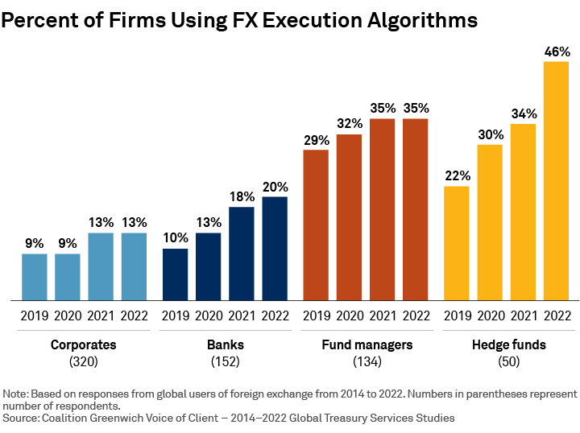

## Table of Contents

## What is an algorithmic execution benchmark?

An algorithmic execution benchmark is a way to measure how well a computer program or algorithm performs a specific task. It helps people understand if the algorithm is fast, efficient, and uses resources well. For example, if you have a program that sorts numbers, a benchmark would tell you how quickly it can sort a large list compared to other sorting programs.

Benchmarks are important because they help developers choose the best algorithm for their needs. By comparing different algorithms using the same benchmark, developers can see which one works better for their specific situation. This can save time and resources, making sure that the chosen algorithm will perform well in real-world applications.

## Why are algorithmic execution benchmarks important?

Algorithmic execution benchmarks are important because they help people see how well a computer program works. When you want to choose the best program for a job, you need to know which one is faster and uses less resources. Benchmarks let you compare different programs side by side, so you can pick the one that does the job best.

Using benchmarks also helps make sure that programs will work well in real life. If a program is fast and efficient in a benchmark test, it's likely to perform well when people actually use it. This saves time and money because you don't have to guess which program will be best; you can trust the benchmark results to guide your choice.

## What are the common types of algorithms used in benchmarks?

There are many types of algorithms that people use in benchmarks. Some common ones are sorting algorithms, like quicksort and mergesort, which arrange items in order. Another type is search algorithms, like binary search, which find specific items in a list. These algorithms are often used because they are basic tasks that many programs need to do, so it's helpful to know which ones work best.

Another group of algorithms used in benchmarks are those for graph problems, like finding the shortest path in a network. These are important in areas like transportation and social networks. Also, numerical algorithms, like those used for solving math problems, are benchmarked. These include things like matrix multiplication and solving equations. By testing these different kinds of algorithms, benchmarks help people understand which ones are fastest and most efficient for their needs.

## How do you measure the performance of an algorithm in a benchmark?

To measure the performance of an algorithm in a benchmark, you look at how fast it runs and how much computer resources it uses. Speed is often measured in time, like seconds or milliseconds, to see how long it takes the algorithm to finish its job. For example, if you're testing a sorting algorithm, you might see how quickly it can sort a list of 1,000 numbers. The less time it takes, the better the algorithm is considered to be.

Another important thing to measure is how much memory the algorithm uses. Memory is like the space on your computer where the algorithm stores information while it works. If an algorithm uses less memory, it's usually better because it means it can run on computers with less space. Sometimes, benchmarks also look at other resources, like how much the algorithm makes the computer's processor work. By looking at all these things together, you can get a good idea of how well an algorithm performs.

## What are some popular benchmark suites for algorithmic execution?

There are several popular benchmark suites that people use to test how well algorithms work. One well-known suite is the Standard Performance Evaluation Corporation (SPEC), which has different tests for different kinds of programs. For example, SPEC CPU is used to test how fast a computer's processor can run certain tasks. Another suite is the Transaction Processing Performance Council (TPC), which focuses on how well databases and other systems handle transactions.

Another popular benchmark suite is the Linpack benchmark, which is often used to measure the performance of supercomputers and other high-performance systems. It tests how quickly a computer can solve large systems of linear equations. For more general-purpose benchmarking, people often use the Phoronix Test Suite, which has a lot of different tests for different kinds of software and hardware. These suites help people see which algorithms and systems work the best for their needs.

## How can beginners set up and run their first algorithmic benchmark?

To set up and run your first algorithmic benchmark, you'll need a computer and some basic programming skills. Start by choosing a simple algorithm you want to test, like a sorting algorithm. Next, find or create a benchmark suite that can test this kind of algorithm. There are many free benchmark suites online, like the Phoronix Test Suite, which you can download and install on your computer. Once you have the suite installed, you'll need to write a small program that uses the algorithm you want to test. This program will be run by the benchmark suite to measure its performance.

After you have your program ready, you can run the benchmark. Open the benchmark suite and follow its instructions to load your program into the test environment. The suite will then run your program multiple times, measuring how fast it runs and how much memory it uses. It's important to run the test several times to get an average performance, as computers can vary in speed due to other running programs. Once the benchmark is done, the suite will give you a report showing the results. You can use these results to see how well your algorithm performs and compare it to other algorithms if you want.

## What are the key metrics to look for when analyzing benchmark results?

When you look at benchmark results, the most important thing to check is the time it takes for the algorithm to finish its job. This is usually measured in seconds or milliseconds. The faster the algorithm, the better it is. But time isn't the only thing to look at. You should also see how much memory the algorithm uses. Memory is like the space on your computer where the algorithm stores information while it works. If an algorithm uses less memory, it's usually better because it can run on computers with less space.

Another key metric is how much the algorithm makes the computer's processor work. This is often called CPU usage. If an algorithm uses a lot of the processor's power, it might slow down other tasks on your computer. Sometimes, benchmarks also look at other things like how many times the algorithm has to read or write data to the computer's storage. By looking at all these metrics together, you can get a good idea of how well an algorithm performs and choose the best one for your needs.

## How do different programming languages affect benchmark outcomes?

Different programming languages can affect benchmark outcomes because they have different ways of doing things. Some languages are made to be fast, like C or C++, which can make algorithms run quicker in benchmarks. Other languages, like Python, are easier to use but might be slower because they do more work behind the scenes. When you run a benchmark, the language you choose can change how fast the algorithm runs and how much memory it uses.

For example, if you test a sorting algorithm in C++, it might finish faster than the same algorithm written in Python. This is because C++ is closer to the computer's hardware and can do things more directly. But if you need to write the program quickly and don't mind if it runs a bit slower, Python might be a better choice. So, when you look at benchmark results, remember that the language used can make a big difference in what you see.

## What are the challenges in designing fair and representative benchmarks?

Designing fair and representative benchmarks can be hard because you need to make sure the tests are the same for everyone. If the tests are not the same, it's not fair to compare the results. For example, if one algorithm is tested on a fast computer and another on a slow one, the results won't be fair. You also need to pick tasks that are common and important, so the benchmarks show how well the algorithms will work in real life. If you only test one kind of task, the results might not be useful for other tasks.

Another challenge is making sure the benchmarks measure the right things. You want to look at speed, memory use, and other important things, but it's hard to cover everything. Sometimes, focusing too much on one thing, like speed, can make you miss other important things, like how much power the algorithm uses. It's also hard to keep benchmarks up to date because computers and software change all the time. What was a good test a few years ago might not be a good test now. So, making benchmarks that are fair and useful takes a lot of careful planning and testing.

## How can advanced users optimize algorithms based on benchmark data?

Advanced users can use benchmark data to make their algorithms work better. They look at the results to find out where the algorithm is slow or uses too much memory. If the algorithm is slow, they might change the way it works to make it faster. For example, if sorting a list takes too long, they could try a different sorting method that might be quicker. If the algorithm uses too much memory, they might find ways to use less space, like using smaller data types or reusing memory instead of getting new space each time.

Once they have ideas on how to make the algorithm better, advanced users can test these changes with the benchmark again. They run the new version of the algorithm and compare the new results with the old ones. If the new version is faster or uses less memory, they know their changes worked. They might need to try different things and keep testing until they find the best way to make the algorithm work well. This way, they can keep improving the algorithm until it performs as well as possible.

## What role do hardware specifications play in algorithmic execution benchmarks?

Hardware specifications are very important in algorithmic execution benchmarks because they affect how fast and well the algorithms run. Different computers have different processors, memory sizes, and storage types, which can change the results of the benchmarks. For example, a computer with a fast processor might make an algorithm finish its job quicker than a computer with a slower processor. If you run the same benchmark on different computers, you might see different results just because of the hardware.

Because hardware can change benchmark results, it's important to keep the hardware the same when you want to compare different algorithms fairly. If you test one algorithm on a powerful computer and another on a less powerful one, the comparison won't be fair. To make sure the benchmarks are useful, you need to use the same kind of hardware for all the tests. This way, you can be sure that any differences in the results come from the algorithms themselves, not from the computers they are running on.

## How do industry standards and academic research influence benchmark development?

Industry standards and academic research both help make benchmarks better. Industry standards are like rules that companies follow to make sure their products work well. When these standards are used in benchmarks, it helps make sure the tests are fair and useful for real-world situations. For example, if a standard says how fast a computer should be, benchmarks can be made to test if products meet that standard. This makes the benchmarks more trusted and useful for companies and customers.

Academic research also plays a big role in making benchmarks better. Researchers study how algorithms work and find new ways to test them. They might come up with new ideas for what to measure or how to measure it. When these new ideas are added to benchmarks, it can make them more complete and accurate. For example, a researcher might find a new way to measure how much power an algorithm uses, and this can be added to the benchmark to give a fuller picture of how well the algorithm works.

## What is the key to understanding algorithmic execution benchmarks?

Algorithmic execution benchmarks serve as pivotal tools in quantifying the performance of trading algorithms within financial markets. Their primary purpose is to provide a standard against which the effectiveness of trading strategies can be evaluated, primarily focusing on the efficiency and cost-effectiveness of executing orders. By benchmarking, traders are equipped with a framework to quantify the success of their algorithms in terms of how closely they align with certain performance metrics.

Execution benchmarks come in several forms, each tailored to particular trading needs and objectives. Three common types include Volume Weighted Average Price (VWAP), Time Weighted Average Price (TWAP), and participation rate.

1. **Volume Weighted Average Price (VWAP)**: This benchmark calculates the average price a security has traded at throughout the day, based on both volume and price. It is defined by the formula:
$$
   VWAP = \frac{\sum_{i=1}^{N} P_i \cdot Q_i}{\sum_{i=1}^{N} Q_i}

$$

   where $P_i$ is the price and $Q_i$ is the quantity of the i-th trade. VWAP is widely used to assess whether the algorithm executed trades at a good price compared to the market average over a specified period.

2. **Time Weighted Average Price (TWAP)**: Unlike VWAP, TWAP focuses on dividing an order evenly over a set period, minimizing the market impact by ignoring trade volumes. This benchmark is given by:
$$
   TWAP = \frac{\sum_{i=1}^{N} P_i}{N}

$$

   where $P_i$ is the price at each interval. TWAP is advantageous for traders who prioritize consistent execution over time, especially in markets with thin liquidity.

3. **Participation Rate**: This benchmark measures the degree to which a trading algorithm participates in the total volume of the market, typically represented as a percentage. It guides the trader in aligning execution with market activity, aimed at maintaining a consistent level of execution relative to overall market volume.

Benchmarks are fundamental for the development and refinement of trading algorithms. They offer a quantitative basis for comparing the performance of different algorithms and identifying areas for improvement. This is crucial in a landscape where minuscule margins can define profitability. Execution benchmarks enable traders to optimize strategies, ensuring trades are executed at favorable prices, thus reducing costs associated with market impact.

Moreover, by utilizing benchmarks like VWAP or TWAP, traders can design algorithms that adhere to specific objectives, such as minimizing price impact or adhering to a risk management framework. Benchmark assessments drive a feedback loop that informs algorithmic adjustments and strategic planning, ultimately enhancing trading outcomes.

Through systematic evaluation using execution benchmarks, traders can continuously evolve their approaches, leveraging the capacity for improved data analytics and algorithmic precision to gain competitive advantages in the ever-dynamic financial markets.

## What are the types of execution benchmarks?

Execution benchmarks in [algorithmic trading](/wiki/algorithmic-trading) are essential tools for assessing the performance of trading algorithms. Among the most commonly used benchmarks are Volume Weighted Average Price (VWAP), Time Weighted Average Price (TWAP), and implementation shortfall. Each serves a distinct purpose and has unique characteristics, advantages, and limitations.

**Volume Weighted Average Price (VWAP):**

VWAP is calculated by taking the total dollar amount traded for every transaction and dividing it by the total shares traded over a particular time frame. It is represented mathematically as:

$$
VWAP = \frac{\sum (Price_i \times Volume_i)}{\sum Volume_i}
$$

where $Price_i$ is the price of each transaction, and $Volume_i$ is the volume of each transaction.

**Advantages and Limitations:**

VWAP is beneficial for traders looking to execute large orders without disturbing the market. It serves as a fair value indicator, helping traders assess whether they achieved a better price for their trades compared to the average market trend during that time frame. However, VWAP may not be suitable for quickly changing markets since it lags in fast-moving conditions. Moreover, it doesn't capture information outside the benchmark period and may not account for overnight news or events impacting prices.

**Example and Usage:**

A trader might use VWAP to execute a large stock order in a way that the execution price is close to the average trading price during the trading day. Large institutional investors often aim to buy below VWAP or sell above it to ensure cost-effective trades.

**Time Weighted Average Price (TWAP):**

TWAP, unlike VWAP, divides the total price of trades by the number of trades over a specified period. It is calculated as follows:

$$
TWAP = \frac{1}{n} \sum_{i=1}^{n} Price_i
$$

where $Price_i$ refers to the price at different time intervals, and $n$ is the number of time intervals considered.

**Advantages and Limitations:**

The TWAP benchmark is advantageous for executing trades uniformly across a given period, minimizing impact by spreading transactions over time. This characteristic makes it less sensitive to sudden market fluctuations. However, TWAP ignores [volume](/wiki/volume-trading-strategy) data, making it potentially less effective in markets where trade volume varies significantly.

**Example and Usage:**

A trader executing a large order over an entire trading day might use TWAP to ensure that an equal portion of shares is traded at regular intervals, thus mitigating the impact on the market price.

**Implementation Shortfall:**

Implementation shortfall measures the difference between the decision price, where a trading decision is made, and the final execution price. It considers various costs, such as market impact and opportunity costs. The formula for implementation shortfall is:

$$
\text{Implementation Shortfall} = (P_{decision} - P_{execution}) \times \text{Shares Executed} + \text{Other Costs}
$$

**Advantages and Limitations:**

Its primary advantage is that it captures the total cost of executing a trade, including explicit and implicit costs, offering a comprehensive view of trading performance. Nonetheless, calculating implementation shortfall can be challenging due to its requirement of accurate forecasts for what the market would have done otherwise, and it is more complex than VWAP or TWAP.

**Example and Usage:**

A firm might track implementation shortfall to understand the full impact of their trade execution strategies, adjusting them to improve overall trading costs.

In summary, VWAP, TWAP, and implementation shortfall are vital benchmarks that serve different purposes in trading strategies, each offering distinct advantages and being best suited for particular market conditions and trading objectives.

## References & Further Reading

[1]: Kissell, R. (2013). ["The Science of Algorithmic Trading and Portfolio Management"](https://www.sciencedirect.com/book/9780124016897/the-science-of-algorithmic-trading-and-portfolio-management). Academic Press.

[2]: Aldridge, I. (2013). ["High-Frequency Trading: A Practical Guide to Algorithmic Strategies and Trading Systems"](https://www.amazon.com/High-Frequency-Trading-Practical-Algorithmic-Strategies/dp/1118343506). Wiley.

[3]: Lopez de Prado, M. (2018). ["Advances in Financial Machine Learning"](https://www.amazon.com/Advances-Financial-Machine-Learning-Marcos/dp/1119482089). Wiley.

[4]: Chan, E. P. (2009). ["Quantitative Trading: How to Build Your Own Algorithmic Trading Business"](https://github.com/ftvision/quant_trading_echan_book). Wiley.

[5]: Jansen, S. (2020). ["Machine Learning for Algorithmic Trading"](https://github.com/stefan-jansen/machine-learning-for-trading). Packt Publishing.

[6]: Cartea, Á., Jaimungal, S., & Penalva, J. (2015). ["Algorithmic and High-Frequency Trading"](https://assets.cambridge.org/97811070/91146/frontmatter/9781107091146_frontmatter.pdf). Cambridge University Press.