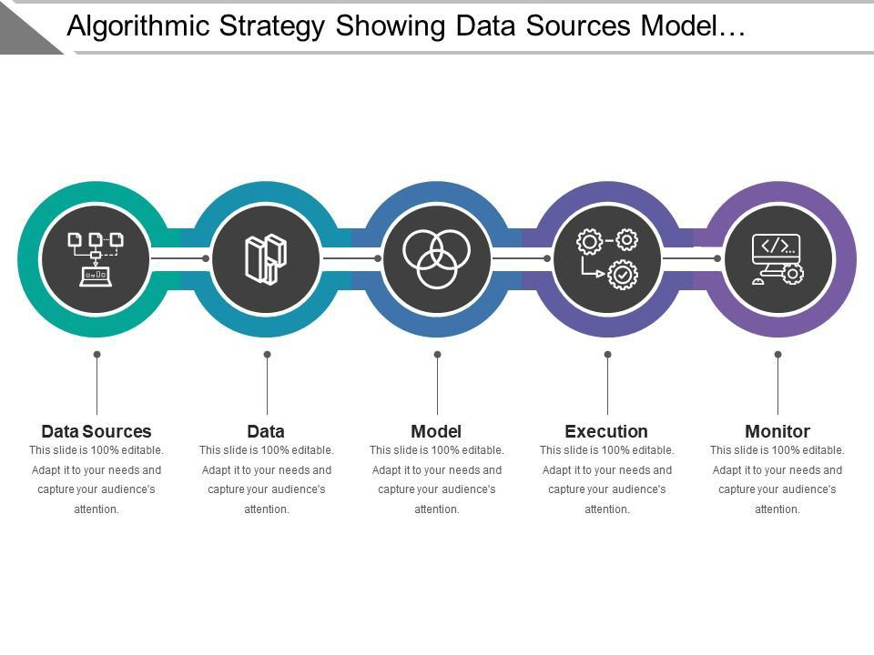

Algorithmic trading, often referred to as algo trading, is a method of executing trades utilizing automated and pre-programmed trading instructions to account for variables such as time, price, and volume. These computer-based systems are designed to optimize trading performance by leveraging complex algorithms, which can identify orders to execute in the most efficient manner. Algo trading encapsulates a range of strategies from simple executions to sophisticated high-frequency trading models.

The significance of algo trading in contemporary financial markets cannot be overstated. It has transformed how financial transactions are conducted by enhancing speed, reducing costs, and fostering market efficiencies. The advent of algorithmic execution strategies has not only accelerated the processing of trades but also increased liquidity in the market, allowing for tighter bid-ask spreads and reducing transaction costs for participants. Through synchronized execution, these strategies reduce the opportunity for human error, enabling precise trades even in high-pressure market environments.



Algorithmic execution strategies have revolutionized the trading landscape. They allow traders to parse vast data sets rapidly and execute trades based on quantitative criteria without manual intervention. Strategies like statistical arbitrage use sophisticated mathematical models to identify price discrepancies across securities, while others might focus on achieving the best execution price using time-based or volume-weighted metrics. As a result, these strategies facilitate efficient market entry and exit points, adjusting dynamically to market conditions.

The purpose of this exploration is to unpack the diverse types and distinct advantages presented by algorithmic execution strategies. By examining different methodologies, such as market making, VWAP, and trend following, we aim to highlight how these strategies can be beneficial to both institutional and individual investors. Additionally, a comprehensive analysis will explore how algo trading can mitigate risks and augment trading decisions by incorporating advanced technologies like machine learning. As the financial landscape evolves, a deeper understanding of these strategies ensures preparedness for future shifts in market dynamics.

## Table of Contents

## Understanding Algo Trading

Algorithmic trading, often referred to as algo trading, involves the use of computer algorithms to execute trades in the financial markets. These algorithms are designed to determine the optimal timing, price, and quantity for trading specific securities. The basic concept of algorithmic trading is to automate trading strategies that traditionally would require significant human oversight and decision-making. Algo trading aims to enhance efficiency by executing orders at optimal prices, reducing transaction costs, and securing the best possible order execution.

Algorithmic trading is predominantly used in securities markets, including stocks, futures, options, and foreign exchange markets. It is especially prevalent in electronic markets where execution speed and precision are paramount. The types of trades suitable for algorithmic execution range from simple buy or sell orders to complex strategies such as arbitrage, [market making](/wiki/market-making), and statistical investments.

Traditional trading typically involves manual order execution, where traders analyze market conditions and place orders based on their insights and experience. This method is often slower and more prone to human error compared to [algorithmic trading](/wiki/algorithmic-trading). In contrast, algo trading harnesses the power of computers to process vast quantities of data, executing orders with speed and accuracy that human traders cannot match. Algorithms can rapidly analyze market conditions, historical trends, and other relevant data to make informed trade decisions.

Computers and technology play a critical role in enabling algorithmic trading. High-speed internet connections, advanced data processing capabilities, and sophisticated trading platforms facilitate the rapid assessment of market information and swift execution of trades. Algorithms can be programmed using languages such as Python to identify patterns, predict market movements, and automate decision-making processes. Here is a simple example of a trading algorithm using Python:

```python
import numpy as np

def moving_average(data, window_size):
    return np.convolve(data, np.ones(window_size)/window_size, mode='valid')

def trading_algorithm(prices, short_window, long_window):
    short_mavg = moving_average(prices, short_window)
    long_mavg = moving_average(prices, long_window)

    signals = np.where(short_mavg > long_mavg, 1, 0)

    return signals

prices = [100, 102, 105, 103, 100, 98, 97, 101, 99, 98]
signals = trading_algorithm(prices, short_window=3, long_window=5)
print("Trade Signals:", signals)
```

This example illustrates a simple moving average crossover strategy, where buy signals are generated when a short-term moving average exceeds a long-term moving average. While simplistic, this code underscores the essence of algorithmic trading: making data-driven decisions based on predefined criteria without human intervention.

In summary, algorithmic trading revolutionizes traditional trading approaches by leveraging technology to enhance speed, efficiency, and accuracy. As financial markets continue to evolve, the reliance on algorithmic methods is expected to grow, driving further advancements in trading technology and strategy development.

## Types of Algorithmic Execution Strategies

Algorithmic execution strategies are diverse and serve different functions within financial markets. These strategies can range from statistical [arbitrage](/wiki/arbitrage) to [trend following](/wiki/trend-following), each with unique methodologies and objectives. A brief overview of some key strategies is outlined below:

### Statistical Arbitrage and Market Making

Statistical arbitrage involves trading strategies that profit from statistical mispricings of one or more assets. Utilizing complex mathematical models, these strategies identify price inefficiencies and exploit them for gain. For instance, pairs trading is a common strategy where two correlated securities are traded in opposite directions when their price relationship deviates from historical norms.

Market making, on the other hand, involves providing [liquidity](/wiki/liquidity-risk-premium) to markets by simultaneously offering to buy and sell a given asset, thereby profiting from the bid-ask spread. Market makers use algorithms to continuously adjust their quotes in response to market conditions to manage the risks associated with holding significant positions.

### VWAP and TWAP

Volume Weighted Average Price (VWAP) is a popular execution strategy intended to execute large orders at the average price throughout a specific trading period, weighted by [volume](/wiki/volume-trading-strategy). The formula for VWAP is:

$$
VWAP = \frac{\sum (Price_i \times Volume_i)}{\sum Volume_i}
$$

where $Price_i$ and $Volume_i$ are the price and volume of each trade.

Time Weighted Average Price (TWAP) executes trades evenly over a specified time period. This strategy is particularly useful for minimizing market impact by spreading transactions. Unlike VWAP, TWAP does not consider volume but focuses on executing trades at regular intervals, reducing short-term price fluctuations' influence.

### Trend Following Strategies

Trend following utilizes past price data to predict future market movements. Algorithms identify trends from historical data and continue buying or selling based on the anticipated continuation of these trends. These strategies are known for their simplicity and their adaptability to various time frames, from short-term to long-term trends. Common tools include moving averages and [momentum](/wiki/momentum) indicators, which facilitate the execution of trades aligned with detected trends.

### High-Frequency Trading (HFT)

High-Frequency Trading represents a sophisticated realm in algorithmic execution, characterized by executing a large number of orders at extremely high speeds, often across multiple markets. [HFT](/wiki/high-frequency-trading-strategies) algorithms leverage superior processing speeds and connectivity to detect and exploit minute price discrepancies. These strategies often demand significant computational resources and a deep understanding of both technology and market microstructures. Among their benefits, HFT strategies contribute to market liquidity and efficiency, although they also raise concerns about market [volatility](/wiki/volatility-trading-strategies).

Each of these algorithmic execution strategies serves distinct purposes and relies on specific algorithms to optimize trading processes in dynamic market environments. Understanding their mechanics is crucial for traders seeking to enhance operational efficiency and achieve their strategic financial objectives.

## Advantages of Algorithmic Execution Strategies

Algorithmic execution strategies in trading offer several significant advantages that enhance the efficiency and effectiveness of financial market operations. Firstly, speed and accuracy are paramount in these strategies. Algorithms can execute orders at velocities unattainable by human traders, which substantially reduces latency in transactions. This rapid execution is crucial in markets where price dynamics can shift within fractions of a second, leading to more favorable entry and [exit](/wiki/exit-strategy) points. Moreover, the precision of algorithmic trading minimizes human error, ensuring that trades are executed as intended without manual intervention that could lead to mistakes.

Another advantage is cost efficiency. Algorithmic trading reduces transaction costs by optimizing order execution. Algorithms can break large orders into smaller ones, intelligently timing them to avoid significant market impacts, which would otherwise lead to price slippage. Additionally, by engaging in high-frequency trading, even the smallest arbitrage opportunities can be exploited, thus reducing the overall cost per trade.

Transparency and control are also enhanced through algorithmic execution strategies. Traders and portfolio managers can monitor their strategies in real time, allowing them to make adjustments based on current market conditions. This oversight facilitates a higher degree of control over trading activities and ensures that strategies align with risk management protocols and investment objectives.

Finally, the market impact is minimized through the intelligent execution of large orders. Algorithms can determine the optimal strategy to deploy large trades without causing substantial market fluctuations. By dispersing these orders over a specified time and volume, algorithms mitigate the risk of adverse market movements that large trades can induce. This discreet handling of transactions maintains market stability and preserves the integrity of the trading strategy.

In conclusion, algorithmic execution strategies have revolutionized trading through enhanced speed, accuracy, cost savings, transparency, and minimized market impact, fundamentally transforming modern financial markets.

## Challenges and Risks of Algo Trading

Algorithmic trading, while transformative, presents several challenges and risks that participants must consider. One significant concern is technical failures, which can arise from software glitches, network outages, or hardware malfunctions. Such disruptions can lead to incorrect order execution, resulting in substantial financial loss. For instance, a system malfunction might trigger unintended trades, leading to significant market exposure and loss if not promptly addressed.

Market risks, including flash crashes, represent another critical challenge. Flash crashes are characterized by rapid and deep price declines in asset markets, often exacerbated by the high-speed nature of algorithmic trading. Algorithms, designed to maximize execution speed, may accelerate price movements during periods of market stress, causing liquidity to evaporate. This phenomenon was starkly illustrated during the infamous May 6, 2010, flash crash when major U.S. stock indices rapidly declined and recovered within minutes.

Regulations concerning algorithmic trading are evolving as regulatory bodies strive to keep pace with technological advancements. Concerns about market stability, fairness, and transparency have led to increasingly stringent oversight. Legislators and regulators have introduced measures to mitigate risks associated with high-frequency and algorithmic trading, such as requiring firms to implement robust risk controls and regularly test their algorithms under different market conditions.

Moreover, continuous monitoring and updating of algorithms are essential to mitigate risk and ensure optimal performance. Financial markets are dynamic, with conditions that can shift rapidly due to economic, political, or social factors. Algorithms must be adeptly tuned to adapt to such changes, which necessitates ongoing analysis and refinement by skilled professionals. Continuous updates help in addressing any discovered inefficiencies or potential vulnerabilities that could be exploited under specific market conditions.

In addressing these challenges, firms typically invest in significant infrastructure, redundancy systems, and risk management protocols to minimize the potential downside of algorithmic trading. These measures may include real-time monitoring systems and advanced analytics to detect anomalies in trading activity, as well as implementing circuit breakers to halt trading in response to unusual market conditions.

## Future Trends in Algorithmic Execution Strategies

The landscape of algorithmic execution strategies is rapidly evolving, driven by significant advancements in [artificial intelligence](/wiki/ai-artificial-intelligence) (AI) and [machine learning](/wiki/machine-learning). These technologies enable the development of more sophisticated models that can learn and adapt to new market conditions, thereby improving the performance of trading algorithms. AI models analyze vast datasets at unprecedented speed, identifying patterns and making predictions that would be difficult for human traders to discern. Machine learning, in particular, facilitates the creation of algorithms capable of self-optimization as they accumulate more data, enhancing decision-making processes.

As technology advances, several emerging trends are poised to impact algorithmic execution strategies. Quantum computing represents a frontier with potential to revolutionize computational speed and problem-solving capabilities, enabling more complex and faster analysis of market data. Distributed ledger technology (DLT), such as blockchain, may enhance the transparency and security of trading processes while also reducing transaction costs and settlement times.

The role of big data is increasingly vital in refining and optimizing algorithmic trading techniques. By harnessing the power of large datasets, traders can gain deeper insights into market dynamics, improving the accuracy of predictive models. Big data analytics enable the integration of diverse data sources, from market feeds to social media sentiment, which enhance the contextual understanding of market movements and complement traditional financial indicators.

With these technological advancements come regulatory and ethical considerations. Regulators are challenged with ensuring that algorithmic trading systems operate fairly and transparently, without exacerbating market volatility or enabling unethical practices. The potential for AI-driven algorithms to contribute to flash crashes or manipulate markets underscores the need for robust regulatory frameworks that adapt to technological changes. Simultaneously, ethical concerns regarding the transparency of AI decision-making processes are being scrutinized, prompting calls for greater algorithmic accountability and explainability.

In conclusion, the future of algorithmic execution strategies is intertwined with technological innovation, presenting opportunities for greater efficiency and accuracy in trading while also posing challenges related to regulation and ethics. As the integration of AI, machine learning, and big data continues to reshape trading, these developments hold the promise of transforming the finance sector, provided there is careful management of risks and adherence to evolving ethical standards.

## Conclusion

Algorithmic execution strategies, or algo trading, have fundamentally transformed the landscape of financial markets by enabling trades that are faster, more efficient, and less prone to human error. Throughout this discussion, we have explored the basic concepts, types of strategies, advantages, and potential challenges associated with algorithmic trading. This conclusion highlights the significance of these strategies and reflects on their continued evolution.

Algorithmic trading has become an integral component of modern finance, as it facilitates the execution of complex trading strategies with exceptional precision. The prominence of technologies, such as high-frequency trading and quantitative analysis, underscores the importance of constant innovation. These advancements have reduced transaction costs and enhanced market efficiency, solidifying the position of algo trading as a cornerstone of contemporary trading practices.

Balancing innovation and risk management is crucial in algorithmic trading. While the speed and complexity of algorithmic strategies offer distinct advantages, they also present risks, such as technical failures and market anomalies. The infamous "flash crashes" serve as stark reminders of the potential pitfalls that can accompany such advanced methodologies. Therefore, robust risk management frameworks and stringent regulatory oversight are essential to mitigating these challenges and ensuring market stability.

The rapid pace of technological advancements requires ongoing research and adaptation in algorithmic execution strategies. Emerging technologies, like artificial intelligence and machine learning, hold promise for further optimizing trading algorithms, while access to big data provides insights for fine-tuning strategies. Nevertheless, with these innovations come new ethical considerations and regulatory challenges that must be addressed to maintain fairness and transparency in financial markets.

In summary, the evolution of algorithmic execution strategies reflects both the ingenuity and the complexity of modern trading. As financial markets continue to evolve, so too must the strategies that govern them. Continued research, technological development, and well-crafted regulation will be paramount to navigating this dynamic landscape, ensuring that the potential of algo trading is fully realized while safeguarding against its inherent risks.

## References & Further Reading

[1]: ["Advances in Financial Machine Learning"](https://www.amazon.com/Advances-Financial-Machine-Learning-Marcos/dp/1119482089) by Marcos Lopez de Prado

[2]: ["Algorithmic Trading and DMA: An introduction to direct access trading strategies"](https://www.semanticscholar.org/paper/Algorithmic-trading-%26-DMA-%3A-an-introduction-to-Johnson/aa5de1ab883d5e23b6651faa7c1807586d688e4b) by Barry Johnson

[3]: ["Quantitative Trading: How to Build Your Own Algorithmic Trading Business"](https://www.amazon.com/Quantitative-Trading-Build-Algorithmic-Business/dp/1119800064) by Ernest P. Chan

[4]: Aldridge, I. (2013). [High-Frequency Trading: A Practical Guide to Algorithmic Strategies and Trading Systems](https://www.amazon.com/High-Frequency-Trading-Practical-Algorithmic-Strategies/dp/1118343506)

[5]: ["Evidence-Based Technical Analysis: Applying the Scientific Method and Statistical Inference to Trading Signals"](https://www.amazon.com/Evidence-Based-Technical-Analysis-Scientific-Statistical/dp/0470008741) by David Aronson

[6]: ["Machine Learning for Algorithmic Trading: Predictive models to extract signals from market and alternative data for systematic trading strategies with Python"](https://www.amazon.com/Machine-Learning-Algorithmic-Trading-alternative/dp/1839217715) by Stefan Jansen

[7]: Cartea, Á., Jaimungal, S., & Penalva, J. (2015). ["Algorithmic and High-Frequency Trading"](https://assets.cambridge.org/97811070/91146/frontmatter/9781107091146_frontmatter.pdf) Cambridge University Press.