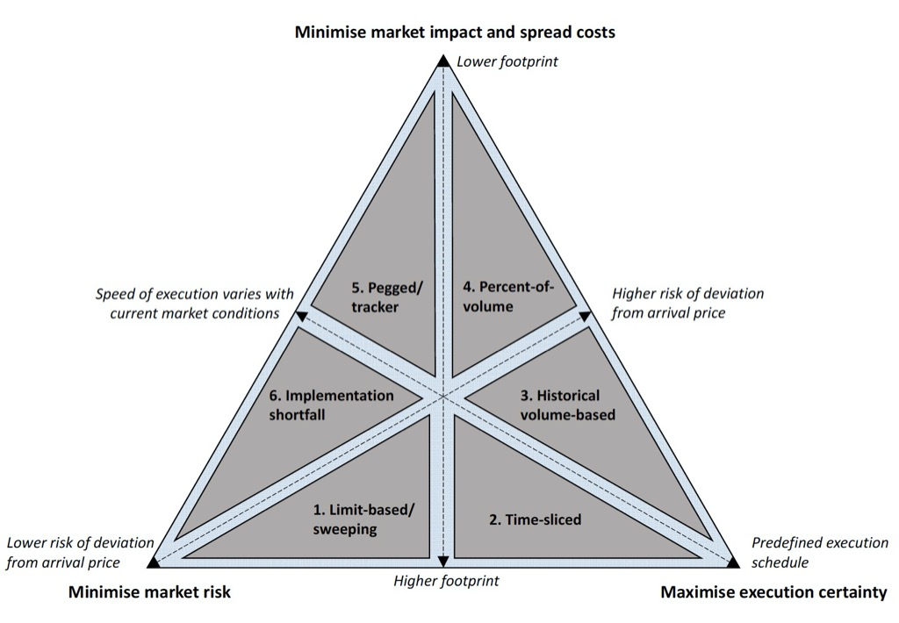

## Table of Contents

## What is algorithmic execution?

Algorithmic execution, often called algo trading, is when computers use math formulas to buy or sell stocks and other financial things automatically. Instead of people making the decisions, the computer follows the rules set in the algorithm to make trades. This can happen very quickly, sometimes in fractions of a second, which is much faster than a human could do it.

Using algorithms for trading can have many benefits. It can help traders make decisions based on a lot of data and complex calculations, which might be hard for a person to do. It can also help to take away some of the emotions that can affect trading decisions, like fear or greed. But, it can also be risky because the algorithms might not always understand everything happening in the market, and if something goes wrong with the program, it could cause big problems.

## How does algorithmic execution differ from manual trading?

Algorithmic execution and manual trading are two different ways to buy and sell things like stocks. With manual trading, a person looks at the market, thinks about what to do, and then makes the trade themselves. They use their own judgment, experience, and sometimes their feelings to decide when to buy or sell. This can be slow because it takes time for a person to gather information and make a decision.

On the other hand, algorithmic execution uses a computer program to make trades automatically. The program follows a set of rules, or an algorithm, that tells it exactly when to buy or sell. This can happen very quickly, often in just a few moments. Because the computer makes the decisions, it doesn't get influenced by emotions like a human might. This can be good because it can take the emotion out of trading, but it also means the computer might miss things that a human would notice.

## What are the basic components of an algorithmic trading system?

An [algorithmic trading](/wiki/algorithmic-trading) system has a few key parts that work together to make trades happen automatically. First, there's the data feed, which gives the system information about what's happening in the market, like prices and how much people are buying or selling. Then, there's the algorithm itself, which is a set of rules that tells the computer when to buy or sell based on the data it gets. This part is like the brain of the system, making decisions quickly based on the rules it's been given.

The other important part is the order management system, which takes the decisions from the algorithm and turns them into actual trades. It sends the buy or sell orders to the market and makes sure they get done correctly. Finally, there's the risk management and performance monitoring part, which keeps an eye on how well the system is doing and makes sure it's not taking too many risks. This part can stop the system if it starts to lose too much money or if something goes wrong.

All these parts work together to make the trading happen without a person having to do it. The system can run all the time, making trades based on the rules in the algorithm, and it can do this much faster than a human could.

## What programming languages are commonly used for algorithmic execution?

For algorithmic execution, people often use programming languages that are good at handling numbers and working quickly. Some of the most common languages are Python, C++, and Java. Python is popular because it's easy to learn and has a lot of tools that help with trading. C++ is used when speed is really important because it runs very fast. Java is also used a lot, especially in big trading systems, because it's good at handling many things at once.

Each of these languages has its own strengths. Python is great for beginners and for quickly trying out new ideas because it's simple to write and read. It has libraries like Pandas and NumPy that make it easy to work with data. C++ is harder to learn but it's very fast, which is important for making trades in just a few moments. Java is good for big systems because it can handle a lot of trades at the same time without slowing down.

In the end, the choice of language depends on what the trader needs. If they want to try out new trading ideas quickly, Python might be the best choice. If they need the system to be as fast as possible, C++ could be better. And if they're building a big trading platform that needs to handle lots of trades, Java might be the way to go.

## Can you explain the concept of backtesting in algorithmic trading?

Backtesting is like a practice run for your trading algorithm. It lets you see how your trading rules would have worked in the past by using old market data. You pretend that your algorithm was trading back then and see if it would have made money or lost money. This helps you figure out if your algorithm is good or if you need to change it before you start using it with real money.

When you do [backtesting](/wiki/backtesting), you feed your algorithm historical data, which is information about what the market was like in the past. The algorithm makes pretend trades based on this old data, and you can see how it would have done. This is really helpful because it lets you test your ideas without risking any real money. But remember, just because your algorithm did well in the past doesn't mean it will do well in the future, because the market can change a lot.

## What are some common strategies used in algorithmic execution?

One common strategy in algorithmic execution is called [trend following](/wiki/trend-following). This means the algorithm looks at the market to see if prices are going up or down over time. If it sees a trend, it will buy when the price is going up and sell when the price is going down. This strategy tries to make money by riding the waves of the market, hoping that trends will continue for a while.

Another strategy is mean reversion. This is based on the idea that prices don't keep going up or down forever. Instead, they often go back to their average value. So, if the algorithm sees that a price is much higher or lower than usual, it might bet that the price will come back to the middle. It will buy when the price is low and sell when the price is high, expecting it to return to normal.

A third strategy is [arbitrage](/wiki/arbitrage), which looks for small differences in prices between different markets or different types of the same thing. The algorithm will buy where the price is low and sell where the price is high, making a profit from the difference. This strategy needs to be very fast because these price differences usually don't last long.

## How do market conditions affect algorithmic trading strategies?

Market conditions can really change how well algorithmic trading strategies work. If the market is going up and down a lot, a strategy like trend following might do well because it can catch those big moves. But if the market is calm and not moving much, trend following might not make much money because there aren't big trends to follow. On the other hand, a strategy like mean reversion might do better in a calm market because prices are more likely to go back to their average value when things aren't changing a lot.

Also, different events can shake up the market and affect how strategies work. For example, if there's big news like a company doing really well or a country changing its rules, the market can move in ways that are hard to predict. An algorithm that usually works well might lose money if it can't understand these sudden changes. Traders have to keep an eye on the market and maybe change their algorithms to fit the new conditions, or they might need to stop trading until things calm down.

## What are the risks associated with algorithmic execution?

Using algorithms for trading can be risky. One big risk is that the computer might make mistakes. If the algorithm has a bug or if it's not set up right, it could make trades that lose a lot of money. Also, the market can change in ways that the algorithm doesn't expect. If something big happens, like a sudden drop in stock prices, the algorithm might keep trading in a way that makes things worse instead of better.

Another risk is that the market can be too fast for the algorithm to keep up. Sometimes, prices can change in just a few moments, and if the algorithm is too slow, it might miss out on good trades or make bad ones. Also, if a lot of people are using the same kind of algorithm, they might all try to trade at the same time, which can cause big swings in the market. This is called a "flash crash," and it can be really dangerous for traders.

## How can one optimize an algorithmic trading strategy?

To make an algorithmic trading strategy work better, you need to keep testing and changing it. Start by using backtesting to see how your strategy would have done in the past. If it didn't do well, try to figure out why and change the rules of your algorithm. Maybe it's too quick to buy or sell, or maybe it's not looking at the right kind of data. Keep trying different things until you find a way that works better. It's also important to use real-time data to see how your strategy is doing right now, not just in the past.

Another way to optimize your strategy is to think about how it fits with the current market. If the market is moving a lot, you might need a different set of rules than if it's calm. Keep an eye on the news and other things that can change the market, and be ready to change your algorithm if you need to. Also, don't put all your money into one strategy. Try using different strategies at the same time to spread out your risk. This way, if one strategy isn't working well, the others might still make money.

## What regulatory considerations should be taken into account with algorithmic trading?

When you use algorithms for trading, you need to think about the rules that governments and other groups have set up. These rules are there to make sure the market stays fair and safe for everyone. For example, some places have rules about how fast you can trade or how much you can trade at one time. They might also want to know about your algorithms to make sure they're not doing anything wrong. It's important to follow these rules so you don't get in trouble and so the market stays a good place to trade.

Another thing to consider is that different countries might have different rules. If you're trading in more than one country, you need to know and follow all the rules for each place. Sometimes, there are also rules about how you need to keep records of your trades and report them to the right people. Keeping up with these rules can be hard, but it's important to do it right to avoid fines or other problems.

## How do machine learning and AI enhance algorithmic execution?

Machine learning and AI can make algorithmic trading better by helping the computer learn from the market. Instead of just following rules that someone wrote, the computer can look at a lot of data and find patterns that people might miss. It can then use these patterns to make better trading decisions. For example, it might learn that certain things happening in the news often lead to changes in stock prices, and then it can use this knowledge to trade more smartly.

These technologies also help by making the algorithm better over time. As the market changes, the AI can change with it, always trying to find new ways to make money. This means the trading strategy can keep up with new trends and not get stuck using old rules that don't work anymore. But, it's important to remember that even with AI, there's still a lot of risk, and the market can be hard to predict.

## What are the future trends in algorithmic execution and trading?

In the future, algorithmic trading is likely to become even more advanced with the help of new technologies like AI and [machine learning](/wiki/machine-learning). These tools will make it easier for computers to understand the market and make better trading decisions. They can look at huge amounts of data and find patterns that humans might not see. This could lead to trading strategies that change and improve all the time, making them more successful. Also, more people might start using algorithmic trading because it's getting easier to set up and use, even if you're not a professional trader.

Another trend we might see is more rules and regulations around algorithmic trading. As more people use these systems, governments and other groups might want to make sure they're safe and fair. This could mean new laws about how fast you can trade or how much information you need to share about your algorithms. It's important for traders to keep up with these rules so they can keep trading without getting into trouble. Overall, the future of algorithmic trading looks exciting, but it will also need careful watching to make sure it stays safe and fair for everyone.

## References & Further Reading

[1]: Aldridge, I. (2013). ["High-Frequency Trading: A Practical Guide to Algorithmic Strategies and Trading Systems"](https://www.wiley.com/en-us/High+Frequency+Trading%3A+A+Practical+Guide+to+Algorithmic+Strategies+and+Trading+Systems%2C+2nd+Edition-p-9781118343500). Wiley.

[2]: Narang, R. (2013). ["Inside the Black Box: A Simple Guide to Quantitative and High Frequency Trading"](https://onlinelibrary.wiley.com/doi/book/10.1002/9781118662717). Wiley.

[3]: Kissell, R. (2013). ["The Science of Algorithmic Trading and Portfolio Management"](https://www.sciencedirect.com/book/9780124016897/the-science-of-algorithmic-trading-and-portfolio-management). Academic Press.

[4]: MacKenzie, D. (2016). ["Material Markets: How Economic Agents are Constructed"](https://academic.oup.com/book/52341). Oxford University Press.

[5]: Treleaven, P., Galas, M., & Lalchand, V. (2013). [Algorithmic trading review](https://www.researchgate.net/publication/262239006_Algorithmic_Trading_Review). Communications of the ACM, 56(11), 76-85.

[6]: Cartea, Á., Jaimungal, S., & Penalva, J. (2015). ["Algorithmic and High-Frequency Trading"](https://assets.cambridge.org/97811070/91146/frontmatter/9781107091146_frontmatter.pdf). Cambridge University Press.