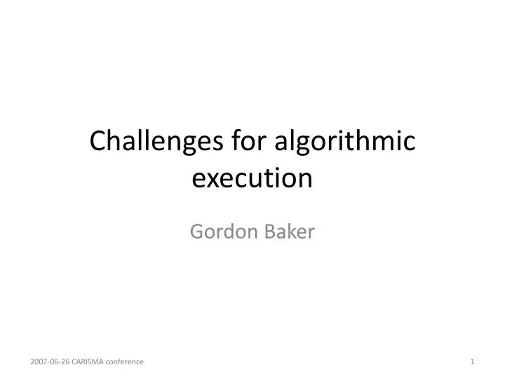

In the rapidly evolving world of financial trading, the integration of advanced technologies has become a necessity. Among these technologies, algorithmic execution—commonly known as algo trading—stands out as a revolutionary force. The advent of algo trading represents a paradigm shift, enabling market participants to execute trades with unprecedented speed and precision.

This article explores the intricacies, advantages, and potential pitfalls of algorithmic execution in trading, offering a comprehensive overview for both novices and experienced traders. Algorithmic execution automates the trading process, employing complex algorithms that interpret market data and execute trades based on predefined parameters. This approach mitigates human error and operates at a speed that is beyond the ability of any individual trader.



We will analyze how algo trading functions, its benefits, cons, and essential tips to maximize success while avoiding common pitfalls. By leveraging computer programs and cutting-edge technology, traders can make informed decisions in milliseconds, capitalizing on market opportunities as they arise. 

Join us as we unpack this crucial aspect of modern financial markets, empowering you with the knowledge to leverage algorithmic trading effectively. From boosting efficiency to reducing emotional bias, algo trading is reshaping how trades are executed in today's markets. Through the incorporation of mathematical models and historical data analysis, these systems enhance the strategic framework within which traders operate, while simultaneously minimizing the emotional factors that often skew decision-making. 

Whether you are seeking to optimize your trading processes or understand the transformative impact of algorithms on the financial landscape, this article will provide the insight needed to navigate the realm of algorithmic execution.

## Table of Contents

## What is Algorithmic Execution (Algo Trading)?

Algorithmic execution, commonly known as algo trading, is the deployment of computer programs to execute trades in financial markets with precision and speed, governed by predefined conditions. These computer algorithms are designed to automate trading activities by analyzing vast amounts of market data and subsequently making decisions to place trades within milliseconds, far surpassing the capabilities of human traders. This automation dramatically increases efficiency, enabling the handling of complex trading strategies while reducing the likelihood of human error.

The history of [algorithmic trading](/wiki/algorithmic-trading) can be linked to the emergence and expansion of electronic markets alongside advancements in computing technologies. As trading moved away from traditional pit trading to electronic platforms, the need for automated and rapid execution processes became apparent. These technological leaps enabled the development of sophisticated algorithms capable of performing trades at speeds that were previously unimaginable.

In the field of algorithmic execution, intricate trading strategies are converted into automated processes. This transformation not only enhances execution efficiency but also ensures consistency in trading decisions. Without the emotional influences that could affect human traders, algorithmic systems maintain focus solely on the mathematical and statistical models defined in their programming. This creates opportunities for executing orders based on strict technical criteria such as moving averages, relative strength, and other technical indicators.

Algorithmic trading finds applications across a broad spectrum of financial securities. It is prominently used in trading stocks, currency pairs in the [forex](/wiki/forex-system) market, and cryptocurrencies, among others. Regardless of the asset class, the deployment of algo trading facilitates the management of substantial volumes at high speed, delivering significant improvement in scalability and operational efficiency. The application of algo trading in these markets underscores its integral role in the modern financial trading landscape, bringing unparalleled speed and precision to trade execution.

## How Does Algorithmic Execution Work?

Algorithmic execution operates by leveraging pre-programmed instructions to trade financial securities with high precision and speed. These instructions are structured to encompass various factors such as timing, pricing, and the quantity of orders. At the core, traders develop specific rules for these trades, based on well-defined criteria including price levels, moving averages, or technical indicators.

For example, a basic trading algorithm could be constructed using a price crossover strategy, where the algorithm buys a security when its short-term moving average crosses above its long-term moving average and sells when the reverse occurs. Such a rule can be translated into a Python script using popular financial libraries:

```python
import numpy as np

def moving_average(data, window_size):
    return np.convolve(data, np.ones(window_size)/window_size, mode='valid')

def generate_signals(prices, short_window, long_window):
    short_ma = moving_average(prices, short_window)
    long_ma = moving_average(prices, long_window)

    signals = np.where(short_ma > long_ma, 1, 0)  # 1 for buy, 0 for sell
    return signals

# Example usage:
# prices = np.array([...]) # An array of historical price data
# signals = generate_signals(prices, 10, 50)
```

Once the pre-set criteria are fulfilled, the algorithm autonomously executes the trade orders, ensuring that executions occur at optimal times without human intervention. This autonomy is vital in capturing fleeting market opportunities that manual traders may miss.

The technology underlying algorithmic trading utilizes an array of advanced tools such as [machine learning](/wiki/machine-learning), [artificial intelligence](/wiki/ai-artificial-intelligence), and data analytics. These technologies facilitate the refinement of trading strategies by enabling the prediction of market movements with greater accuracy. Machine learning models, for example, can process vast amounts of historical market data to identify patterns and improve decision-making processes.

Sophisticated platforms such as Algorix exemplify the advanced nature of these systems. By integrating artificial intelligence and operations research, these platforms optimize trading strategies with heightened efficiency. Algorix, for instance, employs complex algorithms to minimize transaction costs while maximizing potential returns, showcasing how AI-driven insights can leverage market inefficiencies.

In conclusion, algorithmic execution revolutionizes financial trading by merging automated processes with cutting-edge technology. This combination ensures that theoretical and empirical findings are continually applied, fine-tuned, and executed in real-time, embodying a transformative force in modern trading practices.

## Pros and Cons of Algorithmic Execution

Algorithmic execution, a cornerstone of modern financial markets, brings numerous advantages alongside its inherent challenges. One of the primary benefits is the acceleration of execution speed, enabling trades to be executed in mere milliseconds. This speed advantage minimizes slippage and optimizes entry and [exit](/wiki/exit-strategy) points, directly impacting profitability. 

Algorithmic trading also significantly reduces human error by automating the decision-making process. Trading decisions influenced by emotion are eliminated, as algorithms process information based solely on preset criteria. This leads to more consistent results and the ability to execute complex strategies that would be unfeasible for human execution alone. For instance, algorithms can efficiently manage large volumes of securities simultaneously, a task that would be daunting for manual operations.

A noteworthy advantage is the ability to backtest strategies using historical data. Backtesting offers traders the opportunity to simulate a strategy's performance against past market conditions, providing insights into potential outcomes and helping refine strategies before applying them in real-world scenarios.

Despite these benefits, algorithmic trading presents notable challenges and risks. High technical expertise is paramount for designing, implementing, and maintaining trading algorithms. Continuous monitoring is essential to prevent and quickly address possible technical failures, such as software glitches or network disruptions, which can lead to significant financial losses if not detected promptly.

Moreover, the reliance on historical data can mislead traders into a false sense of security about a strategy's efficacy in real-time markets. Over-optimization, or curve fitting, occurs when a strategy is excessively tailored to past data, increasing the risk that it might not perform well under current or future market conditions.

Overall, while algorithmic execution enhances trading efficiency and strategic capability, it requires careful management and awareness of its potential pitfalls to fully capitalize on its advantages.

## Tips for Successful Algorithmic Execution

To succeed with algorithmic trading, setting effective trading rules is paramount. These rules form the backbone of your trading strategy, dictating when and how trades are executed. Define criteria such as entry and exit points, risk management parameters, and the types of orders used. For example, you might program an algorithm to buy a stock when its price crosses a 50-day moving average and sell when it reaches a certain return threshold.

Choosing reliable platforms, like Algorix, plays a crucial role in the seamless execution of these strategies. Such platforms often offer sophisticated tools that not only simplify the process of rule-setting but also provide robust data analytics and machine learning capabilities to optimize trading strategies. When evaluating a platform, consider factors like speed, reliability, and the range of features offered.

Continuous monitoring of system performance is vital to ensure that algorithms operate correctly and efficiently. Implement real-time performance tracking and alert systems to promptly identify and address issues such as software glitches or connectivity problems. This vigilance minimizes the risk of significant financial loss due to technical failures.

Regular [backtesting](/wiki/backtesting) is essential for verifying the viability of your trading strategies. By applying your algorithm to historical market data, you can assess its performance and make necessary adjustments. This process helps identify potential weaknesses and optimize strategies for current market conditions. However, it's important to remember that past performance doesn't guarantee future results, so remain cautious of overfitting to historical data.

Practicing in a simulated environment offers valuable experience without the risk of losing actual funds. Simulation helps in refining algorithms, understanding potential market responses, and improving strategy robustness. Platforms often provide demo accounts with access to live financial news and virtual funds, allowing traders to experiment and learn before committing real capital.

Staying informed about market trends and regulatory changes is crucial for maintaining a competitive edge. Markets are dynamic and frequently impacted by economic indicators, geopolitical events, and policy shifts. Keeping abreast of these factors ensures that your algo trading strategies remain relevant and effective. Additionally, regulatory changes can influence trading practices and compliance requirements. Hence, continuous education and adaptation to new developments are vital components of a successful algorithmic trading strategy.

## Conclusion

Algorithmic execution has reshaped trading, providing traders with advanced tools that significantly enhance efficiency and improve strategic execution. By automating complex processes and allowing trades to be carried out at precise moments, algorithmic trading has become a staple in modern financial strategies. When employed thoughtfully, algorithmic trading can yield a considerable competitive advantage, optimizing the execution of trades and broadening the potential for financial returns.

However, it's crucial to acknowledge that algo trading is not without its challenges. Technical issues such as software glitches or network failures can impact outcomes if not carefully monitored. Additionally, designing effective algorithms requires a nuanced understanding of both market dynamics and the technical intricacies of trading platforms. Recognizing these limitations and implementing iterative improvements can lead to better resiliency and performance of trading algorithms over time.

Success in algorithmic trading also hinges on the continuous adaptation and refinement of strategies. Having the right knowledge and tools is imperative for crafting robust algorithms and sustaining an edge in the ever-evolving financial markets. By staying vigilant and updating strategies in accordance with market trends and technological advancements, traders can optimize their approaches and mitigate risks.

Ultimately, awareness and preparation are key. With a deep understanding of algorithmic execution's capabilities and constraints, traders can unlock vast potential for financial opportunities. Investing time in learning and improving trading algorithms can translate into unlocking new avenues for financial growth and success. Empowering oneself with the proper knowledge and resources allows for maximized benefits from the powerful tools that algorithmic trading presents.

## References & Further Reading

[1]: Aldridge, I. (2013). ["High-Frequency Trading: A Practical Guide to Algorithmic Strategies and Trading Systems"](https://www.wiley.com/en-us/High+Frequency+Trading%3A+A+Practical+Guide+to+Algorithmic+Strategies+and+Trading+Systems%2C+2nd+Edition-p-9781118343500). Wiley.

[2]: Narang, R. (2013). ["Inside the Black Box: A Simple Guide to Quantitative and High Frequency Trading"](https://onlinelibrary.wiley.com/doi/book/10.1002/9781118662717). Wiley.

[3]: Kissell, R. (2013). ["The Science of Algorithmic Trading and Portfolio Management"](https://www.sciencedirect.com/book/9780124016897/the-science-of-algorithmic-trading-and-portfolio-management). Academic Press.

[4]: MacKenzie, D. (2016). ["Material Markets: How Economic Agents are Constructed"](https://academic.oup.com/book/52341). Oxford University Press.

[5]: Treleaven, P., Galas, M., & Lalchand, V. (2013). [Algorithmic trading review](https://www.researchgate.net/publication/262239006_Algorithmic_Trading_Review). Communications of the ACM, 56(11), 76-85.

[6]: Cartea, Á., Jaimungal, S., & Penalva, J. (2015). ["Algorithmic and High-Frequency Trading"](https://assets.cambridge.org/97811070/91146/frontmatter/9781107091146_frontmatter.pdf). Cambridge University Press.