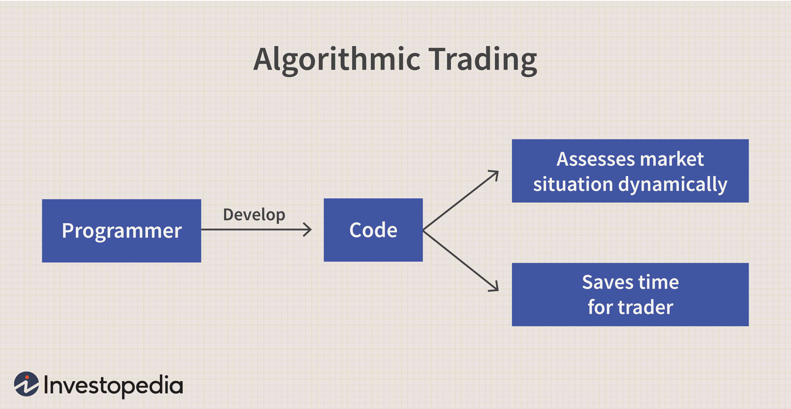

In the ever-evolving landscape of finance, technology is continuously reshaping traditional practices, with algorithmic trading playing a pivotal role in these transformations. Algorithmic trading leverages complex mathematical models and algorithms to automate the trading process, thereby enhancing the speed and precision of trade execution. As technology advances, these algorithms have become increasingly sophisticated, enabling market participants to execute trades faster and more efficiently than ever before.

Market making, a crucial function in financial markets, ensures liquidity by consistently quoting buy and sell prices. Historically a manual and labor-intensive task, market making is now increasingly dominated by algorithmic solutions. This shift to algorithmic market making has streamlined trading operations, significantly reducing human error and enhancing responsiveness to market fluctuations. By automating the analysis of market data and the execution of trades, algorithms help maintain tighter bid-ask spreads and thus more streamlined market operations.

This article examines the synergy between algorithmic trading and market making, emphasizing the impact of leading global market-making firms. These firms utilize advanced algorithms to provide liquidity across various asset classes, influencing both the speed and dynamics of financial markets. Understanding the mechanics of algorithmic market making provides valuable insights into the operation of today’s financial markets, where technology continues to set new standards for efficiency and execution. As traditional practices give way to digital solutions, the interplay between technology and finance becomes increasingly significant in shaping the future of trading.

## Table of Contents

## Understanding Market Making and Algorithmic Trading

Market making plays a critical role in financial markets by providing liquidity. Liquidity is achieved through the continuous quoting of both buy and sell prices, allowing traders to enter and exit positions with ease. Traditionally, market making was a human-centric activity, relying on the expertise of traders to manually adjust prices and manage orders. However, with the advent of algorithmic trading, this process has become increasingly automated.

Algorithmic trading uses advanced computer programs to analyze market data and execute trading decisions at high speeds. These algorithms are capable of processing vast amounts of information in real-time, identifying patterns and trends that are imperceptible to human traders. This shift towards automation has significantly impacted market-making strategies, enhancing precision and reducing the need for manual intervention.

One of the primary advantages of algorithmic trading in market making is its speed. Algorithms can execute trades in milliseconds, ensuring that market makers can respond quickly to market changes and provide consistent liquidity. This high-frequency trading capability reduces the time it takes to complete transactions, leading to more efficient markets with tighter bid-ask spreads.

Furthermore, [algorithmic trading](/wiki/algorithmic-trading) allows for more sophisticated strategies in [market making](/wiki/market-making). Algorithms can dynamically adjust quotes based on market conditions, optimizing the balance between competitive pricing and desired profit margins. By continuously monitoring the market, these programs can adapt to sudden shifts, such as changes in supply and demand or increased [volatility](/wiki/volatility-trading-strategies).

In summary, the integration of algorithmic trading into market making has transformed this traditional practice into a more precise and efficient operation. By utilizing advanced algorithms, market makers can enhance [liquidity](/wiki/liquidity-risk-premium) provision, contributing to the overall health and stability of financial markets.

## The Algo Advantage: Dominating Exchange Volumes

Algorithmic trading has become indispensable in the optimization of market making by facilitating operations with unprecedented speed and precision. At the core of this advantage is the ability of algorithms to execute trades faster than any human trader, significantly reducing latency and improving the overall execution quality. This superiority is largely attributed to the integration of high-frequency trading ([HFT](/wiki/high-frequency-trading-strategies)) systems, which allow for execution times in microseconds, narrowing the bid-ask spread and enhancing market liquidity.

The heightened efficiency achieved through algorithmic trading attracts a broad spectrum of traders, ranging from institutional investors to individual retail traders. This influx of market participants leads to increased trading volumes, fundamentally altering traditional market mechanics. With greater volumes, algorithms are equipped to provide consistent liquidity, a critical component that stabilizes prices and reduces volatility. The continuous presence of liquidity providers helps maintain orderly markets, allowing participants to execute larger orders with minimal impact on the market prices.

Mathematically, the success of algorithmic trading in market making can be modeled through factors such as spread minimization and order flow dynamics. Consider the bid-ask spread $S$, where $S = A - B$, with $A$ being the ask price and $B$ the bid price. The goal of an effective market-making algorithm is to minimize $S$, thereby offering tighter spreads that are appealing to traders seeking cost-effective trade execution.

Furthermore, advanced algorithms analyze vast datasets for pattern recognition and predictive modeling, enabling optimal pricing strategies that adapt to evolving market conditions. These algorithms utilize [machine learning](/wiki/machine-learning) techniques and statistical models to predict order flow and price movements, thus becoming pivotal in crafting strategies that yield competitive advantages in volatile markets.

The benefits of these efficiencies extend beyond the market makers themselves to the broader trading ecosystem, enhancing the trading experience for all market participants. By providing a robust framework for liquidity and reducing transaction costs through minimized spreads, algorithmic market making elevates the overall health and functionality of financial markets. As a result, investors benefit from tighter spreads, leading to cost savings and improved price discovery, while market makers sustain profitability through high transaction volumes.

In summary, the dominance of algorithmic trading in exchange volumes is underpinned by its ability to leverage speed, data analytics, and technological innovation to deliver superior market-making outcomes. This transition not only refines the efficiency of market operations but also ensures a more dynamic and resilient trading environment that promotes continuous market growth.

## Global Firms That Pioneered Algorithmic Market Making

Citadel Securities is a prominent global market-making firm known for its sophisticated algorithms that facilitate liquidity across multiple asset classes. By deploying advanced trading strategies, Citadel Securities plays a crucial role in maintaining market efficiency. Its algorithms are designed to evaluate large volumes of data in real time, enabling the firm to quote buy and sell prices accurately, thus ensuring tight bid-ask spreads. This capability not only reinforces its influence in financial markets but also exemplifies the role of technology in enhancing market operations.

Jane Street stands out for its use of proprietary algorithms to effectively navigate both traditional and [cryptocurrency](/wiki/cryptocurrency) markets. The firm's approach to liquidity provision sets a benchmark in the industry, driven by its focus on data-driven decision-making and execution efficiency. By constantly optimizing its trading strategies through quantitative analysis and machine learning, Jane Street ensures it can provide consistent market liquidity, thus attracting a broad spectrum of traders and investors.

Optiver is another leader in algorithmic market making, known for its specialization in options trading. Based in Amsterdam, Optiver employs cutting-edge technologies to maintain a strong presence in global financial markets. The firm leverages complex mathematical models to price options with precision, facilitating liquidity and ensuring market depth. Its commitment to innovation and technology allows Optiver to adapt to changing market conditions swiftly, maintaining robust market-making operations worldwide.

These firms highlight the transformative impact of algorithmic trading in market making, as they continually push the boundaries of speed, efficiency, and accuracy in financial markets. Through their pioneering efforts, Citadel Securities, Jane Street, and Optiver set industry standards and contribute significantly to the evolution of market-making practices in the digital age.

## Conclusion

Algorithmic trading has profoundly reshaped market making, demonstrating its transformative potential within the financial landscape. The integration of algorithmic precision into market-making strategies has consistently produced tighter bid-ask spreads, enhanced overall market liquidity, and contributed to increased trading volumes on a global scale. This evolution has not only improved operational efficiency but has also created a more resilient trading ecosystem conducive to a wide range of market participants.

Prominent firms such as Citadel Securities, Jane Street, and Optiver exemplify the significant impact of algorithmic trading in market making. Citadel Securities leverages advanced algorithms to provide liquidity across numerous asset classes, solidifying its standing as a key player in global financial markets. Jane Street sets a benchmark through its sophisticated proprietary algorithms that adeptly handle both traditional and cryptocurrency markets. Optiver, with a specialization in options trading, utilizes cutting-edge technologies from its Amsterdam base to sustain a substantial market-making footprint worldwide.

Looking ahead, the continual advancements in technology promise further innovations in algorithmic trading and market-making strategies. As the financial markets evolve, these strategies will persist in pushing the boundaries of possibilities, fostering an environment where precision, speed, and adaptation are paramount. The foreseeable future indicates a deeper integration of technology in trading operations, encouraging ongoing improvements in market structure and participant engagement.

## References & Further Reading

[1]: Aldridge, I. (2013). ["High-Frequency Trading: A Practical Guide to Algorithmic Strategies and Trading Systems."](https://www.wiley.com/en-us/High+Frequency+Trading%3A+A+Practical+Guide+to+Algorithmic+Strategies+and+Trading+Systems%2C+2nd+Edition-p-9781118343500) John Wiley & Sons.

[2]: Narang, R. K. (2013). ["Inside the Black Box: A Simple Guide to Quantitative and High-Frequency Trading."](https://onlinelibrary.wiley.com/doi/book/10.1002/9781118662717) John Wiley & Sons.

[3]: Kissell, R. (2014). ["The Science of Algorithmic Trading and Portfolio Management."](https://www.sciencedirect.com/book/9780124016897/the-science-of-algorithmic-trading-and-portfolio-management) Academic Press.

[4]: Hasbrouck, J., & Saar, G. (2013). ["Low-latency trading."](https://www.sciencedirect.com/science/article/abs/pii/S1386418113000165) The Review of Financial Studies, 26(9), 2091-2122.

[5]: Easley, D., López de Prado, M. M., & O'Hara, M. (2012). ["The Volume Clock: Insights into the High-Frequency Paradigm."](https://papers.ssrn.com/sol3/papers.cfm?abstract_id=2034858) The Journal of Portfolio Management, 39(1), 19-29.

[6]: Gould, M. D., Porter, M. A., Williams, S., McDonald, M., Fenn, D. J., & Howison, S. D. (2013). ["Limit order books."](https://arxiv.org/abs/1012.0349) Philosophical Transactions of the Royal Society A: Mathematical, Physical and Engineering Sciences, 371(1982), 20120371.

[7]: Biais, B., Foucault, T., & Moinas, S. (2015). ["Equilibrium fast trading."](https://www.sciencedirect.com/science/article/pii/S0304405X15000288) Journal of Financial Economics, 116(2), 456-483.