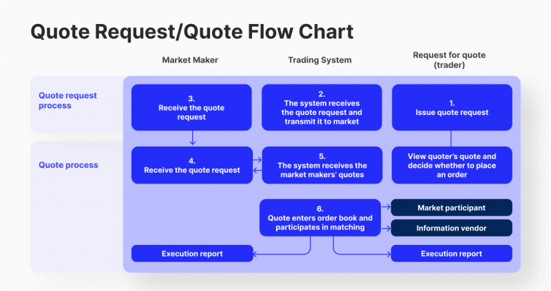

## Table of Contents

## What is algorithmic market making?

Algorithmic market making is a way for computers to help buy and sell things in a market. It uses special math formulas, called algorithms, to decide when to buy or sell, and at what price. People who use these algorithms, called market makers, try to make a small profit on each trade. They do this by always having something to buy and something to sell, which helps keep the market running smoothly.

These algorithms look at lots of information, like how much people want to buy or sell something, and what prices others are offering. They use this information to set their own prices. If the market changes, the algorithm can quickly change its prices too. This helps market makers make money while also helping the market work better by making it easier for others to buy and sell.

## How does algorithmic market making differ from traditional market making?

Algorithmic market making uses computers and math formulas to decide when to buy and sell things in a market. This is different from traditional market making, where people, called market makers, make these decisions themselves. In traditional market making, these people use their own knowledge and experience to set prices and decide when to trade. They watch the market closely and try to guess what will happen next.

In contrast, algorithmic [market making](/wiki/market-making) uses special programs that can look at a lot of information very quickly. These programs can change prices and make trades much faster than a person can. They also don't get tired or make mistakes like humans might. This can make the market more efficient and help market makers make more money, but it also means that the market can change very quickly, which can be hard for some people to keep up with.

## What are the basic components of an algorithmic market making system?

An algorithmic market making system has several important parts that work together to buy and sell things in a market. The first part is the algorithm itself, which is a set of rules or math formulas that the computer follows to decide when to buy or sell, and at what price. These rules are based on lots of information, like how many people want to buy or sell something, what prices others are offering, and how the market is changing over time. The algorithm uses this information to set prices and make trades that can make a small profit.

Another key part of the system is the data feed, which gives the algorithm all the information it needs about the market. This data feed needs to be very fast and reliable, so the algorithm can make quick decisions. The system also includes a trading platform, which is where the buying and selling actually happens. The trading platform connects the algorithm to the market, so it can send out buy and sell orders based on what the algorithm decides. Together, these parts help the market maker keep the market running smoothly and make a profit.

## What types of financial instruments are commonly used in algorithmic market making?

Algorithmic market making is often used with stocks, which are pieces of ownership in a company. When people trade stocks, market makers use their algorithms to decide when to buy and sell them. They look at how many people want to buy or sell a stock, what prices others are offering, and how the stock's price is changing over time. This helps them set their own prices and make trades that can make a small profit.

Another common financial instrument used in algorithmic market making is options. Options give people the right to buy or sell something at a certain price in the future. Market makers use algorithms to figure out the best prices for options, taking into account things like how likely the price of the underlying asset will change and how much time is left until the option expires. This can be more complicated than trading stocks, but it also gives market makers more chances to make money.

Forex, or foreign exchange, is also frequently used in algorithmic market making. This involves trading different currencies, like dollars and euros. Algorithms help market makers decide when to buy and sell currencies, based on things like interest rates, economic news, and how currencies are moving against each other. This can be very fast-paced, with prices changing quickly, so having a good algorithm is important for making profits in the [forex](/wiki/forex-system) market.

## How do liquidity and volume affect algorithmic market making strategies?

Liquidity and [volume](/wiki/volume-trading-strategy) are really important for algorithmic market making. Liquidity means how easy it is to buy or sell something without the price changing a lot. When there's a lot of [liquidity](/wiki/liquidity-risk-premium), it's easier for market makers to buy and sell things because there are always people ready to trade. This means they can make more trades and make more money. On the other hand, if there's not much liquidity, it can be harder for market makers to find people to trade with, so they might not be able to make as many trades or make as much money.

Volume is how many trades are happening in the market. When there's a lot of volume, it means a lot of people are buying and selling, so market makers can make more trades and make more money. Their algorithms can work better because there's more information to look at and more chances to trade. But if the volume is low, there are fewer trades happening, so market makers might have to wait longer to make trades and might not make as much money. Both liquidity and volume can change how market makers use their algorithms to make the best decisions.

## What are the key risks associated with algorithmic market making?

One big risk with algorithmic market making is that things can go wrong with the computer program. The algorithm might make a mistake, or something unexpected might happen in the market that the algorithm doesn't know how to handle. This can lead to big losses for the market maker. Another problem is that the market can change very quickly. If the algorithm can't keep up with these changes, it might buy or sell at the wrong times and lose money. It's important for market makers to always be checking and updating their algorithms to make sure they are working well.

Another risk is that other market makers might be using better algorithms. If someone else's algorithm is faster or smarter, they might be able to make more money and leave the others behind. This can make it hard for market makers to stay competitive. Also, there's the risk of not having enough money to cover losses. If the market moves against them, market makers need to have enough money to keep trading. If they don't, they might have to stop trading and lose even more money. Keeping an eye on these risks and managing them carefully is a big part of being a successful algorithmic market maker.

## How can market makers use algorithms to manage inventory risk?

Market makers use algorithms to manage inventory risk by keeping track of what they have and what they need to buy or sell. The algorithm looks at how much of a certain thing, like a stock or option, the market maker has in their inventory. If they have too much of something, the algorithm can help them sell it off slowly to avoid losing money. On the other hand, if they don't have enough of something that people want to buy, the algorithm can help them buy more to meet the demand. This way, the market maker can keep their inventory balanced and reduce the risk of big losses.

Another way algorithms help manage inventory risk is by adjusting prices based on how much of something the market maker has. If they have a lot of something, the algorithm can lower the price to sell it faster. If they don't have much of something, the algorithm can raise the price to slow down sales and give them time to buy more. By doing this, the algorithm helps the market maker keep their inventory at a safe level and make sure they can always buy and sell what people want. This helps them stay profitable and manage their risk better.

## What role does machine learning play in advanced algorithmic market making?

Machine learning helps make algorithmic market making better by letting the computer learn from past trades. It looks at a lot of data, like how prices changed and how many people bought or sold things. By studying this data, the [machine learning](/wiki/machine-learning) algorithm can find patterns and make better guesses about what might happen next in the market. This can help market makers set better prices and make smarter trades. The more data the algorithm sees, the better it gets at making these guesses, which can lead to more profits for the market maker.

In advanced algorithmic market making, machine learning can also help with managing risks. It can figure out when the market might be risky and tell the market maker to be more careful. For example, if the market is changing a lot, the algorithm can adjust the prices or slow down trading to avoid big losses. Machine learning can also help keep the market maker's inventory balanced. It can learn what levels of inventory are safe and help the market maker buy or sell things to stay at those levels. This way, machine learning helps market makers make more money while keeping their risks under control.

## How do regulatory environments impact algorithmic market making practices?

Regulatory environments can have a big impact on how algorithmic market makers do their work. Different countries have different rules about trading, and these rules can change how market makers use their algorithms. For example, some places might have strict rules about how fast you can trade or what kind of information you can use. This means market makers have to be careful to follow these rules, or they might get in trouble. They might need to change their algorithms to make sure they are doing things the right way according to the law.

These rules can also affect how much risk market makers are willing to take. If the rules are very strict, market makers might be more careful and not trade as much, because they don't want to break the rules and face penalties. On the other hand, if the rules are more relaxed, market makers might be more willing to take risks and trade more. Either way, market makers need to keep up with the rules and make sure their algorithms are always following them. This can be a lot of work, but it's important for staying out of trouble and keeping the market fair for everyone.

## What are some common algorithms used in market making and how do they work?

One common algorithm used in market making is the simple moving average (SMA) algorithm. This algorithm looks at the average price of a stock over a certain period of time, like the last 20 days. It helps market makers decide when to buy or sell by comparing the current price to this average. If the current price is higher than the average, the algorithm might suggest selling, because the price could go down soon. If the current price is lower than the average, the algorithm might suggest buying, because the price could go up soon. This helps market makers make trades that can make a small profit.

Another common algorithm is the volume-weighted average price (VWAP) algorithm. This one looks at both the price and how many people are trading a stock. It calculates an average price based on how much trading is happening at different prices. Market makers use this to decide when to buy or sell, trying to get a better price than the average. If the current price is lower than the VWAP, the algorithm might suggest buying, because it's a good deal. If the current price is higher than the VWAP, the algorithm might suggest selling, because it's a good time to make a profit. By using VWAP, market makers can make trades that are more likely to be profitable.

## How do market makers optimize their algorithms for different market conditions?

Market makers change their algorithms to work better in different market situations. When the market is moving a lot, they might make their algorithms more careful. They do this by setting wider price ranges, so they don't buy or sell too quickly and lose money. If the market is calm, they might make their algorithms more active, setting tighter price ranges to make more trades and earn more money. They also look at how many people are trading and how easy it is to buy or sell things. If there's a lot of trading and it's easy to buy or sell, they might take more risks to make more money.

Another way market makers adjust their algorithms is by using different rules for different times of the day or different days of the week. For example, they might know that trading is usually busier at the start of the day, so they can set their algorithms to be more active then. They also pay attention to big news or events that might change the market. If they know a big news report is coming out, they might make their algorithms more cautious until they see how the market reacts. By changing their algorithms to fit the current market conditions, market makers can make more money and take fewer risks.

## What are the future trends and innovations expected in algorithmic market making?

In the future, algorithmic market making is expected to become even smarter and faster thanks to new technology. One big trend is the use of [artificial intelligence](/wiki/ai-artificial-intelligence) (AI) and machine learning. These technologies can help algorithms learn from past trades and make better decisions. They can look at huge amounts of data very quickly and find patterns that humans might miss. This can help market makers set better prices and make more money. Another trend is the use of more advanced math models. These models can help algorithms understand the market better and make trades that are more likely to be profitable.

Another innovation that might change algorithmic market making is the use of blockchain technology. Blockchain can make trading faster and safer by keeping a record of all trades that can't be changed. This can help market makers trust the market more and make trades more quickly. Also, new rules and regulations might change how market makers use their algorithms. Governments around the world are looking at how to make sure trading is fair and safe. This might mean market makers have to change their algorithms to follow these new rules. Overall, these trends and innovations can help market makers do their job better and make the market work more smoothly for everyone.

## What are some Global Firms that pioneered Algorithmic Market Making?

Citadel Securities is a prominent global market-making firm known for its sophisticated algorithms that facilitate liquidity across multiple asset classes. By deploying advanced trading strategies, Citadel Securities plays a crucial role in maintaining market efficiency. Its algorithms are designed to evaluate large volumes of data in real time, enabling the firm to quote buy and sell prices accurately, thus ensuring tight bid-ask spreads. This capability not only reinforces its influence in financial markets but also exemplifies the role of technology in enhancing market operations.

Jane Street stands out for its use of proprietary algorithms to effectively navigate both traditional and [cryptocurrency](/wiki/cryptocurrency) markets. The firm's approach to liquidity provision sets a benchmark in the industry, driven by its focus on data-driven decision-making and execution efficiency. By constantly optimizing its trading strategies through quantitative analysis and machine learning, Jane Street ensures it can provide consistent market liquidity, thus attracting a broad spectrum of traders and investors.

Optiver is another leader in algorithmic market making, known for its specialization in options trading. Based in Amsterdam, Optiver employs cutting-edge technologies to maintain a strong presence in global financial markets. The firm leverages complex mathematical models to price options with precision, facilitating liquidity and ensuring market depth. Its commitment to innovation and technology allows Optiver to adapt to changing market conditions swiftly, maintaining robust market-making operations worldwide.

These firms highlight the transformative impact of [algorithmic trading](/wiki/algorithmic-trading) in market making, as they continually push the boundaries of speed, efficiency, and accuracy in financial markets. Through their pioneering efforts, Citadel Securities, Jane Street, and Optiver set industry standards and contribute significantly to the evolution of market-making practices in the digital age.

## References & Further Reading

[1]: Aldridge, I. (2013). ["High-Frequency Trading: A Practical Guide to Algorithmic Strategies and Trading Systems."](https://www.wiley.com/en-us/High+Frequency+Trading%3A+A+Practical+Guide+to+Algorithmic+Strategies+and+Trading+Systems%2C+2nd+Edition-p-9781118343500) John Wiley & Sons.

[2]: Narang, R. K. (2013). ["Inside the Black Box: A Simple Guide to Quantitative and High-Frequency Trading."](https://onlinelibrary.wiley.com/doi/book/10.1002/9781118662717) John Wiley & Sons.

[3]: Kissell, R. (2014). ["The Science of Algorithmic Trading and Portfolio Management."](https://www.sciencedirect.com/book/9780124016897/the-science-of-algorithmic-trading-and-portfolio-management) Academic Press.

[4]: Hasbrouck, J., & Saar, G. (2013). ["Low-latency trading."](https://www.sciencedirect.com/science/article/abs/pii/S1386418113000165) The Review of Financial Studies, 26(9), 2091-2122.

[5]: Easley, D., López de Prado, M. M., & O'Hara, M. (2012). ["The Volume Clock: Insights into the High-Frequency Paradigm."](https://papers.ssrn.com/sol3/papers.cfm?abstract_id=2034858) The Journal of Portfolio Management, 39(1), 19-29.

[6]: Gould, M. D., Porter, M. A., Williams, S., McDonald, M., Fenn, D. J., & Howison, S. D. (2013). ["Limit order books."](https://arxiv.org/abs/1012.0349) Philosophical Transactions of the Royal Society A: Mathematical, Physical and Engineering Sciences, 371(1982), 20120371.

[7]: Biais, B., Foucault, T., & Moinas, S. (2015). ["Equilibrium fast trading."](https://www.sciencedirect.com/science/article/pii/S0304405X15000288) Journal of Financial Economics, 116(2), 456-483.