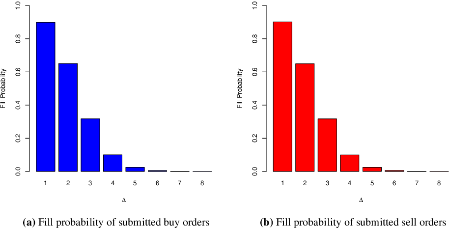

## Table of Contents

## What is algorithmic order placement?

Algorithmic order placement is when computers use special math formulas to decide how and when to buy or sell things like stocks or other financial stuff. Instead of a person making these decisions, the computer does it automatically based on the rules set in the formulas. This helps to make trading faster and can sometimes get better prices because the computer can act very quickly and look at a lot of information at once.

These algorithms can be set up to do different things. For example, they can be told to buy or sell a little bit at a time to not change the price too much, or they can be set to trade at certain times of the day when prices might be better. Using algorithms can help traders who manage a lot of money to do their job more efficiently and maybe make more money. But, it's important to make sure these algorithms are set up right, because if they're not, they can cause problems in the market.

## Why is algorithmic order placement important in trading?

Algorithmic order placement is really important in trading because it helps make trading faster and can save money. Instead of people having to watch the market all the time and decide when to buy or sell, computers can do it much quicker using math formulas. This means trades can happen in just a few seconds, which is way faster than a person could do it. Also, because computers can look at a lot of information at once, they can find the best times to trade and often get better prices.

Another reason it's important is that it helps big traders who manage a lot of money. When you're dealing with a lot of money, buying or selling all at once can change the market price, which isn't good. Algorithms can break up big trades into smaller ones and spread them out over time. This way, they don't affect the market as much and can still get good prices. But, it's really important to make sure these algorithms are set up correctly because if they're not, they could cause big problems in the market.

## What are the basic types of algorithmic trading strategies?

There are a few basic types of [algorithmic trading](/wiki/algorithmic-trading) strategies that traders use. One type is called [trend following](/wiki/trend-following). This is when the computer looks at the market to see if prices are going up or down over time. If it sees a trend, it will buy if prices are going up or sell if prices are going down, hoping to make money as the trend continues. Another type is called mean reversion. This strategy believes that if a price moves a lot away from its normal level, it will eventually come back to that normal level. So, the computer will buy when the price is low and sell when it's high, expecting it to go back to the middle.

Another strategy is called [arbitrage](/wiki/arbitrage). This is when the computer finds small differences in prices of the same thing in different places and buys in one place and sells in another to make a profit from the difference. There's also [market making](/wiki/market-making), where the computer puts out buy and sell orders to help make the market work smoothly, making a little money on each trade. Lastly, there's [statistical arbitrage](/wiki/statistical-arbitrage), which uses math to find patterns in how different things in the market move together, and trades based on those patterns.

These strategies each have their own way of trying to make money, and traders pick the ones that fit their goals and how much risk they're willing to take. But no matter which strategy they use, the key is to set up the algorithms carefully and keep an eye on them to make sure they're working right and not causing problems.

## How does a simple moving average crossover strategy work in algorithmic order placement?

A simple moving average crossover strategy is a type of trend-following strategy used in algorithmic trading. It works by using two moving averages: a short-term one and a long-term one. The short-term moving average is calculated over a shorter period of time, like 50 days, while the long-term moving average is calculated over a longer period, like 200 days. The idea is to watch these two lines on a chart. When the short-term moving average crosses above the long-term moving average, it's a signal that the price might be starting to go up, so the algorithm will buy. When the short-term moving average crosses below the long-term moving average, it's a signal that the price might be starting to go down, so the algorithm will sell.

This strategy is simple but can be effective because it helps traders catch trends early. However, like any strategy, it's not perfect. Sometimes, the moving averages can give false signals, where they cross over but the price doesn't keep going in the expected direction. This can lead to losses if the algorithm buys or sells at the wrong time. Traders using this strategy need to be careful and might want to use other tools or rules along with the moving averages to make sure their trades are more likely to be successful.

## What role do market conditions play in choosing an algorithmic order placement strategy?

Market conditions are really important when choosing an algorithmic order placement strategy. Different strategies work better in different situations. For example, if the market is going up and down a lot, a strategy like mean reversion might work well because it tries to make money from prices coming back to normal after big moves. On the other hand, if the market is moving in a clear direction, a trend-following strategy like the moving average crossover might be better because it tries to catch the trend and make money as it continues.

Also, the type of market can affect which strategy to use. If you're trading in a very liquid market where there are a lot of buyers and sellers, you might use a strategy like arbitrage that looks for small price differences. But in a less liquid market, where it's harder to buy and sell quickly, you might need a strategy that's more careful and doesn't trade as often. Understanding the market conditions helps traders pick the right strategy and set up their algorithms to work the best they can.

## How can risk management be integrated into algorithmic order placement?

Risk management is a big part of algorithmic order placement because it helps keep trading safe and successful. One way to do this is by setting stop-loss orders. These are like safety nets that tell the computer to sell something if its price drops too much. This way, if the market goes against what the algorithm expected, it won't lose too much money. Another way is by using position sizing, which means deciding how much money to put into each trade based on how risky it is. If a trade is very risky, you might put less money into it to keep the risk low.

Another important part of risk management is setting limits on how much the algorithm can trade in a day or over time. This helps make sure the algorithm doesn't go too wild and make too many trades that could lead to big losses. Also, it's good to keep checking on how the algorithm is doing and making changes if needed. This means looking at how much money it's making or losing and adjusting the rules it follows to make sure it's still working well with the current market conditions. By doing all these things, traders can use algorithms to trade more safely and with less risk.

## What are the common challenges faced when implementing algorithmic order placement systems?

One of the biggest challenges when setting up algorithmic order placement systems is making sure the algorithms work right. This means testing them a lot to see if they do what they're supposed to do without causing problems. Sometimes, even small mistakes in the code can lead to big issues, like the algorithm buying or selling too much or at the wrong times. It's also hard to keep up with changes in the market. What works well one day might not work the next, so traders need to keep updating and adjusting their algorithms to fit the current situation.

Another challenge is dealing with the technology itself. These systems need fast and reliable computers and internet connections because they have to make quick decisions. If something goes wrong with the technology, like a computer breaking down or the internet going out, it can cause the algorithm to stop working or make bad trades. Also, keeping the system safe from hackers is important. If someone breaks into the system, they could mess with the trades and cause a lot of damage. So, traders have to spend a lot of time and money on making sure their technology is working well and is safe.

## How do high-frequency trading algorithms influence order placement?

High-frequency trading algorithms are super fast computers that trade a lot of times in just a few seconds. They can change how orders are placed because they look at the market all the time and can buy or sell really quickly. When these algorithms see a chance to make money, they jump on it right away. This means they can affect the prices of things like stocks because they're trading so fast and so often. Other traders might see these quick trades and change what they're doing, too.

Because high-frequency trading algorithms work so fast, they can make the market move in ways that are hard to predict. Sometimes, they can make prices go up or down a lot in a short time, which can be risky for other traders. But they can also help make the market more liquid, which means there are more buyers and sellers, and it's easier to trade. So, while they can make things more complicated, they also help the market work better in some ways.

## What advanced techniques can be used to optimize algorithmic order placement?

One advanced technique to optimize algorithmic order placement is [machine learning](/wiki/machine-learning). This is when computers learn from past data to make better decisions. Instead of just following set rules, the algorithm can look at a lot of information and find patterns that humans might miss. This can help it predict what the market might do next and place orders at the best times. For example, it can learn from how prices have moved before and use that to decide when to buy or sell. This can make trading more successful because the algorithm gets better over time as it learns more.

Another technique is using more advanced math models. These models can look at many different things at once, like how different stocks move together or how news affects the market. By understanding these relationships, the algorithm can make smarter decisions about when and how to trade. For example, if the model sees that one stock usually goes up when another goes down, it can use this information to place orders that take advantage of this pattern. This can help the algorithm find better opportunities and make more money while also managing risk better.

Lastly, using real-time data and adapting quickly to market changes is crucial. This means the algorithm needs to be able to take in new information as it happens and adjust its orders accordingly. If something big happens in the market, like a company announcing good or bad news, the algorithm can react right away to buy or sell at the best possible time. This quick reaction can make a big difference in how well the algorithm performs, helping it stay ahead of other traders and make the most of new opportunities as they come up.

## How does machine learning enhance algorithmic order placement strategies?

Machine learning helps make algorithmic order placement strategies better by letting the computer learn from past data. Instead of just following rules that someone set up, the computer can look at lots of old trades and find patterns. This helps it guess what might happen next in the market. For example, it might see that certain things, like news or how other stocks are doing, often make prices go up or down. By understanding these patterns, the algorithm can decide the best times to buy or sell, making trades more successful. As the computer keeps learning, it gets better at making smart choices, which can lead to more money for traders.

Another way machine learning helps is by making the algorithm more flexible. Markets change all the time, and what worked yesterday might not work today. With machine learning, the algorithm can keep learning and adjusting to new market conditions. If something big happens, like a company announcing new products or bad news, the algorithm can quickly figure out what it means and change its orders to take advantage of it. This quick thinking can help traders stay ahead of others and make the most of new opportunities as they come up.

## What are the regulatory considerations for algorithmic order placement?

When using algorithmic order placement, traders need to follow rules set by different countries or groups to make sure trading is fair and safe. These rules are there to stop bad things from happening, like big price swings or people taking advantage of others. For example, some places have rules that say you have to tell someone if you're using an algorithm to trade, so they can watch and make sure it's not causing problems. Also, there are rules about how much you can trade at once to stop the market from getting too crazy.

Another important thing is making sure the algorithms are safe and can't be hacked. Regulators want traders to have strong security to protect their systems. They also want to make sure that if something goes wrong with the algorithm, there's a way to stop it quickly. This helps keep the market stable and protects everyone who's trading. So, while algorithms can help traders a lot, they have to be careful to follow all these rules to keep trading fair and safe for everyone.

## How can one evaluate the performance of an algorithmic order placement system?

To evaluate how well an algorithmic order placement system is doing, you need to look at a few important things. First, check how much money the system is making or losing. This is called the return on investment (ROI). If the system is making more money than it's losing, that's a good sign. You also want to see if it's making steady profits over time, not just having good days and bad days. Another thing to look at is how much risk the system is taking. You can measure this by looking at how much the profits or losses go up and down, which is called [volatility](/wiki/volatility-trading-strategies). If the system is taking too much risk, it might not be worth it, even if it's making money.

Another way to evaluate the system is by comparing it to other ways of trading. For example, you could see how it does compared to just buying and holding onto stocks, or how it does compared to other traders who are using different methods. This can help you understand if the algorithm is really doing better than other options. Also, it's important to keep an eye on how the system is working in different market conditions. Is it doing well when the market is going up, but not so well when it's going down? By looking at all these things, you can get a good idea of how well the algorithmic order placement system is performing and if it's worth using.

## References & Further Reading

[1]: ["Algorithmic Trading and DMA: An introduction to direct access trading strategies"](https://www.amazon.com/Algorithmic-Trading-DMA-introduction-strategies/dp/0956399207) by Barry Johnson

[2]: Silverman, B. W. (1986). ["Algorithmic Trading: Winning Strategies and Their Rationale."](https://www.wiley.com/en-us/Algorithmic+Trading%3A+Winning+Strategies+and+Their+Rationale-p-9781118676998) Wiley Trading.

[3]: ["Algorithmic and High-Frequency Trading"](https://www.amazon.com/Algorithmic-High-Frequency-Trading-Mathematics-Finance/dp/1107091144) by Álvaro Cartea, Sebastian Jaimungal, and José Penalva

[4]: ["Quantitative Trading: How to Build Your Own Algorithmic Trading Business"](https://www.amazon.com/Quantitative-Trading-Build-Algorithmic-Business/dp/1119800064) by Ernest P. Chan

[5]: ["Advances in Financial Machine Learning"](https://www.amazon.com/Advances-Financial-Machine-Learning-Marcos/dp/1119482089) by Marcos Lopez de Prado

[6]: ["Evidence-Based Technical Analysis: Applying the Scientific Method and Statistical Inference to Trading Signals"](https://www.amazon.com/Evidence-Based-Technical-Analysis-Scientific-Statistical/dp/0470008741) by David Aronson

[7]: Aldridge, I. (2013). ["High-Frequency Trading: A Practical Guide to Algorithmic Strategies and Trading Systems,"](https://www.amazon.com/High-Frequency-Trading-Practical-Algorithmic-Strategies/dp/1118343506) 2nd Edition. Wiley.

[8]: ["Machine Learning for Algorithmic Trading"](https://github.com/stefan-jansen/machine-learning-for-trading) by Stefan Jansen