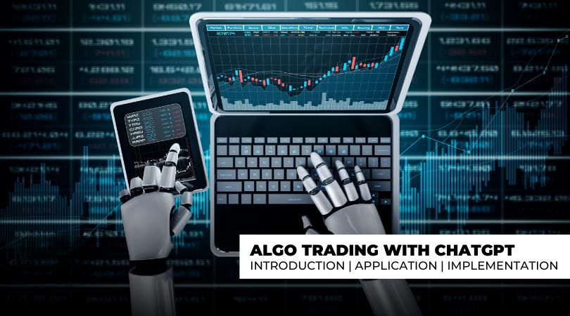

The world of algorithmic trading is undergoing rapid transformation, with advanced tools like ChatGPT at the forefront of this change. ChatGPT, a sophisticated language model created by OpenAI, presents significant opportunities for traders aiming to enhance their strategies. As financial markets become increasingly complex, leveraging technologies like ChatGPT allows traders to better navigate and interpret market data.

ChatGPT is instrumental in optimizing trading strategies by offering robust capabilities in data interpretation and process automation. Its potential applications extend across various aspects of trading operations, such as enhancing decision-making processes and automating strategies. The model's capacity to understand and generate human-like text makes it a versatile tool for extracting valuable insights from vast amounts of textual data.



In algorithmic trading, using technologies like ChatGPT can significantly improve adaptability to market trends, supporting traders in staying competitive. As we explore the applications and benefits of ChatGPT, it becomes evident how integrating such tools into trading systems can provide a meaningful advantage in the dynamic environment of financial markets.

## Table of Contents

## What is ChatGPT?

ChatGPT is a cutting-edge language model renowned for its proficiency in understanding and generating text that closely resembles human communication. It belongs to the Generative Pre-trained Transformer (GPT) series, created by OpenAI, and is celebrated for its sophisticated natural language processing (NLP) capabilities. This series is built upon the Transformer architecture, which forms the foundation for its ability to handle extensive text data.

A standout feature of ChatGPT is its versatility across various domains, including financial markets. It can interpret prompts, engage in interactive discussions, and deliver insights on diverse topics, a trait that traders particularly find useful for market analysis. The model's mechanism involves pre-training on a vast corpus of text from the internet, followed by fine-tuning, which enhances its ability to generate coherent and contextually relevant responses.

The architecture of ChatGPT includes layers of attention mechanisms, which allow it to consider different parts of an input sequence attentively, ensuring that each word's context is appropriately factored into the output it generates. This capability makes it adept at text tasks, such as sentiment analysis and trend prediction, which are crucial in trading environments.

For traders, ChatGPT serves as a dynamic tool that can aid in digesting large volumes of market data, social media commentary, and financial news. By processing and analyzing this data with speed and precision, it allows traders to glean valuable insights that might otherwise be missed. Moreover, its ability to customize outputs based on specific prompts means that traders can tailor its responses to align more closely with their strategic needs. This adaptability positions ChatGPT as an invaluable asset for those keen on optimizing their trading decisions through enhanced data analysis and strategy development.

## How Can ChatGPT Be Used in Algo Trading?

ChatGPT can serve as a valuable tool in [algorithmic trading](/wiki/algorithmic-trading) by aiding traders in both the design and implementation of trading strategies. The model's capability to analyze vast amounts of text data makes it efficient in parsing through market reports and economic indicators, helping traders identify relevant trends and potential investment opportunities. By interpreting financial news, ChatGPT can assist in generating forecasts that align with data-driven trading strategies.

One of the key applications of ChatGPT in trading is sentiment analysis. By evaluating sentiments expressed in financial news and social media platforms, the model can offer insights into the market mood, which is critical in short-term trading strategies. This involves processing large volumes of textual data to extract relevant emotions and opinions, allowing traders to gauge the general market sentiment. Such analysis can be crucial for predicting market movements, as positive or negative sentiments can significantly influence stock prices.

ChatGPT also provides traders with real-time insights and personalized recommendations. For instance, it can analyze incoming news and suggest updates on portfolio allocations or highlight potential risks based on current events. This real-time interaction enhances the traders' decision-making process as they receive timely and tailored advice that accounts for the continuous flow of market information.

Moreover, traders can leverage ChatGPT to automate specific parts of their trading process through script generation. ChatGPT-enabled scripts can be employed to execute trades automatically based on predefined criteria, increasing the efficiency and precision of trading operations. For example, a trader may utilize a Python script powered by ChatGPT to monitor certain stock price thresholds and execute trades when these conditions are met. Here is a simple Python code snippet illustrating how a trader might automate a buy action when certain price criteria are met:

```python
import yfinance as yf

def check_price_and_buy(stock_symbol, target_price):
    stock_data = yf.Ticker(stock_symbol)
    current_price = stock_data.history(period='1d')['Close'][-1]

    if current_price <= target_price:
        execute_trade(stock_symbol, "buy", current_price)

def execute_trade(stock_symbol, action, price):
    print(f"Executing {action} for {stock_symbol} at ${price}")

# Example usage
check_price_and_buy('AAPL', 130)
```

This code monitors the price of a specific stock and initiates a buy transaction if the price falls below or equals the target price. By integrating such automation into their trading systems, traders can minimize human error and react swiftly to market changes.

Overall, ChatGPT empowers traders by offering sophisticated analytical tools and automating mundane tasks, thus enabling more strategic and agile trading operations.

## Steps to Integrate ChatGPT in Algorithmic Trading

Integrating ChatGPT into your algorithmic trading system can enhance various functions such as market analysis and trade execution. Here are the essential steps to seamlessly incorporate ChatGPT into your trading operations:

### Identify Key Areas for ChatGPT Assistance

Begin by pinpointing the specific tasks where ChatGPT can add value. This could involve market analysis tasks where ChatGPT interprets vast datasets, offering insights on price movements, trade volumes, or economic indicators. Alternatively, it might assist in automating aspects of trade execution by providing real-time decision support. Clear identification of these tasks will streamline subsequent integration efforts.

### Craft Effective Prompts

Success with ChatGPT heavily depends on the quality of prompts you formulate. Create prompts that are tailored to your trading strategy's needs, focusing on clarity and precision. For instance, if ChatGPT is used for sentiment analysis, a prompt might be: 

```python
prompt = "Analyze the sentiment of the following news article related to stock X: [article text]"
```

Ensure that these prompts are structured in a manner that allows ChatGPT to generate concise and relevant insights.

### Test and Refine Prompts

Once the initial prompts are crafted, rigorously test them to assess the quality and relevance of the responses generated. This iterative process is crucial. During testing, adjust the prompts based on the outputs received to better align them with your trading objectives. This may involve altering the phrasing, adjusting the information detail levels, or employing different context settings.

### Integrate ChatGPT into Trading Infrastructure

The next phase involves technical integration into your trading infrastructure. Implementing ChatGPT using APIs provided by OpenAI will enable seamless interaction with your existing systems. Here's a simple Python implementation to illustrate:

```python
import openai

openai.api_key = 'your-api-key'

def get_chatgpt_response(prompt):
    response = openai.Completion.create(
      engine="gpt-3.5-turbo",
      prompt=prompt,
      max_tokens=100
    )
    return response.choices[0].text.strip()
```

This integration allows for real-time data analysis or feedback which can be directly applied to trading algorithms.

### Monitor and Adjust

Finally, continuous monitoring of ChatGPT's output relative to trading performance is essential. Evaluate the outcomes of the trading strategies enhanced by ChatGPT to ensure they align with your financial goals. Continuous adaptation and recalibration may be necessary as market conditions change or as new features within ChatGPT become available.

Incorporating ChatGPT into your algorithmic trading can yield substantial advantages. Yet, the integration must be handled thoughtfully to maximize its impact and ensure it synergizes effectively with your existing trading systems.

## Challenges and Considerations

While ChatGPT holds significant promise for enhancing algorithmic trading, it's crucial to acknowledge the challenges and considerations associated with its use. One of the primary limitations of ChatGPT is its dependency on the quality and relevance of its data sources. As an AI model trained on a diverse range of internet text, ChatGPT may occasionally generate responses based on outdated or irrelevant information. Traders must exercise caution and verify the information obtained from ChatGPT against current, reliable data sources.

Accuracy is another concern. Although ChatGPT can produce human-like text, it does not inherently understand the nuances or complexities of financial markets. The model's responses are probabilistic, meaning that there is always a risk of generating inaccurate or misleading information. Traders must carefully evaluate the outputs of ChatGPT, supplementing them with their insights and other statistical or analytical tools to ensure sound decision-making.

Balancing AI-generated insights with human expertise is essential. While ChatGPT can provide valuable inputs, it should not be used as a standalone decision-making tool. Traders are advised to integrate ChatGPT's outputs with technical analysis, [fundamental analysis](/wiki/fundamental-analysis), and market knowledge. This hybrid approach can lead to more balanced outcomes and better risk management in trading strategies.

The successful integration of ChatGPT into algorithmic trading systems demands a thorough understanding of both financial markets and AI technologies. Traders need to grasp how ChatGPT operates, including its strengths and limitations, to effectively harness its potential. This knowledge is critical for designing prompts that generate relevant insights and for interpreting the AI's output correctly.

Incorporating AI tools like ChatGPT into trading systems may require specialized technical expertise and infrastructure. It often necessitates collaboration between financial experts and data scientists to ensure seamless integration and optimal utilization of AI capabilities. This collaborative approach aims to maximize the advantages of AI while minimizing potential drawbacks.

In summary, while ChatGPT introduces exciting opportunities for algorithmic trading, careful consideration of its limitations and strategic integration into existing trading frameworks are imperative. By doing so, traders can leverage AI to enhance their strategies while effectively managing associated risks.

## Conclusion

Combining the advanced capabilities of ChatGPT with algorithmic trading strategies presents novel opportunities for traders aiming to enhance their performance in financial markets. ChatGPT, a sophisticated language model developed by OpenAI, offers unique benefits that can aid in processing and interpreting vast amounts of text data, which is crucial in the fast-paced trading environment. By enabling real-time sentiment analysis and generating actionable insights, ChatGPT can significantly contribute to informed decision-making.

As financial markets are inherently dynamic, the ability to adapt quickly to changes is vital for maintaining a competitive advantage. The integration of innovative tools such as ChatGPT into trading systems equips traders with the means to stay ahead by allowing them to rapidly identify market trends and potential risks. The model can parse through diverse data sources, including news articles and social media, to gauge market sentiment and provide strategies that align with evolving market conditions.

However, the successful incorporation of ChatGPT into trading operations requires careful implementation and ongoing optimization. Traders must focus on refining their use of prompts and continually evaluating the model's outputs to ensure they are aiding rather than hindering trading objectives. It is crucial to combine the AI's capabilities with human expertise to create a balanced approach to trading strategy development. Collaboration between domain experts and AI specialists is essential to fully harness the potential of ChatGPT, optimizing its contributions to automated trading frameworks.

In conclusion, while ChatGPT offers compelling advantages for algorithmic trading, its successful application depends on thoughtful integration and consistent refinement. By effectively utilizing ChatGPT, traders can enhance their trading strategies, achieve better outcomes, and ultimately secure a competitive edge in the financial markets.

## References & Further Reading

[1]: Bergstra, J., Bardenet, R., Bengio, Y., & Kégl, B. (2011). ["Algorithms for Hyper-Parameter Optimization."](https://papers.nips.cc/paper/4443-algorithms-for-hyper-parameter-optimization) Advances in Neural Information Processing Systems 24.

[2]: ["Advances in Financial Machine Learning"](https://www.amazon.com/Advances-Financial-Machine-Learning-Marcos/dp/1119482089) by Marcos Lopez de Prado

[3]: ["Evidence-Based Technical Analysis: Applying the Scientific Method and Statistical Inference to Trading Signals"](https://www.amazon.com/Evidence-Based-Technical-Analysis-Scientific-Statistical/dp/0470008741) by David Aronson

[4]: ["Machine Learning for Algorithmic Trading"](https://github.com/stefan-jansen/machine-learning-for-trading) by Stefan Jansen

[5]: ["Quantitative Trading: How to Build Your Own Algorithmic Trading Business"](https://www.amazon.com/Quantitative-Trading-Build-Algorithmic-Business/dp/0470284889) by Ernest P. Chan