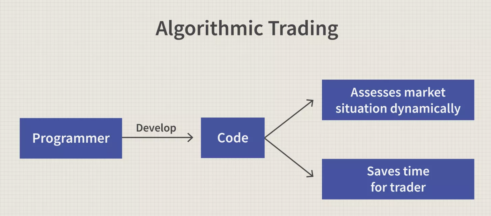

## Table of Contents

## What is algorithmic trading?

Algorithmic trading is a way of buying and selling things like stocks or currencies using computers and special math formulas. Instead of people making decisions about when to buy or sell, a computer program does it automatically. These programs use lots of data and math to figure out the best times to trade. This can happen very quickly, often in just a few seconds or even less.

People use algorithmic trading because it can be faster and sometimes more accurate than humans. Computers can look at a lot of information at once and make decisions based on that information without getting tired or emotional. However, it's not perfect. Sometimes the math formulas can be wrong, or the market can change in ways that the computer didn't expect. So, while algorithmic trading can be helpful, it also needs to be watched carefully by people to make sure it's working correctly.

At its core, an algorithm used for trading purposes consists of several components: data intake, signal generation, risk management, and execution. 

1. **Data Intake:** This component involves the continuous collection and aggregation of market data, including price quotes, volumes, and recent trades, which form the basis for making informed decisions.

2. **Signal Generation:** Based on the data collected, the algorithm employs rules or models to generate trading signals. These signals indicate buy or sell opportunities based on specific conditions being met.

3. **Risk Management:** Algorithms often incorporate risk management protocols to maintain exposure within acceptable levels, helping to mitigate potential losses.

4. **Execution:** Once a signal is confirmed, the algorithm executes the trade using the best available route or method to optimize transaction costs, often through direct market access (DMA) or smart order routing.

The core advantage of [algorithmic trading](/wiki/algorithmic-trading) lies in its automation, which removes the element of human error and bias from the trading process. This automation enables trades to be executed at a speed and frequency impossible for a human trader, enhancing both the speed and efficiency of trading operations. By processing vast amounts of data quickly and accurately, algorithms are able to exploit minor price discrepancies in real time, leading to more profitable trades.

Algorithmic trading algorithms may take the form of pre-programmed instructions which can specify conditions under which trades are automatically triggered. For example, a Python script might look like this:

```python
def trading_signal(prices):
    # Example rules for signal generation
    if prices[-1] > prices[-5]:  # Simple moving average crossover
        return "Buy"
    elif prices[-1] < prices[-5]:
        return "Sell"
    return "Hold"

# Execute trade
current_prices = [100, 101, 102, 103, 104]
signal = trading_signal(current_prices)
print(f"Trading signal: {signal}")
```

This script uses a simple moving average crossover strategy to determine buy or sell signals, a common pattern in algorithmic trading.

Algorithmic trading isn't limited to a single type of asset. Commonly traded assets using these algorithms include equities, commodities, foreign exchange, and derivatives. The breadth of the asset classes highlights the adaptability of algorithms to complex and diverse markets.

## What are the basic components of an algorithmic trading system?

The first main part of an algorithmic trading system is the data feed. This is where the system gets all the information it needs about the market, like stock prices, trading volumes, and news. The data feed is really important because the system uses this information to make trading decisions. Without good, up-to-date data, the system wouldn't know what's happening in the market and would make bad trades.

The second part is the algorithm itself. This is the math formula that tells the computer when to buy or sell. The algorithm looks at the data from the feed and decides if it's a good time to trade. It might use things like price trends, how much a stock's price is moving, or even news events to make these decisions. The algorithm needs to be carefully designed so it can make smart choices quickly.

The third part is the execution system. This is what actually places the buy or sell orders in the market. Once the algorithm decides to trade, the execution system sends the order to the market. It needs to do this fast and accurately so the trade happens at the best possible price. The execution system also keeps track of the trades that have been made and makes sure everything is working smoothly.

## How does algorithmic trading differ from traditional trading?

Algorithmic trading is different from traditional trading because it uses computers and math formulas to make trading decisions, while traditional trading relies on people making those choices. In traditional trading, a person looks at charts, news, and other information to decide when to buy or sell. They might use their experience and gut feelings to make these decisions. On the other hand, [algorithmic trading](/wiki/algorithmic-trading) takes the human element out of it. A computer program follows a set of rules to decide when to trade, and it can do this much faster than a human could.

Another big difference is the speed and amount of data that can be processed. Algorithmic trading systems can look at huge amounts of data in a very short time, sometimes making thousands of trades in a second. This means they can take advantage of small price changes that a human might miss. Traditional trading is slower because humans can't process information as quickly as computers. This means they might not be able to react to market changes as fast, which can affect how much money they make or lose.

## What are the advantages of using algorithmic trading?

One big advantage of using algorithmic trading is that it can be much faster than traditional trading. Computers can make decisions and place trades in milliseconds, which means they can take advantage of small price changes that humans might not even notice. This speed can lead to better profits because the system can buy and sell at the best possible times. Also, because computers follow set rules, they don't get tired or make emotional decisions, which can sometimes lead to mistakes in traditional trading.

Another advantage is that algorithmic trading can handle a lot more information than a person can. The system can look at huge amounts of data from different sources, like stock prices, trading volumes, and news, all at the same time. This means it can make smarter decisions based on a lot more information than a human trader could. Plus, once the system is set up, it can run on its own, which means it can keep trading even when the markets are open late at night or over the weekend, times when human traders might not be working.

## What are the risks and challenges associated with algorithmic trading?

One big risk with algorithmic trading is that the math formulas, or algorithms, might be wrong. If the algorithm is based on bad information or doesn't work the way it's supposed to, it can make bad trading decisions. This can lead to big losses. Also, the market can change in ways that the algorithm didn't expect. For example, if there's a sudden big event like a financial crisis, the algorithm might not know how to react, and it could keep trading in a way that loses money. So, even though computers are fast, they can still make mistakes if they're not set up right or if the market does something unexpected.

Another challenge is that algorithmic trading can be hard to control. Once you start the system, it can make trades very quickly, and it might be hard to stop it if something goes wrong. This is called a "flash crash," where the market can drop suddenly because of a lot of fast trades. Also, because algorithmic trading can happen so fast, it can be hard to keep an eye on everything. You need to watch the system carefully to make sure it's working right and not doing anything risky. This means you need good systems in place to monitor and manage the trading, which can be complicated and take a lot of work.

## What programming languages are commonly used in algorithmic trading?

In algorithmic trading, some programming languages are used more often than others because they are good at handling numbers and working fast. Python is very popular because it's easy to learn and has a lot of tools that help with trading, like libraries for analyzing data and making charts. Another common language is C++, which is used when speed is really important. C++ can make programs run very quickly, which is helpful for trading where every second counts.

Other languages like Java and R are also used in algorithmic trading. Java is good because it can handle a lot of data at the same time, which is useful for big trading systems. R is often used for its strong data analysis tools, which can help traders understand market trends better. Each of these languages has its own strengths, so the choice often depends on what the trading system needs to do best.

## Can you explain some common algorithmic trading strategies?

One common algorithmic trading strategy is called [trend following](/wiki/trend-following). This strategy looks at the market to see if prices are going up or down over time. If the prices are going up, the algorithm will buy more of the stock, hoping to sell it later at a higher price. If the prices are going down, the algorithm will sell the stock to avoid losing money. Trend following is simple but can be effective because it tries to make money by following the direction of the market.

Another strategy is called mean reversion. This strategy is based on the idea that prices will eventually go back to their average value. If a stock's price goes up a lot, the algorithm might think it's too high and will sell it, expecting the price to go back down. If the price goes down a lot, the algorithm might buy it, expecting the price to go back up. Mean reversion tries to make money by betting that prices will return to normal after they've moved too far one way or the other.

A third strategy is called [arbitrage](/wiki/arbitrage). This is when the algorithm looks for small differences in prices between different markets or different forms of the same stock. For example, if a stock is selling for a slightly different price on two different exchanges, the algorithm might buy it on the cheaper exchange and sell it on the more expensive one to make a small profit. Arbitrage tries to make money from these tiny price differences, but it needs to happen very quickly because the differences usually don't last long.

## How do you backtest an algorithmic trading strategy?

Backtesting an algorithmic trading strategy means you test it on old market data to see how it would have worked in the past. You take your trading rules and apply them to historical data to see if your strategy would have made money. This helps you figure out if your strategy is good before you use real money. To do this, you need a lot of past data on prices, volumes, and other market information. You also need a computer program that can run your trading rules on this data.

When you backtest, you look at things like how much money your strategy would have made or lost, how often it made trades, and how risky it was. You might find that your strategy works well most of the time but fails in certain situations, like during big market changes. This can help you improve your strategy. It's important to be careful, though, because past results don't always mean the strategy will work the same way in the future. Markets can change, and what worked before might not work again.

## What role do machine learning and AI play in algorithmic trading?

Machine learning and AI are changing the way algorithmic trading works. They help make trading strategies smarter by learning from past data. Instead of just following set rules, these systems can find patterns in the market that people might miss. For example, they can look at a lot of different things like news, social media, and even the weather to predict how the market might move. This means they can make better trading decisions because they can see more of what's going on.

However, using [machine learning](/wiki/machine-learning) and AI in trading also has its challenges. These systems need a lot of data to learn from, and they can sometimes make mistakes if the data is not good or if the market changes in a way they didn't expect. Also, because they are so complex, it can be hard to understand why they make certain decisions. This is called the "black box" problem. Still, many traders think the benefits of using AI and machine learning are worth it because they can help make more money and work faster than older methods.

## How can one ensure compliance with regulations in algorithmic trading?

To make sure your algorithmic trading follows the rules, you need to know the laws and rules that apply to trading in your area. Different places have different rules, so you need to check what they are and make sure your trading system follows them. This might mean setting up your system to keep records of all trades, report them to the right people, and make sure you're not doing anything that's not allowed, like trading too much or trying to trick the market.

Another important thing is to have good systems in place to watch your trading and make sure it's doing what it's supposed to do. This means having people who check the system regularly to make sure it's following the rules. If something goes wrong, you need to be able to stop the trading quickly and fix the problem. This way, you can keep trading safely and legally, and avoid getting into trouble with the people who make the rules.

## What are some real-world examples of successful algorithmic trading?

One real-world example of successful algorithmic trading is Renaissance Technologies, a [hedge fund](/wiki/hedge-fund-trading-strategies) known for using complex math and computer algorithms to trade. They have a famous fund called the Medallion Fund, which has made huge profits over the years. The fund uses algorithms to find patterns in the market that are hard for people to see. They trade a lot and very quickly, and their success shows how powerful algorithmic trading can be when done right.

Another example is Two Sigma, another big hedge fund that uses algorithms to trade. They use a lot of data, including things like news and social media, to help their computers make smart trading decisions. Two Sigma has been very successful, showing that using lots of different kinds of information can help make better trades. Their success also shows that algorithmic trading can work well in many different markets, not just stocks.

## How do high-frequency trading algorithms work and what impact do they have on the market?

High-frequency trading algorithms work by making a lot of trades very quickly, often in just a few milliseconds. These algorithms use computers to look at the market all the time and find small chances to make money. They might buy a stock on one exchange where it's a tiny bit cheaper and then sell it on another exchange where it's a tiny bit more expensive. This is called arbitrage. Because they can do this so fast, they can make a lot of small profits that add up over time. High-frequency trading needs very fast computers and special connections to the market to work well.

High-frequency trading can have a big impact on the market. On one hand, it can make the market more efficient because it helps prices stay the same across different exchanges. This is good for everyone because it means you're more likely to get a fair price when you trade. On the other hand, high-frequency trading can also make the market more risky. Sometimes, these algorithms can cause big, sudden changes in the market, like a flash crash, where prices drop very quickly because of a lot of fast trades. This can be scary for other traders and can make the market feel less stable. So, while high-frequency trading can be good for making money, it also needs to be watched carefully to keep the market safe.


## What are the most common algorithmic trading strategies?  

The most common algorithmic trading strategies range from simple to sophisticated, each leveraging market patterns or inefficiencies. Here’s a rundown of the heavy hitters:

1. **Moving Average Crossover** - This is the beginner’s go-to. It uses two moving averages—say, a 10-day and a 50-day. Buy when the short one crosses above the long one (signaling an uptrend); sell when it dips below. It’s trend-following and works best in markets with clear momentum, not choppy sideways action.

2. **Mean Reversion** - Assumes prices bounce back to their average over time. If a stock drops way below its historical mean (calculated via something like a 20-day average), the algo buys, expecting a rebound. Sell when it overshoots high. It thrives in range-bound markets but can bleed in strong trends.

3. **Arbitrage** - Exploits price differences. Think buying a stock cheaper on one exchange and selling it higher on another (spatial arbitrage), or cashing in on mispricing between a stock and its ETF (statistical arbitrage). Speed is king here—latency kills profits.

4. **Momentum Trading** - Rides the wave of big price moves. The algo scans for stocks breaking out (like hitting a 52-week high) with strong volume, betting the trend continues. It’s high-risk, high-reward, and needs tight stop-losses to avoid crashes.

5. **Market Making** - Acts like a middleman. The algo posts buy and sell orders around the current price, pocketing the spread. It’s low-risk per trade but demands constant adjustment and monster liquidity to scale.

6. **Pairs Trading** - A statistical play. Find two correlated assets—like Coke and Pepsi. If their price ratio diverges (one spikes, the other lags), short the overperformer and buy the underdog, betting they’ll converge. It’s market-neutral, dodging big directional bets.

7. **Trend Following** - Broader than crossovers. Uses indicators like MACD or ADX to chase sustained moves. It’s less about timing the start and more about staying in as long as the trend holds. Patience is key; false starts hurt.

8. **High-Frequency Trading (HFT)** - Less a strategy, more a style. Think scalping tiny price gaps or front-running orders with microsecond execution. It’s for pros with deep pockets and custom tech—think co-located servers—not beginners.

Each has its sweet spot. Momentum loves [volatility](/wiki/volatility-trading-strategies); mean reversion hates it. Arbitrage needs precision; [market making](/wiki/market-making) needs volume. Beginners might start with crossovers or mean reversion since they’re easier to code and test, while advanced traders layer in pairs or HFT with beefier tools. Pick based on your market, data, and stomach for risk.

## How does backtesting improve algorithmic trading performance?  

Backtesting improves algorithmic trading performance by letting you stress-test your strategy on historical data before it faces the chaos of live markets. It’s like a flight simulator for pilots—find the flaws without crashing real cash. Here’s how it works and why it matters.

First, it reveals if your idea even holds water. You feed your algorithm—like a moving average crossover—years of past price data (say, daily S&P 500 candles from 2015-2023). The system simulates every trade it would’ve made, tracking wins, losses, and drawdowns. If it’s bleeding red or barely beats a coin flip, you know it’s junk before risking a dime.

It also exposes weaknesses. Maybe your strategy nails uptrends but gets shredded in choppy markets. Backtesting shows you the hit rate (percent of profitable trades), average profit versus loss, and max losing streaks. You can spot if it’s overfitted—tuned too perfectly to past quirks that won’t repeat—or if it chokes on transaction costs you forgot to include. For example, a high-frequency scalper might look golden until commissions eat the gains.

Tweaking becomes data-driven, not guesswork. Say your 10-day/50-day crossover lags too much; backtesting lets you test a 5-day/20-day version instead. You see the impact on returns and risk (like Sharpe ratio) instantly. It’s iterative—adjust, retest, refine—until the algo’s robust across different market conditions, like bull runs or crashes.

Risk management sharpens, too. Backtesting shows your worst drawdown—maybe a 20% dip in 2018’s volatility spike. You can size positions or set stop-losses to survive that, not just hope it works. It’s not foolproof—past data doesn’t guarantee future wins, and “black swan” events like 2020’s pandemic crash can blindside you—but it cuts naive errors.

Tools like Python’s `backtrader` or MetaTrader’s strategy tester make it accessible. You just need clean data (Yahoo Finance, Quandl) and realistic assumptions (slippage, fees). Without it, you’re flying blind; with it, you’ve got a map—imperfect, but miles ahead of gut instinct.

## What role does data play in designing trading algorithms?  

Data is the backbone of designing trading algorithms—it’s what fuels the logic, tests the strategy, and keeps it grounded in reality. Without it, you’re just guessing; with it, you’ve got a shot at something that actually works. Here’s how it fits in.

First, data defines the signals. Your algorithm needs inputs to decide when to buy or sell—price, volume, time, whatever. Historical price data (like daily OHLC—open, high, low, close—from a stock or [forex](/wiki/forex-system) pair) lets you build rules, say, “Buy when the 10-day moving average crosses the 50-day.” More granular tick data (every trade’s price and size) can power high-frequency stuff, catching split-second moves. No data, no patterns, no edge.

It’s also the testing ground. Backtesting leans on historical datasets—think years of S&P 500 prices or crypto minute-by-minute trades—to simulate how your algo would’ve performed. Clean, accurate data here is critical; garbage in (missing trades, bad timestamps) means garbage out (fake profits). You’re not just checking wins but how it handles volatility, gaps, or crashes.

Data variety shapes sophistication. Basic algos might just use price and volume, but richer datasets—think options Greeks, [order book](/wiki/order-book-trading-strategies) depth, or sentiment from news feeds—let you craft nuanced strategies like [arbitrage](/wiki/arbitrage) or trend prediction. Alternative data (social media buzz, weather impacting crops) is gold for advanced traders, though it’s trickier to source and process.

Quality trumps everything. Data needs to be reliable—adjusted for splits, dividends, or glitches—and high-resolution if your strategy demands it (daily bars won’t cut it for [scalping](/wiki/gamma-scalping)). Free sources like Yahoo Finance work for starters, but pros pay for Bloomberg or Refinitiv to avoid delays or errors. Bad data can fool you into overconfidence; a strategy “winning” on corrupted numbers flops live.

Finally, it’s about adaptation. Live data—streamed via APIs from brokers like Interactive Brokers—keeps your algo reacting to the market now, not just yesterday. Designing with this in mind means coding for speed and handling outliers (a flash crash shouldn’t nuke you). Data isn’t static; it’s the pulse that keeps your algo alive and evolving. Skimp on it, and you’re building on sand.

## How do you manage risk in algorithmic trading?  

Managing risk in algorithmic trading is about building guardrails into your system so it doesn’t blow up when the market inevitably throws a curveball. It’s less about avoiding losses—those happen—and more about keeping them survivable while maximizing your edge. Here’s how it’s done.

Start with position sizing. Don’t bet the farm on one trade. A common rule is risking no more than 1-2% of your account per trade. If you’ve got $10,000, that’s $100 max loss. Your algo can calculate this dynamically—say, based on the stock’s volatility (using ATR, average true range) or stop-loss distance—so it scales bets to match the risk, not your gut.

Stop-losses are non-negotiable. Hard-code them into the algo: “If price drops 5% below entry, sell.” This caps your downside when a trade goes south fast, like during a gap down. Trailing stops can lock in profits as a trend runs, adjusting the [exit](/wiki/exit-strategy) as price climbs. Just don’t set them too tight, or choppy markets will shake you out early—backtest to find the sweet spot.

Diversify your trades. If your algo only plays one stock or strategy (say, [momentum](/wiki/momentum) on tech), a sector crash kills you. Spread it across assets (stocks, forex, crypto) or mix strategies (trend-following plus mean reversion). Correlation matters—don’t double down on pairs that move in lockstep, or you’re not really diversified.

Leverage is a double-edged sword. Borrowing amps up gains but magnifies losses. Cap it in your code—maybe 2:1 max—and monitor margin use live. A 50% drawdown on a leveraged account can wipe you out faster than you can blink. Algos don’t flinch, so you have to enforce discipline upfront.

Monitor real-time. Markets shift—volatility spikes, liquidity dries up. Build alerts or kill switches: “If drawdown hits 10% today, pause trading.” This catches bugs or black swans (think 2020 flash crash) before they spiral. Test for slippage, too—your backtest might assume perfect fills, but live trades don’t, so pad your risk calc for that.

Finally, stress-test everything. Run your algo on historical worst-case scenarios—2008 meltdown, 2018 Volmageddon. If it survives with acceptable losses, you’re in decent shape. Risk management isn’t sexy, but it’s why pros last while amateurs bust. Code it tight, test it hard, and don’t trust luck.

## What are the challenges of implementing algorithms in live markets?  

Implementing algorithms in live markets throws a slew of challenges at you that simulations can’t fully prep you for—it’s where theory meets the messy real world. Here’s what you’re up against.

First, execution’s a beast. In backtests, trades fill instantly at the quoted price. Live, you’ve got slippage—prices move before your order hits, especially in fast markets or thin liquidity. A buy at $100 might execute at $100.50, eating your edge. Latency compounds this; if your algo’s slow (bad internet, distant servers), pros with co-located rigs front-run you. Speed matters more than you’d think.

Market conditions shift. Your algo might crush it in a trending 2021 bull run but flop in 2022’s choppy bear market. Overfitting’s the trap—tuning too perfectly to past data leaves it brittle when volatility spikes or trends vanish. Live markets don’t care about your historical curve-fitting; they’ll expose any lack of adaptability.

Data quality bites back. Backtests use clean, curated feeds. Live, you’re stuck with what streams—delays, gaps, or outright errors (a bad tick showing $0.01 on a $50 stock). If your algo doesn’t filter noise or handle missing bars, it’ll misfire—buying into a glitch or sitting idle during a [breakout](/wiki/breakout-trading).

Costs creep in. Commissions, spreads, and fees look trivial on paper but stack up fast. A scalping algo hitting 100 trades a day might lose 20% of profits to transaction costs if you didn’t account for them. Live, you feel every penny; backtests often gloss over this.

Tech fails happen. Servers crash, APIs disconnect, or your code hits a bug—like an infinite loop gobbling orders. Without fail-safes (kill switches, max trade limits), a glitch can drain your account before you unplug. Even brokers can lag or reject orders during high volume, like earnings season pileups.

Psychology sneaks in, too. Watching real money swing tests your nerve—tweaking a live algo mid-run risks breaking what works. Pros stick to the plan; amateurs panic-fiddle. And regulators lurk—fat-finger a million-share order or trip a circuit breaker, and you’re in hot water.

Fixing it means over-preparing: stress-test with slippage and latency baked in, use robust error handling, and start small (micro-lots, one stock). Live markets don’t forgive sloppy transitions—respect the chaos, and you might survive it.

## How do advanced traders optimize algorithms for speed and efficiency?  

Advanced traders optimize algorithms for speed and efficiency by squeezing every drop of performance out of their tech and strategy—it’s a game of microseconds and resource management. Here’s how they pull it off.

Speed starts with infrastructure. They co-locate servers right next to exchange data centers—think NYSE or Nasdaq facilities—cutting latency from milliseconds to microseconds. Every hop a signal takes (your home Wi-Fi to a broker to the market) adds delay; co-lo skips the line. They pair this with high-performance hardware—think multi-core CPUs or GPUs for parallel processing, and FPGAs (field-programmable gate arrays) for ultra-low-latency execution. An FPGA can process a trade signal in nanoseconds, leaving software in the dust.

Code gets lean. Python’s great for prototyping, but advanced traders rewrite critical parts in C++ or Rust—faster languages with less overhead. They strip out bloat: no redundant loops, minimal memory allocation, and precomputed lookups (like caching moving averages). Profiling tools pinpoint bottlenecks—say, a slow sort function—and they swap it for a quicker algorithm, like binary heaps over lists.

Data handling’s streamlined. Instead of polling full datasets, they use event-driven systems—reacting only to price ticks or order book updates via APIs like FIX protocol. They compress data (binary over text) and process it in-memory (RAM’s faster than disk). For high-frequency trading (HFT), they might skip databases entirely, holding everything in a custom, low-latency buffer.

Strategy efficiency matters, too. They prune unprofitable signals—say, a momentum trigger firing too often with weak odds—using real-time analytics. Machine learning can help, but only if lightweight; a neural net’s overkill if it lags. They also batch orders smartly—grouping trades to minimize market impact and fees without sacrificing timing.

Redundancy’s cut, but not safety. They ditch unnecessary logging or UI fluff in live runs, but keep kill switches and throttles (max trades per second) to avoid runaway algos. Testing’s brutal—simulated latency, packet loss, and peak volume (think FOMC announcement chaos) ensure it holds up.

Cost-benefit drives it all. A $10,000 server might shave 50 microseconds, but if the edge only nets $5,000, it’s scrapped. Advanced traders obsess over this math—speed’s worthless if it doesn’t pay. It’s a brutal, technical grind, but that’s how they stay ahead of the pack.

## What impact does machine learning have on algorithmic trading?  

Machine learning (ML) supercharges algorithmic trading by digging deeper into data and adapting to markets in ways traditional rules can’t match. It’s not a magic bullet—hype oversells it—but when done right, it’s a game-changer. Here’s the impact.

First, it boosts signal detection. Old-school algos rely on fixed rules—like “buy when RSI hits 30.” ML models, like random forests or neural networks, chew through mountains of data (prices, volume, news sentiment) to find hidden patterns humans or simple stats might miss. Maybe it spots a combo—low volatility plus a Twitter spike—that predicts a breakout. It’s less about guessing and more about letting the data talk.

Adaptability’s a big win. Markets evolve—2020’s pandemic chaos didn’t look like 2008’s crash. Traditional algos can break when conditions shift; ML can retrain on fresh data, tweaking its logic on the fly. A [reinforcement learning](/wiki/reinforcement-learning) model might learn to dial back risk during wild swings, something a static mean-reversion script can’t do without manual rewrites.

Prediction gets sharper. Time-series models (like LSTM networks) forecast price moves or volatility better than basic indicators, especially with granular data—think tick-level trades or order book depth. It’s not perfect (markets are noisy), but even a slight edge, like 55% accuracy on direction, compounds fast in high-frequency setups.

Risk management levels up. ML can model tail risks—those rare, brutal drops—by training on historical crashes plus [alternative data](/wiki/best-alternative-data) (weather, geopolitics). It might flag “sell now” before a traditional stop-loss triggers, or dynamically size positions based on predicted drawdowns, not just fixed percentages.

But it’s got teeth. Overfitting’s a killer—models can memorize past quirks (like a 2015 anomaly) and flop live. Data quality’s make-or-break; garbage inputs (unadjusted splits, delayed feeds) spit out garbage trades. And it’s resource-hungry—training a [deep learning](/wiki/deep-learning) model takes serious compute power and time, unlike a quick moving average tweak. Latency’s another hitch; complex ML can’t always keep up with HFT’s microsecond demands unless paired with optimized hardware.

The edge shows in execution, too. ML-driven market-making algos adjust spreads dynamically, sniffing out liquidity shifts faster than rule-based rivals. Big players—like hedge funds—use it for macro calls, blending satellite imagery or earnings text with price data for bets traditionalists can’t touch.

It’s not for beginners—coding a solid ML trading system needs stats chops and clean data (think Quandl, not just Yahoo). But for pros, it’s a force multiplier, turning raw info into tighter, smarter trades. Just don’t expect it to print money without sweat.

## How do regulations affect algorithmic trading practices?

Regulations shape algorithmic trading by setting boundaries that keep markets stable and fair, but they also throw curveballs at traders’ strategies and tech. They’re not just red tape—they can make or break an algo’s edge. Here’s how they hit.

First, they enforce transparency. In the U.S., the SEC’s Reg NMS (National Market System) demands “best execution”—your algo can’t just chase speed if it screws clients on price. That means coding in checks to hit the tightest spreads, even if it slows you down. MiFID II in Europe ups this game, requiring detailed trade reporting—every order, cancel, or fill gets logged with timestamps. If your system’s sloppy or skips records, you’re fined or shut down.

Risk controls are mandatory. After the 2010 Flash Crash—where algos tanked the Dow 1,000 points in minutes—regulators like the CFTC pushed “kill switch” rules. Your algo needs auto-shutdowns if it spirals (say, max loss of 5% in an hour) and pre-trade risk filters—like caps on order size or frequency. No more “let it rip” HFT chaos; compliance means extra layers in your code.

Speed games get policed. Reg ATS (Alternative Trading Systems) and similar rules target dark pool abuses or spoofing—where algos fake orders to trick others. The SEC’s cracked down hard (think fines on Citadel or Virtu); if your strategy flirts with manipulation, it’s a legal minefield. Honest market-making algos have to prove they’re not gaming the book.

Capital and leverage rules bite, too. Dodd-Frank in the U.S. and Basel III globally tighten how much you can borrow. An over-leveraged arbitrage algo might’ve thrived pre-2010, but now it’s constrained—your risk models have to fit stricter margins, shrinking position sizes and profits.

Testing’s non-negotiable. Regulators demand backtests and stress tests—prove your algo survives a 2008-style crash or a fat-finger error (like Knight Capital’s $440M loss in 2012). If you skip this, or your live system drifts from the tested version, you’re toast—fines or bans hit fast.

Cross-border trading’s a maze. An algo hitting U.S. and EU markets faces SEC rules *and* ESMA’s playbook—different latency tolerances, reporting formats, even trading hours. Syncing that up costs time and tech, especially for forex or crypto algos dodging patchy global oversight.

The upside? Rules level some playing fields—smaller firms aren’t as crushed by HFT giants if everyone’s throttled. But the cost is real: compliance bloats overhead (staff, software, audits), and innovation can stall—why build a bleeding-edge algo if it’s illegal by next quarter? Traders adapt by baking reg limits into design—slower, safer, auditable—or they arbitrage gaps where rules lag, like crypto’s Wild West (for now). It’s a tightrope—ignore regs, and you’re sunk; master them, and you’ve got an edge.

## References & Further Reading

[1]: Kirilenko, Andrei A., et al. "The Flash Crash: The Impact of High Frequency Trading on an Electronic Market." *The Journal of Finance*, vol. 68, no. 3, 2017, pp. 1121-1151.

[2]: "Advances in Financial Machine Learning" by Marcos Lopez de Prado. Available on Amazon: [here](https://www.amazon.com/Advances-Financial-Machine-Learning-Marcos/dp/1119482089).

[3]: "Evidence-Based Technical Analysis: Applying the Scientific Method and Statistical Inference to Trading Signals" by David Aronson. Available on Wiley: [here](https://www.amazon.com/Evidence-Based-Technical-Analysis-Scientific-Statistical/dp/0470008741).

[4]: "Machine Learning for Algorithmic Trading" by Stefan Jansen. Available on Amazon: [here](https://www.amazon.com/Machine-Learning-Algorithmic-Trading-alternative/dp/1839217715).

[5]: "Quantitative Trading: How to Build Your Own Algorithmic Trading Business" by Ernest P. Chan. Available on Amazon: [here](https://www.amazon.com/Quantitative-Trading-Build-Algorithmic-Business/dp/0470284889).

[6]: [Basics of Algorithmic Trading: Concepts and Examples](https://www.investopedia.com/articles/active-trading/101014/basics-algorithmic-trading-concepts-and-examples.asp)

[7]: [Algorithmic Trading - Wikipedia](https://en.wikipedia.org/wiki/Algorithmic_trading)

[8]: [Algorithmic Trading: Definition, How It Works, Pros & Cons](https://www.investopedia.com/terms/a/algorithmictrading.asp)

[9]: [What is Algorithmic Trading and How Do You Get Started? | IG International](https://www.ig.com/en/trading-platforms/algorithmic-trading)

[10]: [9 Examples of Established Algorithmic Trading Strategies (And how to implement them without coding) – Composer](https://www.composer.trade/learn/examples-of-best-algorithmic-strategies)

[11]: [Algorithmic Trading Strategies | Classification | Creation | Risk | Steps](https://blog.quantinsti.com/algorithmic-trading-strategies/)

[12]: [Machine Learning for Trading | Coursera](https://www.coursera.org/specializations/machine-learning-trading)

[13]: [How to Use Machine Learning in Algorithmic Trading? - DevTeam.Space](https://www.devteam.space/blog/machine-learning-for-algorithmic-trading/)

[14]: [The Best Algorithmic Trading Strategy | Complete Guide 2024 (Update)](https://tradingstrategyguides.com/algorithmic-trading-strategies/)

[15]: [Deep Reinforcement Learning for Trading: Strategy Development & AutoML](https://blog.mlq.ai/deep-reinforcement-learning-trading-strategies-automl/)

[16]: [Machine Learning for Algorithmic Trading: Predictive models to extract signals from market and alternative data for systematic trading strategies ...](https://www.amazon.com/Machine-Learning-Algorithmic-Trading-alternative/dp/1839217715)

[17]: [Applications of Machine Learning Algorithms for Trading - logicai](https://logicai.io/blog/applications-of-machine-learning-algorithms-for-trading/)