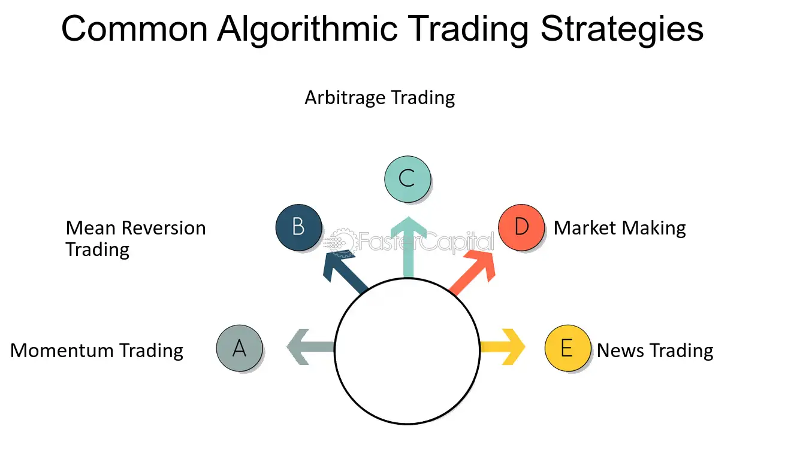

## Table of Contents

## What is algorithmic trading?

Algorithmic trading is a method of buying and selling assets using computer programs. These programs follow a set of rules, called an algorithm, to make trading decisions automatically. Instead of a person deciding when to buy or sell, the computer does it based on the rules it has been given. This can happen very quickly, often in fractions of a second, which can be faster than a human could ever trade.

People use algorithmic trading for many reasons. One big reason is that it can help remove emotions from trading. When humans trade, they can sometimes make bad decisions because they feel scared or excited. A computer doesn't feel these emotions, so it can stick to the plan. Another reason is that it can handle a lot of information at once. The computer can look at many different pieces of data and make decisions based on all of it, which can be hard for a person to do.

## How does algorithmic trading work?

Algorithmic trading works by using computer programs to make trading decisions based on a set of rules, or an algorithm. These rules can be based on many things, like the price of the asset, how much it's going up or down, or other market data. When the computer sees that the rules are met, it will automatically buy or sell the asset without a person needing to do anything. This can happen very quickly, often in milliseconds, which is much faster than a human could trade.

The computer program is given instructions on what to look for and what to do when it sees certain conditions. For example, it might be told to buy a stock if its price goes below a certain level, or to sell if it goes above another level. The program then watches the market all the time, looking for these conditions. When it finds them, it acts right away. This means that [algorithmic trading](/wiki/algorithmic-trading) can take advantage of small changes in the market that a person might miss.

## What are the basic components of an algorithmic trading system?

An algorithmic trading system has a few main parts that work together to make trades happen. The first part is the data feed, which gives the system all the information it needs about the market. This can include things like the current prices of stocks, how much they are going up or down, and other important numbers. The system uses this data to decide when to buy or sell.

The second part is the algorithm itself, which is a set of rules that tell the computer what to do. These rules can be simple, like buying a stock if its price goes below a certain level, or they can be very complex, using many different pieces of data to make decisions. The algorithm looks at the data from the feed and decides if it should make a trade. If it decides to trade, it sends the order to the market through a trading platform, which is the third part of the system. The trading platform is what actually makes the trade happen, connecting the algorithm to the market where the buying and selling takes place.

## What are the most common types of algorithms used in trading?

The most common types of algorithms used in trading are trend-following algorithms and mean reversion algorithms. Trend-following algorithms try to find and follow the direction of the market. They look for signs that a stock or other asset is going up or down and then buy or sell based on that direction. For example, if a stock has been going up for a while, a trend-following algorithm might decide to buy it, thinking it will keep going up. These algorithms are popular because they can catch big moves in the market, but they can also be risky if the trend suddenly changes.

Mean reversion algorithms work in a different way. They believe that prices will eventually go back to their average, or mean, level. So, if a stock's price goes too high, a mean reversion algorithm might decide to sell it, thinking it will come back down. And if the price goes too low, the algorithm might buy it, expecting it to go back up. These algorithms can be good at finding opportunities when prices are out of their normal range, but they can also be risky if the price keeps moving away from the average instead of coming back to it.

Another common type of algorithm is the [arbitrage](/wiki/arbitrage) algorithm. Arbitrage algorithms look for price differences between different markets or different forms of the same asset. For example, if a stock is cheaper on one exchange than another, the algorithm might buy it on the cheaper exchange and sell it on the more expensive one, making a profit from the difference. These algorithms can be very fast and take advantage of small price differences that might not last long.

## What are the advantages of using algorithmic trading?

One big advantage of using algorithmic trading is that it can be faster than human trading. Computers can make decisions and place trades in milliseconds, which is much quicker than a person could do it. This speed can help catch small changes in the market that might not last long enough for a human to act on. Also, algorithmic trading can handle a lot of information at once. It can look at many different pieces of data, like stock prices, news, and other market information, and use all of it to make better trading decisions.

Another advantage is that it can help take emotions out of trading. When people trade, they can sometimes make bad choices because they feel scared or excited. A computer doesn't have these feelings, so it can stick to the plan without getting distracted. This can lead to more consistent and disciplined trading. Plus, algorithmic trading can work all the time, even when markets are open in different parts of the world. This means it can keep an eye on the market 24/7, which a person couldn't do without getting tired.

## Can algorithmic trading improve market efficiency?

Algorithmic trading can help make markets more efficient. It does this by looking at a lot of information very quickly and making trades based on that information. When lots of computers are doing this at the same time, they can help prices move to where they should be faster. For example, if a stock is priced too high, algorithmic trading can help sell it until the price goes down to a more fair level. This can make the market work better because prices are more likely to be right.

Also, algorithmic trading can help make markets more liquid. Liquidity means how easy it is to buy or sell something without the price changing a lot. When lots of computers are trading all the time, it can be easier for people to buy and sell things quickly. This can make the market more efficient because people can trade without worrying as much about the price moving against them. So, algorithmic trading can help make the market smoother and more fair for everyone.

## What are the potential disadvantages or risks associated with algorithmic trading?

One big risk with algorithmic trading is that it can lead to big losses if the algorithms don't work right. Since the computer makes trades very quickly and without human input, if there's a mistake in the code or if the market changes in a way the algorithm didn't expect, it can keep making bad trades before anyone can stop it. This can happen very fast, and the losses can add up quickly. Also, because algorithmic trading can be very complex, it can be hard for people to understand what the computer is doing and why, which can make it harder to fix problems when they happen.

Another risk is that algorithmic trading can make the market more unstable. When lots of computers are making trades based on the same information, they can all start buying or selling at the same time. This can cause the market to move a lot, which can lead to big price swings that can be hard to predict. These big swings can make the market feel more risky and can make it harder for people to trade without losing money. Also, if lots of computers are using the same strategies, it can make the market less diverse, which can make it easier for things to go wrong if everyone is doing the same thing.

## How can one start with algorithmic trading as a beginner?

To start with algorithmic trading as a beginner, you first need to learn the basics. This means understanding how the stock market works and what algorithmic trading is all about. You can do this by reading [books](/wiki/algo-trading-books), taking online courses, or watching videos that explain these concepts in simple terms. Once you have a good grasp of the basics, you can start learning how to code. Python is a popular language for algorithmic trading because it's easy to learn and has lots of tools that can help you. You'll need to practice writing code and learn how to use it to make trading decisions based on data.

After you've learned the basics and can write some code, the next step is to test your algorithms. You can do this using a demo account with a trading platform that lets you practice without using real money. This way, you can see if your algorithms work without risking any money. As you get better, you can start to use real money, but it's important to start small and only use money you can afford to lose. Remember, algorithmic trading can be risky, so it's important to keep learning and improving your skills as you go.

## What programming languages and tools are essential for developing algorithmic trading strategies?

To develop algorithmic trading strategies, Python is one of the most essential programming languages. It's easy to learn and has lots of libraries and tools that can help you build trading algorithms. For example, libraries like Pandas help you work with data, NumPy helps with numbers, and Matplotlib helps you make charts. There are also special libraries like Backtrader and Zipline that let you test your trading strategies using past data. These tools make it easier to write code that can look at market data and make trading decisions.

Another important tool for algorithmic trading is a trading platform that lets you connect your code to the market. Platforms like MetaTrader, [Interactive Brokers](/wiki/interactive-brokers-api), and Alpaca have special APIs that let you send your trading orders from your code to the market. These platforms often have demo accounts where you can practice without using real money. Besides these, you might also need a good computer and a fast internet connection to make sure your trades happen quickly and without problems. Learning to use these tools takes time, but they are key to making your algorithmic trading strategies work well.

## How do regulatory bodies view algorithmic trading, and what are the compliance requirements?

Regulatory bodies around the world view algorithmic trading with a mix of interest and caution. They see that it can help make markets work better and be more fair, but they also worry about the risks it can bring. Things like big price swings and the chance of mistakes in the code can make the market less stable. So, regulators try to make rules that keep the good parts of algorithmic trading while also making sure it doesn't cause problems.

To make sure algorithmic trading is done safely, regulatory bodies have set up compliance requirements that traders need to follow. These rules can include things like making sure the code is tested well before it's used in the real market, having good systems to watch over the trading and stop it if something goes wrong, and keeping good records of all trades. Traders also need to be open about what they're doing, sometimes telling regulators about their algorithms and how they work. These rules help make sure that algorithmic trading is done in a way that's safe and fair for everyone in the market.

## What are some advanced strategies used in algorithmic trading?

One advanced strategy in algorithmic trading is called [statistical arbitrage](/wiki/statistical-arbitrage). This strategy looks for small differences in the prices of related stocks or other assets. The idea is to buy the cheaper one and sell the more expensive one, expecting that the prices will eventually come back together. This strategy uses a lot of math and data to find these small differences, which can be hard for a person to see. It needs fast computers and good data to work well, but it can be a good way to make money from small changes in the market.

Another advanced strategy is [machine learning](/wiki/machine-learning). This strategy uses computers to learn from past data and make better trading decisions. The computer looks at lots of old trades and market information to find patterns that can help it predict what will happen next. Once it learns these patterns, it can use them to decide when to buy or sell. This can be very powerful because the computer can keep learning and getting better over time. But it's also complex and needs a lot of data and computer power to work well.

## How does one evaluate the performance of an algorithmic trading strategy?

To evaluate the performance of an algorithmic trading strategy, you need to look at a few key things. One important thing is the profit and loss, or how much money the strategy makes or loses. You can measure this by looking at the total return, which is how much more money you have at the end than you started with. Another thing to look at is the risk, or how much the strategy could lose. You can measure risk by looking at the drawdown, which is the biggest drop in the value of your account, and the [volatility](/wiki/volatility-trading-strategies), which is how much the value goes up and down.

Another way to evaluate the strategy is by looking at how well it does compared to just holding the market. This is called the alpha, which is the extra return the strategy makes compared to the market. If your strategy has a positive alpha, it means it's doing better than just holding the market. You should also look at how often the strategy makes money, which is called the win rate, and how big the wins and losses are. A good strategy should have a high win rate and bigger wins than losses.

Lastly, it's important to test the strategy on past data, which is called [backtesting](/wiki/backtesting). This can help you see how the strategy would have done in different market conditions. But remember, past performance doesn't guarantee future results. You should also test the strategy in real time with a small amount of money, which is called forward testing or paper trading. This can help you see how the strategy works in the real market without risking a lot of money. By looking at all these things, you can get a good idea of how well your algorithmic trading strategy is working.

## References & Further Reading

[1]: Bergstra, J., Bardenet, R., Bengio, Y., & Kégl, B. (2011). ["Algorithms for Hyper-Parameter Optimization."](https://papers.nips.cc/paper/4443-algorithms-for-hyper-parameter-optimization) Advances in Neural Information Processing Systems 24.

[2]: ["Advances in Financial Machine Learning"](https://www.amazon.com/Advances-Financial-Machine-Learning-Marcos/dp/1119482089) by Marcos Lopez de Prado

[3]: ["Evidence-Based Technical Analysis: Applying the Scientific Method and Statistical Inference to Trading Signals"](https://www.amazon.com/Evidence-Based-Technical-Analysis-Scientific-Statistical/dp/0470008741) by David Aronson

[4]: ["Machine Learning for Algorithmic Trading"](https://github.com/stefan-jansen/machine-learning-for-trading) by Stefan Jansen

[5]: ["Quantitative Trading: How to Build Your Own Algorithmic Trading Business"](https://www.amazon.com/Quantitative-Trading-Build-Algorithmic-Business/dp/1119800064) by Ernest P. Chan