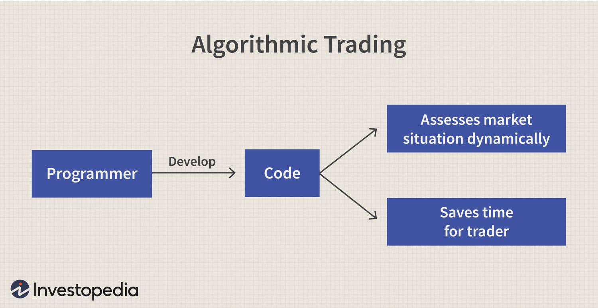

Algorithmic trading, commonly referred to as 'algo trading', employs sophisticated computer algorithms to automate transactions in financial markets. This practice has dramatically changed how trading is conducted, enabling traders to handle multiple transactions with remarkable speed and precision. By leveraging high-speed data analysis and trade execution, algo trading can execute thousands of trades per second, a feat unattainable by traditional trading methods.

The evolution of algorithmic trading can be attributed to advancements in computer processing power and data analytics, which have greatly enhanced the capability of traders to interpret and respond to market data quickly. Contrary to manual trading, where human judgment plays a significant role, algorithmic trading relies on pre-defined sets of rules that guide decisions. These rules are typically based on timing, price, quantity, or any mathematical model that the algorithm considers relevant.



The exploration of various trading strategies within algorithmic trading is essential to understanding its importance and distinguishing it from conventional trading practices. The strategies in algo trading are designed to minimize human intervention while exploiting market inefficiencies or capitalizing on price movements. This approach not only improves efficiency and effectiveness but also reduces human-related errors and emotional biases, leading to more consistent and objective trading outcomes.

Throughout this article, we will explore the fundamental aspects, benefits, different strategies, and potential limitations associated with automated trading. Whether you have considerable experience in trading or are simply interested in the technicalities of the financial market, the insights offered here are intended to broaden your understanding of this advanced trading methodology. By grasping the nuances of algorithmic trading, readers can better appreciate its transformative impact on modern finance.

## Table of Contents

## Understanding Algorithmic Trading

Algorithmic trading utilizes pre-programmed instructions executed by computers to carry out trading activities with precision. These instructions are typically based on market data analysis and are designed to capitalize on specific trading opportunities. This practice has its roots in the late 20th century, but it has experienced significant growth in recent decades, driven by advances in computing power and data analytics. Understanding the core components of algorithmic trading is crucial to grasp its widespread adoption and effectiveness in modern financial markets.

The primary components of algorithmic trading include market data analysis, trade execution, and risk management. Market data analysis involves the examination of historical and real-time market data to identify trading signals and opportunities. This process can incorporate a variety of data, such as price movements, trading volumes, and other relevant market indicators. Advanced algorithms are designed to interpret these signals and respond accordingly.

Trade execution is a critical aspect of [algorithmic trading](/wiki/algorithmic-trading), as it involves placing buy or sell orders in the market based on the identified signals. Execution algorithms ensure that trades are carried out efficiently, often through direct market access platforms that provide rapid order placement. These algorithms can target different market conditions, adapting order strategies to minimize market impact and maximize execution efficiency.

Risk management is an integral part of the algorithmic trading process. It involves setting parameters to control potential losses and protect investment capital. Risk management strategies can include stop-loss orders, position sizing, and diversification across multiple assets or strategies. By incorporating robust risk management practices, traders can mitigate the risks associated with automated trading systems.

Algorithms used in trading can range from simple to highly complex models. Simple algorithms might follow straightforward strategies, like buying or selling assets based on moving averages. More complex models, however, can include strategies such as [arbitrage](/wiki/arbitrage) or [trend following](/wiki/trend-following). Arbitrage involves exploiting price differences of the same or similar financial instruments across different markets, while trend-following strategies aim to capitalize on sustained movements in asset prices. The complexity of these algorithms can significantly enhance their ability to identify and exploit market inefficiencies.

An example of a basic algorithm in Python could look like this:

```python
# Simple moving average crossover strategy
def moving_average(values, window):
    return sum(values[-window:]) / window

def execute_trade(prices, short_window, long_window):
    short_ma = moving_average(prices, short_window)
    long_ma = moving_average(prices, long_window)

    if short_ma > long_ma:
        # Signal to buy
        print("Buy signal")
    elif short_ma < long_ma:
        # Signal to sell
        print("Sell signal")
    else:
        # Hold
        print("Hold position")

prices = [100, 102, 104, 103, 101, 105, 108]
short_window = 3
long_window = 5

execute_trade(prices, short_window, long_window)
```

This algorithm checks the moving averages of a set of prices over short and long windows to generate buy or sell signals. Despite its simplicity, such strategies are foundational in algorithmic trading and are often enhanced using complex statistical and quantitative models.

Algorithmic trading has gained considerable traction due to its ability to process large quantities of data, make decisions at speeds unattainable by humans, and execute trades with high precision. The continuous evolution of technology and availability of data are likely to further propel the development and adoption of algorithmic trading in financial markets.

## Advantages and Disadvantages of Algorithmic Trading

Algorithmic trading, frequently referred to as algo trading, provides several distinct advantages over traditional trading methods, making it a preferred option among investors and financial institutions. One of the primary benefits is the speed and accuracy it offers. By utilizing advanced algorithms, trades can be executed within microseconds, far surpassing the capabilities of human traders. This increased speed allows traders to capitalize on short-lived market opportunities, potentially leading to increased profitability.

Another notable advantage of algorithmic trading is its ability to eliminate emotional influences from the trading process. Human emotions, such as fear and greed, often lead to impulsive decisions. Algorithmic systems, governed by pre-set rules and data-driven logic, operate purely on analytical results, thus ensuring that trades are based on objective criteria devoid of emotional bias.

Scalability is another key strength of algorithmic trading. Unlike manual trading, which is limited by human capacity, algorithmic systems can manage large volumes of transactions simultaneously. This capability is especially useful for institutional investors who need to execute high volumes of trades to maintain [liquidity](/wiki/liquidity-risk-premium) and achieve strategic objectives. This scalability also extends to testing multiple strategies across various markets to determine those with the best potential for success.

Despite these significant advantages, algorithmic trading is not without its challenges and risks. The reliance on technology introduces vulnerabilities such as technical failures, which can disrupt trading activities. System outages, data feed issues, or software bugs can result in substantial financial losses or missed market opportunities.

Market manipulation concerns also arise from algorithmic trading practices. Techniques like spoofing, where large orders are placed with the intent to cancel before execution to create a false impression of demand or supply, can distort market pricing and stability. These unethical practices are increasingly coming under scrutiny, with regulatory bodies taking measures to curb such activities and ensure fair market practices.

To summarize, while algorithmic trading offers speed, precision, and the potential for high-frequency trading and scalability, it is also associated with risks related to technology and ethical trading practices. Addressing these challenges appropriately requires robust risk management frameworks and regulatory compliance to maintain integrity and trust in financial markets.

## Popular Algorithmic Trading Strategies

Algorithmic trading strategies aim to capitalize on inefficiencies and fluctuations in financial markets with minimal human intervention. Some of the most widely employed strategies include trend-following, arbitrage, high-frequency trading ([HFT](/wiki/high-frequency-trading-strategies)), and market-making. Each of these strategies leverages different market dynamics and requires sophisticated data analysis and technological infrastructures to maximize efficacy.

**Trend-Following Strategies**

Trend-following strategies are based on the premise that prices tend to move in trends, and once a trend is established, it is likely to continue. These strategies utilize technical indicators such as moving averages, [momentum](/wiki/momentum) indicators, or channel breakouts. A typical trend-following algorithm might look like this in Python:

```python
def moving_average_strategy(prices, short_window, long_window):
    short_mavg = prices.rolling(window=short_window, min_periods=1).mean()
    long_mavg = prices.rolling(window=long_window, min_periods=1).mean()
    signals = np.where(short_mavg > long_mavg, 1, 0)
    return signals
```

This example demonstrates how traders utilize moving averages to signal buy (when the short-term average crosses above the long-term average) or sell conditions (when it crosses below).

**Arbitrage Strategies**

Arbitrage involves taking advantage of price discrepancies between related markets or instruments. One common form of arbitrage is [statistical arbitrage](/wiki/statistical-arbitrage), which relies on quantitative models to identify and exploit temporary mispricings. For instance, traders might employ pairs trading, where they take long and short positions on two correlated stocks that have diverged from their historical price ratio, anticipating convergence.

**High-Frequency Trading (HFT)**

High-frequency trading involves executing a large number of orders at extremely fast speeds, often within milliseconds. HFT strategies might focus on exploiting minute price differentials, latency advantages from proximities to exchanges, or reacting instantaneously to news. These strategies require substantial investments in technology and co-location services to gain a speed advantage over competitors.

**Market-Making Strategies**

Market makers provide liquidity to financial markets by continuously quoting bid and ask prices. Profit is generated from the spread between buying and selling prices. Market-making algorithms dynamically adjust quotes based on market conditions, inventories, and available liquidity, ensuring minimal market impact and maximizing profit margins.

**Role of Data in Optimizing Strategies**

Data remain crucial in optimizing algorithmic trading strategies. Reliable and high-frequency data feeds help strategies to react promptly and accurately to market changes. The quality of data influences [backtesting](/wiki/backtesting)—the process of testing a strategy under historical data to evaluate its potential performance. Incorporation of [alternative data](/wiki/best-alternative-data) sources, like sentiment analysis from social media or satellite imagery for commodity predictions, is increasingly popular to enhance prediction models and decision-making processes.

In summary, the implementation of effective algorithmic trading strategies capitalizes on technological and data-driven advantages to optimize trading outcomes through informed, swift, and systematic decision-making in the financial markets.

## The Role of Technology and Data in Automated Trading

Algorithmic trading is heavily reliant on the advancements in technology and the accessibility of high-quality data. The seamless operation of automated trading systems hinges on effective technological infrastructure capable of handling multiple processes concurrently, ranging from backtesting strategies to real-time trade execution. This technological prowess allows traders to conduct thorough analyses and execute orders with unprecedented speed and accuracy.

Backtesting, a critical component of strategy development in algorithmic trading, involves simulating a trading strategy using historical data to evaluate its effectiveness. With robust software and computational power, traders can optimize strategies before deploying them in live markets. Python, a preferred language for algorithmic trading, offers libraries like 'Backtrader' for backtesting trading strategies easily. Here's a simple example of a backtesting script in Python:

```python
import backtrader as bt

class TestStrategy(bt.Strategy):
    def __init__(self):
        self.sma = bt.indicators.SimpleMovingAverage(self.data, period=15)

    def next(self):
        if self.sma[0] < self.data.close[0]:
            self.buy()
        elif self.sma[0] > self.data.close[0]:
            self.sell()

cerebro = bt.Cerebro()
cerebro.addstrategy(TestStrategy)
data = bt.feeds.YahooFinanceData(dataname='AAPL', fromdate=datetime(2020, 1, 1), todate=datetime(2021, 1, 1))
cerebro.adddata(data)
cerebro.run()
cerebro.plot()
```

Real-time trade execution powered by advanced technology ensures that traders can capitalize on market opportunities within milliseconds. This capability is essential in markets where prices fluctuate rapidly and opportunities can disappear as quickly as they arise.

Data, whether derived from traditional financial datasets or alternative sources like social media sentiment analysis, forms the cornerstone of decision-making in algorithmic trading. The quality, accuracy, and timeliness of data significantly impact the performance of trading algorithms. High-quality data feeds provide the precision needed for algorithms to make informed trading decisions, thus bolstering the effectiveness of trading strategies.

Moreover, the availability of open-source platforms and APIs has democratized access to financial markets, enabling individual traders and smaller firms to utilize algorithmic trading. Tools like Alpaca and QuantConnect provide APIs that facilitate the development and execution of trading algorithms. These platforms offer traders the resources to access market data, execute trades, and develop trading strategies within a unified environment, bridging the gap between technological sophistication and accessibility.

In conclusion, the intersection of technology and high-quality data is pivotal to the success of algorithmic trading. The continuous evolution of computational power and data analysis tools not only enhances the efficiency of trading processes but also expands the possibilities for developing innovative trading strategies. Consequently, staying abreast of technological advancements and ensuring the integrity of data sources remain central to thriving in the dynamic landscape of algorithmic trading.

## Challenges and Ethical Considerations

Algorithmic trading, while offering significant technological and operational advancements in financial markets, also introduces a host of challenges and ethical considerations. One prominent challenge is the risk of overfitting, where a trading algorithm performs exceptionally well on historical data but fails in live markets. This occurs when a model captures noise instead of underlying patterns, leading to poor future predictions. Overfitting can be mitigated by adopting robust testing methodologies, like cross-validation, and utilizing diverse datasets for training.

Another critical challenge is market risk, influenced by the rapid execution of trades. Algorithmic trading systems can exacerbate market [volatility](/wiki/volatility-trading-strategies) during periods of stress or unexpected economic news. This is particularly evident in high-frequency trading (HFT), a subset of algorithmic trading known for executing trades in fractions of a second. While HFT can enhance market liquidity, it also raises concerns about its impact on market stability. The flash crash of May 6, 2010, is a prime example, where the Dow Jones Industrial Average plummeted nearly 1,000 points within minutes, partially attributed to algorithmic trading.

Ethical concerns are equally significant, especially regarding practices like spoofing and layering, which involve placing deceptive orders to mislead other traders about market demand. These tactics are designed to manipulate market prices for short-term gains, undermining market integrity. To combat such practices, regulatory bodies, including the Securities and Exchange Commission (SEC) in the United States and the Financial Conduct Authority (FCA) in the United Kingdom, have intensified their scrutiny. These organizations are implementing stringent regulations and employing advanced surveillance systems to detect and deter unethical trading activities.

Ensuring transparency in algorithmic trading practices is vital for maintaining fair trading environments. One approach involves the adoption of comprehensive audit trails that document every action taken by an algorithm. Additionally, the implementation of circuit breakers, which temporarily halt trading during extreme market movements, can help safeguard against systemic risks and maintain market order.

Strategies for addressing these challenges include continuous evaluation and modification of trading algorithms to adapt to changing market conditions and regulatory landscapes. Developers can incorporate ethical guidelines into the design and operation of trading algorithms, ensuring compliance with legal standards and promoting responsible behavior. The integration of [artificial intelligence](/wiki/ai-artificial-intelligence) and [machine learning](/wiki/machine-learning) can further enhance the robustness of trading systems, making them more adaptable and less prone to unethical practices.

In summary, while algorithmic trading offers substantial benefits, it is imperative for traders and firms to remain vigilant about the challenges and ethical considerations. By prioritizing transparency, regulation, and ethical standards, the financial industry can harness the potential of algorithmic trading while safeguarding market integrity.

## Conclusion

Algorithmic trading represents a significant evolution in the way financial markets function, offering an unprecedented blend of speed and efficiency. This approach allows for the rapid execution of trades, often in milliseconds, which is a substantial improvement over traditional manual methods. The automation and algorithm-driven decision-making eliminate emotional biases, thus enabling more disciplined trading strategies.

Despite these advantages, traders engaged in algorithmic trading must remain vigilant to the associated risks and ethical considerations. The reliance on technology introduces the potential for technical failures, while the complexity of algorithms can result in unforeseen market impacts. Moreover, the prevalence of high-frequency trading raises concerns about market stability and fairness, prompting increased scrutiny from regulatory bodies.

Continual improvement of algorithms is essential for sustainable success in algorithmic trading. This involves refining codes to enhance decision-making processes and regularly updating systems to adapt to changing market conditions. Equally important is adherence to compliance standards and regulations, which helps protect the integrity of financial markets and builds trust among market participants.

As technology advances, integrating machine learning and artificial intelligence into trading algorithms can further enhance their predictive capabilities, making algorithmic trading an even more integral component of financial markets. This progress, however, must be accompanied by rigorous testing and risk management to safeguard against systemic risks.

This article aimed to provide a comprehensive overview of algorithmic trading, offering insights into its revolutionary impact on financial markets. By understanding both its potential and its challenges, traders and enthusiasts can navigate this transformative trading practice with informed confidence.

## References & Further Reading

[1]: Bergstra, J., Bardenet, R., Bengio, Y., & Kégl, B. (2011). ["Algorithms for Hyper-Parameter Optimization."](https://papers.nips.cc/paper/4443-algorithms-for-hyper-parameter-optimization) Advances in Neural Information Processing Systems 24.

[2]: ["Advances in Financial Machine Learning"](https://www.amazon.com/Advances-Financial-Machine-Learning-Marcos/dp/1119482089) by Marcos Lopez de Prado

[3]: ["Evidence-Based Technical Analysis: Applying the Scientific Method and Statistical Inference to Trading Signals"](https://www.amazon.com/Evidence-Based-Technical-Analysis-Scientific-Statistical/dp/0470008741) by David Aronson

[4]: ["Machine Learning for Algorithmic Trading"](https://github.com/stefan-jansen/machine-learning-for-trading) by Stefan Jansen

[5]: ["Quantitative Trading: How to Build Your Own Algorithmic Trading Business"](https://www.amazon.com/Quantitative-Trading-Build-Algorithmic-Business/dp/1119800064) by Ernest P. Chan