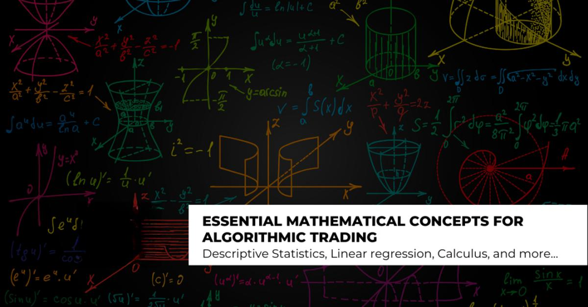

## Table of Contents

## What is algorithmic trading and why is mathematics important in it?

Algorithmic trading is when computers use math formulas to buy and sell things like stocks automatically. Instead of people making the decisions, the computer follows a set of rules to decide when to trade. This can happen very quickly, much faster than a person could do it. The computer looks at lots of information, like prices and news, and then decides what to do based on the math rules it has been given.

Math is really important in algorithmic trading because it helps make the rules that the computer follows. These rules are called algorithms, and they are made up of math equations. Math helps the computer figure out patterns in the market, predict what might happen next, and decide the best time to buy or sell. Without math, the computer wouldn't know what to do, and the trading wouldn't be as fast or as accurate. So, math is like the language that the computer uses to trade smartly.

## How are basic mathematical concepts like arithmetic and algebra used in algorithmic trading?

In algorithmic trading, arithmetic is used every day to do simple calculations. When a computer wants to buy or sell something, it needs to figure out how much money to use or how many shares to trade. For example, if the computer decides to buy a stock, it will use arithmetic to calculate the total cost by multiplying the number of shares by the price per share. It also uses arithmetic to keep track of profits and losses, adding up all the money made or lost from trades.

Algebra is also important in [algorithmic trading](/wiki/algorithmic-trading) because it helps create the rules, or algorithms, that the computer follows. These rules often involve equations that the computer solves to make decisions. For example, an algorithm might use an equation to predict future stock prices based on past prices and other factors. The computer then uses algebra to solve this equation and decide whether to buy or sell. Algebra helps the computer understand relationships between different pieces of information, like how changes in one stock price might affect another.

## What role does probability play in developing trading algorithms?

Probability is really important when making trading algorithms because it helps predict what might happen in the future. In trading, things are never certain, so we use probability to guess how likely it is that a stock price will go up or down. For example, a trading algorithm might look at past data to see how often a stock goes up after a certain event, like a company announcing good news. By using probability, the algorithm can decide if it's worth buying that stock based on how likely it is to make money.

Probability also helps manage risk in trading algorithms. Traders don't want to lose too much money, so they use probability to figure out how much risk they're taking with each trade. For instance, an algorithm might calculate the chance of losing money on a trade and then decide to only use a small amount of money for that trade. This way, even if the trade doesn't work out, the loss won't be too big. So, probability helps trading algorithms make smarter and safer decisions.

## How can statistics help in analyzing market trends and making trading decisions?

Statistics is a big help in understanding market trends and making smart trading choices. By looking at lots of numbers from the past, like stock prices and how much people are buying or selling, traders can see patterns. For example, they might notice that a stock usually goes up in the summer but down in the winter. Statistics lets them figure out if these patterns are just by chance or if they really mean something. This helps traders guess what might happen next in the market.

Using [statistics](/wiki/bayesian-statistics) also helps traders decide when to buy or sell. They can use things like averages and standard deviations to see if a stock is priced too high or too low compared to what's normal. If a stock's price is way higher than its average, a trader might think it's time to sell before the price drops. On the other hand, if the price is much lower than usual, it might be a good time to buy. By using statistics, traders can make decisions based on solid numbers instead of just guessing.

## What are the applications of calculus in optimizing trading strategies?

Calculus is used in trading to make strategies better. It helps traders figure out how fast things are changing, like how quickly stock prices are going up or down. This is important because knowing the speed of change can help traders decide when to buy or sell. For example, if a stock's price is going up really fast, a trader might want to buy it soon before it gets too expensive. Calculus helps traders use math to find the best time to make a trade.

Another way calculus helps is by finding the best way to use money. Traders want to make as much money as they can without taking too much risk. Calculus can help them figure out the best amount of money to put into different trades. It does this by solving equations that show how much money they might make or lose. This way, traders can spread their money around in a smart way to get the best results.

## How do linear algebra techniques assist in portfolio management and risk assessment?

Linear algebra helps in managing a portfolio by letting traders see how different investments work together. Imagine you have a bunch of stocks in your portfolio. Linear algebra can help you understand how each stock's price moving up or down affects the whole group. It does this by using something called a covariance matrix, which shows how much stocks move together. By looking at this matrix, traders can figure out the best mix of stocks to have in their portfolio. This helps them spread out their risk and make more money.

Linear algebra is also important for figuring out risk. Traders want to know how likely it is that they'll lose money. Linear algebra helps them do this by using a tool called principal component analysis (PCA). PCA looks at all the different factors that can affect a portfolio, like interest rates or economic news, and figures out which ones matter the most. By understanding these key factors, traders can see where their biggest risks are and take steps to protect their money. So, linear algebra helps traders make smarter choices about their investments.

## What advanced mathematical models are used to predict stock prices in algorithmic trading?

In algorithmic trading, one of the advanced mathematical models used to predict stock prices is the autoregressive integrated moving average (ARIMA) model. This model looks at past stock prices to guess what might happen next. It does this by figuring out patterns in the data, like how much prices tend to go up or down over time. ARIMA is good at handling data that changes a lot, which is common in the stock market. Traders use ARIMA to make short-term predictions, helping them decide when to buy or sell stocks.

Another model that traders use is the GARCH (Generalized Autoregressive Conditional Heteroskedasticity) model. This model is all about understanding how much stock prices might move around. It helps traders predict not just the direction of stock prices, but also how much they might go up or down. This is important because knowing how much prices might change helps traders manage their risk. By using GARCH, traders can make better guesses about the future and plan their trades more carefully.

## How does machine learning integrate with mathematical models to enhance trading algorithms?

Machine learning helps make trading algorithms better by working with mathematical models. It does this by looking at a lot of data and finding patterns that might be hard for people to see. For example, machine learning can use past stock prices and other information, like news or economic reports, to make better guesses about what might happen next. It can learn from its mistakes and get better over time. This means that the trading algorithms can keep improving and make smarter decisions about when to buy or sell stocks.

One way machine learning and math work together is by using something called neural networks. These are like special math formulas that can learn from data. They can find complicated patterns in stock prices and other information, and then use those patterns to predict what might happen next. By combining neural networks with traditional math models like ARIMA or GARCH, traders can make even better predictions. This helps them make more money and take less risk, because they have a better idea of what the market might do.

## What is the significance of time series analysis in algorithmic trading?

Time series analysis is really important in algorithmic trading because it helps traders understand how stock prices change over time. It looks at past prices and other data to find patterns. For example, it can show if a stock usually goes up on certain days or if it follows a certain trend. By understanding these patterns, traders can make better guesses about what the stock might do next. This helps them decide when to buy or sell to make more money.

Time series analysis also helps traders manage risk. It can show how much stock prices might move around, which is called [volatility](/wiki/volatility-trading-strategies). If a stock's price jumps a lot, it's riskier to trade. By using time series analysis, traders can figure out how much risk they're taking and adjust their strategies to be safer. This way, they can protect their money while still trying to make profits. So, time series analysis is a key tool for making smart trading decisions.

## How are stochastic processes applied in modeling financial markets?

Stochastic processes are used in financial markets to model how things like stock prices change over time. These processes help traders understand that stock prices don't move in a straight line; they can go up and down in unpredictable ways. A common example is the random walk model, which says that the next price of a stock is based on the last price plus some random change. This helps traders see that the future is uncertain and that they need to be ready for different possibilities.

Another way stochastic processes are used is in option pricing models, like the Black-Scholes model. This model uses a type of stochastic process called geometric Brownian motion to predict how stock prices might change. It helps traders figure out how much an option should cost, based on how likely it is that the stock price will go up or down. By using these models, traders can make better guesses about the future and plan their trades more carefully, even though the market is always changing.

## What challenges arise when applying complex mathematical theories to real-time trading scenarios?

Using complex math in real-time trading can be tricky because things in the market change so fast. Math models need a lot of data to work well, but in real-time trading, you don't always have enough time to gather all the data you need. Also, the market can be affected by sudden news or events that the math models might not be able to predict. This means that even the best math models can sometimes get it wrong, and traders have to be ready to change their plans quickly.

Another challenge is that math models can be hard to understand and use. Not everyone who trades knows a lot about advanced math, so it can be tough to explain why a model is suggesting a certain trade. Plus, setting up and running these models can take a lot of computer power and time, which can slow things down when you need to make quick decisions. So, while math can help a lot, it also brings some big challenges when you're trying to use it in the fast-paced world of trading.

## How can one validate and backtest mathematical models used in algorithmic trading?

To validate and backtest mathematical models used in algorithmic trading, you need to check if the model works well with past data. This means you take the model and see how it would have done if you used it to trade in the past. You look at old stock prices and other information, and then you run the model to see what trades it would have suggested. If the model made good choices and would have made money, that's a good sign. But if it made bad choices and would have lost money, you know you need to fix the model or try a different one.

Backtesting also helps you see if the model is too simple or too complicated. Sometimes a model might work well with past data but not be good for real trading because it's too simple and can't handle new situations. Other times, a model might be too complicated and just fit the past data by chance, without really understanding what's going on in the market. By [backtesting](/wiki/backtesting), you can find these problems and make the model better. It's like practicing with old games to get ready for the real game, making sure your strategy is strong before you use it for real.

## How has the evolution of mathematics influenced trading?

The integration of mathematical models into trading has profoundly transformed financial markets, enabling more sophisticated analysis and data utilization. Historically, the use of mathematics in trading was limited to basic arithmetic and statistics. However, as computational capabilities advanced, so did the complexity and efficacy of mathematical applications in trading.

One of the pivotal figures in this evolution is Edward Thorp, a mathematician widely recognized for pioneering quantitative finance. Thorp's work in the 1960s and 1970s laid the groundwork for modern algorithmic trading. He is best known for applying mathematical techniques to gambling and stock markets, demonstrating how probability and statistical methods could be used to gain an edge. Thorp's groundbreaking book, "Beat the Dealer," introduced card counting strategies to blackjack using probability theory, showcasing the power of mathematical strategies in predicting outcomes.

Transitioning from gambling to finance, Thorp applied his expertise to the stock market. He developed various quantitative strategies based on statistical analysis and probability theory, notably through the use of Black-Scholes options pricing and the Kelly Criterion for portfolio management. The Black-Scholes model, although refined by others, provides a formula for calculating the theoretical value of options, helping traders make informed decisions:

$$
C = S_0 \cdot N(d_1) - X \cdot e^{-rT} \cdot N(d_2)
$$

Where:
- $C$ is the call option price
- $S_0$ is the current stock price
- $X$ is the strike price
- $T$ is the time to expiration
- $r$ is the risk-free interest rate
- $N(d_1)$ and $N(d_2)$ are cumulative distribution functions of the standard normal distribution

Thorp's application of mathematical rigor showcased how academic principles could effectively translate into successful trading strategies, influencing the development of hedge funds and the broader market.

Over the years, advancements in mathematical finance have significantly impacted trading practices. Techniques such as stochastic calculus, numerical optimization, and [machine learning](/wiki/machine-learning) have become integral parts of algorithmic trading systems, capable of analyzing vast amounts of financial data to forecast market trends and develop robust trading strategies. Such mathematical models have allowed traders to implement high-frequency trading ([HFT](/wiki/high-frequency-trading-strategies)) strategies, where trades are executed in fractions of a second, capitalizing on minute price discrepancies.

The evolution of mathematics in trading not only highlights the confluence of theoretical mathematics and practical financial strategies but also underscores the ongoing advancements shaping the future of financial markets. As technology continues to progress, the integration of mathematics in trading will likely expand, exploring new domains and driving innovation in financial analytics.

## References & Further Reading

[1]: Thorp, E. O. (1967). [Beat the Dealer: A Winning Strategy for the Game of Twenty-One.](https://www.amazon.com/Beat-Dealer-Winning-Strategy-Twenty-One/dp/0394703103) Vintage Books.

[2]: Hull, J. C. (2018). [Options, Futures, and Other Derivatives.](https://www.pearson.com/nl/en_NL/higher-education/subject-catalogue/finance/Options-Futures-and-Other-Derivatives-Hull.html) Pearson Education.

[3]: Black, F., & Scholes, M. (1973). ["The Pricing of Options and Corporate Liabilities."](https://www.cs.princeton.edu/courses/archive/fall09/cos323/papers/black_scholes73.pdf) Journal of Political Economy, 81(3), 637-654.

[4]: Markowitz, H. (1952). ["Portfolio Selection."](https://onlinelibrary.wiley.com/doi/abs/10.1111/j.1540-6261.1952.tb01525.x) The Journal of Finance, 7(1), 77-91.

[5]: Lopez de Prado, M. (2018). [Advances in Financial Machine Learning.](https://www.amazon.com/Advances-Financial-Machine-Learning-Marcos/dp/1119482089) Wiley.