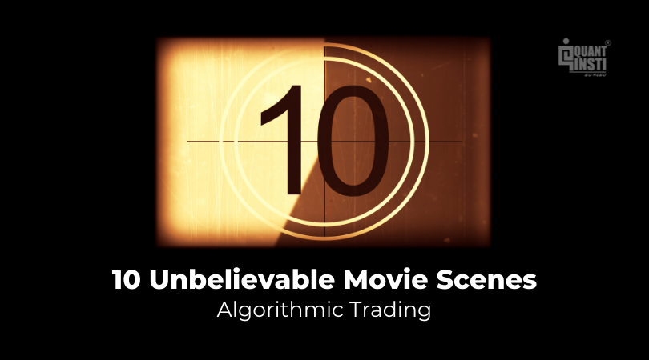

## Table of Contents

## What is algorithmic trading?

Algorithmic trading is when computers use math formulas to buy and sell things like stocks or cryptocurrencies automatically. Instead of people making decisions, the computer follows a set of rules to make trades. This can happen very quickly, often in fractions of a second, which is much faster than a human could do it.

People use algorithmic trading because it can be more accurate and less emotional than human trading. Computers don't get scared or excited, so they stick to the plan. This can lead to making more money or losing less money. However, it can also be risky because the market can change in ways the algorithm didn't expect.

## How does algorithmic trading relate to movies?

Algorithmic trading might not seem related to movies at first, but it can actually show up in films in cool ways. Some movies use the idea of fast, automatic trading to make exciting scenes. For example, in the movie "The Big Short," they talk about how computers trade stocks really fast. This helps the audience understand how big money moves can happen without people directly making decisions.

Another way [algorithmic trading](/wiki/algorithmic-trading) connects to movies is through stories about people who use these systems. A film like "Wall Street: Money Never Sleeps" might show characters using algorithms to make big profits or to cause problems in the market. These stories can make the world of finance more interesting and dramatic, showing how technology changes the game.

In some cases, movies might not focus on the trading itself but on the people behind the screens. "The Hummingbird Project" is about two guys trying to build a fast internet line to gain an edge in algorithmic trading. This kind of movie explores the human side of tech and finance, showing the lengths people will go to win in the fast-paced world of trading.

## What are some popular movies that feature algorithmic trading?

One popular movie that features algorithmic trading is "The Big Short." In this film, they show how computers can trade stocks really fast. This helps explain to viewers how big financial moves can happen without people directly making the decisions. The movie uses this idea to show how the 2008 financial crisis happened, making the complex world of finance easier to understand.

Another movie is "Wall Street: Money Never Sleeps." It's about a young trader who uses algorithms to try and make big profits. The film shows how technology can change the way people trade, making it faster and more automatic. It also explores the drama and risks that come with using these systems, adding excitement to the story.

"The Hummingbird Project" is another film that focuses on algorithmic trading. It's about two guys who want to build a super fast internet line to get an edge in trading. The movie shows the challenges and adventures they face, making the technical world of finance into a thrilling story. It highlights how people behind the technology can be just as interesting as the tech itself.

## Can you explain the plot of 'The Big Short' and its connection to algorithmic trading?

"The Big Short" is a movie about the 2008 financial crisis. It follows a few people who saw that the housing market was going to crash and decided to bet against it. They used something called "short selling" to make money when the market fell. The movie shows how these people, like Michael Burry and Mark Baum, figured out that the banks were giving out too many bad loans. They used this information to make big bets against the market, which was risky but could pay off big if they were right.

In the movie, algorithmic trading plays a part in showing how fast and automatic trading can be. There's a scene where they explain how computers can trade stocks in milliseconds, much faster than humans. This helps the audience see how big money moves can happen without people directly making decisions. The film uses this idea to make the complex world of finance easier to understand, showing how technology can change the game and affect the economy in big ways.

## How is 'Margin Call' relevant to algorithmic trading?

"Margin Call" is a movie about a big bank during the start of the 2008 financial crisis. The story shows how the bank's workers find out they have too many risky investments that are losing value fast. They have to decide whether to sell these investments quickly to lose less money or keep them and risk losing everything. In the movie, they use computers and math to figure out how bad things are and what to do next.

The movie doesn't show algorithmic trading directly, but it does show how computers and math are important in finance. The characters use computer models to understand their situation and make decisions. This is similar to algorithmic trading, where computers use math to make trades automatically. So, while "Margin Call" isn't about algorithmic trading, it shows how technology and math play a big role in the world of finance.

## What role does algorithmic trading play in 'Wall Street: Money Never Sleeps'?

In "Wall Street: Money Never Sleeps," algorithmic trading is a key part of the story. The main character, Jacob Moore, works at a big bank and uses computer programs to trade stocks quickly. These programs help him make money by buying and selling stocks faster than people can. The movie shows how these fast trades can make a lot of money but can also be risky. Jacob uses these algorithms to try and beat other traders and make big profits.

The film also shows how algorithmic trading can affect the whole market. At one point, Jacob's boss talks about how these computer programs can cause big swings in stock prices. This shows that while algorithmic trading can help make money, it can also make the market more unstable. The movie uses this idea to add excitement and tension, showing how technology can change the world of finance in big ways.

## Are there any documentaries about algorithmic trading?

One good documentary about algorithmic trading is "The Wall Street Code." This movie talks about how computers trade stocks really fast. It shows how these computers can make big money but also cause problems in the market. The documentary follows different people who work with these systems and explains how they work. It's interesting because it makes the complex world of finance easy to understand.

Another documentary is "Floored." It's about the Chicago trading floor and how computers started to take over from human traders. The movie shows how this change happened and what it meant for the people who used to trade by hand. "Floored" gives a personal look at how technology changed the trading world, making it faster and more automatic.

## How accurate are the portrayals of algorithmic trading in these movies?

The movies and documentaries you mentioned do a good job showing how algorithmic trading works, but they also make it more exciting for the story. In "The Big Short," they use simple examples to explain how computers can trade stocks really fast. This helps people understand the basics, but the movie also adds drama to make it more interesting. The same goes for "Wall Street: Money Never Sleeps," where they show how fast trading can make a lot of money but also be risky. These movies mix real facts with exciting stories to keep viewers interested.

The documentaries, like "The Wall Street Code" and "Floored," try to be more accurate. They show real people who work with these systems and explain how they work in detail. "The Wall Street Code" talks about how these computers can affect the whole market, which is true, but it also picks stories that are interesting to watch. "Floored" gives a personal look at how trading changed from people to computers, which is accurate, but it focuses on the human stories to make it more engaging. So, while these movies and documentaries give a good idea of algorithmic trading, they also add some drama to make them more fun to watch.

## What are the criticisms of algorithmic trading shown in these films?

In these movies and documentaries, one big criticism of algorithmic trading is that it can make the market unstable. They show how computers can trade stocks so fast that it can cause big swings in prices. This can be scary because it means the market can change a lot in a short time, and people might lose money. "Wall Street: Money Never Sleeps" talks about how these fast trades can make things risky, and "The Wall Street Code" shows how these computers can affect the whole market in big ways.

Another criticism is that algorithmic trading can take jobs away from people. In "Floored," they show how computers started to take over from human traders on the Chicago trading floor. This made it hard for people who used to trade by hand to keep their jobs. The movie gives a personal look at how this change affected real people, showing that while computers can make trading faster, they can also make it harder for people to find work in the trading world.

## Can you discuss any lesser-known films that focus on algorithmic trading?

One lesser-known film that focuses on algorithmic trading is "The Hummingbird Project." This movie is about two guys, Vincent and Anton, who want to build a super fast internet line to get an edge in trading. They go through a lot of challenges, like digging a tunnel through mountains, to make their plan work. The film shows how people can do crazy things to win in the world of fast trading, and it also talks about how these systems can change the market in big ways.

Another lesser-known movie is "Equity." This film follows a woman named Naomi Bishop who works in the world of finance. She uses computer programs to help her company go public. The movie shows how these programs can help make money but also make things more complicated and risky. It's interesting because it gives a look at how women in finance use technology to try and succeed in a tough world.

## How have these movies influenced public perception of algorithmic trading?

Movies like "The Big Short," "Wall Street: Money Never Sleeps," and "The Hummingbird Project" have helped people understand what algorithmic trading is. They show how computers can trade stocks really fast and make big money. These movies use simple examples to explain hard ideas, so more people can get what's going on. They also make the world of finance exciting and dramatic, which can make people more interested in how trading works.

At the same time, these movies have shown that algorithmic trading can be risky. They talk about how these fast trades can make the market go up and down a lot, which can be scary for people who might lose money. Some movies, like "Floored," also show how computers can take jobs away from people who used to trade by hand. So, while these films help people learn about algorithmic trading, they also make them think about the good and bad sides of using computers in finance.

## What future trends in algorithmic trading might we see reflected in upcoming films?

In the future, movies might show how computers get even smarter at trading. They could talk about things like [artificial intelligence](/wiki/ai-artificial-intelligence), where computers learn on their own and make even better trades. These films might show how AI can make trading faster and more accurate, but also how it can be scary if the computers start making decisions that people don't understand. It could be exciting to see characters trying to control these smart systems or dealing with the surprises they bring.

Another trend we might see in movies is how more people start using algorithmic trading, not just big banks. Films could show regular folks using apps on their phones to trade stocks automatically. This could make for interesting stories about how everyday people deal with the risks and rewards of fast trading. Movies might explore how this changes the way people think about money and investing, making it more accessible but also more dangerous if things go wrong.

## References & Further Reading

[1]: Bergstra, J., Bardenet, R., Bengio, Y., & Kégl, B. (2011). ["Algorithms for Hyper-Parameter Optimization."](https://papers.nips.cc/paper/4443-algorithms-for-hyper-parameter-optimization) Advances in Neural Information Processing Systems 24.

[2]: ["Advances in Financial Machine Learning"](https://www.amazon.com/Advances-Financial-Machine-Learning-Marcos/dp/1119482089) by Marcos Lopez de Prado

[3]: ["Evidence-Based Technical Analysis: Applying the Scientific Method and Statistical Inference to Trading Signals"](https://www.amazon.com/Evidence-Based-Technical-Analysis-Scientific-Statistical/dp/0470008741) by David Aronson

[4]: ["Machine Learning for Algorithmic Trading"](https://github.com/stefan-jansen/machine-learning-for-trading) by Stefan Jansen

[5]: ["Quantitative Trading: How to Build Your Own Algorithmic Trading Business"](https://books.google.com/books/about/Quantitative_Trading.html?id=j70yEAAAQBAJ) by Ernest P. Chan