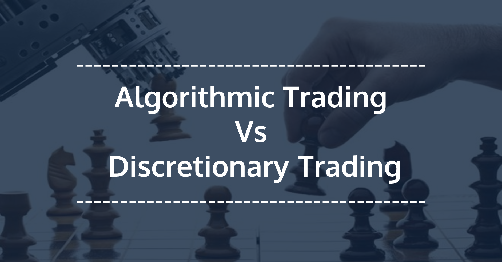

## Table of Contents

## What is algorithmic trading?

Algorithmic trading is a method of buying and selling things like stocks or currencies using computer programs. These programs follow a set of rules, called an algorithm, to decide when to buy or sell. This can happen very quickly, often faster than a human could do it. People use algorithmic trading because it can help them make decisions based on a lot of information and do it without getting tired or making mistakes that humans might make.

The algorithms used in trading can be simple or very complex. A simple one might just look at the price of a stock and decide to buy if it goes below a certain level. A more complex algorithm might look at many different things, like news stories, how other stocks are doing, or even the weather, to decide what to do. These algorithms can be set up to trade automatically, without a person needing to watch them all the time. This can save time and sometimes make more money than trading by hand.

## What is discretionary trading?

Discretionary trading is when a person makes decisions about buying and selling things like stocks or currencies based on their own judgment. Instead of using a computer program, the trader looks at charts, news, and other information to decide what to do. They use their experience and intuition to make trades, trying to predict what will happen next in the market.

This kind of trading can be more flexible because the trader can quickly change their mind based on new information. It's different from [algorithmic trading](/wiki/algorithmic-trading), where a computer follows a set of rules without thinking. Discretionary trading can be rewarding, but it also requires a lot of skill and can be stressful because the trader has to make many decisions quickly and be ready to take responsibility for any losses.

## How do algorithmic and discretionary trading differ in terms of decision-making?

Algorithmic trading uses computers to make decisions about buying and selling. These computers follow a set of rules, called an algorithm, to decide when to trade. The rules can be simple or very complicated, but the computer always does what the rules say. This means that the decisions are made quickly and without emotions. The computer doesn't get tired or make mistakes that a human might make, so it can trade all the time without stopping.

Discretionary trading is different because a person makes the decisions. The trader looks at information like news, charts, and their own experience to decide what to do. They use their judgment and intuition to buy or sell, trying to guess what will happen next in the market. This means the trader can change their mind quickly if something new happens. But it can be hard work and stressful because the trader has to make a lot of decisions and can feel bad if they lose money.

## What are the basic tools needed for algorithmic trading?

To do algorithmic trading, you need a computer that is fast and can handle a lot of information at the same time. You also need to write a program, called an algorithm, that tells the computer what to do. This program can be written in different computer languages, like Python or C++. You'll need special software to help you write this program, like an Integrated Development Environment (IDE), which makes it easier to write and check your code.

You also need to connect to a place where you can buy and sell things, like a stock market. This is called a broker, and they have special programs called APIs that let your computer talk to the market. You need to set up this connection so your algorithm can send orders to buy or sell. Lastly, you need data about the things you want to trade, like the prices of stocks or currencies. This data can come from the broker or from other places that sell information about the market.

## What skills are essential for effective discretionary trading?

For effective discretionary trading, you need to be good at understanding and using charts and graphs. These show you how prices are moving over time, and you need to be able to spot patterns that can help you guess what will happen next. You also need to know a lot about the things you are trading, like stocks or currencies, and how they can be affected by news and events. This means you have to keep learning and staying updated with what's happening in the world.

Another important skill is being able to control your emotions. Trading can be stressful, and it's easy to make bad decisions if you're feeling scared or excited. You need to stay calm and stick to your plan, even when things aren't going well. It also helps to be good at math and numbers, so you can quickly work out how much money you might make or lose on a trade. Practice and experience are key, as the more you trade, the better you'll get at making the right decisions.

## How can a beginner start with algorithmic trading?

To start with algorithmic trading, a beginner should first learn the basics of programming. A good language to start with is Python because it's easy to learn and many people use it for trading. You can find lots of free lessons online to help you learn. Once you know some programming, you need to choose a broker that lets you trade using a computer program. Brokers have special tools called APIs that let your program talk to the stock market. You'll need to set this up so your program can buy and sell things.

After setting up your program and broker, you need to create a simple trading strategy. Start with something basic, like buying a stock when its price goes below a certain level and selling it when it goes above another level. You can test your strategy using old data to see if it would have made money in the past. This is called [backtesting](/wiki/backtesting). Once you have a strategy that works, you can start trading with real money, but it's smart to start small until you're more confident. Remember, algorithmic trading can be risky, so always keep learning and be ready to change your strategy if it's not working.

## What are the common strategies used in discretionary trading?

In discretionary trading, one common strategy is [trend following](/wiki/trend-following). This means the trader looks at charts to see if a stock or currency is going up or down over time. If it's going up, the trader might buy it, hoping it will keep going up. If it's going down, they might sell it or even sell it short, betting that it will keep falling. The key is to spot the trend early and follow it until it changes.

Another strategy is called swing trading. This involves trying to catch short-term changes in the price of a stock or currency. The trader looks for times when the price might go up a little bit before going back down, or down a little bit before going back up. They buy or sell at these times, hoping to make a small profit from each swing. This needs a good sense of timing and understanding of how prices move in the short term.

A third strategy is news trading. Here, the trader pays close attention to news and events that could affect the market. When big news comes out, like a company's earnings report or a government policy change, the trader quickly decides to buy or sell based on how they think the market will react. This strategy needs the trader to be very fast and to have a good understanding of how different news can move prices.

## What are the advantages of algorithmic trading over discretionary trading?

Algorithmic trading has some big advantages over discretionary trading. One of the main ones is that it can be faster. Computers can look at a lot of information and make decisions in just a few seconds, much faster than a person could. This speed can help catch small changes in the market that a human might miss. Also, computers don't get tired or make mistakes like humans can. They can keep trading all day and night without needing a break. This means they can take advantage of more opportunities to make money.

Another advantage is that algorithmic trading can be more consistent. A computer follows the same set of rules every time, so it doesn't change its mind or get influenced by emotions. This can lead to more predictable results. In discretionary trading, a person might make different decisions on different days, even if the situation is the same. They might feel scared or excited and make a bad choice. With a computer, the rules stay the same, which can help avoid these kinds of mistakes.

## What are the potential drawbacks of relying solely on algorithmic trading?

One big problem with relying only on algorithmic trading is that it can miss out on important things that humans can see. Computers follow rules and don't understand news or events the way people do. If something big happens, like a company going bankrupt or a new law being passed, a human trader might see it coming and change their plan. But a computer might keep trading the same way, not knowing what's happening, and lose money because of it.

Another issue is that algorithmic trading can sometimes make the market move in strange ways. When a lot of computers are trading at the same time, they can all start buying or selling the same thing at once. This can make prices go up or down very quickly, which is called a flash crash. It can be scary and cause people to lose a lot of money. Also, if everyone is using the same kind of algorithm, it can lead to a lot of trading happening in the same way, which might not be good for the market overall.

## How do market conditions affect the choice between algorithmic and discretionary trading?

Market conditions can really change how well algorithmic and discretionary trading work. When the market is calm and prices are moving in a steady way, algorithmic trading can be very good. The computer can follow its rules and make money without getting confused. But if the market is wild and prices are jumping around a lot, it can be hard for the computer to keep up. It might make bad trades because it can't understand what's happening. In these times, a human trader might do better because they can see what's going on and change their plan quickly.

In times when big news or events are happening, like a company going bankrupt or a new law being made, discretionary trading can be more useful. A person can understand these events and guess how they will affect the market. They can then make smart trades based on this understanding. But a computer might not know about these events or how to react to them. It will just keep following its rules, which might not be the best thing to do. So, the choice between algorithmic and discretionary trading can depend a lot on what's happening in the market.

## What advanced techniques can be used to optimize algorithmic trading strategies?

To make algorithmic trading strategies better, you can use something called [machine learning](/wiki/machine-learning). This is when a computer learns from old data to make better guesses about what will happen next in the market. You can use machine learning to find patterns in the data that are hard for people to see. This can help you make better rules for your trading program. Another way to improve your strategy is by using more data. Instead of just looking at the price of a stock, you can also look at things like how much people are talking about the stock on social media, or what the weather is like in different places. This can give your program more information to work with and help it make smarter trades.

Another advanced technique is called risk management. This means setting up rules in your program to stop trading if it's losing too much money. You can also use something called portfolio optimization, which is when you balance your trades so that you're not putting all your money into one thing. This can help you make more money while also keeping your losses small. By using these techniques, you can make your algorithmic trading strategy work better and be safer.

## How can one measure the performance of algorithmic versus discretionary trading approaches?

To measure the performance of algorithmic and discretionary trading, you can look at how much money each method makes over time. This is called the return on investment (ROI). For algorithmic trading, you can track how well your computer program does by looking at the trades it makes and how much profit or loss it generates. You can also use backtesting, which means running your algorithm on old market data to see how it would have done in the past. For discretionary trading, you can keep a record of all your trades and see how much money you make or lose. By comparing the ROI of both methods, you can see which one is making more money.

Another way to measure performance is by looking at how much risk each method takes. This is called risk-adjusted return. You can use something called the Sharpe ratio, which compares the return of your trading to the amount of risk you're taking. A higher Sharpe ratio means you're making more money for the risk you're taking. In algorithmic trading, you can set up your program to follow certain risk rules, like not losing more than a certain amount of money in a day. In discretionary trading, you have to be careful and make sure you're not taking too many risky trades. By looking at the Sharpe ratio for both methods, you can see which one is better at making money while keeping risk low.

## References & Further Reading

[1]: ["Quantitative Trading: How to Build Your Own Algorithmic Trading Business"](https://www.amazon.com/Quantitative-Trading-Build-Algorithmic-Business/dp/0470284889) by Ernest P. Chan

[2]: ["Machine Learning for Algorithmic Trading"](https://github.com/stefan-jansen/machine-learning-for-trading) by Stefan Jansen

[3]: ["Advances in Financial Machine Learning"](https://www.amazon.com/Advances-Financial-Machine-Learning-Marcos/dp/1119482089) by Marcos Lopez de Prado

[4]: ["Evidence-Based Technical Analysis: Applying the Scientific Method and Statistical Inference to Trading Signals"](https://www.amazon.com/Evidence-Based-Technical-Analysis-Scientific-Statistical/dp/0470008741) by David Aronson

[5]: Aldridge, I. (2013). ["High-Frequency Trading: A Practical Guide to Algorithmic Strategies and Trading Systems"](https://onlinelibrary.wiley.com/doi/pdf/10.1002/9781119203803.fmatter). Wiley.