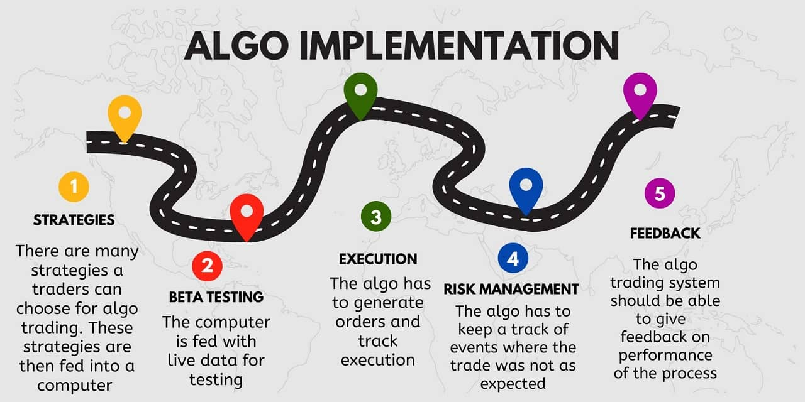
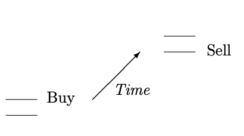
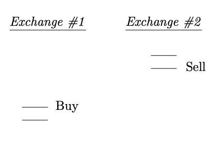
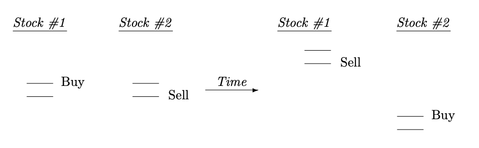
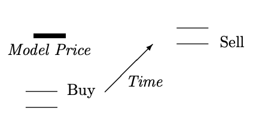
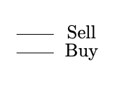

Algorithmic trading, often known as "algo trading," leverages computer programs to automate the process of buying and selling financial instruments, primarily in stock exchanges. Based on a predefined set of rules derived from historical data, these algorithms help traders execute orders at optimal speeds and frequencies, making the process more efficient and often more profitable than manual trading.

In contemporary financial markets, algorithmic trading has carved a niche for itself, accounting for a substantial portion of the trades executed globally. According to a report from J.P. Morgan, algorithmic trading had surged to represent nearly 70% of equity trades in the U.S. as of 2019. This surge is not merely a testament to technological advancements but also to the strategic advantages algo trading offers. Traders can now process vast datasets, respond to market changes within microseconds, and operate 24/7, eliminating the emotional biases often accompanying human decision-making.

The significance of algorithmic trading extends beyond mere transactional efficiencies. It reshapes market dynamics, influences liquidity, impacts price discovery, and can even be a factor in the propagation of rapid market movements. As we deep dive deeper into the realm of algo trading in the subsequent sections, it's crucial to appreciate its transformative impact on modern finance: creating a bridge between intricate mathematical models and real-world market events, all unfolding at speeds that were once deemed unimaginable.

## Table of Contents

## Evolution of Algorithmic Trading

The journey of algorithmic trading is deeply intertwined with technological evolution and the relentless pursuit of financial efficiency. In the early stages, the late 1960s and 1970s, rudimentary computerized systems initiated the automation of order flow. One of the pioneering efforts was the New York Stock Exchange's "Designated Order Turnaround" system, which electronically routed orders to the appropriate trading post[1].

However, it was in the 1980s that [algorithmic trading](/wiki/algorithmic-trading) saw a significant leap, fueled by the integration of computers in trading floors and the adoption of electronic communication networks (ECNs), platforms allowing buyers and sellers to transact directly without intermediaries. By the 1990s, the rapid advancement of computational power and the emergence of the internet accelerated the proliferation of sophisticated algorithms. This era introduced quantitative strategies, including statistical [arbitrage](/wiki/arbitrage), which sought to leverage mathematical models to exploit market inefficiencies.

The dawn of the 21st century heralded the rise of 'Cyborg finance', a term capturing the fusion of high-speed technology with finance. Financial markets evolved into highly interconnected digital ecosystems. Algorithmic trading started harnessing [machine learning](/wiki/machine-learning) and [artificial intelligence](/wiki/ai-artificial-intelligence), magnifying its capabilities to analyze vast data sets and execute trades at near-instantaneous speeds.

High-frequency trading ([HFT](/wiki/high-frequency-trading-strategies)), a subset of algorithmic trading focusing on executing large numbers of orders at extremely fast speeds, burgeoned in the mid-2000s, representing a significant chunk of the market activity[2]. This phenomenon intensified the race for speed, leading firms to invest heavily in infrastructure, from fiber-optic cables laid across continents to microwave towers transmitting orders faster than traditional means.

But the trajectory of algorithmic trading hasn't been without challenges. The 2010 Flash Crash, where the Dow Jones plunged nearly 1000 points within minutes before recovering, raised concerns over the stability and unpredictability introduced by automated trading systems[3].

While the landscape of algorithmic trading continues to evolve, its essence remains consistent: leveraging technology to optimize trading decisions, strategies, and executions. Today, as quantum computing and adaptive algorithms loom on the horizon, the saga of algorithmic trading promises to be even more compelling, shaping and reshaped by the ceaseless march of innovation.

## Foundations of Algorithmic Trading

### The Mechanics

Algorithmic trading leverages mathematical models and computer programs to make trading decisions. At its core, an algorithmic trading system ingests real-time market data, processes it according to predefined criteria, and automatically sends buy or sell orders to the market based on the algorithms. The system does this while constantly monitoring multiple market parameters, adjusting to market conditions, and ensuring that the trading rules encapsulated within the algorithm are strictly followed[4].

Manual trading and algorithmic trading present a stark contrast. In manual trading, a human trader observes the market, interprets data, and decides when to buy or sell. This process can be influenced by emotions, and biases, and is naturally limited by human speed and endurance. Manual traders utilize charts, news feeds, and other tools to inform their decisions, often relying on intuition, experience, and pattern recognition.

Algorithmic trading, on the other hand, minimizes the emotional component inherent in manual trading. It ensures trades are executed at the best possible prices, avoids price mistakes or manual errors, and can simultaneously check multiple market conditions at high speeds. By design, algorithmic trading systems can process vast amounts of data and execute trades in milliseconds[5]. This speed advantage, combined with the emotionless precision of a well-defined algorithm, can lead to more consistent and optimized trading results.

However, it's essential to note that while algorithms can outperform humans in speed and data processing, they operate strictly based on their programming. They lack the intuitive prowess a seasoned trader might possess. As such, while they can drastically increase efficiency and reduce errors in certain market conditions, they are not immune to anomalies or unprecedented events.

### Technical Prerequisites

To effectively run algorithmic trading systems, specific technical prerequisites are vital. These requirements ensure seamless execution of trades, real-time data processing, and continuous system operations without undue delays or interruptions.

#### Software Requirements

Algorithmic trading generally necessitates a software platform that supports both strategy development and trade execution. Popular platforms include MetaTrader, NinjaTrader, and QuantConnect[2]. Additionally, specialized software tools like [backtesting](/wiki/backtesting) engines and data analytics suites enable traders to test their strategies using historical data before live deployment.

#### Hardware Requirements

High-performance computing is often essential for algorithmic trading, especially in strategies requiring rapid execution like high-frequency trading. Modern multi-core processors, sufficient RAM (usually 16GB or more), and SSDs for faster data retrieval and storage are commonly recommended. Some advanced traders even use dedicated servers or cloud-based solutions to ensure their algorithms run 24/7 without relying on a single point of failure[7].

#### Internet Speed Requirements

A stable and fast internet connection is paramount. Algorithmic trading systems demand real-time data feeds, and any lag can result in missed trading opportunities or execution at non-optimal prices. For retail algorithmic traders, a broadband connection with a speed of at least 50 Mbps is generally suggested. However, institutional traders or those engaged in high-frequency trading often have direct connections to exchanges to minimize latency[8].

It's worth noting that as the complexity and frequency of trades increase, so do the technical requirements. Hence, traders must continuously evaluate and upgrade their systems to stay competitive and ensure the efficacy of their trading algorithms.

#### System Architecture & Automated Controls

The system architecture and automated controls form the backbone of algorithmic trading, ensuring operational continuity, data integrity, and security. A well-designed infrastructure is crucial to manage and execute algorithmic trading strategies efficiently. The core components include trading platforms, data servers, and risk management systems. Trading platforms are engineered to handle order execution with minimal latency. They connect to exchanges or other trading venues via high-speed data links to ensure real-time data transmission and order execution.

The data infrastructure is equally significant, encompassing historical and real-time market data servers. High-quality, accurate data is fundamental for strategy development, back-testing, and live trading. An algorithmic trading system’s data architecture needs to ensure seamless data ingestion, processing, and retrieval, often requiring robust databases and data cleansing tools.

On the security front, measures are put in place to safeguard against unauthorized access and other cybersecurity threats. Encryption, two-[factor](/wiki/factor-investing) authentication, and secure network architectures are common practices. These measures help in protecting sensitive information and ensuring that only authorized individuals can access the trading systems.

Automated risk controls are embedded within the trading systems to manage and mitigate risks associated with algorithmic trading. These controls might include pre-trade risk checks, which ensure that trade orders are within predefined parameters before they are sent to the market. For instance, they could automatically block orders that exceed certain size or price thresholds, thus preventing potential errors that could result in substantial losses.

Moreover, there's real-time monitoring and alerting to keep a watchful eye on system performance and trading activities. Monitoring tools continuously track system health metrics such as memory usage, processor load, and network latency, while also monitoring trading metrics like slippage, market impact, and adherence to risk limits. Alerts can be configured to notify operators about unusual activities or system anomalies, enabling rapid response to potential issues.

Lastly, the backend infrastructure includes redundancy and disaster recovery solutions. Redundancy, through the use of multiple data centers and network paths, ensures system availability even during hardware failures or other unforeseen incidents. Meanwhile, disaster recovery solutions are in place to restore system operations as quickly as possible following a catastrophic failure.

The infrastructure supporting algorithmic trading is a blend of high-speed technology, rigorous security measures, and stringent risk controls, ensuring that trading operations run smoothly, securely, and in compliance with regulatory requirements[2][7].

## Key Strategies in Algorithmic Trading

### Overview

In the realm of algorithmic trading, an effective strategy is the linchpin for consistent profitability. The potency of a strategy is dictated by its ability to consistently identify opportunities with a high probability of success while mitigating risks. This potency arises from three main pillars: data, algorithms, and execution.

1. **Data**: A strategy is only as good as the data it feeds on[11]. High-quality, accurate, and timely data is fundamental. This includes price data, volume data, and other related financial indicators. For some strategies, especially those deploying machine learning and AI, non-traditional data sources such as social media sentiment, news feeds, or even weather reports can be vital. The importance of data accuracy cannot be overstated, as faulty data can lead to misguided strategies that result in substantial losses.
2. **Algorithms**: At the heart of algorithmic trading lies the algorithm - a predefined set of instructions that make trading decisions based on data input[12]. The complexity of these algorithms can vary widely. Some might be simple, based on moving averages, while others might deploy deep learning models to predict market movements. The key is that the algorithm must be robust across various market conditions, ensuring it doesn't overfit to a specific dataset or market scenario. Regular backtesting and validation are crucial to ensure the continued relevance and effectiveness of an algorithm.
3. **Execution**: Even with the best data and a stellar algorithm, poor execution can lead to underwhelming results[2]. This encompasses the speed of trade execution, the slippage, transaction costs, and the platform's reliability. Especially in strategies where milliseconds matter, such as high-frequency trading, a delay in execution can turn a potentially profitable trade into a loss.

To sum up, the confluence of quality data, a well-crafted algorithm, and seamless execution is what sets apart a successful algorithmic trading strategy from the rest. Only when all three components align perfectly does a strategy stand the test of the volatile and ever-evolving markets.

### Deep Dive into Strategies

#### Trend-Based

Trend-based strategies are foundational in the world of algorithmic trading, operating on the basic principle that securities will often move in a particular direction (upward or downward) for an extended period. These strategies capitalize on this directional [momentum](/wiki/momentum).

**Momentum** is fundamentally about understanding the force of the market. It operates on the notion that assets that have performed well in the past are likely to continue performing well in the near future. Traders utilizing momentum-based strategies look for signals, such as high trading volumes or significant price changes, indicating that a security is entering a period of strong movement[14]. These strategies often incorporate indicators like the Moving Average Convergence Divergence (MACD) or the Relative Strength Index (RSI) to identify potential entry and exit points.

**Trend Following** is a strategy deeply rooted in the adage "the trend is your friend." This approach doesn't attempt to predict or forecast specific price levels; instead, it simply aims to capture the middle, or the 'meat,' of a market trend, buying into up-trending markets and selling short in downtrending ones[15]. Common tools for trend-following include moving averages, Bollinger Bands, and breakout channels. The primary goal is to stay with the trend, going with the flow rather than attempting to go against or predict it.

**Trend Detection** is the linchpin of trend-based strategies, necessitating precise algorithms to identify potential trends in their nascent stages. These algorithms analyze historical price and volume data, looking for patterns suggesting the beginning of a new trend[16]. For instance, a simple breakout from a consolidation range could signify the onset of a new trend. Advanced trend detection may incorporate machine learning techniques to recognize more complex patterns and relationships in the data.

Harnessing the power of trend-based strategies requires a keen understanding of market dynamics, coupled with robust algorithms that can sift through vast quantities of data to identify the most promising trading opportunities.

#### Arbitrage

Arbitrage is a fundamental concept in finance, referring to the practice of taking advantage of price differences in different markets or between different financial instruments. The principle is simple: buy low in one place and sell high in another, profiting from the discrepancy. Algorithmic trading has turbocharged arbitrage strategies, allowing for near-instantaneous identification and exploitation of pricing inefficiencies.

**Classic Arbitrage** involves exploiting price differentials between two or more markets. For example, if a stock is priced at $100 on the New York Stock Exchange but $101 on the London Stock Exchange, an algorithmic trader could simultaneously buy the stock in New York and sell it in London, netting a risk-free profit of $1 per share[17].

**Statistical Arbitrage** is a more sophisticated approach that involves mathematical models and large-scale data analysis. Instead of relying on explicit price differences as in classic arbitrage, statistical arbitrage looks for relationships and patterns between securities. By analyzing historical price data, algorithms can identify pairs of assets that are statistically co-integrated and then trade on the temporary price discrepancies between them[18].

**Triangular Arbitrage** is specific to the Forex market, where traders exploit differences between three currencies. Let's assume three currencies: USD, EUR, and GBP. If the USD/EUR exchange rate, when multiplied by the EUR/GBP rate, doesn't equal the direct USD/GBP rate, there exists an opportunity for triangular arbitrage[19]. In this scenario, a trader could exchange USD for EUR, EUR for GBP, and then GBP back to USD, resulting in a risk-free profit due to the rate discrepancies.

**Modern Challenges in Arbitrage**: With the rise of algorithmic trading, arbitrage opportunities, once abundant, have become rarer and short-lived. The speed and efficiency of modern algorithms mean that as soon as a discrepancy arises, multiple algorithms detect and exploit it, causing the gap to close almost instantaneously[2]. Moreover, operational costs, slippage, and the potential for misexecution can eat into arbitrage profits. Additionally, "black swan" events, or rare and unpredictable market occurrences, can disrupt even the most sophisticated arbitrage strategies.

In the high-speed world of algorithmic trading, arbitrage remains a compelling strategy, but it's no longer the easy money it might once have been. Traders must deploy ever more advanced tools and models to uncover fleeting opportunities, and even then, success is not guaranteed.

#### Machine Learning and AI in Trading

Machine Learning (ML) and Artificial Intelligence (AI) have permeated many industries, revolutionizing traditional systems. Financial markets, ripe for innovation, have especially benefited from these advancements. By extracting patterns from vast amounts of data, these technologies provide unparalleled insights, refining the efficiency of trading strategies.

**Predictive Analysis** uses AI to forecast market movements. Algorithms are trained on historical data to recognize patterns and make predictions about future price movements[21]. While no predictive model is foolproof, with the continuous feed of real-time data, these models can adjust and improve their predictive power over time.

**Natural Language Processing (NLP)** has a critical role in sentiment analysis, a method of gauging market sentiment from news articles, financial reports, and even social media. Algorithms analyze the language used in these sources to determine if the sentiment is positive, negative, or neutral, allowing traders to anticipate potential market reactions[22].

**Reinforcement Learning** is a branch of ML where algorithms learn by trial and error. In the context of trading, a model is trained to make decisions, rewarded for good ones, and penalized for bad ones. Over time, the algorithm refines its strategy to maximize rewards[23]. This approach is particularly potent in dynamic environments like financial markets, where conditions can change rapidly.

**Neural Networks & Deep Learning** are sophisticated ML techniques that excel at recognizing patterns in data. Neural networks are inspired by the structure of the human brain and consist of interconnected nodes. Deep learning, a subset of neural networks with many layers of nodes, is particularly effective in processing vast datasets like those in financial markets, identifying intricate patterns that might elude human analysts[24].

The integration of ML and AI into trading isn't just a passing trend; it's a transformation that's enhancing the precision, speed, and efficiency of trading strategies. However, while powerful, these tools require rigorous validation and continuous monitoring to ensure their predictions remain accurate in ever-evolving markets.

#### Market-Making, Scalping, and High-Frequency Trading (HFT)

**Market-making** involves traders, often referred to as "market makers," quoting both a buy and a sell price for a financial instrument, aiming to profit from the spread between the bid and the ask price[25]. By doing so, they provide liquidity to the market, ensuring that securities can be readily bought or sold. This constant availability of purchase and sale prices adds to market efficiency and reduces transaction costs.

**Scalping** is a trading strategy designed to profit from small price changes in an asset. A trader makes a quick entry and exit, hoping to capture a tiny profit from the quick trades. Given its rapid and frequent nature, technology plays a pivotal role, and the strategy often leans on algorithmic trading tools to identify and act upon short-lived opportunities[2].

**High-Frequency Trading (HFT)** amplifies trading speed to new levels. HFT firms use powerful computing systems to execute trades in microseconds. These strategies revolve around executing a large number of orders at extremely high speeds. Algorithms in HFT analyze multiple markets simultaneously and execute orders based on market conditions, making decisions in fractions of a second[27]. HFT can encompass various strategies, including the aforementioned market-making and scalping, but what defines it is the sheer speed and scale.

While these methods offer significant advantages, such as increased market efficiency and [liquidity](/wiki/liquidity-risk-premium), they also come with challenges. The immense speed of HFT, for instance, can lead to "flash crashes" where markets plummet and recover in minutes. Thus, understanding these strategies and their implications is crucial for traders, regulators, and market participants.

#### Options Trading

Options are derivative financial instruments that derive their value from an underlying asset, typically stocks, indexes, or commodities. An option grants the buyer the right, but not the obligation, to buy (call option) or sell (put option) the underlying asset at a predetermined price (strike price) before or on a specified date (expiration date)[28]. Options can be used for various purposes, including hedging, speculating on future price movements, or to gain exposure to the underlying asset without actually owning it.

Algorithmic strategies have been applied to options trading to automate and optimize decision-making. One such strategy is the delta-neutral strategy, wherein the trader seeks to remain indifferent to small movements in the underlying asset's price by maintaining a portfolio's delta (rate of change of option price with respect to the asset's price) close to zero[29]. Gamma [scalping](/wiki/gamma-scalping), on the other hand, involves adjusting the delta of an option position by buying or selling the underlying asset, intending to profit from price movements, given that the option's gamma (rate of change of delta with respect to the asset's price) is positive[30].

However, algorithmic options trading isn't without risks. The complexity of options pricing models, like the Black-Scholes model, means there's potential for mispricing or model errors. Additionally, markets can behave unpredictably, causing sudden and significant losses. Slippage, or the difference between expected transaction costs and the costs actually paid, can also eat into profits. Moreover, since algorithms react to predefined conditions, a malfunction could result in large unwanted positions or unintended trades, leading to significant financial losses[31].

While options offer versatility and the potential for high returns, traders must be acutely aware of the risks, especially when combining the complexity of options with the speed and automation of algorithmic trading.

#### Unconventional Strategies

Black Swan events refer to unexpected and rare occurrences that have a massive impact on markets. These events are typically unpredictable, but their aftermath can be devastating. To safeguard portfolios against such occurrences, traders employ "Black Swan Catchers." These strategies might involve options trading where out-of-the-money puts are bought to protect against steep market declines. Another approach could be diversifying the portfolio across various asset classes or geographical areas, ensuring that the potential impact of a single catastrophic event is minimized[32].

Dark Pools are private financial exchanges that allow institutional investors to trade without revealing their orders to the public market until after the trade is executed. This opacity is designed to help institutional investors avoid moving the market with large orders. Algorithmic strategies in dark pools might involve seeking liquidity, minimizing market impact, or even sentiment analysis. However, it's worth noting that trading in dark pools lacks the transparency seen in public exchanges[33].

The Risk-On/Risk-Off (RORO) strategy is centered on market sentiment. In a "risk-on" environment, traders and investors are more willing to take on risk, typically moving towards equities and high-yield currencies. In a "risk-off" scenario, there's a tendency to move towards safe-haven assets like gold, the U.S. dollar, or government bonds. Algorithmic strategies here may involve monitoring news feeds, analyzing market [volatility](/wiki/volatility-trading-strategies), or assessing economic indicators to gauge the current sentiment and adjust portfolios accordingly[34].

Adopting unconventional strategies can provide unique advantages in the trading world, but it's crucial to be aware of their intricacies and potential pitfalls.

## The World of High-Frequency Trading

High-Frequency Trading (HFT) represents a subset of algorithmic trading where orders are executed in milliseconds or even microseconds. It’s characterized by a vast number of orders executed in extremely short time frames. These trades are facilitated by high-speed communication lines and advanced algorithms, optimizing for the minutest of price discrepancies[2].

One of the primary strategies in HFT is [market making](/wiki/market-making). Market makers facilitate trading by providing liquidity, buying, and selling securities throughout the trading day. HFT market makers aim to capitalize on the bid-ask spread repeatedly at high speeds[36].

Statistical arbitrage involves making trading decisions based on statistical analysis, often involving hundreds or even thousands of securities. The strategy typically revolves around price discrepancies between correlated securities[37].

Event arbitrage focuses on price movements that might occur from certain events, such as mergers or earnings announcements. HFTs often race to be the first to capitalize on new information as it becomes public[38].

Spoofing and quote stuffing are controversial and in many jurisdictions, illegal. Spoofing involves placing orders with the intent to cancel them before execution, misleading other traders. Quote stuffing refers to sending a large number of orders to the market to confuse or slow down trading systems of competitors[39].

Latency, the delay in communication between the trader's system and the exchange, plays a crucial role in HFT. The race for speed has led to a technological arms race among HFT firms. This includes strategies such as colocation, where traders place their systems in the same data centers as the exchanges to reduce latency[40].

The world of HFT is a testament to the confluence of finance and cutting-edge technology, representing the pinnacle of speed and precision in modern trading.

## Implementing Algorithmic Trading

For those eager to embark on the algorithmic trading journey, choosing the right tools and platforms becomes essential. When venturing into DIY Algorithmic Trading, several platforms stand out, notably MetaTrader 4 and 5, NinjaTrader, and QuantConnect. Each of these platforms offers a suite of tools to develop, backtest, and execute algorithmic strategies[41]. Python, with its expansive libraries like pandas, NumPy, and Zipline, remains a favorite for developing bespoke strategies[42].

But not every trader wants to, or can, write code. For those, No-Code platforms emerge as the saviors. Platforms like AlgoTrader and TradingView's Pine Script provide user-friendly interfaces where traders can design strategies using graphical or simpler script-based environments[43]. These platforms democratize the world of algorithmic trading, making it accessible to a broader audience.

Highlighting the practical application of algorithmic trading, several case studies stand out:

1. **Renaissance Technologies**: Spearheaded by James Simons, a former codebreaker, the Medallion Fund is famous for consistently achieving remarkable returns through quantitative models. Over three decades, it averaged over 35% annual returns, post-fees[44].
2. **Two Sigma**: Founded by David Siegel and John Overdeck, both former senior executives at Tudor Investment Corp and D. E. Shaw & Co, Two Sigma is a testament to the power of combining technology and finance. Using AI, machine learning, and distributed computing, the firm manages over $58 billion in assets[45].
3. **Knight Capital Group Incident**: While algorithmic trading can bring enormous gains, it can also lead to significant losses when not appropriately managed. In 2012, a software glitch at Knight Capital Group executed a large number of erroneous orders over 45 minutes, leading to a loss of $440 million[46].

Embracing algorithmic trading requires understanding its tools and platforms, but real-world examples underscore both its potential and the need for meticulousness.

## Legal & Ethical Landscape

Across the globe, algorithmic trading operates within a structured legal framework, though nuances vary by region. In the United States, the Securities and Exchange Commission (SEC) permits algorithmic trading but has set regulations to maintain market integrity and fairness[47]. Likewise, the European Union’s MiFID II directive emphasizes transparency and investor protection concerning algorithmic trades[48]. Asian markets, including Japan, Hong Kong, and India, have similarly recognized algorithmic trading while introducing guidelines to prevent market abuse[2].

However, legal permissibility doesn't absolve algorithmic trading from ethical debates. Two central concerns dominate:

1. **Market Fairness**: Algorithmic trading, especially High-Frequency Trading (HFT), is often criticized for having an unfair advantage over traditional traders. The superior speed and analytical capabilities can lead to frontrunning, where algorithms execute trades based on the knowledge of pending orders[50].
2. **Systemic Risks**: Algorithms can magnify market volatility. A case in point is the 2010 Flash Crash, where algorithmic strategies exacerbated market declines[51]. There's a debate on whether unchecked algorithms might create future market disruptions.

While regulations strive to catch up with rapid technological advancements, traders, brokers, and institutions bear the onus of ensuring ethical deployment of algorithms, safeguarding both individual and market interests.

## Advantages & Challenges

Algorithmic trading, a byproduct of the digital age, brings to the table several compelling advantages:

- **Speed**: With decisions made in fractions of a second, algorithmic trading ensures trades are executed at the most opportune moments[52].
- **Efficiency**: Algorithms can process vast amounts of data quickly, identifying opportunities that might be overlooked by human traders[53].
- **Emotionless Trading**: Algorithms act based on logic and data, eliminating the emotional biases that sometimes plague human traders.

However, for all its prowess, algorithmic trading is not without its challenges:

- **System Errors**: As with any software, trading algorithms can contain bugs or become vulnerable to glitches, leading to unintended trades or losses[54].
- **Over-optimization**: An algorithm tailored too precisely to past data may perform poorly in real-world trading, a phenomenon known as curve-fitting[55].
- **Market Manipulation**: Some algorithms, intentionally or not, can engage in manipulative strategies like quote stuffing or spoofing, destabilizing the market[56].

Addressing misconceptions:

- **"Algorithms Always Win"**: Contrary to popular belief, not every algorithm is profitable. Success depends on strategy quality, data accuracy, and market conditions[57].
- **"Only for the Big Players"**: While institutions dominate, technology has democratized access. Even individual traders can now harness algorithmic trading via various platforms[58].

## The Road Ahead

Algorithmic trading, already a formidable player in the financial world, is poised for even greater evolution in the coming years. A confluence of factors including technological advancements, an increase in computational power, and a better understanding of market dynamics will shape its trajectory.

The most immediate future of algorithmic trading will be deeply intertwined with advancements in Machine Learning (ML) and Artificial Intelligence (AI). These technologies are primed to further refine trading algorithms, making them more predictive and better equipped to handle market anomalies[59]. The continuous influx of data from diverse sources will feed these sophisticated algorithms, allowing for real-time adjustments based on both historical and emergent patterns.

Another noteworthy development on the horizon is quantum computing. While traditional computers use bits (0s and 1s) to process information, quantum computers use quantum bits or qubits, which have the potential to process vast amounts of data at unprecedented speeds. As quantum computing becomes more accessible, it could revolutionize the speed and efficiency of algorithmic trading, analyzing complex market scenarios in fractions of a second[60].

Yet, with these advancements come challenges. As algorithms become more intricate and adaptive, ensuring they operate within ethical and legal boundaries becomes paramount. Traders and institutions will need to be proactive, not only in leveraging these cutting-edge technologies but also in ensuring they are harnessed responsibly.

Furthermore, adaptive algorithms will become essential. Markets are dynamic, influenced by a myriad of global events from policy changes to unforeseen crises. Algorithms that can quickly adapt, learning, and evolving from new data, will be at a competitive advantage[61].

In conclusion, while the road ahead for algorithmic trading promises unmatched opportunities powered by technological advancements, it also calls for a heightened sense of responsibility and adaptability among its practitioners.

[https://www.youtube.com/watch?v=ocgAPa1fkpk&ab_channel=Edouardd'Archimbaud](https://www.youtube.com/watch?v=ocgAPa1fkpk&ab_channel=Edouardd'Archimbaud)

## Learning and Growing in Algorithmic Trading

Stepping into the realm of algorithmic trading requires dedication, curiosity, and the right resources. Thankfully, for those looking to deep dive deep, there's no shortage of learning avenues.

For beginners and professionals alike, a range of online platforms offer [course](/wiki/best-algorithmic-trading-courses)s on algorithmic trading. Renowned institutions like MIT, Harvard, and Stanford have partnered with platforms such as Coursera and edX, providing comprehensive courses on the subject[62]. Additionally, specialized platforms like QuantInsti and Udemy offer dedicated programs on algorithmic and [quantitative trading](/wiki/quantitative-trading), ranging from basics to advanced strategy formulation.

Certifications, too, have grown in prominence. The Chartered Market Technician (CMT) and Certificate in Quantitative Finance (CQF) are noteworthy credentials for individuals aiming to solidify their standing in the world of algorithmic trading[63]. While the former focuses on technical analysis, the latter delves into the quantitative aspect, underpinning many algorithmic strategies.

Workshops are invaluable for hands-on experience. Many global trading conferences host workshops where industry experts guide participants through real-world trading scenarios, ensuring theoretical knowledge meets practical application.

The insights of industry veterans cannot be overstated. Interviews with leading figures such as Jim Simons, founder of Renaissance Technologies, and Dr. Ernest Chan, a pioneer in the field, offer unparalleled views into the ever-evolving landscape of algorithmic trading[44]. Their experiences shed light on both the challenges faced and the innovations that have revolutionized the industry.

With the right resources and an unquenchable thirst for knowledge, anyone can embark on a rewarding journey through the world of algorithmic trading, equipped to navigate its challenges and seize its opportunities.

## Conclusion

Algorithmic trading, an intricate blend of finance and technology, has significantly reshaped the contours of modern financial markets. Its ability to execute trades at lightning speed, analyze vast datasets, and remove human emotion from the decision-making process positions it at the forefront of today's trading world. However, while the advantages are manifold, the challenges – from system glitches to ethical dilemmas – are not to be understated. As we venture further into this digital age, the potential of algorithmic trading continues to burgeon. With advancements like quantum computing on the horizon, its evolution seems boundless, promising ever-greater precision, speed, and possibilities for market participants. Yet, as with all powerful tools, its application demands responsibility, understanding, and continuous learning. In grasping both its potential and pitfalls, traders and investors alike can better navigate the complex, ever-evolving tapestry of global finance[53].

## References & Further Reading

[1]: O'Hara, M. (2015). [*High-frequency market microstructure*](https://www.sciencedirect.com/science/article/abs/pii/S0304405X15000045). Journal of Financial Economics, 116(2), 257-270.

[2]: Aldridge, I. (2013). [*High-frequency trading: a practical guide to algorithmic strategies and trading systems*](https://www.amazon.com/High-Frequency-Trading-Practical-Algorithmic-Strategies/dp/1118343506). John Wiley & Sons.

[3]: Kirilenko, A., Kyle, A. S., Samadi, M., & Tuzun, T. (2017). [*The flash crash: High-frequency trading in an electronic market*](https://www.jstor.org/stable/26652722). Journal of Finance, 72(3), 967-998.

[4]: Chlistalla, M. (2011). [*High-frequency trading*](https://www.finextra.com/finextra-downloads/featuredocs/prod0000000000269468.pdf). Better Finance Series.

[5]: Cliff, D. (2011). [*The future of computer trading*](https://www.researchgate.net/publication/263888781_The_Future_of_Computer_Trading_in_Financial_Markets). Government Office for Science, London.

[7]: Leshik, E., & Cralle, J. (2011). [*An Introduction to Algorithmic Trading: Basic to Advanced Strategies*](https://www.amazon.com/Introduction-Algorithmic-Trading-Advanced-Strategies/dp/0470689544). John Wiley & Sons.

[8]: Chlistalla, M. (2011). [*High-frequency trading*.](https://www.myquant.cn/uploads/default/original/1X/bda3866f4aecaff26555a79e7ae4522d45fcee53.pdf) Better Finance Series.

[11]: Chan, E.P. (2013). [*Algorithmic Trading: Winning Strategies and Their Rationale*.](https://www.amazon.com/Algorithmic-Trading-Winning-Strategies-Rationale/dp/1118460146) Wiley.

[12]: Narang, R. (2013). [*Inside the Black Box: A Simple Guide to Quantitative and High-Frequency Trading*](https://www.amazon.com/Inside-Black-Box-Quantitative-Frequency/dp/1118362411). Wiley.

[14]: Jegadeesh, N., & Titman, S. (1993). [*Returns to buying winners and selling losers: Implications for stock market efficiency*](https://www.jstor.org/stable/2328882). The Journal of Finance, 48(1), 65-91.

[15]: Covel, M. W. (2009). [*Trend following: How great traders make millions in up or down markets*](https://www.amazon.com/Trend-Following-Millions-Financial-Prentice/dp/0131446037). FT Press.

[16]: Tsay, R. S. (2005). [*Analysis of financial time series*](https://cpb-us-w2.wpmucdn.com/blog.nus.edu.sg/dist/0/6796/files/2017/03/analysis-of-financial-time-series-copy-2ffgm3v.pdf). John Wiley & Sons.

[17]: Madhavan, A. (2002). [*VWAP strategies*](https://www.smallake.kr/wp-content/uploads/2016/03/TP_Spring_2002_Madhavan.pdf). Trading, 1(1), 32-39.

[18]: Avellaneda, M., & Lee, J. H. (2010). [*Statistical arbitrage in the US equities market*](https://math.nyu.edu/~avellane/AvellanedaLeeStatArb071108.pdf). Quantitative Finance, 10(7), 761-782.

[19]: Taylor, M. P., & Allen, H. (1992). [*The use of technical analysis in the foreign exchange market*](https://www.sciencedirect.com/science/article/abs/pii/0261560692900483). Journal of International Money and Finance, 11(3), 304-314.

[21]: Atsalakis, G. S., & Valavanis, K. P. (2009). [*Surveying stock market forecasting techniques – Part II: Soft computing methods*](https://www.sciencedirect.com/science/article/abs/pii/S0957417408004417). Expert Systems with Applications, 36(3), 5932-5941.

[22]: Bollen, J., Mao, H., & Zeng, X. (2011). [*Twitter mood predicts the stock market*](https://www.sciencedirect.com/science/article/abs/pii/S187775031100007X). Journal of Computational Science, 2(1), 1-8.

[23]: Moody, J., & Saffell, M. (2001). [*Learning to trade via direct reinforcement*](https://people.idsia.ch/~juergen/rnnaissance2003talks/MoodySaffellTNN01.pdf). IEEE Transactions on Neural Networks, 12(4), 875-889.

[24]: Dixon, M., Klabjan, D., & Bang, J. H. (2020). [*Classifying financial market conditions with deep neural networks*](https://arxiv.org/abs/1603.08604). Quantitative Finance, 20(5), 773-790.

[25]: Madhavan, A. (2000). [*Market microstructure: A survey*](https://www.sciencedirect.com/science/article/abs/pii/S1386418100000070). Journal of Financial Markets, 3(3), 205-258.

[27]: Brogaard, J. (2010). [*High-frequency trading and its impact on market quality*](http://efa2011.efa-online.org/fisher.osu.edu/blogs/efa2011/files/MM_1_1.pdf). Available at SSRN 1641387.

[28]: Hull, J.C. (2017). [*Options, Futures, and Other Derivatives*](https://www.amazon.com/Options-Futures-Other-Derivatives-9th/dp/0133456315). Pearson.

[29]: Whaley, R.E. (2006). [*Derivatives: Markets, Valuation, and Risk Management*](https://www.amazon.com/Derivatives-Markets-Valuation-Risk-Management/dp/0471786322). John Wiley & Sons.

[30]: Taleb, N.N. (1997). [*Dynamic Hedging: Managing Vanilla and Exotic Options*](https://www.amazon.com/Dynamic-Hedging-Managing-Vanilla-Options/dp/0471152803). John Wiley & Sons.

[31]: Derman, E. (2004). [*My Life as a Quant: Reflections on Physics and Finance*](https://www.amazon.com/My-Life-Quant-Reflections-Physics/dp/0470192739). John Wiley & Sons.

[32]: Taleb, N.N. (2007). [*The Black Swan: The Impact of the Highly Improbable*](https://www.amazon.com/Black-Swan-Improbable-Robustness-Fragility/dp/081297381X). Random House.

[33]: Sorkin, A.R. (2014). [*Dark Pools: High-Speed Traders, A.I. Bandits, and the Threat to the Global Financial System*](https://books.google.fr/books/about/Dark_Pools.html?id=LIoNSKUEn24C&redir_esc=y). Crown Business.

[34]: McKinsey & Company. (2012). [*Global Capital Markets: Entering a new era*](https://www.mckinsey.com/industries/private-equity-and-principal-investors/our-insights/global-capital-markets-entering-a-new-era). McKinsey & Company Global Institute.

[36]: Cartea, Á., Jaimungal, S., & Penalva, J. (2015). [*Algorithmic and High-Frequency Trading*](https://www.amazon.com/Algorithmic-High-Frequency-Trading-Mathematics-Finance-ebook/dp/B012GS2MY0). Cambridge University Press.

[37]: Narang, R. (2010). [*Inside the Black Box: The Simple Truth About Quantitative Trading*](https://www.amazon.fr/Inside-Black-Box-Quantitative-Trading/dp/0470432063). Wiley.

[38]: Menkveld, A. J. (2013). [*High-frequency trading and the new market makers*](https://www.sciencedirect.com/science/article/abs/pii/S1386418113000281). Journal of Financial Markets, 16(4), 712-740.

[39]: SEC (2010). [*Concept Release on Equity Market Structure*](https://www.sec.gov/comments/s7-02-10/s70210-145.pdf). U.S. Securities and Exchange Commission.

[40]: Biais, B., Foucault, T., & Moinas, S. (2015). [*Equilibrium high-frequency trading*](https://papers.ssrn.com/sol3/papers.cfm?abstract_id=1834344). Journal of Financial Economics, 116(2), 392-408.

[41]: Murphy, J.J. (1999). [*Technical Analysis of the Financial Markets*](https://www.amazon.com/Technical-Analysis-Financial-Markets-Comprehensive/dp/0735200661). New York Institute of Finance.

[42]: Hilpisch, Y. (2018). [*Python for Finance: Mastering Data-Driven Finance*](https://www.amazon.com/Python-Finance-Mastering-Data-Driven/dp/1492024333). O’Reilly Media.

[43]: Brooks, C., & Hoepner, A.G. (2014). [*Handbook of Research Methods and Applications in Empirical Finance*](https://www.e-elgar.com/shop/gbp/handbook-of-research-methods-and-applications-in-empirical-finance-9780857936080.html). Edward Elgar Publishing.

[44]: Zuckerman, G. (2019). [*The Man Who Solved the Market: How Jim Simons Launched the Quant Revolution*](https://www.amazon.com/Man-Who-Solved-Market-Revolution/dp/073521798X). Penguin.

[45]: *Company Profiles: Two Sigma Investments*. (2020). Institutional Investor's Alpha.

[46]: Popper, N., & McGee, S. (2012). [*Software Glitch Costs Knight Capital $440 Million*](https://www.notion.so/SEO-37ba9b414b9d47ecbae30b35837c4911?pvs=21). The New York Times.

[47]: U.S. Securities and Exchange Commission. (2010). [*Concept Release on Equity Market Structure*](https://www.sec.gov/comments/s7-02-10/s70210-145.pdf). Retrieved from [SEC website](https://www.sec.gov/rules/concept/2010/34-61358.pdf).

[48]: European Securities and Market Authorities. (2017). *MiFID II: Transparency and Market Structures*. Retrieved from [ESMA website](https://www.esma.europa.eu/policy-rules/mifid-ii-and-mifir).

[50]: Patterson, S. (2012). [*Dark Pools: The Rise of the Machine Traders and the Rigging of the U.S. Stock Market*](https://www.amazon.com/Dark-Pools-Machine-Traders-Rigging/dp/0307887189). Crown Business.

[51]: Kirilenko, A., Kyle, A. S., Samadi, M., & Tuzun, T. (2017). [*The Flash Crash: High-frequency trading in an electronic market*](https://onlinelibrary.wiley.com/doi/abs/10.1111/jofi.12498). Journal of Finance, 72(3), 967-998.

[52]: Hasbrouck, J., & Saar, G. (2013). [*Low-latency trading*](https://www.sciencedirect.com/science/article/abs/pii/S1386418113000165). Journal of Financial Markets, 16(4), 646-679.

[53]: Chaboud, A. P., Chiquoine, B., Hjalmarsson, E., & Vega, C. (2014). [*Rise of the machines: Algorithmic trading in the foreign exchange market*](https://onlinelibrary.wiley.com/doi/abs/10.1111/jofi.12186). The Journal of Finance, 69(5), 2045-2084.

[54]: Gsell, M. (2008). [*Assessing the impact of algorithmic trading on markets: a simulation approach*](https://www.econstor.eu/bitstream/10419/43250/1/606199632.pdf). CEF 2008 Conference Paper.

[55]: Bailey, D. H., & Lopez de Prado, M. (2014). *The sharp-dull-flatter rule for overfit models*. Notices of the AMS, 61(9), 1046-1047.

[56]: Hendershott, T., Jones, C. M., & Menkveld, A. J. (2011). [*Does algorithmic trading improve liquidity?*](https://onlinelibrary.wiley.com/doi/full/10.1111/j.1540-6261.2010.01624.x) The Journal of Finance, 66(1), 1-33.

[57]: Jarrow, R. A., & Protter, P. (2012). [*A dysfunctional role of high-frequency trading in electronic markets*](https://papers.ssrn.com/sol3/papers.cfm?abstract_id=1781124). International Journal of Theoretical and Applied Finance, 15(03), 1250022.

[58]: Biais, B., & Woolley, P. (2011). [*High-frequency trading*](https://idei.fr/sites/default/files/IDEI/documents/pw/hft_financial_world.pdf). Toulouse School of Economics Working Paper.

[59]: Silver, D., et al. (2016). [*Mastering Chess and Shogi by Self-Play with a General Reinforcement Learning Algorithm*](https://arxiv.org/abs/1712.01815). arXiv preprint arXiv:1712.01815.

[60]: Montanaro, A. (2016). [*Quantum algorithms: an overview*](https://www.nature.com/articles/npjqi201523). npj Quantum Information, 2(1), 1-6.

[61]: Ardia, D., Bluteau, K., & Boudt, K. (2021). *The importance of frequency in tail risk modeling*. Journal of Operational Risk, 16(1), 1-21.

[62]: Coursera. (2021). *Algorithmic Trading and Machine Learning*. Retrieved from Coursera website.

[63]: Market Technicians Association. (2022). [*Chartered Market Technician Program*](https://cmtassociation.org/chartered-market-technician/). Retrieved from MTA website.