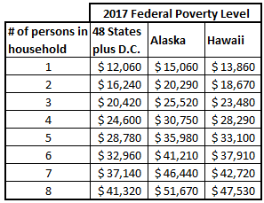

Poverty and economic hardship are complex issues shaped by various metrics and standards. One of the significant measures gaining attention is the ALICE Threshold, which stands for Asset Limited, Income Constrained, Employed. This metric reflects households that earn more than the federal poverty level but struggle to afford basic living necessities such as housing, healthcare, and childcare. Understanding the ALICE Threshold offers a broader view of economic hardship beyond traditional metrics, highlighting the financial challenges faced by a substantial portion of employed households.

This article examines the interplay between the ALICE Threshold, the Federal Poverty Line, and algorithmic trading. The Federal Poverty Line is a government-established benchmark to assess poverty levels in the United States. However, it often fails to consider local variations in the cost of living, leaving many ALICE households unrecognized in poverty data. ALICE provides a more nuanced perspective, acknowledging the "working poor" who are often overlooked in social welfare schemes.



As the financial landscape evolves, algorithmic trading emerges as a pivotal player in the financial markets. Leveraging computer algorithms for trades provides opportunities to enhance market efficiency and adapt to economic trends. By integrating insights from ALICE data, algorithmic trading and financial models can potentially identify market movements influenced by socioeconomic disparities.

Understanding the connections between these metrics allows policymakers, markets, and communities to craft strategies that address financial insecurity and economic inequality. By bridging these insights, stakeholders can work towards economic solutions that are both equitable and resilient.

## Table of Contents

## Understanding the ALICE Threshold

The ALICE (Asset Limited, Income Constrained, Employed) Threshold is a metric designed to capture the economic challenges faced by households that earn above the federal poverty level but still struggle to afford basic necessities. Developed by United Way, this measure highlights the disparity between actual income and the real cost of living that these households experience. While they do not qualify for government poverty assistance, ALICE households face significant financial constraints, unable to meet essential needs such as housing, healthcare, childcare, and transportation.

As of 2022, approximately 42% of U.S. households were classified either as ALICE or under the poverty line, emphasizing the widespread nature of economic vulnerability beyond what traditional poverty metrics typically capture. This statistic indicates a substantial segment of the population living paycheck to paycheck, often without savings or a financial safety net. The struggle of ALICE households is further compounded by stagnant wages, increasing living costs, and limited access to affordable services.

The ALICE Essentials Index is a tool used to measure the cost of essential goods and services necessary for survival, such as housing, food, transportation, healthcare, and childcare. Unlike the Consumer Price Index (CPI), which includes a broad array of goods such as electronics and entertainment items, the Essentials Index focuses solely on these basic needs. This makes the ALICE Index a more accurate representation of the financial stresses faced by working families struggling to maintain a basic standard of living. The CPI's inclusion of luxury items can mask the true inflationary pressures experienced by low-income households, thus the ALICE Essentials Index provides a more nuanced understanding of economic hardship.

Overall, the ALICE Threshold serves as a critical tool for understanding and addressing the complexities of economic hardship in the United States, providing data essential for policymakers, community organizations, and other stakeholders aiming to design effective strategies for improving the economic security of employed but financially constrained families.

## Federal Poverty Line vs. ALICE Threshold

The Federal Poverty Line (FPL) is a standardized metric established by the U.S. government to determine the minimum income level required for individuals and families to meet basic living needs. This measure is primarily based on pre-tax income and does not account for regional differences in living costs or the full scope of essential needs. Derived from 1960s data, the FPL is annually adjusted for inflation but remains critiqued for its limitations in addressing contemporary economic realities.

In contrast, the ALICE (Asset Limited, Income Constrained, Employed) Threshold provides a more nuanced understanding of financial hardship. Developed by the United Way, the ALICE measure considers both income and the local cost of living, offering a detailed depiction of the economic challenges faced by households [earning](/wiki/earning-announcement) above the FPL yet struggling to afford basic necessities. The ALICE Threshold includes a comprehensive assessment of essential needs such as housing, child care, food, transportation, and healthcare, which are specific to each locality.

ALICE households are characterized by working individuals or families who, despite being employed, remain financially constrained. These households live paycheck to paycheck and are often excluded from traditional poverty assistance programs, as their earnings may surpass the FPL, yet insufficiently cover their actual living expenses. This exclusion highlights a significant gap in social welfare policies, which primarily focus on those falling below the FPL, neglecting those still experiencing economic insecurity despite employment.

Understanding the distinctions between the Federal Poverty Line and the ALICE Threshold is crucial for policymakers. While the FPL serves as a traditional yardstick for poverty, the ALICE Threshold shifts the focus to a broader spectrum of economic vulnerability, capturing the realities of a substantial portion of the population not typically recognized as impoverished. This distinction underscores the necessity for comprehensive social welfare programs that address not only those living in absolute poverty but also those who are asset-limited and income-constrained.

Policymakers equipped with insights from both the FPL and the ALICE Threshold can better design and implement social welfare initiatives that reflect the actual economic landscape, ensuring that the needs of all vulnerable households are met effectively. By acknowledging the limitations of the FPL and incorporating the expanded perspective provided by the ALICE framework, there is potential to develop inclusive strategies aimed at economic stability and empowerment for a wider demographic.

## The Economic Impact of ALICE Households

ALICE households are a significant force within the service sector, holding crucial roles in industries such as retail, hospitality, and healthcare. These sectors are foundational to the economy, and the contributions from ALICE households are indispensable. While their employment status suggests financial participation and stability, these families consistently endure financial stress. The primary driver of this stress is the mismatch between rising living costs and stagnant or insufficient wages. 

The economic vulnerability of ALICE households is exacerbated by the increased cost of essentials such as housing, healthcare, and education, combined with wages that fail to rise proportionately. This discrepancy creates a precarious financial situation where these households struggle to save or invest for the future, leaving them susceptible to economic shocks. 

Despite their financial constraints, ALICE households play a critical role in sustaining local economies. Their spending supports small businesses and service providers, helping to maintain economic circulation in their communities. However, the lack of adequate financial security means that any downturn or economic crisis can have severe repercussions, not only for these households but also for the economic stability of their communities.

The economic challenges faced by ALICE households have far-reaching implications. On a macroeconomic scale, these struggles contribute to widening income inequality and can lead to decreased overall economic mobility. Policymakers and social welfare advocates are increasingly acknowledging the significance of addressing the needs of ALICE households. Their financial instability prompts essential debates concerning minimum wage laws, affordable housing policies, and healthcare access. By recognizing and responding to these economic stressors, stakeholders can work towards more equitable and resilient economic systems.

## Algorithmic Trading and Financial Markets

Algorithmic trading utilizes sophisticated computer algorithms to execute trades across financial markets with precision and efficiency. These algorithms enable trading strategies that automatically monitor market conditions, execute trades, and manage portfolios with minimal human intervention. The primary objective is to capitalize on minute price differences and market inefficiencies, thus creating substantial profit opportunities that were previously unattainable through manual trading.

Over the past few decades, [algorithmic trading](/wiki/algorithmic-trading) has significantly reshaped the landscape of financial markets. By enabling rapid transaction speeds and high-frequency trading, this technology-driven approach allows traders to process vast volumes of data and execute a large number of trades within seconds. This capability not only enhances [liquidity](/wiki/liquidity-risk-premium) in financial markets but also compresses bid-ask spreads, contributing to market efficiency.

However, the rise of algorithmic trading entails complexities that investors and financial institutions must understand to harness its full potential. Key components of successful algorithmic trading include the development of robust algorithms capable of carrying out complex strategies, risk management systems to minimize exposure to adverse market movements, and substantial computing power to analyze massive datasets in real time.

Advancements in algorithmic trading mirror broader economic trends. For example, the proliferation of [machine learning](/wiki/machine-learning) and [artificial intelligence](/wiki/ai-artificial-intelligence) has enabled the development of predictive models that analyze patterns in historical data to forecast future market dynamics. These models can identify arbitrate opportunities, optimize trade execution, and improve decision-making processes.

Furthermore, the impact of algorithmic trading extends beyond individual profit maximization to affect overall market stability. While it increases market liquidity, it also poses risks such as flash crashes—sudden, severe price drops followed by quick recoveries—caused by algorithmic misfires or feedback loops. As a result, regulators continuously monitor the implications of high-frequency trading to ensure the stability and integrity of financial systems. 

To illustrate algorithmic trading, consider the following simple example using Python:

```python
import pandas as pd

# Hypothetical historical stock data
data = {
    'Date': ['2021-01-01', '2021-01-02', '2021-01-03', '2021-01-04'],
    'Close': [150.0, 152.0, 153.5, 151.0]
}
df = pd.DataFrame(data)

# Simple moving average strategy
window_size = 2
df['SMA'] = df['Close'].rolling(window=window_size).mean()

df['Signal'] = 0
df['Signal'][window_size:] = \
    np.where(df['Close'][window_size:] > df['SMA'][window_size:], 1, -1)

print(df)
```

This code snippet demonstrates a basic moving average crossover strategy, a common type of algorithmic trading. The strategy generates buy signals when a security's short-term average price surpasses its long-term average, and sell signals when the opposite occurs.

In conclusion, algorithmic trading represents a pivotal evolution in financial markets, offering both opportunities and challenges. Its ongoing development will likely continue reflecting broader economic shifts, necessitating comprehensive understanding and management from all market participants.

## Connecting ALICE, Poverty Metrics, and Algo Trading

The integration of ALICE data with financial systems has the potential to enhance the precision of economic models by incorporating socioeconomic disparities into the analysis. The ALICE Threshold provides a nuanced understanding of households that are financially constrained despite being employed. By integrating this data into algorithmic trading models, financial systems can better anticipate how economic inequality might contribute to market shifts.

Algorithmic trading, a technology-driven approach that uses computer algorithms to execute trades, typically aims to leverage market inefficiencies for profit. These algorithms can benefit from including socioeconomic data such as ALICE metrics, which highlight consumer behavior trends and market dynamics influenced by financial insecurity. Incorporating ALICE datasets can potentially improve the responsiveness of these algorithms to real-world economic conditions, leading to more informed trading decisions.

One of the primary advantages of understanding ALICE metrics is the ability to evaluate how economic conditions, including income constraints and essential costs, influence consumer behavior. These insights can be critical in predicting market dynamics, particularly in sectors heavily reliant on consumer spending, such as retail and services, where many ALICE households are employed.

Implementing solutions that address the financial difficulties faced by ALICE households could play a significant role in redefining economic policies, thereby enhancing market resilience. Policies that elevate the financial stability of ALICE families not only improve individual well-being but also strengthen local economies by increasing consumer spending and reducing financial [volatility](/wiki/volatility-trading-strategies).

The complex interactions between poverty metrics and financial markets underscore the necessity for inclusive economic strategies. By incorporating diverse data such as ALICE metrics into financial models and trading algorithms, stakeholders can create an economic landscape that is more reflective of societal conditions. This inclusive approach could lead to more robust and equitable economic policies, paving the way for improved societal and financial outcomes.

## Conclusion and Future Directions

A robust understanding of the ALICE Threshold and its implications is essential for creating sustainable economic policies. Recognizing that this population lives above the federal poverty level but struggles with basic cost-of-living expenses prompts a reevaluation of poverty measurement models. Current models often rely on income as the sole indicator of economic well-being, yet this approach neglects the nuanced realities faced by ALICE households. To address these issues effectively, models must include additional dimensions such as regional cost of living, access to essential services, and employment stability. These factors can help policymakers design targeted interventions that better serve economically vulnerable groups.

Algorithmic trading, prevalent in financial markets, presents an opportunity to incorporate socio-economic data for more comprehensive market analysis. By integrating ALICE metrics into trading algorithms, financial institutions can gain insights into consumer behavior and market dynamics influenced by economic inequality. Such integration could improve the ability to forecast market shifts triggered by socio-economic factors, increasing resilience in financial markets.

Future research should explore the potential of financial technologies to promote economic equity. This includes examining how advancements in algorithmic trading can accommodate socio-economic indicators to offer solutions that address disparities in wealth and opportunity. The confluence of technology and socio-economic data may lead to the development of tools that not only drive profits but also foster equitable economic growth.

A collaborative approach involving policymakers, researchers, and financial technologists could yield innovative strategies for economic empowerment. By combining expertise from different domains, these stakeholders can develop holistic solutions that integrate financial market capabilities with social welfare objectives. Such collaboration is crucial for crafting economic policies that truly reflect and address the needs of populations like ALICE, ultimately contributing to a more inclusive and equitable economic landscape.

## References & Further Reading

[1]: United For ALICE. ["What is ALICE?"](https://www.unitedforalice.org/) United For ALICE.

[2]: United For ALICE. ["ALICE Essentials Index"](https://www.unitedforalice.org/essentials-index) United For ALICE Methodology.

[3]: U.S. Department of Health & Human Services. ["Poverty Guidelines."](https://aspe.hhs.gov/sites/default/files/documents/7240229f28375f54435c5b83a3764cd1/detailed-guidelines-2024.pdf) Office of the Assistant Secretary for Planning and Evaluation.

[4]: Baker, B., Bernstein, J., & Jones, J. C. (2016). ["The Federal Poverty Line Hasn't Kept Up with the Cost of Living in America."](https://academic.oup.com/qje/article/131/4/1593/2468873) Vox Media.

[5]: Lopez de Prado, M. (2018). ["Advances in Financial Machine Learning."](https://www.amazon.com/Advances-Financial-Machine-Learning-Marcos/dp/1119482089) Wiley.

[6]: Jansen, S. (2020). ["Machine Learning for Algorithmic Trading."](https://github.com/stefan-jansen/machine-learning-for-trading) Packt Publishing.